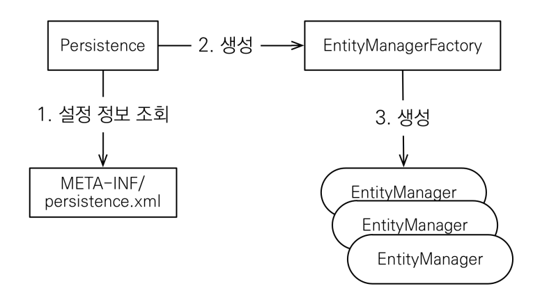
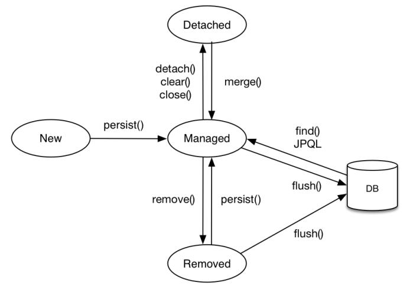

# JPA 소개
## SQL 중심적인 개발의 문제점
- CRUD 무한 반복, 객체를 SQL로 SQL를 객체로..
- 객체와 관계형 DB의 패러다임이 다르다
    - 상속, 연관관계, 데이터 타입, 데이터 식별 방법등이 다르다

> 객체지향적 설계를 위해 JPA를 사용한다.

## JPA 소개
- ORM
- JDBC API를 사용한다.
- SQL 매핑을 자동 지원
- SQL과의 패러다임의 불일치 해결
- 인터페이스의 모음
    - hibernate는 구현체
- CRUD 생산성 증가
- 성능 최적화 기능 지원
    - 1차 캐시와 동일성 보장
    - 지연 로딩, 즉시 로딩 간단하게 지원
    - DB Isolation Level이 Read Committed 이어도 JPA에서 Repeatable Read 보장
        - 한 트랜잭션에서 find를 다시 하면 영속성 컨텍스트에 1차 캐시에서 가져오기 때문에 Non-Repeatable Read를 방지할 수 있다.
        > Non-Repeatable Read   
          한 트랜잭션 내에서 같은 쿼리를 두번 수행할 때, 그 사이에 다른 트랜잭션이 값을 수정 또는 삭제함으로써 두 쿼리가 다르게 나타나는 현상) 
    - 트랜잭션 커밋까지 Insert SQL 모음 -> 모으는 쿼리도 옵션 조절 가능

### JPA 구독 방식

Persistence라는 클래스에서 설정 정보를 읽어서 EntityManagerFactory라는 클래스를 만든다.
여기서 필요할때마다 EntityManager들을 만들어서 사용하면 된다.

## 영속성 컨텍스트
> 엔티티를 영구 저장하는 환경

- EntityManager.persist(entity);
    - 이건 영속성 컨텍스트를 통해서 entity를 영속화한다. (DB에 저장하는게 아니라 영속석 컨텍스트에 저장한다.)
- EntityManager를 통해서 영속성 컨텍스트에 접근

## 엔티티 생명주기

- 비영속
    - new Member();
- 영속
    - 영속성 컨텍스트에 관리되는 상태
    - em.persist(member);
    - 아직 DB에 저장된게 아님, commit해야 저장됨
- 준영속
    - 영속성 컨텍스트에 저장되었다가 분리된 상태
    - em.detach(member);
- 삭제
    - em.remove(member);    

### 이점
- 1차 캐시
- 동일성 보장
- 쓰기 지연
- 변경 감지
- 지연 로딩

## 플러시
- 영속성 컨텍스트의 변경내용을 DB에 반영해주는 것
    - 쌓아놨던 insert sql이나 update sql 등이 DB에 날라가는것
- 발생할때
    - 변경 감지
    - 수정된 Entity 쓰기 지연 SQL 저장소에 등록
    - 쓰기 지연 SQL 저장소의 쿼리를 DB에 전송
- em.flush(), 트랜잭션 커밋, JPQL 쿼리 실행할때 호출
- 1차 캐시에서 지워지진 않는다.
- 영속성 컨텍스트를 비우진 않는다.