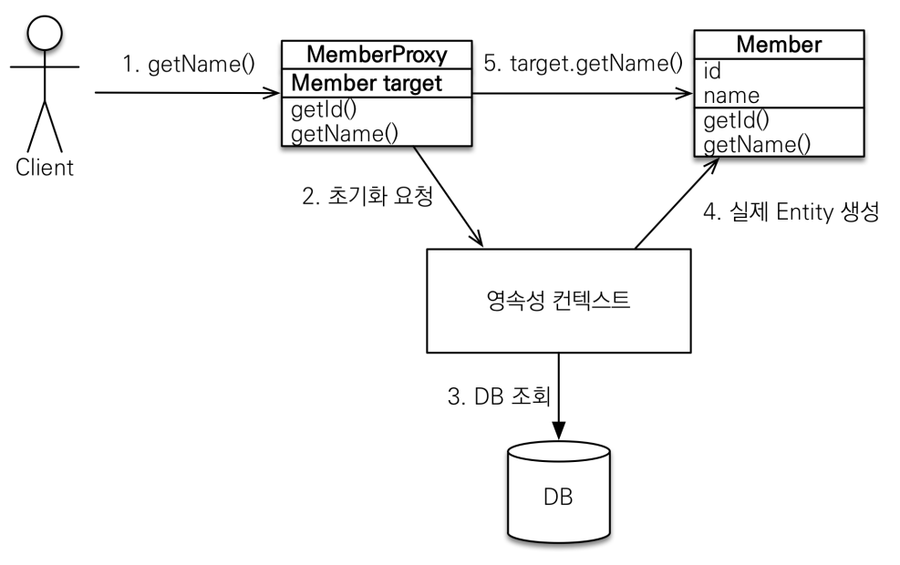

> 6주차

# 프록시

member와 team이 연관관계가 있을때   
member만 가져와야하는경우, member와 team 둘 다 가져올 때가   
각각 있을 수 있다.
이때 지연로딩과 프록시로 해결 가능하다   

em.find() : DB를 통해 실제 엔티티 객체 조회    
vs   
em.getReference() : DB 조회를 미루는 가짜(프록시) 엔티티 객체 조회 -> Lazy Loading, 값이 없는 필드 사용할때만 가져온다

### 프록시 특징

- 원본 클래스를 사용해 hibernate가 내부적으로 만듦
- 프록시객체.getClass() == 원본클래스 는 false이므로 instanc of 를 사용해야 한다.
- em.getReference()시 em.find()로 가져온 객체가 영속성 컨텍스트에 있으면 em.find()로 가져온 원본 객체가 나온다.
    - em.getReference() 먼저 하고 em.find() 하면 프록시 객체가 나온다.
- 준영속 상태일때(트랜젝션 종료 등으로 영속성 종료시) 프록시를 초기화하면(getter 사용 등) 에러 발생
- FetchType.LAZY 조회시 프록시로 가져온다.

### 프록시 객체의 초기화

### 즉시로딩 주의
- @OneToOne도 lazy 로딩 사용하자
- @ManyToOne에서 Many쪽 수 만큼 One쪽 테이블을 fk로 select 한다.
    - lazy 사용 후 필요시 fetch join 사용하자. 
    
# 영속성 전이: CASCADE

- 특정 엔티티를 영속 상태로 만들 때 연관된 엔티티도 함꼐 영속 상태도 만듦
- Member의 Order를 @OneToMany, mappedBy로 연관관계를 매핑하고 주인이 아님을 지정해 select만 되도록 했는데 Member의
Member에서 persist시 Order도 persist되게 하려면 Cascade All 설정
  - 반대로 @ManyToOne만으로 지정한뒤 flush하면 object references an unsaved transient instance - save the transient instance before flushing 에러가 발생함
- 실무에서 하나의 부모가 자식들을 관리할때 의미가 있다. 하나의 게시물에서 여러 첨부파일들을 종속적으로 관리할때는 좋음
첨부파일들을 여러 게시물에서 볼 수 있다면 사용 X -> 소유자가 하나일 때, 종속적일 때
  - 라이프 사이클이 똑같고 단일 소유자일 때 사용

## 고아 객체
- 부모 엔티티와 연관관계가 끊어진 자식 엔티티를 자도으로 삭제
    - 참조하는 곳 하나이고 개인 소유일 때 사용해야 함

### 영속성 전이 + 고아 객체, 생명주기
- CascadeType.ALL + orphanRemovel=true 
- 부모 엔티티를 통해 자식의 생명주기 관리
- DDD 에그리거트 루트 개념 사용할 때 유용!
    - 에그리거트 루트를 통해 자식 엔티티 관리한다(자식은 꼭 repository가 필요하지 않다.)