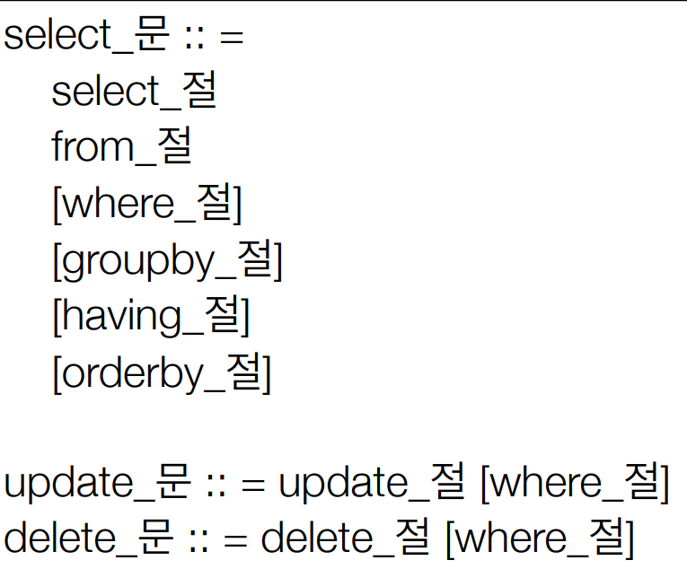
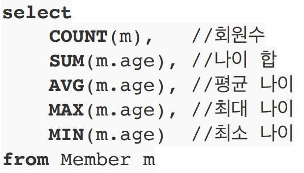

# 8주차

# 객체지향 쿼리 언어
> 기본 문법

JPQL, JPA Criteria, QueryDSL, 네이티브 SQL, JDBC 직접 사용 등등..   

## JPQL
- 엔티티 객체를 대상으로 객체지향 쿼리
- SQL 추상화

### Criteria
- JPQL 은 쿼리가 단순 문자라서 동적 쿼리 만들기 어려움
- 동적 쿼리 사용시 용이하지만 복잡ㅎ다
- 표준 스펙이지만 복잡해서 실무에서 비추천

## QueryDSL
- 간단하고 쉬움
- 컴파일 에러 잡아줌
- 동적 쿼리 작성 쉬움
- querydsl.com
- JPQL 문법 알면 금방 익숙해진다.
- 실무에서 추천

### 네이티브 SQL
- 실제 SQL 사용

---
# JPQL 소개

### 문법
- select m from Member as m where m.age > 18 
- 테이블 이름이 아닌 엔티티 이름, 별칭은 필수

 ### TypeQuery, Query
- TypedQuery : "select m from Member", Member.class 반환타입 명확
- Query : select m.username, m.age from Member m 반환타입 불명확

### 결과조회 API
- query.getResultList(); -> 없으면 빈 리스트
- query.getSingleResult(); -> 결과 없거나 둘 이상이면 에러 -> Spring Data JPA 에선 optional로 반환해줌

### 파라미터 바인딩
- SELECT m FROM Member m where m.username=:username
  query.setParameter("username", usernameParam);
---
# 프로젝션
- Select 절에 조회할 대상을 지정하는 것
- SELECT m FROM Member m -> 엔티티 프로젝션 -> 영속성 컨텍스트에서 관리함
-  SELECT m.team FROM Member m -> 엔티티 프로젝션 -> 이렇게 쓰지 말고 join을 명시적으로 써주자
-  SELECT m.address FROM Member m -> 임베디드 타입 프로젝션
-  SELECT m.username, m.age FROM Member m -> 스칼라 타입 프로젝션
    - new Dto 만들어서 조회 추천
    - SELECT new jpabook.jpql.UserDTO(m.username, m.age) FROM
      Member m
---
# 페이징 API
- setFirstResult : 조회 시작 위치
- setMaxResults : 조회할 데이터 수
- Spring Data JPA가 이 API 사용한다.
---
# 조인
- 내부 조인:
  SELECT m FROM Member m [INNER] JOIN m.team t
- 외부 조인:
  SELECT m FROM Member m LEFT [OUTER] JOIN m.team t
- 세타 조인:
  select count(m) from Member m, Team t where m.username
  = t.name
---
# 서브쿼리
- SQL 처럼 서브쿼리 사용 가능
- EXIST, ALL, ANY, SOME, IN 사용 가능
- WHERE, HAVING, SELECT(Hibernate 지원) 절에서 사용가능
- FROM 절에서 서브쿼리는 불가능
    - 조인으로 해결 가능
---
# JPQL 타입 표현
- 문자: ‘HELLO’, ‘She’’s’
- 숫자: 10L(Long), 10D(Double), 10F(Float)
- Boolean: TRUE, FALSE
- ENUM: jpabook.MemberType.Admin (패키지명 포함)
- 엔티티 타입: SELECT i FROM Item i where TYPE(i) = Book (상속 관계에서 사용)
- EXISTS, IN, AND, OR, NOT, =, >, >=, BETWEEN, LIKE, IS NULL 사용 가능
---
# 조건식 - CASE 식
- switch 문 비슷하게 사용 가능
- COALESCE: 조회하다가 null이 아니면 반환
- NULLIF : 같으면 null 반환
---
# JPQL 기본 함수
- 기본 함수들 사용 가능 + Size 지원
- 방언별 함수도 지원 가능