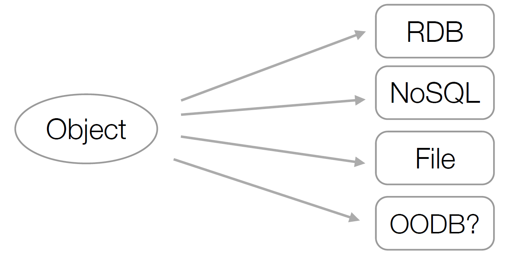
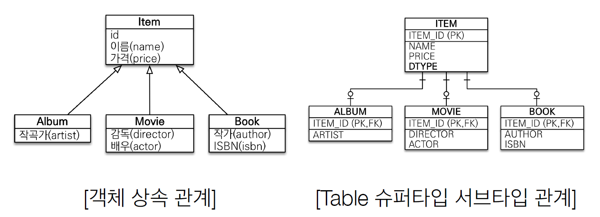
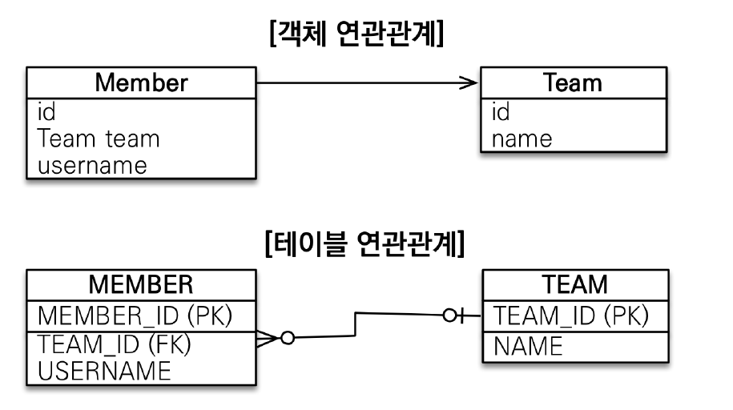
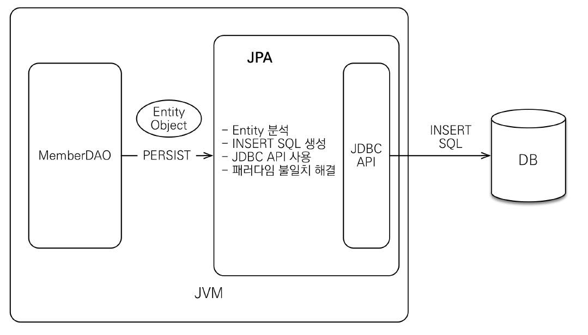
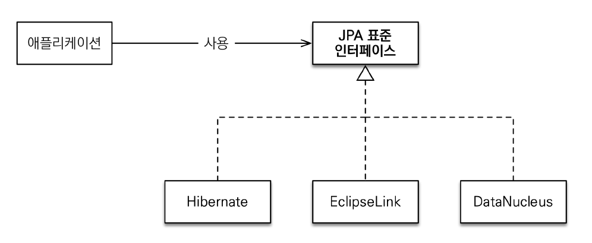
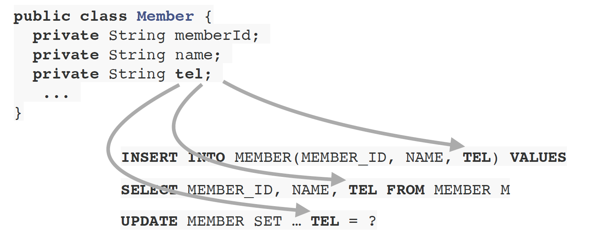
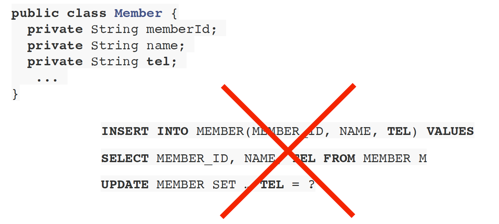

# JPA 소개


## SQL 중심적인 개발의 문제점

애플리케이션 (객체 지향 언어)

객체를 관계형 db에 관리 -> sql 중심적인 개발이 문제가 됨 (CRUD-> 무한반복, 지루한 코드)

EX 회원 객체 만들고, SQL짰는데, 필드 추가하면 쿼리들도 다 하나씩 수정해야함;

즉 SQL에 의존적인 개발을 피하기 어렵다.


또, 패러다임의 불일치 발생

(객체 VS 관계형 데이터 베이스)


**객체를 보관하려면 어떤 저장소에?**



RDB, NOSQL, FILE 등이 있는데, 현실적으로 FILE에 넣으면 검색할 수 없다.

NOSQL은 대안이 될 수있지만 아직 main이 아님. 그래서 현실적인 대안으로 관계형 데이터베이스를 써야함.


그래서 객체를 sql로 바꿔서 rdb에 저장해야하는데,

이 객체를 sql로 바꾸는 작업을 개발자가 함.. (개발자 == SQL 매퍼)


### 객체와 관계형 데이터베이스의 차이

1. 상속
2. 연관관계
3. 데이터 타입
4. 데이터 식별 방법


#### 1. 상속



그나마 객체의 상속관계와 비슷한게 TABLE의 슈퍼타입 서브타입 관계가 있다.

근데 ITEM이라는 슈퍼타입에 ALBUM, MOVIE, BOOK 서브타입이 있다면, ALBUM을 저장할때, ITEM과 ALBUM 테이블에 저장할 쿼리 2개를 만들어야 한다. (객체 분해 -> INSERT INTO ITEM... -> INSERT INTO ALBUM...)

삽입은 뭐 그럴수 있다. 근데 문제는 조회할때다.

내가 ALBUM을 조회하고 싶으면? ITEM과 ALBUM 각 테이블을 JOIN해서 ALBUM과 ITEM 각 데이터에 맞게 객체에 집어넣어 줘야 함. 

ALBUM 뿐만아니라 MOVIE, BOOK또 똑같이 ITEM과 조인해야 되고 ~ 복잡해진다. 그래서 **DB에 저장할 객체에는 상속 관계를 쓰지 않는다.**

근데 자바 컬렉션에 저장하면?

```JAVA
list.add(album);
```

또 자바 컬렉션에서 조회한다면? 

```java
Album album = list.get(albumId);

// 부모 타입으로 조회 후 다형성 활용
Item item = list.get(albumId);
```

그냥 list.get(albumId)만 하면 된다. 심지어 부모타입인 Item도 다형성을 활용할 수 있다. 이러한 차이점이 있다.


#### 2. 연관관계



객체는 참조로 연관관계를 찾는다 (member.getTeam())

테이블은 외래키를 사용한다 (JOIN ON M.TEAM_ID = T.TEAM_ID)

여기서 테이블은 멤버테이블에서 팀 테이블을, 반대로 팀 테이블에서 멤버테이블을 조회할 수 있는데, (양방향 조회 가능)

객체는 그럴 수 없다. (한방향 밖에 안됨.)

```java
// 객체를 테이블에 맞추어 모델링
class Member {
    String id; //MEMBER_ID 컬럼 사용
    Long teamId; //TEAM_ID FK 컬럼 사용 //**
    String username;//USERNAME 컬럼 사용
}
class Team {
    Long id; //TEAM_ID PK 사용
    String name; //NAME 컬럼 사용
}
```

멤버라는 객체에 팀 객체의 외래키를 가져오게끔 만들었다.

근데 사실 멤버 객체에 팀 객체 참조값을 가져야 되는게 아닌가? 라고 생각할 수 밖에없다. 그래서 멤버 객체에 팀 객체를 필드값으로 넣는다. 그러니까 member.getTeam() 해서 연관관계를 찾아 올 수 있는거다. 지극히 객체지향적인 것이다.

```java
// 객체 다운 모델링
class Member {
    String id; //MEMBER_ID 컬럼 사용
    Team team; //참조로 연관관계를 맺는다. //**
    String username;//USERNAME 컬럼 사용
    Team getTeam() {
        return team;
    }
}
class Team {
    Long id; //TEAM_ID PK 사용
    String name; //NAME 컬럼 사용
}
```


이렇게 설계하고 db에 insert하려면? 

그럼 팀 테이블 외래키를 가지고 있지않고 참조값만 가지고 있다. 그럼 member.getTeam().getId() 해서 가져오면 돼지?

저장은 잘된다. 근데 이런식의 객체지향 설계는 조회할 때 문제가 생긴다.


```java
class MemberService {
...
    public void process() {
        Member member = memberDAO.find(memberId);
        member.getTeam(); //???
        member.getOrder().getDelivery(); // ???
    }
}
```

또한 엔티티 신뢰의 문제가 생기는데, 객체는 원래 그래프 탐색이 가능해야 한다. get을 통해 참조된 모든 객체를 탐색할 수 있다는 것이다.

근데 sql이 실행되는 순간부터 테이블의 범위가 정해져 있기 때문에 아무리 누가 memberDAO라는 것을 구현했더라도 그 안에있는 sql을 보지 않는이상, member가 모든 객체들을 get으로 탐색할 수 없다. (sql로 인해 범위가 정해져 버리기 때문)

layered-architecture라고 하는데, 보통 계층간의 신뢰를 가지게 되는데, 이 경우는 entity간의 신뢰를 할 수 없다. (물리적으로는 service, dao로 계층이 나눠져 있지만, 논리적으로는 긴밀하게 엮여있다고 생각하면 된다.)

즉, **모든 객체를 미리 로딩할 수 없기에** 상황에 따라 조회 메서드를 여러개 만들어야만 한다. 

따라서 sql을 이용하게 되면 진정한 의미의 계층 분할이 어려워 진다. (계층형 아키텍처)


또 비교할때도 문제가 생기는데, 

```java
String memberId = "100";
Member member1 = memberDAO.getMember(memberId);
Member member2 = memberDAO.getMember(memberId);
member1 == member2; //다르다.
class MemberDAO {
    public Member getMember(String memberId) {
        String sql = "SELECT * FROM MEMBER WHERE MEMBER_ID = ?";
        ...
        //JDBC API, SQL 실행
        return new Member(...);
    }
}
```

sql로 select 해온것을 결국에는 new Member로 새롭게 반환하므로 member1 member2 참조가 다르기 때문에 다른 객체이다.

하지만 자바 컬렉션에서 조회한다고 생각하면? 

```java
String memberId = "100";
Member member1 = list.get(memberId);
Member member2 = list.get(memberId);
member1 == member2; //같다.
```

조회를 위한 id 값에 대한 참조값이 같기 때문에 member1과 member2가 같은 객체를 가리킨다.

이러한 계속적인 예시를 보면, 결국 sql과 자바 컬렉션 사이의 미스매치가 계속 발생하게 된다.

-> 결론 : 객체 답게 모델링 할 수록 매핑 작업만 늘어난다..

그래서 객체를 자바 컬렉션에 저장하듯이 db에 저장할 수 없을까? 라는 생각이 1980년대 부터 고민을 해왔고 자바진영에서 그 고민의 결과물로 JPA가 나오게 되었다.

---

### JPA란 무엇인가?

JPA(Java Persistence Api) = 자바 진영의 ORM 기술 표준

ORM (Object Relational Mapping)

- 객체와 관계형 데이터베이스를 매핑한다는 뜻
- orm 프레임워크가 객체 - 관계형 데이터베이스 중간에서 매핑해줌
- 대중적인 언어에 대부분 orm 기술이 존재함 (typescript도 type orm으로 제공함)

#### 어플리케이션과 JDBC 사이에서 동작


#### JPA 동작 - 저장



#### JPA 동작 - 조회


#### JPA 소개

EJB - 엔티티 빈 (자바 표준) -> 하이버네이트 (오픈 소스) -> JPA(자바 표준)


#### JPA 는 표준 명세

JPA는 인터페이스의 모음 (껍데기)

JPA 2.1 표준 명세를 구현한 3가지 구현체가 있다. (하이버네이트, EclipseLink, DataNucleus)



#### JPA를 왜 사용해야 하는가

- SQL 중심적인 개발에서 객체 중심으로 개발
- 생산성
- 유지보수
- 패러다임의 불일치
- 성능
- 데이터 접근 추상화와 벤더 독립성
- 표준


#### 1. 생산성

JPA와 CRUD

- 저장: jpa.persist(member)
- 조회: Member member = jpa.find(memberId)
- 수정: member.setName("변경할 이름")
- 삭제: jpa.remove(member)

#### 2. 유지보수

기존 : 필드 변경시 모든 SQL 수정 해야함.



JPA : 필드만 추가하면 됨. SQL은 JPA가 처리.



#### 3. JPA와 패러다임의 불일치 해결

- JPA와 상속
- JPA와 연관관계
- JPA와 객체 그래프 탐색
- JPA와 비교하기


#### JPA와 상속 : 객체 상속 관계 - Table 슈퍼타입 서브타입 관계 


**[저장]**

**개발자가 할 일**

```java
jpa.persist(album);
```

**나머진 jpa가 처리 (INSERT 쿼리를 2개로 쪼개줌)**

```sql
INSERT INTO ITEM ...
INSERT INTO ALBUM ...
```


**[조회]**

**개발자가 할일**

Album album = jpa.find(Album.class, albumId);

나머진 JPA가 처리

```sql
SELECT I.*, A.*
    FROM ITME I
    JOIN ALBUM A ON I.ITEM_ID = A.ITEM_ID
```

이렇게 객체와 관계형 데이터베이스의 패러다임을 JPA가 해결해 주고 있음.


#### JPA와 연관관계, 객체 그래프 탐색

**연관관계 저장**

```java
member.setTeam(team);
jpa.persist(member);
```

**객체 그래프 탐색**

```java
Member member - jpa.find(Member.class, memberId);
Team team = member.getTeam();
```

--> 신뢰할 수 있는 엔티티, 계층

```java
class MemberService {
    ...
    public void process() {
        Member member = memberDAO.find(memberId);
        member.getTeam(); // 자유로운 객체 그래프 탐색
        member.getOrder().getDelivery();
    }
}
```

memberDAO안에 JPA를 통해 멤버 객체를 가져온다면 객체그래프를 자유롭게 정말 다 탐색할 수 있음.

JPA는 `지연로딩`이라는 기능이 있어서 실제로 객체안의 객체를 조회하는 시점에 SQL이 나가서 데이터가 채워지는 기능을 제공해서, 자유롭게 객체 그래프를 탐색할 수 있다.

이제 JPA를 통해 조회한 객체는 믿을 수 있다.


#### JPA와 비교하기

```java
String memberId = "100";
Member member1 = jpa.find(Member.class, memberId);
Member member2 = jpa.find(Member.class, memberId);

member1 == membe2; // true
```

동일한 트랜잭션에서 조회한 엔티티는 같음을 보장한다.


#### JPA와 성능 최적화 기능

1. 1차 캐시와 동일성(identity) 보장
2. 트랜잭션을 지원하는 쓰기 지연(transactional write-behind)
3. 지연 로딩(Lazy Loading)


JPA를 쓰면 성능이 더 떨어지지 않을까? 라는 고민을 할 수 있음.

뭔가 계층 사이에 중간계층이 있으면 항상 할 수 있는게 있다. 뭘 할 수 있냐면 모아서 쏘는 버퍼링과, 읽을 때, 캐싱을 할 수 있다. (마치 cpu와 메모리 구조와 비슷하다.)

JPA도 중간 계층이기 때문에 오히려 더 성능을 최적화 할 수 있다.

**1차 캐시와 동일성 보장**

1. 같은 트랜잭션 안에서는 같은 엔티티를 반환 - 약간의 조회 성능 향상
2. DB Isolation Level이 Read Commit이어도 애플리케이션에서 Repeatable Read 보장

```java
String memberId = "100";
Member m1 = jpa.find(Member.class, memberId); // SQL
Member m2 = jpa.find(Member.class, memberId); // 캐시

println(m1 == m2) // true
```

-> SQL 1번만 실행

근데 이건 우리가 알던 캐시가 아니다. 트랜잭션동안, 고객을 조회하고 빠져나간다. 그 트랜잭션 사이에서의 동일성을 보장해 주는 것이기 때문에 사실상 굉장히 짧은 시간의 캐싱이다. 그래서 사실 실무에서 성능적으로 그렇게 큰 도움은 안된다.


**트랜잭션을 지원하는 쓰기 지연 - INSERT**

1. 트랜잭션을 커밋할 때까지 INSERT SQL을 모음
2. JDBC BATCH SQL 기능을 사용해서 한번에 SQL 전송

```java
transaction.begin(); // [트랜잭션] 시작

em.persist(memberA);
em.persist(memberB);
em.persist(memberC);
// 여기까지 INSERT SQL을 데이터베이스에 보내지 않는다.

// 커밋하는 순간 데이터베이스에 INSERT SQL을 모아서 보낸다.
transaction.commit(); // [트랜잭션] 커밋
```

네트워크로 한방에 보낸다. (하나씩 보내면 비효율)

jpa는 멤버 a,b,c를 메모리에 쌓아뒀다가, 커밋이 되는 순간, 쿼리3개를 한방에 네트워크로 보내버린다. (JDBC BATCH SQL을 통해)

개발자가 디테일한 코드를 신경쓰지 않고 옵션하나만 켜주면 된다.

**트랜잭션을 지원하는 쓰기 지연 - UPDATE**

1. UPDATE, DELETE로 인한 로우(ROW)락 시간 최소화
2. 트랜잭션 커밋 시 UPDATE, DELETE SQL 실행하고, 바로 커밋

```java
transaction.begin(); // [트랜잭션] 시작

changeMember(memberA);
deleteMember(memberB);
비즈니스_로직_수행(); // 비즈니스 로직 수행 동안 DB 로우 락이 걸리지 않는다.

// 커밋하는 순간 데이터베이스에 UPDATE, DELETE SQL을 보낸다.
transaction.commit(); // [트랜잭션] 커밋
```


#### 지연로딩과 즉시 로딩

- 지연 로딩 : 객체가 실제 사용될 때 로딩
- 즉시 로딩 : JOIN SQL로 한번에 연관된 객체까지 미리 조회

```java
// 지연 로딩
Member member = memberDAO.find(memberId); // SELECT * FROM MEMBER
Team team = member.getTeam();
String teamName = team.getName(); // SELECT * FROM TEAM
```

```java
// 즉시 로딩
Member member = memberDAO.find(memberId); // SELECT M.*, T.* FROM MEMBER JOIN TEAM ...
Team team = member.getTeam();
String teamName = team.getName();
```

지연 로딩은 실제로 팀객체에서 해당 값들에 접근할 때 JPA에서 SQL을 그 시점에 날려서 데이터를 채워 주고 그 값을 반환해 준다.

스프링의 AOP 처럼 프록시 기술을 하이버네이트가 써서 이런 문제를 해결해 준다.

근데 이 지연로딩의 문제는 SQL이 두번 나가므로 네트워크를 2번 탄다.

근데, 만약 우리가 어플리케이션을 개발할 때, 거의 99% 이상이 멤버를 조회할 때마다 팀을 같이 쓴다면? 그냥 멤버를 조회할때 한방 쿼리로 팀까지 조인해서 가져오는게 맞다.

JPA에서 옵션을 키면 쿼리가 즉시로딩으로 한번에 멤버와 팀을 가져온다.

 

JPA사용하기 전 개발자들은 이 전략을 미리 정해놓고 가지않아서 중간에 바꾸게 되면 코드를 정말 많이 바꿔야 했음 (객체 - 테이블 맵핑 작업..)

JPA는 옵션하나 끄고 켜고로 튜닝이 가능하다.

실제로 애플리케이션 개발할때 전부 지연로딩으로 쫙 짜놨다가 실제로 최적화 할때 즉시 로딩이 필요한 부분을 찾아서 적용한다.

결론 : ORM은 객체와 RDB 두 기중위에 있는 기술이다.

JPA만 잘 안다고 해서 잘 할 수 있는 것도 아니고, RDB만 알아도 객체지향적 설계를 모르면 결국 유지보수성이 떨어진다. 이 둘 사이의 밸런스를 정말 잘 맞춰야한다.

즉 둘다 정말 잘 해야 한다.

둘 중 더중요한게 뭐냐고? 라고 묻는다면 물론 관계형 데이터베이스가 더 중요하다.

객체 애플리케이션은 중간에 바뀔 수 도있지만, 관계형데이터베이스에 저장될 데이터는 훨씬 오래 살아남기 때문에, JPA를 공부하더라도 관계형 데이터베이스에 대한 공부는 꾸준히 공부 해야 한다.

그래서 이 ORM은 객체와 관계형 데이터베이스 두가지를 정말 잘 아는 상태에서 써야 한다.