# 객체지향 쿼리 언어(JPQL)

 ## 목차

- 객체지향 쿼리 언어 소개
- JPQL
- 기본 문법과 기능
- 페치 조인
- 경로 표현식
- 다형성 쿼리
- 엔티티 직접 사용
- Named 쿼리
- 벌크 연산

## 객체지향 쿼리 언어 소개

### JPA는 다양항 쿼리 방법을 지원

- **JPQL**
- JPA Criteria
- **QueryDSL**
- 네이티브 SQL
- JDBC API 직접 사용, MyBatis, SpringJdbcTemplate 함께 사용

### JPQL 소개

- 가장 단순한 조회 방법
  - EntityManager.find()
  - 객체 그래프 탐색(a.getB().getC())
  - **나이가 18살 이상인 회원을 모두 검색하고 싶다면?**

### JPQL

- JPA를 사용하면 엔티티 객체를 중심으로 개발한다.
- 문제는 검색 쿼리를 사용할 때다.
- 검색을 할 때도 **테이블이 아닌 엔티티 객체를 대상으로 검색한다.**
- 모든 DB 데이터를 객체로 변환해서 검색하는 것은 불가능 하다.
- 애플리케이션이 필요한 데이터만 DB에서 불러오려면 결국 검색조건이 포함된 SQL이 필요하다.

- JPA는 SQL을 추상화한 JPQL이라는 객체 지향 쿼리 언어를 제공한다.
- SQL과 문법이 유사하다. SELECT, FROM, WHERE, GROUP BY, HAVING, JOIN을 지원한다.
- JPQL은 `엔티티 객체`를 대상으로 쿼리한다.
- SQL은 `데이터베이스 테이블`을 대상으로 쿼리한다.

```JAVA
//검색
List<Member> result = em.createQuery("select m From Member m where m.username like '%kim%'", Member.class).getResultList();
```

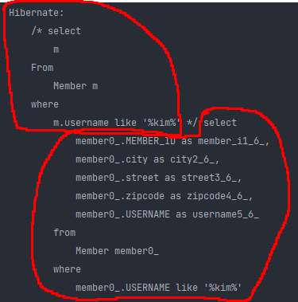

해당 jpql을 보고 적절한 select 쿼리를 만들어 낸다. (엔티티를 대상으로 쿼리한 것을 데이터베이스 테이블 대상 쿼리로 바꿔주는 작업을 하이버네이트가 해준다.)

보통 select 쿼리를할때, *, 또는 alias로 m을 지정하면 m.username, 이런식으로 컬럼들을 조회하는데,

jpql에서 select m이라고 할때 이 m은 멤버객체인 m을 가져오라는 의미이다.

- 테이블이 아닌 객체를 대상으로 검색하는 객체 지향 쿼리이다.
- SQL을 추상화해서 특정 데이터베이스의 SQL에 의존 X
- JPQL을 한마디로 정의하면 `객체 지향 SQL`

### JPQL과 실행된 SQL

```java
//검색
String jpql = "select m from Member m where m.age > 18";
List<Member> result = em.createQuery(jpql, Member.class)
.getResultList();
```

```sql
# 실행된 SQL
	select
		m.id as id,
		m.age as age,
		m.USERNAME as USERNAME,
		m.TEAM_ID as TEAM_ID
	from
		Member m
	where
		m.age>18
```


위처험 jpql을 string으로 만들었는데, 이렇게 단순 문자열을 사용하게 되면 동적 쿼리를 만들기 굉장히 어렵다.

예를들어 파라미터로 받은 username이 null이냐 아니냐에 따라서 쿼리 문이 달라지는데, 이걸 그냥 string 으로 덧셈을 하면 처리해줘야 할게 너무많고, 여기서 버그가 발생한다. (ex 단순히 덧셈으로 인한 문자열이 달라붙음..)

> 이런점을 볼때 mybatis 장점이 동적 쿼리를 되게 편하게 짤 수 있다.

그래서 대안으로 나온 점이 Criteria와 같은 것임.

### Criteria 소개

```java
//Criteria 사용 준비 (자바 표준에서 제공함.)
CriteriaBuilder cb = em.getCriteriaBuilder();
CriteriaQuery<Member> query = cb.createQuery(Member.class);
//루트 클래스 (조회를 시작할 클래스)
Root<Member> m = query.from(Member.class);
//쿼리 생성 
CriteriaQuery<Member> cq = query.select(m).where(cb.equal(m.get("username"), “kim”));
List<Member> resultList = em.createQuery(cq).getResultList();
```

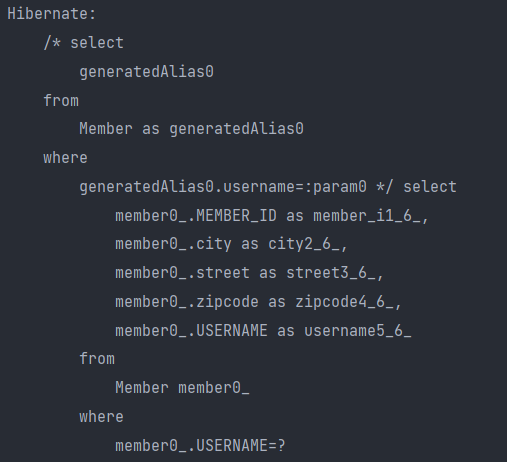

이런식으로 쿼리가 나간다.

근데 cq를 만드는 문법이 알아보기 힘들고 복잡하다.

하지만 이런식의 코드를 짜면 좋은점은 자바코드로 짜기 때문에 잘못 입력했을 때 컴파일 에러가 나기 때문에 이런부분에 있어서는 버그를 잡기 쉽다.

또 동적 쿼리도 짜기 쉽다. (아까 위에서 String으로 덧셈하는거랑 비교하면 확연히 편하다.)

근데 단점은 sql스럽지 않다. 어쩃든 이건 표준 스펙으로 들어가는 기술이지만, 실제 실무에서 안씀. 왜냐면, 내가 못알아보고 유지보수가 안된다.

- 문자가 아닌 자바코드로 JPQL을 작성할 수 있음
- JPQL 빌더 역할
- JPA 공식 기능
- **단점 : 너무 복잡하고 실용성이 없다.**
- Criteria 대신에 **QueryDSL** 사용 권장


### QueryDSL 소개

```JAVA
//JPQL
//select m from Member m where m.age > 18
JPAFactoryQuery query = new JPAQueryFactory(em);
QMember m = QMember.member;

List<Member> list = query.selectFrom(m).where(m.get.gt(18)).orderBy(m.name.desc()).fetch();
```

- 문자가 아닌 자바코드로 JPQL을 작성할 수 있다.
- JPQL 빌더 역할을 한다.
- 컴파일 시점에 문법  오류를 찾을 수 있다.
- 동적 쿼리 작성할 때 편리하다.
- **단순하고 쉽다. (거의 JPQL이랑 1:1임)**
- 실무에서 사용 권장! 

querydsl은 공식 문서는 전부 다 나와있기 때문에, jpql문법만 잘알면 된다!

### 네이티브 SQL 소개

- JPA가 제공하는 SQL을 직접 사용하는 기능이다.
- JPQL로 해결할 수 없는 특정 데이터베이스에 의존적인 기능이다.
- ex) 오라클 CONNECT BY, 특정 DB만 사용하는 SQL 힌트

```JAVA
String sql ="SELECT ID, AGE, TEAM_ID, NAME FROM MEMBER WHERE NAME = ‘kim’";
List<Member> resultList = em.createNativeQuery(sql, Member.class).getResultList();
```

위와 같이 그냥 쌩 쿼리를 날리는 거다.

```java
em.createNativeQuery("select MEMBER_ID, city, street, zipcode, USERNAME from MEMBER").getResultList();
```

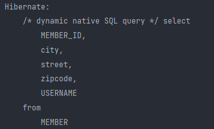

이렇게 쌩 쿼리 날려서 나온 결과를 가져다 쓰면 된다.

근데 이거도 사실 잘 안쓴다.


### JDBC 직접 사용, SpringJdbcTemplate 등

- JPA를 사용하면서 JDBC 커넥션을 직접 사용하거나, 스프링 JdbcTemplate, 마이바티스등을 함께 사용 가능하다.
- 단 영속성 컨텍스트를 적절한 시점에 강제로 플러시가 필요하다
- ex) JPA를 우회해서 SQL을 실행하기 직전에 영속성 컨텍스트 수동 플러시하기.


> flush가 호출 될때 -> 1 commit, 2 query

그래서 createQuery, createNativeQuery를 날릴때 기본적으로 flush가 동작한다.

```java
Member member = new Member();
member.setUsername("member1");
em.persist(member);

List<Member> resultList = em.createNativeQuery("select MEMBER_ID, city, street, zipcode, USERNAME from MEMBER").getResultList();

for (Member member1: resultList) {
    System.out.println("member1 = " + member1);
}
```

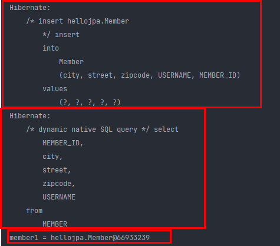

persist할때는 flush가 안되고 있다가, createNativeQuery 메소드를 실행하는 순간 flush가 되며 insert 쿼리가 나가고, 바로 select 쿼리를 날리게 된다.

즉, flush는 commit 뿐만 아니라 어쨋든 변경사항이 db에 남아있어야 결과를 가져올때도 의미가 있는거니까 create Query를 날릴때도 flush 된다. (기본적인 auto모드 전략)


근데 이런 경우가 아니라, db 커넥션을 얻었다면, 여기서 executeQuery를 날렸다면? 얘는 jpa랑 관련이없기 때문에 flush가 안된다.

```java
Member member = new Member();
member.setUsername("member1");
em.persist(member);

em.flush(); // 이때 플러시를 해줘야 아래 구문에서 결과값을 받을 수 있다. (수동 flush)

dbconn.executeQuery("select * from member"); // 얘 자체만으로 flush 해주지 않음.

for (Member member1: resultList) {
    System.out.println("member1 = " + member1);
}
```


#### * 정리

왠만하면 JPQL과 QueryDSL을 섞어서 쓰고 이게 거의 95%다. 정말 5%는, 엄청나게 복잡한 통계성 쿼리같은건 SpringJdbcTemplate같은거나 Native Query로 짜기도 한다. 근데 그거마저도 다 JPQL이나 QueryDSL로 왠만하면 잡는다.

## JPQL(Java Persistence Query Language)

## JPQL - 기본 문법과 기능


### JPA 소개

- JPQL은 객체지향 쿼리 언어다. 따라서 테이블을 대상으로 쿼리하는 것이 아니라 **엔티티 객체를 대상으로 쿼리**한다.
- **JPQL은 SQL을 추상화해서 특정데이터베이스 SQL에 의존하지 않는다.**
- JPQL은 결국 SQL로 변환된다.

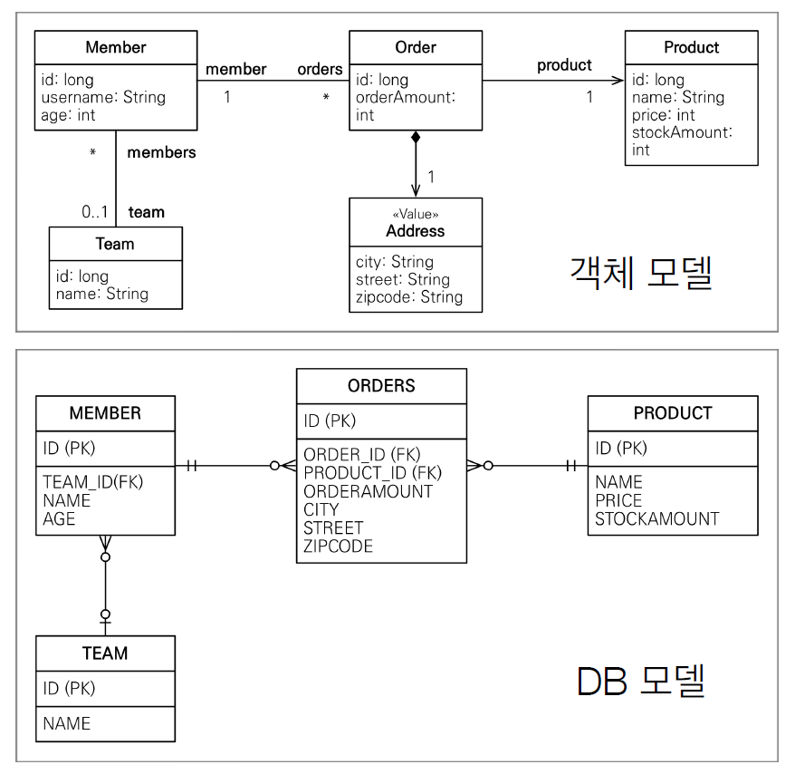

### JPQL 문법

```JAVA
select_문 :: =
	select_절
	from_절
	[where_절]
	[groupby_절]
	[having_절]
	[orderby_절]
    
update_문 :: = update_절 [where_절]
delete_문 :: = delete_절 [where_절]
```

SQL이랑 똑같다. update랑 delete도 있는데, 이건 나중에 뒤에 bulk연산에서 설명함. (ex: 전 사원의 연봉을 10% 인상 시켜라. -> 이런식으로 한방에 여러개를 업데이트 할때) -> 예전에 update는 값만 변경시켜도 commit시점에 쿼리가 날아가는데, 그거는 단건에 대한 쿼리이고, 지금 이런식의 한방 쿼리를 100만개 이상 날리는 경우가 생길 수 있음. 이럴때 jpa에서는 bulk 연산이라고 따로 관리하게 된다.

- select m from **Member** as m where **m.age** > 18
- 엔티티와 속성은 대소문자 구분O (Member, age)
- JPQL 키워드는 대소문자 구분X (SELECT, FROM, where)
- 엔티티 이름 사용, 테이블 이름이 아님(Member) -> @Entity(name = "Member") 여기서의 이름을 의미한다! -> 보통은 이렇게 name안주고 그냥 클래스이름으로 맞추는게 맞다.
- **별칭은 필수(m)** (as는 생략가능)

### 집합과 정렬

```sql
select
	COUNT(m), # 회원수
	SUM(m.age), # 나이 합
	AVG(m.age), # 평균 나이
	MAX(m.age), # 최대 나이
	MIN(m.age) # 최소 나이
from Member m
```

- GROUP BY, HAVING
- ORDER BY

다음과 같은것들을 ansi - sql이라고 하는데, 표준 함수들을 제공해 준다.

### TypedQuery, Query

- TypedQuery: 반환 타입이 명확할 때 사용
- Query: 반환 타입이 명확하지 않을 때 사용

```java
TypedQuery<Member> select_m_from_member_m = em.createQuery("select m from Member m", Member.class);
```

뒤에 Member.class는 기본적으로 엔티티 클래스를 준다. (아닌것도 줄 수 있는데, 뒤에 프로젝션에서 따로 설명.)

위의 경우 타입을 명확하게 기재했기 때문에 generic으로 Member 클래스를 쓸 수 있다.

근데 다음과 같이 타입을 명시하기 힘든 경우라면?

```java
Query query = em.createQuery("select m.username, m.age from Member m");
```

Query로 나타낼 수 있다.


참고 : 아래와 같은 경우는 String으로 명시할 수 있음.

```java
TypedQuery<String> query = em.createQuery("select m.username from Member m", String.class);
```


### 결과 조회 API

- query.getResultList(): **결과가 하나 이상일 때**, 리스트 반환한다.
  - 결과가 없으면 빈 리스트 반환한다. (따라서 NPE를 걱정할 필요가 없다.)
- query.getSingleResult(): **결과가 정확히 하나**, 단일 객체 반환
  - 결과가 없으면: javax.persistence.NoResultException
  - 둘 이상이면: javax.persistence.NonUniqueResultException

그래서 getSingleResult 얘는 진짜 결과가 하나일 때만 써야 한다. (우리가 이걸 쓰면 try - catch를 해야되서 매우 일이 번거로워 짐.)

> Spring Data Jpa에서는 이런 상황일때 null을 반환하거나, Optional을 반환해서 예외가 터지지 않는다.
>
> 스프링 코드를 까보면 어쩔 수 없이 getSingleResult가 나오게 되는데 (표준 스펙이기 때문) 여기서 스프링이 try - catch를 한번 해준다.

### 파라미터 바인딩 - 이름 기준, 위치 기준

```java
SELECT m FROM Member m where m.username=:username
query.setParameter("username", usernameParam);

SELECT m FROM Member m where m.username=?1
query.setParameter(1, usernameParam);
```

다음과 같이 문법을 적용할 수 있다.

```java
Member member = new Member();
member.setUsername("member1");
em.persist(member);

TypedQuery<Member> query = em.createQuery("select m from Member m where m.username = :username", Member.class);
query.setParameter("username", "member1");
Member singleResult = query.getSingleResult();
System.out.println("singleResult = " + singleResult);
```

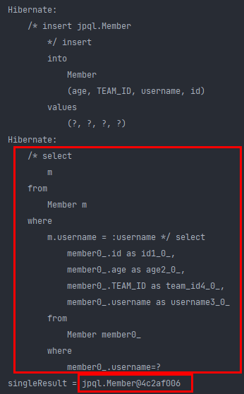

조회 쿼리가 data binding 되어 잘 날아간다.

```java
Member result = em.createQuery("select m from Member m where m.username = :username", Member.class)
    .setParameter("username", "member1")
    .getSingleResult();

System.out.println("singleResult = " + result.getUsername());
```

근데 보통 라인단위로 안하고 메소드 체이닝으로 api 자체가 설계되어 있음.


지금까지는 이름 기준으로 파라미터 바인딩한거고, 위치 기준으로도 파라미터 바인딩 할 수 있다. 하지만 위치 기반은 왠만하면 쓰지마라. 누군가 중간에 끼어들면 순서가 다 밀려버리기 때문이다. (이름 기준으로 쓰면 밀려날 일이 없다!)


### 프로젝션

- SELECT 절에 조회할 대상을 지정하는 것
- 프로젝션 대상: 엔티티, 임베디드 타입, 스칼라 타입(숫자, 문자등 기본 데이터 타입) -> (테이블일 때는 스칼라 타입만 조회할 수 있었는데, 지금은 엔티티, 임베디드 타입까지 조회 가능)
- SELECT **m** FROM Member m -> 엔티티 프로젝션
- SELECT **m.team** FROM Member m -> 엔티티 프로젝션
- SELECT **m.address** FROM Member m -> 임베디드 타입 프로젝션
- SELECT **m.username, m.age** FROM Member m -> 스칼라 타입 프로젝션
- DISTINCT로 중복 제거

이게 간단한 것 같지만 깊은 내용이 있음.

```java
Member member = new Member();
member.setUsername("member1");
member.setAge(10);
em.persist(member);

em.flush();
em.clear();

List<Member> result = em.createQuery("select m from Member m", Member.class)
    .getResultList();

Member findMember = result.get(0);
findMember.setAge(20);
```

이와 같이 member 셋팅한 값을 flush하여 db에 저장하고 영속성 컨텍스트를 비운다음, createQuery로 다시 가져온다.

이때 List<Member> result가 영속성 컨텍스트가 관리하는 대상이 될까?

위 코드에서 findMember로 값을 가져와서 setAge를 20으로 바꿨는데, 실제로 db에 바뀌지 않는다면, 영속성 컨텍스트에서 관리가 안된다는 것을 의미한다.

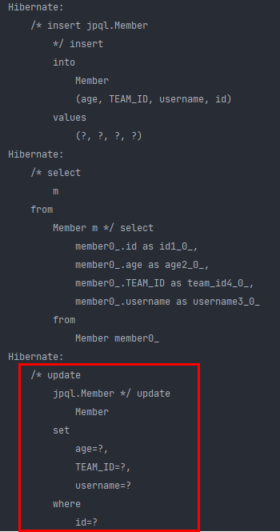

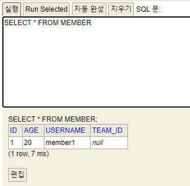

update 쿼리가 날아가면서 db에 변경된 값이 잘 들어간다.

결론적으로, 이렇게 엔티티 프로젝션을 하면, Member m의 대상으로 select 절로 10개, 20개가 조회될 수 있는데, 걔네들이 **전부 영속성 컨텍스트에 다 관리된다.**

그래서 `엔티티 프로젝션`이라고 따로 용어를 붙였다.

m.team같은것도 가능하다.

```java
List<Team> result = em.createQuery("select m.team from Member m", Team.class)
                    .getResultList();
```

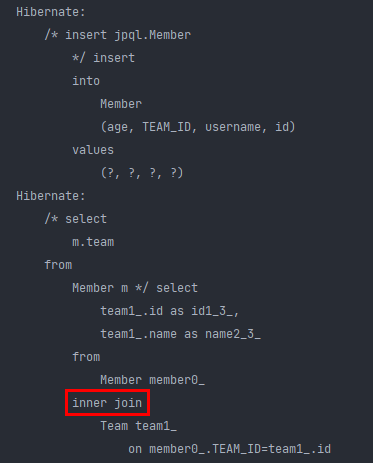

실제 테이블에서는 연관관계들을 inner join을 하여 가져온다. 

이건 나중에 경로 표현식에서 설명함. jpql은 간단한데, 실제 select 쿼리는 조인하면서 복잡하게 나간다.

그래서, 참고로 createQuery에 들어갈 qlString 부분을 sql과 비슷하게 써야한다. (join이 성능에 굉장히 많은 영향을 끼칠 수 있다. 튜닝할 수 있는 요소도 많기 때문에, 한눈에 보이기 쉽게 sql과 비슷하게 써야함.) 그래서 위 코드처럼 

`select m.team from Member m` 이게 아니라, `select t from Member m join m.team t` 이렇게 join이 될걸 알고 써준다.

위와 결과는 같게 나온다. sql문법과는 좀 다르지만 거의 비슷하다. (운영하면서 쿼리 튜닝을 하는 입장에서 전자의 jpql은 좋지 않다.)


임베디드타입 프로젝션의 경우 한계가 있는데, 

`select o.address from Order o` 여기서 address가 Order에 속해있기 때문에 `from Address a` 이렇게 시작할 수 없다.

(즉, 임베디드 타입은 그것의 엔티티로 부터 시작해야 한다.)


### 프로젝션 - 여러 값 조회

- SELECT **m.username, m.age** FROM Member
- 1. Query 타입으로 조회 (위에서 본 Query 타입 -> Object[]이 들어 있음.)]

```java
Member member = new Member();
member.setUsername("member1");
member.setAge(10);
em.persist(member);

em.flush();
em.clear();

List resultList = em.createQuery("select m.username, m.age from Member m")
    .getResultList();

Object o = resultList.get(0); // query 타입으로 Object
Object[] result = (Object[]) o; // m.username과 m.age 2개이므로 Object 배열로 타입 캐스팅 해줘야 함.
System.out.println("result = " + result[0]);
System.out.println("age = " + result[1]);
```
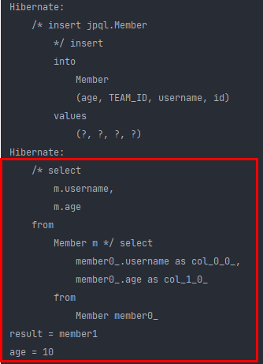

select 쿼리와 함께 값이 잘 나온다.

- 2. Object[] 타입으로 조회


```java
List<Object[]> resultList = em.createQuery("select m.username, m.age from Member m")
                    .getResultList();

Object[] result = resultList.get(0);
System.out.println("result = " + result[0]);
System.out.println("age = " + result[1]);
```

위와 같은 결과를 얻는다.

- 3. new 명령어로 조회 (제일 깔끔한 방법)

  - 단순 값을 DTO로 바로 조회<br>SELECT **new** jpabook.jpql.UserDTO(m.username, m.age) FROM Member m
  - 패키지 명을 포함한 전체 클래스 명 입력
  - 순서와 타입이 일치하는 생성자 필요 (타입은 물론이고, m.username, m.age와 dto간의 먼저 선언한 `순서`를 꼭 맞춰야 한다.)

우선 MemberDTO를 만들고

```java
public class MemberDTO {
    private String username;
    private int age;
    
    // 생성자를 만들어 줘야 new 키워드를 쓸 수 있음.
    public MemberDTO(String username, int age) {
        this.username = username;
        this.age = age;
    }
}
```

```java
Member member = new Member();
member.setUsername("member1");
member.setAge(10);
em.persist(member);

em.flush();
em.clear();

// new 를 이용하여 MemberDTO로 데이터 바인딩 가능
List<MemberDTO> resultList = em.createQuery("select new jpql.MemberDTO(m.username, m.age) from Member m", MemberDTO.class) 
    .getResultList();

MemberDTO memberDTO = resultList.get(0);
System.out.println("result = " + memberDTO.getUsername());
System.out.println("age = " + memberDTO.getAge());
```

결과는 위와 같다.

근데 이게 안좋은 점은 패키지 명이 길어지면 그걸 다 적어줘야한다. 이게 단점임. 근데 이거도 나중에 QueryDSL을 쓰면 다 극복 가능하다. (패키지명을 import해서 쓸 수 있음.)

## 페이징

### 페이징 API

- JPA는 페이징을 다음 두 API로 추상화 한다.
- **setFirstResult**(int startPosition) : 조회 시작 위치 (0부터 시작)
- **setMaxResults**(int maxResult) : 조회할 데이터 수

> 예전에 오라클이나 mssql에서는 페이징 쿼리를 row, col로 3 depth까지 거지같이 쿼리를 짰다고 함. 근데 jpa에서는 위와 같이 2개의 api로 추상화 해놓음.


```java
Member member = new Member();
member.setUsername("member1");
member.setAge(10);
em.persist(member);

em.flush();
em.clear();

List<Member> result = em.createQuery("select m from Member m order by m.age desc", Member.class)
    .setFirstResult(0)
    .setMaxResults(10)
    .getResultList();

System.out.println("result.size = " + result.size());
for (Member member1 : result) {
    System.out.println("member1 = " + member1);
}
```

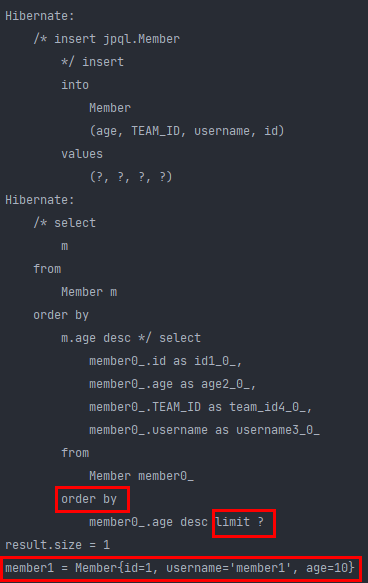

페이징에서는 다음과 같이 order by 가 들어가야 페이징이 잘 되는지 알 수 있다. (sorting 되면서 순서대로 가져오는지 봐야하기 때문)

결과를 보면 limit ?가 뜨는데, 지금 setFirstResult가 0이여서 이런식으로 뜬다.

setFirstResult를 1로 바꾸면
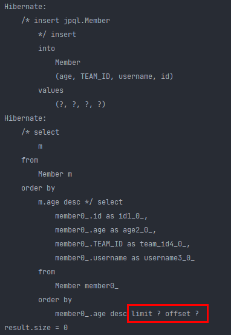

다음과 같이 limit과 offset이 뜨게 된다.

1부터 시작했기 때문에 데이터가 안나온다.

```java
for (int i = 0; i < 100; i++) {
    Member member = new Member();
    member.setUsername("member" + i);
    member.setAge(i);
    em.persist(member);
}
em.flush();
em.clear();

List<Member> result = em.createQuery("select m from Member m order by m.age desc", Member.class)
    .setFirstResult(1)
    .setMaxResults(10)
    .getResultList();

System.out.println("result.size = " + result.size());
for (Member member1 : result) {
    System.out.println("member1 = " + member1);
}
```

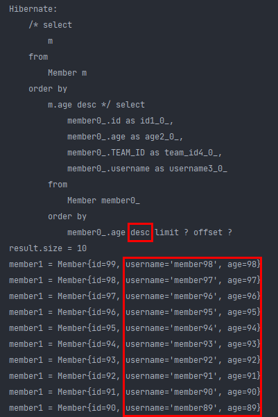

내림차순이고, 99부터 시작이고, setFirstResult가 1이므로 98부터 10개를 찾는다.

그럼 여기 select 쿼리에서 `limit ? offset ?`은 무슨 쿼리일까?

이게 지금 데이터베이스 방언에 의해 돌아가고 있다. 현재 H2 데이터베이스 방언을 쓰고 있고, H2 데이터베이스의 페이징 쿼리 표준은 `limit ? offset ?` 이다.

만약 `<property name="hibernate.dialect" value="org.hibernate.dialect.Oracle12cDialect"/>` 오라클 방언을 쓴다면?

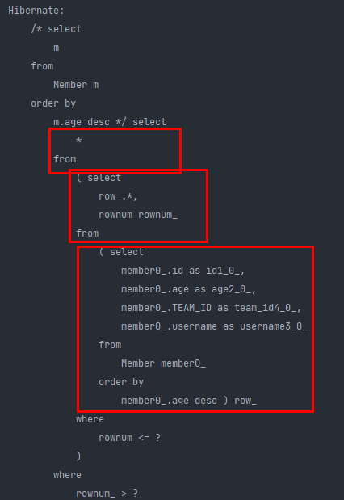

다음과 같이 select from을 3번 쓰는 페이징 전략을 가져간다. (보통 극한의 쿼리 성능을 요구하는게 아니면 페이징은 이렇게 depth가 3인 페이징 쿼리를 날리게 된다.)

> 3번 하는이유는 sorting 하기 위한 select와 거기서 row를 또 뽑아내야 하고, 또 밖에서 최종적으로 뽑아내야 하기 때문이다.

그래서 지금까지 페이징 쿼리를 정말 거지 같이 쓰다가, jpa에서 페이징 api를 제공해줌으로써 훨씬 편하게 쓸 수 있다.

**인간이 추상적으로 까지 생각하면, 구체적인건 프레임워크나 라이브러리가 처리해 준다.**

### 페이징 API - MySQL 방언

```sql
SELECT
	M.ID AS ID,
	M.AGE AS AGE,
	M.TEAM_ID AS TEAM_ID,
	M.NAME AS NAME
FROM
	MEMBER M
ORDER BY
	M.NAME DESC LIMIT ?, ?
```

### 페이징 API - Oracle 방언

```sql
SELECT * FROM
	( SELECT ROW_.*, ROWNUM ROWNUM_
	FROM
		( SELECT
			M.ID AS ID,
			M.AGE AS AGE,
			M.TEAM_ID AS TEAM_ID,
			M.NAME AS NAME
		FROM MEMBER M
		ORDER BY M.NAME
		) ROW_
	WHERE ROWNUM <= ?
	)
WHERE ROWNUM_ > ?
```


나중에 SpringDataJpa를 쓰면 페이징이 되게 쉽게 된다. 그거도 부가적으로 JPA가 다 해주는 거다. JPA가 제공하는 API 표준 스펙을 제공해 주기 때문에 SpringDataJpa는 그냥 한번 추상화 해서 이 기능들을 주워서 더 편하게 활용하는 거다.

결국 아까 봤던 limit ?, ? 이 물음표에 우리가 추상적으로 생각했던 값들을 구체적으로 다 맞게 넣어준다.

(여기서 ?는 어디서부터 어디까지 보라는 페이지 넘버 같은거다.)

## 조인

- 내부 조인: (아래 예시에서 team 값이 없으면 그 row는 가져오지 않음)
  SELECT m FROM Member m [INNER] JOIN m.team t
- 외부 조인: (아래 예시에서 team값이 없으면 그 row에 값이 없는 곳을 null로 채워서 row를 가져온다.)
  SELECT m FROM Member m LEFT [OUTER] JOIN m.team t
- 세타 조인: (연관관계 없는 것들에 대한 경우의수 곱과(ex : 카르테시안 곱) 같은 조인.)
  select count(m) from Member m, Team t where m.username = t.name

SQL 조인과 실행 되는건 똑같은데, 차이점은 어쨋든 얘는 엔티티 중심으로 동작한다. 그래서 객체 스타일로 조인 문법이 나간다.

```java
Team team = new Team();
team.setName("teamA");
em.persist(team);

Member member = new Member();
member.setUsername("member");
member.setAge(10);

member.changeTeam(team);

em.persist(member);

em.flush();
em.clear();

String query = "select m from Member m inner join m.team t";
List<Member> result = em.createQuery(query, Member.class)
    .getResultList();
```

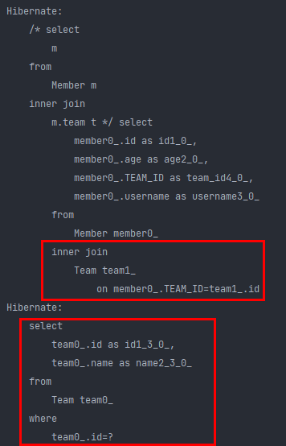

inner join이 나가는걸 확인할 수 있다. 근데 왜 team에서 또 select 쿼리를 나감?

Member의 team 연관관계가 다대일 이므로 LAZY 로딩을 적용해 줘야 한다..

위의 경우 EAGER이기 때문에 MEMBER에서 팀 테이블을 조인해오고, 팀 테이블도 따로 EAGER로 인해 다시 조회 쿼리를 날리게 된다.

> select m from Member m (inner) join m.team t 에서 inner는 생략할 수 있음.

> select m from Member m left (outer) join m.team t 에서 outer는 생략할 수 있음.

```java
Team team = new Team();
team.setName("teamA");
em.persist(team);

Member member = new Member();
member.setUsername("member");
member.setAge(10);

member.changeTeam(team);

em.persist(member);

em.flush();
em.clear();

String query = "select m from Member m left join m.team t ";
List<Member> result = em.createQuery(query, Member.class)
    .getResultList();
```


left outer join 쿼리도 잘 날아 간다.


```java
Team team = new Team();
team.setName("teamA");
em.persist(team);

Member member = new Member();
member.setUsername("member");
member.setAge(10);

member.changeTeam(team);

em.persist(member);

em.flush();
em.clear();

String query = "select m from Member m, Team t where m.username = t.name "; // 이 이름 자체를 비교하는게 말이 안되긴 한데 조인할 수 있다.
List<Member> result = em.createQuery(query, Member.class)
    .getResultList();
```

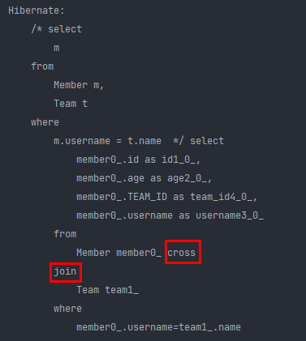

다음과 같이 세타조인을 하면 cross join하여 멤버와 팀을 where 에서 이름이 같은 것들을 전부 경우의수 비교하여 가져온다.


###  조인 - ON 절

- ON절을 활용한 조인(JPA 2.1부터 지원) -> (우리는 전부 2.1 이상 사용한다고 보면 됨.)
  - 1. 조인 대상 필터링
  - 2. 연관관계 없는 엔티티 외부 조인(하이버네이트 5.1부터 지원) -> (옛날에는 내부 조인만 됐었음)

### 1. 조인 대상 필터링

- 예) 회원과 팀을 조인하면서, 팀 이름이 A인 팀만 조인하고 싶을 때

  **JPQL**:

  ```sql
  SELECT m, t FROM Member m LEFT JOIN m.team t on t.name = 'A'
  ```

  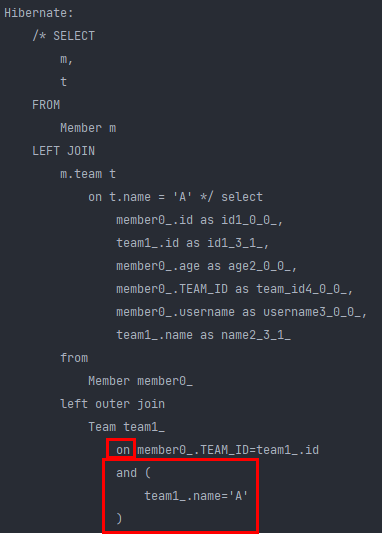

  **SQL**:

  ```sql
  SELECT m.*, t.* FROM
  MEMBER m LEFT JOIN Team t ON m.TEAM_ID=t.id and t.name='A'
  ```

  위 JPQL 결과와 동일한 쿼리가 날아가는 것을 확인할 수 있다.

### 2. 연관관계 없는 엔티티 외부 조인

- 예) 회원의 이름과 팀의 이름이 같은 대상 외부 조인 (물론 내부 조인도 됨!)

  **JPQL**:

  ```SQL
  SELECT m,t FROM Member m LEFT JOIN Team t on m.username = t.name
  ```

  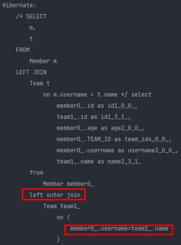

  **SQL**:

  ```SQL
  SELECT m.*, t.* FROM
  Member m LEFT JOIN Team t ON m.username = t.name
  ```

  위 JPQL 결과와 같은 쿼리가 나간다.


## 서브 쿼리

- 나이가 평균보다 많은 회원

  ```SQL
  select m from Member m where m.age > (select avg(m2.age) from Member m2)
  ```

  메인쿼리에서는 m이고 서브쿼리에서는 m2로 하여 서로 독립적으로 구성 (성능도 가져갈 수 있음)

- 한 건이라도 주문한 고객

  ```sql
  select m from Member m where (select count(o) from Order o where m = o.member) > 0
  ```

  위 sql문에서는 m을 서브쿼리로 끌고 왔다. 이럴 경우 성능이 잘 나오지 않음.

### 서브 쿼리 지원 함수

- [NOT] EXISTS (subquery): 서브쿼리에 결과가 존재하면 참
  - {ALL | ANY | SOME} (subquery)
  - ALL 모두 만족하면 참
  - ANY, SOME: 같은 의미, 조건을 하나라도 만족하면 참
- [NOT] IN (subquery): 서브쿼리의 결과 중 하나라도 같은 것이 있으면 참

### 서브 쿼리 - 예제

- 팀A 소속인 회원

  ```sql
  select m from Member m where exists (select t from m.team t where t.name = ‘팀A')
  ```

- 전체 상품 각각의 재고보다 주문량이 많은 주문들

  ```sql
  select o from Order o where o.orderAmount > ALL (select p.stockAmount from Product p)
  ```

- 어떤 팀이든 팀에 소속된 회원

  ```sql
  select m from Member m where m.team = ANY (select t from Team t)
  ```

  

### JPA 서브 쿼리 한계

- JPA는 WHERE, HAVING 절에서만 서브 쿼리 사용 가능하다.

- SELECT 절도 가능 (하이버네이트에서 지원) -> JPA 표준에서는 지원안하지만 하이버네이트 구현체가 지원해줌.

  -> `select (select avg(m1.age) From Member m1) as avgAge from Member m join Team t on m.username = t.name` 이런식으로 뽑아낼 수 있음.

- **FROM 절의 서브 쿼리는 현재 JPQL에서 불가능** -> `select mm.age, mm.username from (select m.age, m.username from Member m) as mm` 이런식으로 from 절의 서브쿼리를 JPQL에서는 할 수 없음

  - **조인으로 풀 수 있으면 풀어서 해결** (그래도 안되는 경우가 있다면 이 방법은 포기해야 한다.) -> 정 안되면 native sql을 써야 한다. 

사실 from 절의 서브쿼리는 대부분 그 안에서 필터가 돼서 추려진다. 그럼 그걸 애플리케이션으로 가져와서 조작하는 방식이었다. 근데 이게 정 안될때는 쿼리를 `2번` 분해해서 날린다. -> 서브 쿼리를 따로 날려서 결과를 가져온 거랑, 원래 쿼리랑 애플리케이션 단에서 조립하는 식으로 해결할 수 있다. (제일 좋은건 조인으로 풀 수 있는게 좋다.)

1. 조인으로 풀어서 해결 
2. 쿼리 2번 날리자. (근데 이거도 안될 때가 있음. ex: 서브 쿼리 자체가 return 하는 값이 너무 커서 복잡할 경우 native로 넘김.)
3. 네이티브 sql

근데 2에서 서브 쿼리자체가 return 하는 값이 크더라도 네이티브로 안쓰는데.. 

사실 from 절에 서브쿼리를 쓰는 이유가 여러가지가 있는데, 보통은 서브쿼리로 from절로 데이터를 긁어서 가져온 다음, 안에서는 데이터를 줄이는 일을 하고, 밖에서는 데이터 타입을 변경하거나, sql에 로직이 있는 경우가 대부분임.(view에 로직이 있거나, view가 원하는 방식으로 문자를 바꾸거나 .. 등등) 

이런 경우에는 전부 JPA로 애플리 케이션으로 다 긁어 가서 FROM 절의 서브쿼리가 많이 줄어 들기도 한다. 

<h6><- 뭔말??</h6>


## JPQL 타입 표현

- 문자: ‘HELLO’, ‘She’’s’ (single quote 표현해야 할 때는 2개 쓰면 됨)
- 숫자: 10L(Long), 10D(Double), 10F(Float)
- Boolean: TRUE, FALSE
- ENUM: jpabook.MemberType.Admin (자바 패키지명 포함해야 함)
- 엔티티 타입: TYPE(m) = Member (상속 관계에서 사용)

```java
Team team = new Team();
team.setName("teamA");
em.persist(team);

Member member = new Member();
member.setUsername("member");
member.setAge(10);

member.changeTeam(team);

em.persist(member);

em.flush();
em.clear();

String query = "select m.username, 'HELLO', TRUE From Member m"; // true 대소문자 구분 안해도 됨
List<Object[]> result = em.createQuery(query)
    .getResultList();

for (Object[] objects : result) {
    System.out.println("objects = " + objects[0]);
    System.out.println("objects = " + objects[1]);
    System.out.println("objects = " + objects[2]);
}
```

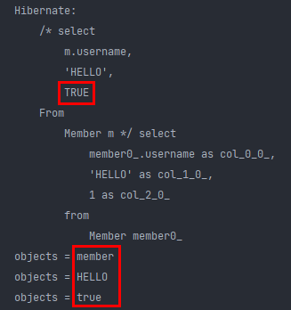

이런식으로 여러 타입을 조회할 수 있다.

```java
Team team = new Team();
team.setName("teamA");
em.persist(team);

Member member = new Member();
member.setUsername("member");
member.setAge(10);
member.setType(MemberType.ADMIN);

member.changeTeam(team);

em.persist(member);

em.flush();
em.clear();

String query = "select m.username, 'HELLO', TRUE From Member m where m.type = jpql.MemberType.ADMIN"; // 이런식으로 enum 타입의 패키지까지 입력하여 사용할 수도 있다.
List<Object[]> result = em.createQuery(query)
    .getResultList();

for (Object[] objects : result) {
    System.out.println("objects = " + objects[0]);
    System.out.println("objects = " + objects[1]);
    System.out.println("objects = " + objects[2]);
}
```

결과는 위와 같이 나온다.

근데 이렇게 패키지로 쓰면 길어지는데, 사실 아래처럼 **파라미터 바인딩**하면 길지않게 줄여줄 수 있다.

```java
String query = "select m.username, 'HELLO', TRUE From Member m where m.type = :userType";
List<Object[]> result = em.createQuery(query)
    .setParameter("userType", MemberType.ADMIN) // 파라미터 바인딩 !
    .getResultList();
```

나중에 querydsl 쓰면 기본적으로 자바 코드로 쓰기 때문에 , 패키지 자체를 import 해서 쓸 수 있다.


상속관계에서는 다음과 같이 select 절을 만들 수 있다.

```java
em.createQuery("select i from Item i where type(i) = Book", Item.class)
```

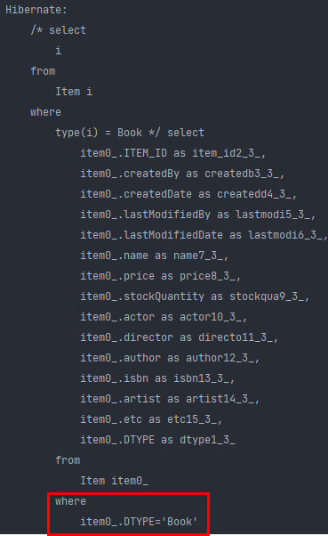

이런식으로 Item의 DTYPE으로 비교한다. 

### JPQL 기타

- SQL과 문법이 같은 식
- EXISTS, IN
- AND, OR, NOT
- =, >, >=, <, <=, <>
- BETWEEN, LIKE, **IS NULL**

## 조건식 - CASE 식

### 기본 CASE 식

```SQL
select
	case when m.age <= 10 then '학생요금'
		when m.age >= 60 then '경로요금'
		else '일반요금'
	end
from Member m
```

기본 case 식은 condition에 대한 조건을 넣어줄 수 있다.

### 단순 CASE 식

```SQL
select
	case t.name
		when '팀A' then '인센티브110%'
		when '팀B' then '인센티브120%'
		else '인센티브105%'
	end
from Team t
```

단순 case 식은 exact 매칭으로 정확하게 맞아야 한다.

```java
Team team = new Team();
team.setName("teamA");
em.persist(team);

Member member = new Member();
member.setUsername("member");
member.setAge(10);
member.setType(MemberType.ADMIN);

member.changeTeam(team);

em.persist(member);

em.flush();
em.clear();

String query =
    "select " +
    "case when m.age <= 10 then '학생요금' " +
    "     when m.age >= 60 then '경로요금' " +
    "     else '일반요금' " +
    "end " +
    "from Member m"; // 나중에 querydsl쓰면 이렇게 문자단위로 고민 안해도 됨.
List<String> result = em.createQuery(query, String.class)
    .getResultList();

for (String s : result) {
    System.out.println("s = " + s);
}
```

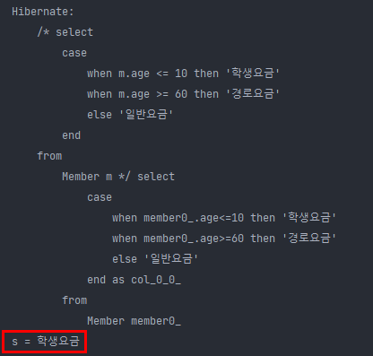

예상했던 대로 잘 나온다.

- COALESCE: 하나씩 조회해서 null이 아니면 반환
- NULLIF: 두 값이 같으면 null 반환, 다르면 첫번째 값 반환

```SQL
select coalesce(m.username,'이름 없는 회원') from Member m
```

사용자 이름이 없으면 이름 없는 회원을 반환한다.

```SQL
select NULLIF(m.username, '관리자') from Member m
```

사용자 이름이 ‘관리자’면 null을 반환하고 나머지는 본인의 이름을 반환한다.

```java
Team team = new Team();
team.setName("teamA");
em.persist(team);

Member member = new Member();
member.setUsername(null);
member.setAge(10);
member.setType(MemberType.ADMIN);

member.changeTeam(team);

em.persist(member);

em.flush();
em.clear();

String query = "select coalesce(m.username, '이름 없는 회원') from Member m";
List<String> result = em.createQuery(query, String.class)
    .getResultList();

for (String s : result) {
    System.out.println("s = " + s);
}
```

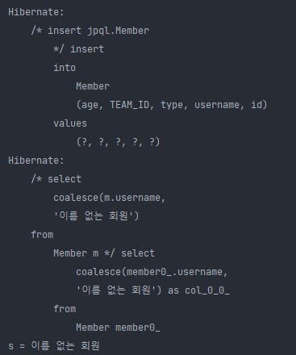

유저 이름을 null로 주면 기대한 값이 나온다.

```java
Team team = new Team();
team.setName("teamA");
em.persist(team);

Member member = new Member();
member.setUsername("관리자");
member.setAge(10);
member.setType(MemberType.ADMIN);

member.changeTeam(team);

em.persist(member);

em.flush();
em.clear();

String query = "select nullif(m.username, '관리자') from Member m";
List<String> result = em.createQuery(query, String.class)
    .getResultList();

for (String s : result) {
    System.out.println("s = " + s);
}
```

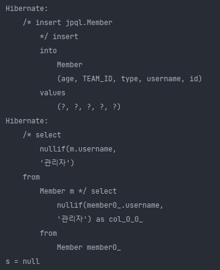

이름이 관리자로 기대한 값과 같기 때문에 null이 나온다.

이 함수들은 표준이기 때문에 어떤 db에서든 다 적용 가능하다.

## JPQL 함수

### JPQL 기본 함수

- CONCAT
- SUBSTRING
- TRIM
- LOWER, UPPER
- LENGTH
- LOCATE
- ABS, SQRT, MOD
- SIZE, INDEX(JPA 용도)

JPQL에서 제공하는 표준 함수 이므로 DB에 상관없이 쓰면 된다.

### 사용자 정의 함수 호출

- 하이버네이트는 사용 전 방언에 추가해야 한다.

  - 사용하는 DB 방언을 상속받고, 사용자 정의 함수를 등록한다.

    ```SQL
    select function('group_concat', i.name) from Item i
    ```

애플리케이션을 개발하다보면 데이터베이스 안에 함수가 들어있을 수 있는데, JPQL은 그 함수를 알 방법이 없다. 그래서 위와 같이 select function 이라는 표준 문법을 제공해 준다. (그냥 쓸 수는 없고 데이터베이스 방언을 추가해 놔야 함.)

실제로 실무에서 함수를 쓸 일이 굉장히 많은데, hibernate의 구현체를 쓴다면, 다행히도

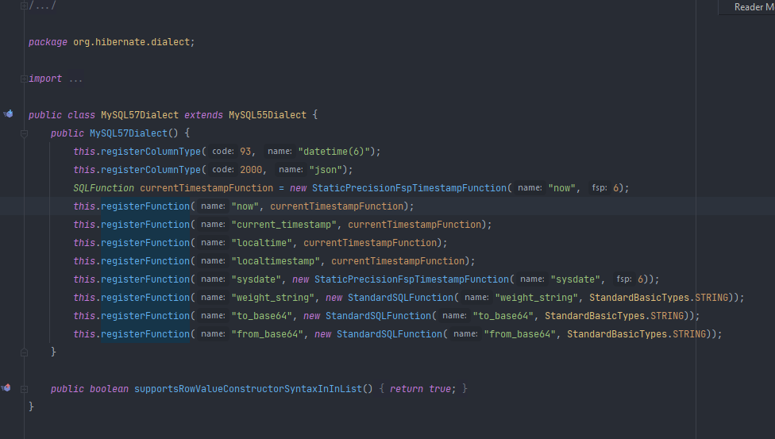

이미 registerFunction으로 함수가 다 등록되어 있다. (물론 db 종속적이긴 함.)

그래도 데이터베이스가 제공하는 대부분의 함수들은 다 미리 등록되어 있기 때문에 그냥 가져다 쓰면 된다. 근데 이렇게 등록되어 있지않은, 일반적인 벤더들이 제공하지 않는 함수들은 사용자 정의 함수로 함수를 등록해야 한다.


JPQL 기본 함수 하나씩 실습

`CONCAT`

```java
Member member1 = new Member();
member1.setUsername("관리자1");
em.persist(member1);

Member member2 = new Member();
member2.setUsername("관리자2");
em.persist(member2);

em.flush();
em.clear();

String query = "select concat('a','b')  From Member m";
List<String> result = em.createQuery(query, String.class)
    .getResultList();

for (String s : result) {
    System.out.println("s = " + s);
}
```

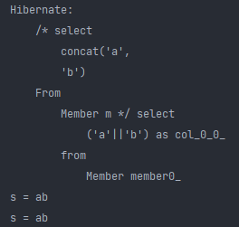

문자 합쳐짐.

```java
String query = "select 'a' || 'b'  From Member m";
```

인텔리제이에서 그냥 ||으로 하고 uninject하면 잘 돌아감.

`LOCATE`

```java
Member member1 = new Member();
member1.setUsername("관리자1");
em.persist(member1);

Member member2 = new Member();
member2.setUsername("관리자2");
em.persist(member2);

em.flush();
em.clear();

String query = "select locate('de','abcdegf') From Member m";
List<Integer> result = em.createQuery(query, Integer.class)
    .getResultList();

for (Integer s : result) {
    System.out.println("s = " + s);
}
```

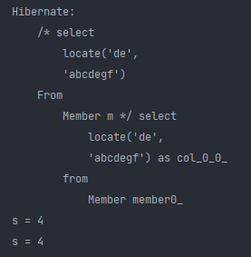

abcd 부터 일치하므로, 1,2,3,4 -> 4번째이므로 4가 출력됨.

`SIZE, INDEX(JPA 용도)`

```java
Team team = new Team();
em.persist(team);

Member member1 = new Member();
member1.setUsername("관리자1");
member1.setTeam(team);
em.persist(member1);

Member member2 = new Member();
member2.setUsername("관리자2");
em.persist(member2);

em.flush();
em.clear();

String query = "select size(t.members) From Team t";

List<Integer> result = em.createQuery(query, Integer.class)
    .getResultList();

for (Integer s : result) {
    System.out.println("s = " + s);
}
```


다음과 같이 관리자 1을 팀과 연결한뒤 size 함수를 사용하면 1이 잘 출력된다.

> index의 경우 @OrderColumn을 이용하여 컬렉션 위치를 가져올 때 사용할 수 있는데, 값타입 챕터에서도 말했듯이, 중간에 list에서 값이 빠지면 null로 들어오기 때문에 왠만하면 안쓰는게 좋다.


`사용자 정의 함수 만드는 방법`

우선 dialect를 만들어야 한다.

```java
public class MyH2Dialect extends H2Dialect {
    public MyH2Dialect() {
        registerFunction("group_concat", new StandardSQLFunction("group_concat", StandardBasicTypes.STRING));
    }
}
```

우선 내가 사용하는 데이터베이스 방언을 상속 받은 다음, 생성자에서 registerFunction으로 등록해주면 된다.

registerFunction 부분은 내가 방금 상속받은 내가 쓰는 데이터베이스 클래스 안에서 어떤식으로 쓰이는지 보고 거기에 맞춰서 작성해야 한다.

그리고 persistence.xml에서

```java
<property name="hibernate.dialect" value="dialect.MyH2Dialect"/>
```

H2Dialect에서 MyH2Dialect로 바꿔줘야 한다.

```java
Member member1 = new Member();
member1.setUsername("관리자1");
em.persist(member1);

Member member2 = new Member();
member2.setUsername("관리자2");
em.persist(member2);

em.flush();
em.clear();

String query = "select function('group_concat', m.username) From Member m";

List<String> result = em.createQuery(query, String.class)
    .getResultList();

for (String s : result) {
    System.out.println("s = " + s);
}
```

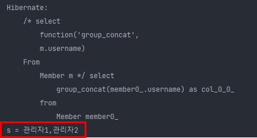

관리자 1,2 2개넣었으니, 값도 2개로 나올거라 생각햿는데, concat되어 한 줄로 return되는 것을 확인할 수 있다.

(사실 위에껀 h2에 등록되있는거지만 예를들어 이런식으로 등록할 수 있다는 것을 보여준 것임)

