# 객체지향 쿼리 언어 2 - 중급 문법

## JPQL - 경로 표현식

### 경로 표현식

- .(점)을 찍어 객체 그래프를 탐색하는 것

```sql
select m.username -> 상태 필드
	from Member m
		join m.team t -> 단일 값 연관 필드
		join m.orders o -> 컬렉션 값 연관 필드
where t.name = '팀A'
```

### 경로 표현식 용어 정리

- **상태 필드**(state field): 단순히 값을 저장하기 위한 필드 (ex: m.username)
- **연관 필드**(association field): 연관관계를 위한 필드
  - **단일 값 연관 필드:**<br>@ManyToOne, @OneToOne, 대상이 엔티티(ex: m.team)
  - **컬렉션 값 연관 필드:**<br>@OneToMany, @ManyToMany, 대상이 컬렉션(ex: m.orders)

### 경로 표현식 특징

- **상태 필드**(state field): 경로 탐색의 끝, 탐색X 
- **단일 값 연관 경로**: 묵시적 내부 조인(inner join) 발생, 탐색O
- **컬렉션 값 연관 경로**: 묵시적 내부 조인 발생, 탐색X
  - FROM 절에서 명시적 조인을 통해 별칭을 얻으면 별칭을 통해 탐색 가능

```java
Member member1 = new Member();
member1.setUsername("관리자1");
em.persist(member1);

Member member2 = new Member();
member2.setUsername("관리자2");
em.persist(member2);

em.flush();
em.clear();

String query = "select m.team From Member m";

List<Team> result = em.createQuery(query, Team.class)
    .getResultList();

for (Team s : result) {
    System.out.println("s = " + s);
}
```

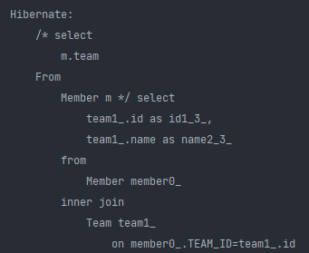

jpql은 그냥 m.team을 조회하라고 하지만, 실제 sql은 inner join을 묵시적으로 한다. (이런식의 단일값 연관 경로는 묵시적 내부 조인을 하게 됨.)

이게 되게 편해보이지만, 실무에서는 쿼리 튜닝할때 힘들어진다. (왠만하면 묵시적 조인이 일어나지 않게 짜야 한다. 실제 운영에서는 수백개의 쿼리가 날아다니므로, 성능튜닝하기가 굉장히 힘들어 진다. dba가 join 쿼리 찾아달라고 하면 찾기도 힘들어짐..)

```java
Member member1 = new Member();
member1.setUsername("관리자1");
em.persist(member1);

Member member2 = new Member();
member2.setUsername("관리자2");
em.persist(member2);

em.flush();
em.clear();

String query = "select t.members From Team t";

Collection result = em.createQuery(query, Collection.class)
    .getResultList();

for (Object o : result) {
    System.out.println("o = " + o);
}
```

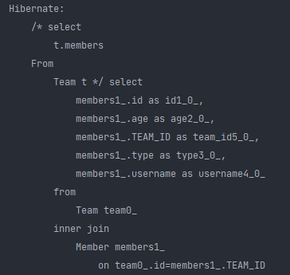

실행이 되는 것을 확인할 수 있음. 근데 값은 안나옴. 왜냐면 members가 컬렉션이기 때문에 필드를 찍을 수 없다. (쓸수있는게 size 정도밖에 없음)

```java
Team team = new Team();
em.persist(team);

Member member1 = new Member();
member1.setUsername("관리자1");
member1.setTeam(team);
em.persist(member1);

Member member2 = new Member();
member2.setUsername("관리자2");
member2.setTeam(team);
em.persist(member2);

em.flush();
em.clear();

String query = "select t.members.size From Team t";

Integer result = em.createQuery(query, Integer.class)
    .getSingleResult();

System.out.println("result = " + result);
```

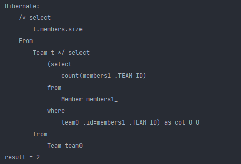

다음과 같이 사이즈는 가져올 수 있다.

```java
Team team = new Team();
em.persist(team);

Member member1 = new Member();
member1.setUsername("관리자1");
member1.setTeam(team);
em.persist(member1);

Member member2 = new Member();
member2.setUsername("관리자2");
member2.setTeam(team);
em.persist(member2);

em.flush();
em.clear();

String query = "select t.members From Team t";

List<Collection> result = em.createQuery(query, Collection.class)
    .getResultList();

System.out.println("result = " + result);
```


이런식으로 값만 가져올 수는 있다. (그 이상의 탐색은 안됨) -> `t.members.username` 이게 안된다는 거임

그래서 이때는 아래와 같이 명시적인 조인을 써야함.

`select m From Team t join t.members m`

이렇게 from절에서 별칭을 통해 탐색가능. -> `m.username`이 된다는 뜻

### 상태 필드 경로 탐색

- JPQL: select m.username, m.age from Member m
- SQL: select m.username, m.age from Member m

### 단일 값 연관 경로 탐색

- JPQL: select **o.member** from Order o

- SQL: select m.* from Orders o **inner join Member m on o.member_id = m.id**

이런 이유때문에 묵시적 조인을 쓰면 안됨.

### 명시적 조인, 묵시적 조인

- 명시적 조인: join 키워드 직접 사용
  - select m from Member m **join m.team t**
- 묵시적 조인: 경로 표현식에 의해 묵시적으로 SQL 조인 발생(내부 조인만 가능)
  - select **m.team** from Member m

### 경로 표현식 - 예제

- select o.member.team from Order o -> 성공 (대신 join이 2번날아가고, 이거보고 무슨 sql이 나갈지 헷갈림..)
- select t.members from Team -> 성공(t.members에서 딱 끊었기 때문에 가능. 더 탐색할 순 없음.)
- select t.members.username from Team t -> 실패 (더 탐색 못함.)
- select m.username from Team t join t.members m -> 성공 (컬렉션을 명시적 조인으로 가져왔기 때문에 가능)

### 경로 탐색을 사용한 묵시적 조인 시 주의사항

- 항상 내부 조인
- 컬렉션은 경로 탐색의 끝, 명시적 조인을 통해 별칭을 얻어야함
- 경로 탐색은 주로 SELECT, WHERE 절에서 사용하지만 묵시적 조인으로 인해 SQL의 FROM (JOIN) 절에 영향을 줌

### 실무 조언

- **가급적 묵시적 조인 대신에 명시적 조인 사용**
- 조인은 SQL 튜닝에 중요 포인트
- 묵시적 조인은 조인이 일어나는 상황을 한눈에 파악하기 어려움

> -> 결론 : 항상 명시적 조인을 사용하라!

## JPQL - 페치 조인(fetch join)

### 실무에서 정말정말 중요하다..

이걸 모르고는 실무를 못할 정도로 진짜 중요하다.

### 페치 조인(fetch join)

- SQL 조인 종류X
- JPQL에서 **성능 최적화**를 위해 제공하는 기능 (JPQL 전용기능)
- 연관된 엔티티나 컬렉션을 **SQL 한 번에 함께 조회**하는 기능 (쿼리 2번나갈 거 같은걸 한방 쿼리로 해결해줌)
- join fetch 명령어 사용
- 페치 조인 ::= [ LEFT [OUTER] | INNER ] JOIN FETCH 조인경로

### 엔티티 페치 조인

- 회원을 조회하면서 연관된 팀도 함께 조회(SQL 한 번에)

- SQL을 보면 회원 뿐만 아니라 **팀(`T.*`)**도 함께 **SELECT**

- **[JPQL]**

  ```SQL 
  select m from Member m join fetch m.team
  ```

- **[SQL]**

  ```SQL 
  SELECT M.*, T.* FROM MEMBER M INNER JOIN TEAM T ON M.TEAM_ID=T.ID
  ```

실제로 JPQL에서는 select `m` 만 썼는데, sql은 T.* 까지 조회한다.

> 즉시 로딩에서 본 쿼리와 같은 상황이다. 근데 이 경우는 쿼리로 어떤 객체 맵들을 한번에 조회할 거야! 라는걸 직접 명시적으로 동적인 타이밍에 정할 수 있다.

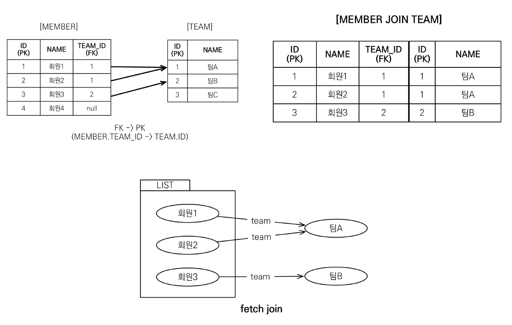

위 그림에서 JPA는 회원1,회원2,회원3,팀A,팀B 총 5개의 엔티티를 만들어 놓는다. 

영속성컨텍스트에서 위와 같은 그림을 보고, join하여 가져온다.

```java
Team teamA = new Team();
teamA.setName("팀A");
em.persist(teamA);

Team teamB = new Team();
teamB.setName("팀B");
em.persist(teamB);

Member member1 = new Member();
member1.setUsername("회원1");
member1.setTeam(teamA);
em.persist(member1);

Member member2 = new Member();
member2.setUsername("회원2");
member2.setTeam(teamA);
em.persist(member2);

Member member3 = new Member();
member3.setUsername("회원3");
member3.setTeam(teamB);
em.persist(member3);

em.flush();
em.clear();

String query = "select m From Member m";

List<Member> result = em.createQuery(query, Member.class)
    .getResultList();

for (Member member : result) {
    System.out.println("member = " + member);
    // 회원1, 팀A(SQL)
    // 회원2, 팀A(1차 캐시)
    // 회원3, 팀B(SQL)
}
```

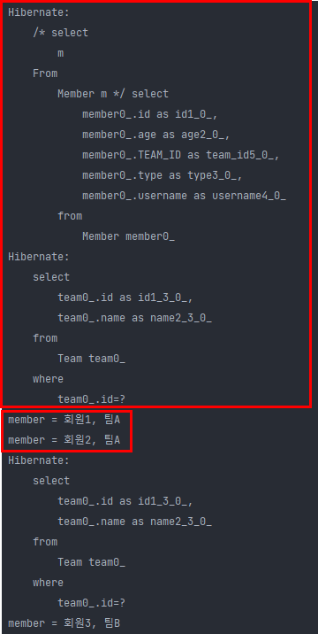

회원1을 조회할 때는 select쿼리를 날리는데, 회원2는 캐시에서 가져온다.

회원3의 경우 팀B가 캐시에 없기 때문에 쿼리를 다시 날려서 가져온다. 

총 쿼리를 3번날리게된다.

최악의 경우, 팀과 소속이 다다르게 되면, 쿼리가 4번 나가게 된다..


예를들어 회원 100명을 조회하게되면 101번 쿼리가 나가게 된다. (N + 1 문제)

여기서 1은 회원을 가져오기 위해 날린 쿼리를 의미한다.

> 이건 사실 즉시로하나, 지연으로 하나 똑같이 N+1 문제가 발생하게 됨.

이 문제의 해결방법은 fetch join 밖에 없다.

### 페치 조인 사용 코드

```java
String query = "select m From Member m join fetch m.team";
```

다음과 같이 query 스트링만 이렇게 fetch join으로 바꿔주면

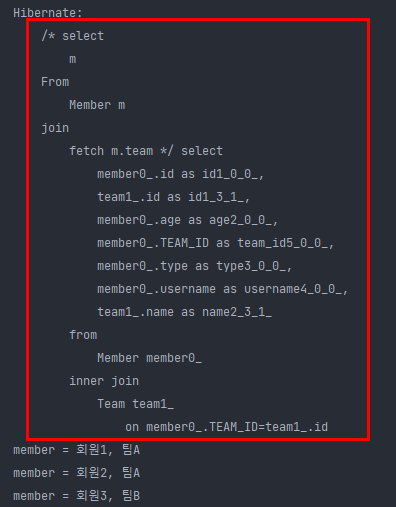

한방 쿼리로 다 가져온다. for문으로 team을 계속 조회하는데, 이 team이 더이상 프록시가 아님. 왜냐면 데이터를 조인해서 다 가져왔기 때문. (지연로딩 없이 깔끔하게 나옴.)

비록 지연로딩으로 설정했을지라도 fetch join이 항상 우선임.

### 컬렉션 페치 조인

- 일대다 관계, 컬렉션 페치 조인

- **[JPQL]**

  ```sql 
  select t from Team t join fetch t.members where t.name = ‘팀A'
  ```

- **[SQL]**

  ```sql
  SELECT T.*, M.* FROM TEAM T INNER JOIN MEMBER M ON T.ID=M.TEAM_ID WHERE T.NAME = '팀A'
  ```

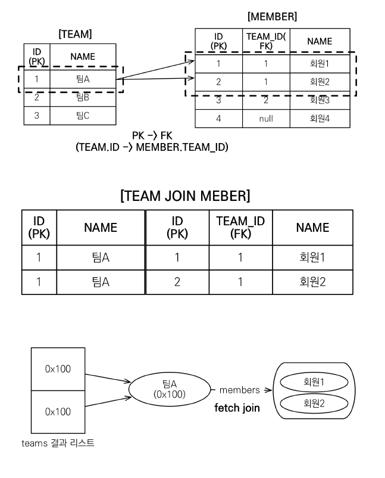

```java
Team teamA = new Team();
teamA.setName("팀A");
em.persist(teamA);

Team teamB = new Team();
teamB.setName("팀B");
em.persist(teamB);

Member member1 = new Member();
member1.setUsername("회원1");
member1.setTeam(teamA);
em.persist(member1);

Member member2 = new Member();
member2.setUsername("회원2");
member2.setTeam(teamA);
em.persist(member2);

Member member3 = new Member();
member3.setUsername("회원3");
member3.setTeam(teamB);
em.persist(member3);

em.flush();
em.clear();

String query = "select t From Team t join fetch t.members";

List<Team> result = em.createQuery(query, Team.class)
    .getResultList();

for (Team team : result) {
    System.out.println("team = " + team.getName() + "|members=" + team.getMembers().size());
}
```

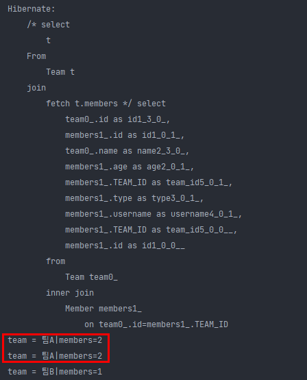

한방 쿼리로 가져오는데, 왜 팀A에 대해 2번을 중복 출력할까? 컬렉션 입장에서 이 경우를 조심해야 한다.

db입장에서 일대다 조인을 하면 데이터가 뻥튀기 된다.

즉, 팀A는 하나인데, 멤버가 2개이므로 row가 2개의 row가 된다.

JPA는 팀A에 회원이 2명이 있는지 100명이 있는지 알지 못한다. 이게 객체와 RDB의 차이인데, 객체 입장에서 알 수 있는 상황이 아닌거다.

결국DB에서 주는데로 받아야 함.

결국 팀A를 조회한 값은 같은 팀A를 가리킨다. 

### 컬렉션 페치 조인 사용 코드

```JAVA
String jpql = "select t from Team t join fetch t.members where t.name = '팀A'"
List<Team> teams = em.createQuery(jpql, Team.class).getResultList();

for(Team team : teams) {
	System.out.println("teamname = " + team.getName() + ", team = " + team);
	for (Member member : team.getMembers()) {
		//페치 조인으로 팀과 회원을 함께 조회해서 지연 로딩 발생 안함
		System.out.println(“-> username = " + member.getUsername()+ ", member = " + member);
	}
}
```

👉result

```
teamname = 팀A, team = Team@0x100
-> username = 회원1, member = Member@0x200
-> username = 회원2, member = Member@0x300
teamname = 팀A, team = Team@0x100
-> username = 회원1, member = Member@0x200
-> username = 회원2, member = Member@0x300
```

### 페치 조인과 DISTINCT

- SQL의 DISTINCT는 중복된 결과를 제거하는 명령이다.
- JPQL의 DISTINCT 2가지 기능 제공한다. (SQL의 DISTINCT만으로는 중복제거를 할 수 없기 때문)
  - 1. SQL에 DISTINCT를 추가한다.
  - 2. 애플리케이션에서(DB가 아니라!) 엔티티 중복 제거한다.

- ```SQL
  select distinct t from Team t join fetch t.members where t.name = ‘팀A’
  ```

- SQL에 DISTINCT를 추가하지만 데이터가 다르므로 SQL 결과에서 중복제거 실패

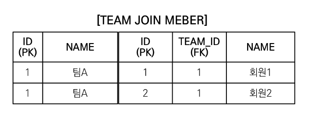

이그림은 ID와 NAME이 다르기 때문에 중복된 데이터가 아님. 

- DISTINCT가 추가로 애플리케이션에서 중복 제거시도한다.
- 같은 식별자를 가진 **Team 엔티티를 제거**한다.

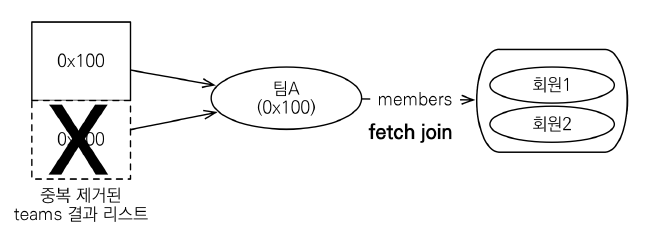

[DISTINCT 추가시 결과]

```
teamname = 팀A, team = Team@0x100
-> username = 회원1, member = Member@0x200
-> username = 회원2, member = Member@0x300
```

>  일대다 -> 데이터 뻥튀기 | 다대일 -> 데이터 뻥튀기 x

### 페치 조인과 일반 조인의 차이

- 일반 조인 실행시 연관된 엔티티를 함께 조회하지 않음

- **[JPQL]**

  ```sql
  select t from Team t join t.members m where t.name = ‘팀A'
  ```

- **[SQL]**

  ```SQL
  SELECT T.* FROM TEAM T INNER JOIN MEMBER M ON T.ID=M.TEAM_ID WHERE T.NAME = '팀A'
  ```

- JPQL은 결과를 반환할 때 연관관계 고려X
- 단지 SELECT 절에 지정한 엔티티만 조회할 뿐
- 여기서는 팀 엔티티만 조회하고, 회원 엔티티는 조회X
- 페치 조인을 사용할 때만 연관된 엔티티도 함께 **조회(즉시 로딩)**
- **페치 조인은 객체 그래프를 SQL 한번에 조회하는 개념**

### 페치 조인 실행 예시

- 페치 조인은 연관된 엔티티를 함께 조회함

- **[JPQL]**

  ```SQL
  select t from Team t join fetch t.members where t.name = ‘팀A'
  ```

- **[SQL]**

  ```SQL
  SELECT T.*, M.* FROM TEAM T INNER JOIN MEMBER M ON T.ID=M.TEAM_ID WHERE T.NAME = '팀A'
  ```

이걸로 대부분의 N+1문제를 해결한다고 보면 됨.

```java
Team teamA = new Team();
teamA.setName("팀A");
em.persist(teamA);

Team teamB = new Team();
teamB.setName("팀B");
em.persist(teamB);

Member member1 = new Member();
member1.setUsername("회원1");
member1.setTeam(teamA);
em.persist(member1);

Member member2 = new Member();
member2.setUsername("회원2");
member2.setTeam(teamA);
em.persist(member2);

Member member3 = new Member();
member3.setUsername("회원3");
member3.setTeam(teamB);
em.persist(member3);

em.flush();
em.clear();

String query = "select t From Team t join fetch t.members";

List<Team> result = em.createQuery(query, Team.class)
    .getResultList();

System.out.println("result = " + result.size());

for (Team team : result) {
    System.out.println("team = " + team.getName() + "|members=" + team.getMembers().size());
    for (Member member : team.getMembers()) {
        System.out.println("-> member = " + member);
    }
}
```

아까 처럼 fetch join을 사용하면

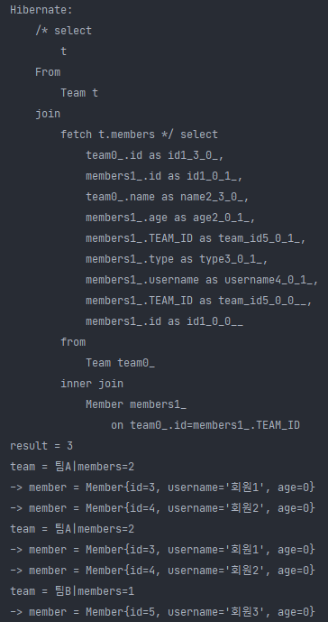

한방 쿼리에, 루프 돌면 데이터가 뻥튀기 되서 나온다.

```java
String query = "select t From Team t join t.members";
```

근데 일반 join을 사용하면

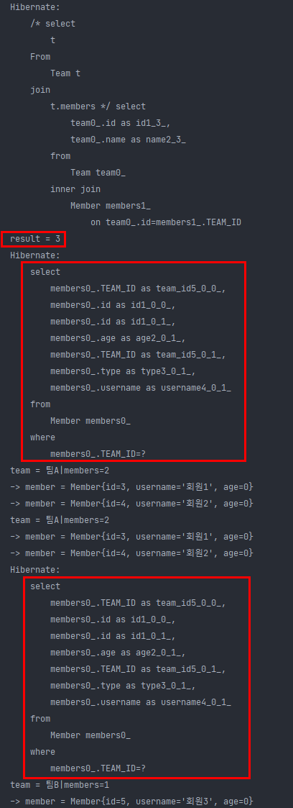

첫 select에서 team만 조회한다. 그리고 그냥 join도 데이터가 뻥튀기 되는것을 알 수 있다.

여기서 문제가 되는건, members가 아직 db에서 데이터를 가져오지 못했기 때문에 (초기화가 안됨) 뒤에 쿼리가 나가는 것을 확인할 수 있다.

## 페치 조인의 특징과 한계

- 페치 조인 대상에는 별칭을 줄 수 없다.
  - 하이버네이트는 가능하지만 가급적 사용X

```SQL
select t From Team t join fetch t.members as m
```

이렇게 as m을 쓸 수 없다. 페치조인은 나와 연관된 모든 데이터를 다 끌고 오는 거기 때문에 별칭을 두고 데이터를 걸러서 가져오고 싶더라도 그렇게 쓰면 안된다. 따로 조회해야한다.

예를들어 팀에 멤버가 5명이있는데, 그중 3명만 조회하고 싶은 상황이다. 이 3명을 조회하기 위해 따로 조작하는게 엄청 위험한 거다. 왜냐면 jpa에서 객체 그래프로 . 찍어서 이동하는데, 

```sql
select t From Team t join fetch t.members as m where m.age > 10
```

이런식으로 특정 조건을 만족하는 멤버들을 가져오려고 하는 상황이다.

이때, jpa에서 의도한 t.members는 사실 팀의 멤버들을 전부 `다` 가져오는 거기 때문에 이렇게 쓰는건 잘못된 방법이다.

데이터를 거르면서 가져오는게 좋지 않다. 팀에 멤버 데이터 100개가 있는데, 그 위에 5개만 가져오겠다? 충분히 그런 상황이 생길 수 있다. 근데 이런건 어떻게 풀어내야 하냐? 그거는 처음부터 팀에서 멤버를 가져오면 안되고, select해서 멤버를 5개 조회하는 쿼리를 따로 날려야 한다.

어떤 상황은 둘다 팀A를 조회하는데 어떤애는 5명을 가지고 있고, 어떤애는 10명을 가지고 있다..? 이거는 영속성 컨텍스트에서도 관리하기 굉장히 힘든 상황이다.

그래서 이 alias는 쓰면 안된다.

> 어쩌다 쓸 상황이 생기긴 하는데, 거의 그럴 일은 없다고 보면 됨.

```sql
select t From Team t join fetch t.members m join fetch m.orders
```

이런식의 fetch join이 연속일 때 빼고는 alias를 쓰지 않는다.

> 결국 데이터의 정합성을 지키는 것이 중요하다.

- **둘 이상의 컬렉션은 페치 조인 할 수 없다.**

일대다도 데이터가 뻥튀기 되는데, 다대다는 페치 조인할 수 없다.. 

이거는 잘못하면 데이터가 정말 예상치 못하게 팍팍 늘어나면서 곱하기 곱하기가 될 수 있다. (가끔 되기도 하는데, 꺼내보면 데이터가 잘 안맞음.)

그냥 페치 조인은 하나만 지정한다고 생각하면 됨.

- **컬렉션을 페치 조인하면 페이징 API(setFirstResult, setMaxResults)를 사용할 수 없다.**
  - 일대일, 다대일 같은 단일 값 연관 필드들은 페치 조인해도 페이징 가능 (왜냐면 데이터 뻥튀기가 안 일어 나기 때문)
  - 하이버네이트는 경고 로그를 남기고 메모리에서 페이징(매우 위험)

페이지라는것은 굉장히 db 중심적인 거다.


이 예시를 다시 보면 만약 1페이지만 가져오라고 한다면, 위의 row 하나만 가져온다.

이렇게 되면 팀A에 회원1만 가져오게 되고 2페이지에 회원2가 있기 때문에 아예 모르는 상황이 된다. (망한거다.. -> 아까 말한것처럼 팀에 해당되는 멤버들을 모두 가져오는게 기본 원칙인데, 특정 데이터만 조회해오는 것이기 때문!)

```java
Team teamA = new Team();
teamA.setName("팀A");
em.persist(teamA);

Team teamB = new Team();
teamB.setName("팀B");
em.persist(teamB);

Member member1 = new Member();
member1.setUsername("회원1");
member1.setTeam(teamA);
em.persist(member1);

Member member2 = new Member();
member2.setUsername("회원2");
member2.setTeam(teamA);
em.persist(member2);

Member member3 = new Member();
member3.setUsername("회원3");
member3.setTeam(teamB);
em.persist(member3);

em.flush();
em.clear();


String query = "select t From Team t join fetch t.members m";
List<Team> result = em.createQuery(query, Team.class)
    .setFirstResult(0)
    .setMaxResults(1)
    .getResultList();

System.out.println("result = " + result.size());

for (Team team : result) {
    System.out.println("team = " + team.getName() + "|members=" + team.getMembers().size());
    for (Member member : team.getMembers()) {
        System.out.println("-> member = " + member);
    }
}
```

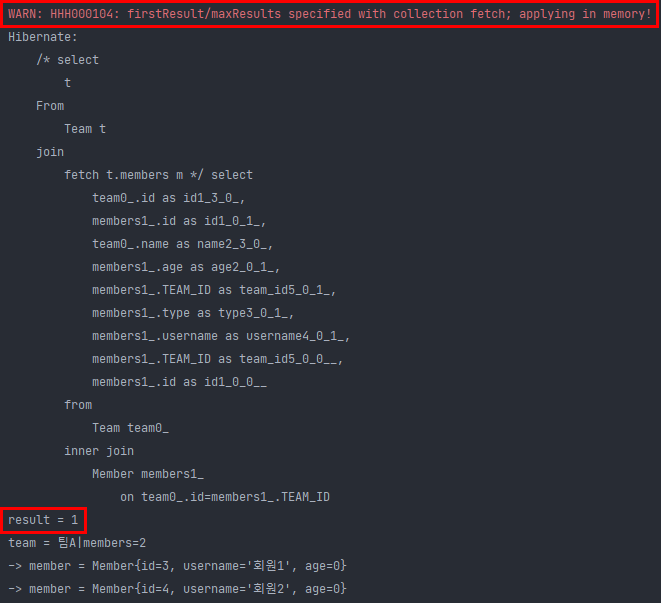

경고와 함께 값(result)를 하나만 가져오는 것을 확인할 수 있다. (select 쿼리를 보면 페이지 쿼리가 없고, db에서  팀에 대한 데이터를 다 긁어오게 된다.. 메모리로..) -> **딱 장애나기 좋다.** 이거 모르면 데이터 100만건 이있으면 페이징해도 100만건을 다 퍼올린다..

그래서 경고를 날리고 메모리에서 다 긁어오는 상황이므로 **절 때 쓰 면 안 된 다.**

이 문제를 해결하는 방법이 여러가지가 있음.

```sql
select t From Team t join t.members m
-> select m From Member m join m.team t
```

그냥 쿼리를 뒤집는다. 이러면 회원에서 팀으로 가는건 다대일 이기 때문에 페이징에 문제 없음.

또 다른 방법으로는 

```java
String query = "select t From Team t";
            List<Team> result = em.createQuery(query, Team.class)
                    .setFirstResult(0)
                    .setMaxResults(2)
                    .getResultList();
```

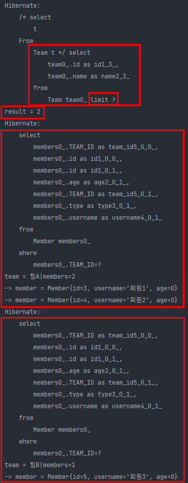

join fetch를 지우고 team만 조회하고, setMaxResult를 2로 준다.

그러면 limit으로 페이지 쿼리도 잘 나가고, 원하는 값인 사이즈 2도 잘 출력된다. (어짜피 팀은 2개 밖에 없음.)

그리고 루프를 돌때, 팀A에 대한 멤버를 불러오기 위한 select문이 나가고, 팀A와 연관된 멤버 2개를 지연로딩으로 가져옴. 또 팀B에대한 멤버를 다시 불러온다.

즉, 지연로딩이 2번 일어남.

결과적으로 쿼리는 총 3번이 나간다.

이렇게 되면 성능이 안나온다. 만약 팀이 10개라면 팀과 연관된 멤버를 찾아오는 쿼리가 10번 나가게 된다;

그래서 이때는 페이징하면 좋은데, 페이징 사용하려면 컬렉션은 페치조인하면 안된다..

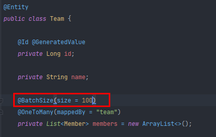

이때 보통 @BatchSize 어노테이션을 사용한다. 이렇게 하고 돌려보면

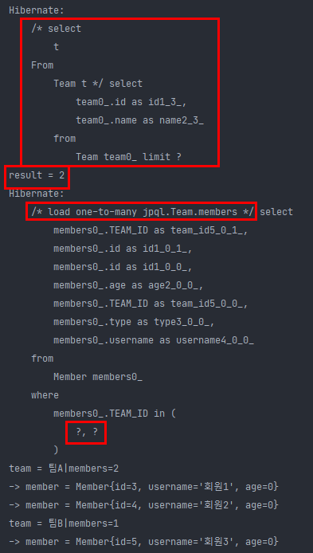

처음에 값을 잘 들고오고, 루프를 돌며 값을 가져올때, ?,?가 들어오는데, 

team_id가 2개가 들어가 있는 거다. 팀A, 팀B에 대한 ID가 다 들어간 거다.

즉, 팀A와 팀B와 연관된 멤버를 한번에 다 가져온 것을 의미한다.

즉 @BatchSize를 사용하면, 원래는 팀에 대한 멤버를 가져올때 지연 로딩 상태인데, 

이 지연로딩을 가져올때, 내가 속한 팀 뿐만아니라, batch size에 따라 한번에 team을 가져오는 List 인쿼리를 100개씩 넘긴다. (지금은 데이터가 2개니깐, 2개만 넘기는거임.)

만약 팀 데이터가 150개면 첨에는 이 ?가 100개가 되고, 2번째에 50개를 날리게 된다.


다시 정리하면, 팀을 쿼리하는데, 데이터가 100개가 있다고 하면 원래는 팀과 연관된 멤버를 찾는 쿼리가 100번 나가야 하는데, (n+1 문제) -> 이걸 해결하기 위해 fetch join을 쓰지만, 컬렉션에서는 페이징시 페치조인 못하므로, @BatchSize를 이용하여 사이즈를 주면 위처럼 해결 가능하다.

이 @BatchSize를 global setting으로 가져갈 수도 있다. 보통 실무에서는 전역 셋팅으로 깔고 간다.

```xml
<property name="hibernate.default_batch_fetch_size" value="100"/>
```

이렇게 하면 @BatchSize(size=100) 과 똑같은 효과를 가진다.

이렇게 되면 n+1이 아니라 쿼리가 딱 테이블 수만큼 맞출 수 있다.


3번째 방법은 그냥 dto로 쿼리를 그냥 직접 짜는 거다. (근데 결국 dto로 뽑아도 정제해줘야하고 만만치 않음.)


- 연관된 엔티티들을 SQL 한 번으로 조회 - 성능 최적화
- 엔티티에 직접 적용하는 글로벌 로딩 전략보다 우선함
  - @OneToMany(fetch = FetchType.LAZY) //글로벌 로딩 전략
- 실무에서 글로벌 로딩 전략은 모두 지연 로딩
- 최적화가 꼭 필요한 곳은 페치 조인 적용 (n+1이 터지는 곳만!) -> 이렇게만 해도 대부분의 성능문제는 해결된다.

대부분의 경우 JPA에서 성능상의 문제는 N+1문제이다! (그리고 거의 fetch join으로 잡힌다! -> 굉장히 복잡한 view같은 경우를 제외하고는.)

### 페치 조인 - 정리

- 모든 것을 페치 조인으로 해결할 수 는 없음
- 페치 조인은 객체 그래프를 유지할 때 사용하면 효과적 (m.team~)
- 여러 테이블을 조인해서 엔티티가 가진 모양이 아닌 전혀 다른 결과를 내야 하면, 페치 조인 보다는 일반 조인을 사용하고 필요한 데이터들만 조회해서 DTO로 반환하는 것이 효과적

데이터를 가져올때 사실 3가지 방법이 있음.

1. fetch join을 사용해서 엔티티를 조회해 온다.
2. fetch join 으로 가져온 값을 애플리케이션에서 dto로 바꿔서 화면에 반환한다.
3. 그냥 처음부터 jpql에 new operation으로 switching 해서 가져온다.

그리고 옛날에는 성능튜닝이라고 하면 쿼리를 다 뜯어 고치면서 했는데, 이 페치 조인을 이용하면 선언적으로 명령에 넣어주면 연관된 얘들만 가져오면서 성능이 확 좋아진다!

## JPQL - 다형성 쿼리

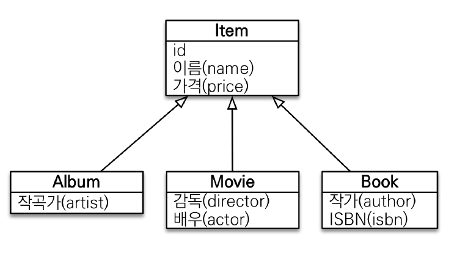

### TYPE

- 조회 대상을 특정 자식으로 한정한다.

- 예) Item 중에 Book, Movie를 조회해라

- **[JPQL]**

  ```SQL
  select i from Item i where type(i) IN (Book, Movie)
  ```

- **[SQL]**

  ```SQL
  select i from i where i.DTYPE in (‘B’, ‘M’)
  ```

### TREAT(JPA 2.1)

- 자바의 타입 캐스팅과 유사

- 상속 구조에서 부모 타입을 특정 자식 타입으로 다룰 때 사용

- FROM, WHERE, SELECT(하이버네이트 지원) 사용

- 예) 부모인 Item과 자식 Book이 있다.

- **[JPQL]**

  ```SQL
  select i from Item i where treat(i as Book).auther = ‘kim’
  ```

- **[SQL]**

  ```SQL
  select i.* from Item i where i.DTYPE = ‘B’ and i.auther = ‘kim’
  ```


## JPQL - 엔티티 직접 사용

### 엔티티 직접 사용 - 기본 키 값

- JPQL에서 엔티티를 직접 사용하면 SQL에서 해당 엔티티의 기본 키 값을 사용 (엔티티를 식별할 수 있는 게 기본 키 이기 때문!)

- **[JPQL]**

  ```SQL
  select count(m.id) from Member m # 엔티티의 아이디를 사용
  select count(m) from Member m # 엔티티를 직접 사용
  ```

- **[SQL]**(JPQL 둘다 같은 다음 SQL 실행)

  ```SQL
  select count(m.id) as cnt from Member m
  ```


`엔티티를 파라미터로 전달`

```JAVA
String jpql = “select m from Member m where m = :member”;
List resultList = em.createQuery(jpql)
	.setParameter("member", member)
	.getResultList();
```

`식별자를 직접 전달`

```JAVA
String jpql = “select m from Member m where m.id = :memberId”;
List resultList = em.createQuery(jpql)
	.setParameter("memberId", memberId)
	.getResultList();
```

`실행된 SQL`

```SQL
select m.* from Member m where m.id=?
```


```java
Member member1 = new Member();
member1.setUsername("회원1");
em.persist(member1);

String query = "select m From Member m where m = :member";
Member findMember = em.createQuery(query, Member.class)
    .setParameter("member", member1)
    .getSingleResult();

System.out.println("findMember = " + findMember);
```

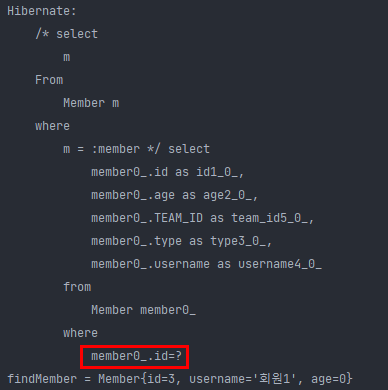

마지막 쿼리의 where이 id로 바뀐 것을 확인할 수 있다.

```java
Member member1 = new Member();
member1.setUsername("회원1");
em.persist(member1);

String query = "select m From Member m where m.id = :memberId";
Member findMember = em.createQuery(query, Member.class)
    .setParameter("memberId", member1.getId())
    .getSingleResult();

System.out.println("findMember = " + findMember);
```

이렇게 id를 명시적으로 나타내도 위와 같은 결과가 나온다.


### 엔티티 직접 사용 - 외래 키 값

```JAVA
Team team = em.find(Team.class, 1L);

String qlString = “select m from Member m where m.team = :team”;
List resultList = em.createQuery(qlString)
	.setParameter("team", team)
	.getResultList();
```

```JAVA
String qlString = “select m from Member m where m.team.id = :teamId”;
List resultList = em.createQuery(qlString)
	.setParameter("teamId", teamId)
	.getResultList();
```

`실행된 SQL`

```SQL
select m.* from Member m where m.team_id=?
```

이 경우는 where 뒤의 m.team이 중요한데, 회원과 관련된 팀의 엔티티를 사용할 경우 team_id를 사용하게 된다.

(member가 team_id를 외래키로 가짐.)

```java
Team teamA = new Team();
teamA.setName("팀A");
em.persist(teamA);

Team teamB = new Team();
teamB.setName("팀B");
em.persist(teamB);

Member member1 = new Member();
member1.setUsername("회원1");
member1.setTeam(teamA);
em.persist(member1);

Member member2 = new Member();
member2.setUsername("회원2");
member2.setTeam(teamA);
em.persist(member2);

Member member3 = new Member();
member3.setUsername("회원3");
member3.setTeam(teamB);
em.persist(member3);

em.flush();
em.clear();


String query = "select m From Member m where m.team = :team";
List<Member> members = em.createQuery(query, Member.class)
    .setParameter("team", teamA)
    .getResultList();

for (Member member : members) {
    System.out.println("member = " + member);
}
```

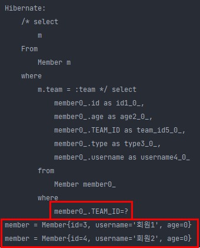

team_id를 외래키로 멤버 2개를 딱 가져오는 것을 확인할 수 있다.

## JPQL - Named 쿼리

### Named 쿼리 - 정적 쿼리

- 미리 정의해서 이름을 부여해두고 사용하는 JPQL
- 정적 쿼리 (동적 쿼리는 안됨 -> 동적으로 문자 더하기 안됨)
- 어노테이션, XML에 정의
- 애플리케이션 로딩 시점에 초기화 후 재사용 (장점!)
- **애플리케이션 로딩 시점에 쿼리를 검증 (장점! 중요!)**

### Named 쿼리 - 어노테이션

```java
@Entity
@NamedQuery( // 엔티티에 미리 선언
	name = "Member.findByUsername",
	query="select m from Member m where m.username = :username")// 애플리케이션 로딩 시점에 jpa or hibernate가 이 query를 sql로 parsing하여 cache하고 있음.
public class Member {
...
}

List<Member> resultList =
	em.createNamedQuery("Member.findByUsername", Member.class)
		.setParameter("username", "회원1")
		.getResultList();
```

jpql은 sql로 파싱되어 실행되기 때문에 거기서 오는 cost가 있었는데, named 쿼리는 그 cost가 없다. (왜냐면 로딩시점에 한번 파싱하고 캐시하기 때문.)

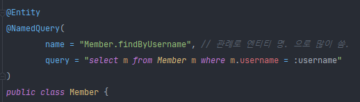

이렇게 정의하고 나서 

```java
Team teamA = new Team();
teamA.setName("팀A");
em.persist(teamA);

Team teamB = new Team();
teamB.setName("팀B");
em.persist(teamB);

Member member1 = new Member();
member1.setUsername("회원1");
member1.setTeam(teamA);
em.persist(member1);

Member member2 = new Member();
member2.setUsername("회원2");
member2.setTeam(teamA);
em.persist(member2);

Member member3 = new Member();
member3.setUsername("회원3");
member3.setTeam(teamB);
em.persist(member3);

em.flush();
em.clear();

List<Member> resultList = em.createNamedQuery("Member.findByUsername", Member.class)
    .setParameter("username", "회원1")
    .getResultList();

for (Member member : resultList) {
    System.out.println("member = " + member);
}
```

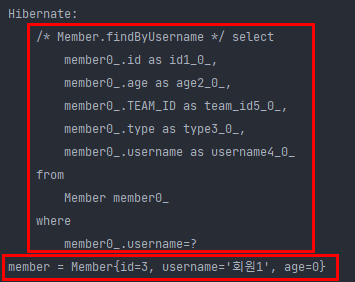

쿼리는 기대했던 그대로 실행된다.  데이터도 회원1을 가져옴.

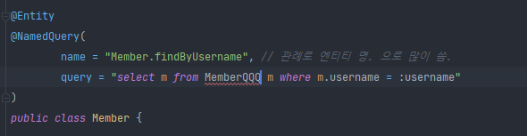

누가 이렇게 잘못 입력했다면? 어쨋든 이 query는 문자이므로 실행은 된다.

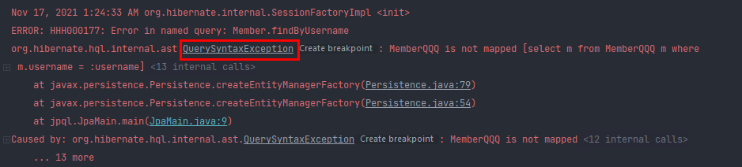

하지만 실행 시점에 **쿼리 신택스 에러**가 나온다.

애플리케이션의 로딩 시점에 jpa가 파싱해서 올리고 캐시해서 들고 있으려고했는데, 문법이 안맞아서 오류를 냄.


개발할때 가잫좋은 에러는 컴파일에러다. 즉시 잡을 수 있기 때문.

가장 나쁜 에러는 사용자가 버튼을 클릭했을때 나는 오류다..

이 둘 사이가 런타임 에러이다. -> 애플리케이션 로딩 시점에 나는 오류다.

이렇게 named 쿼리를 사용하면 대부분의 에러를 런타임 시점에서 다 잡아낼 수 있다.


### Named 쿼리 - XML에 정의

`[META-INF/persistence.xml]`

```xml
<persistence-unit name="jpabook" >
<mapping-file>META-INF/ormMember.xml</mapping-file>
```

`[META-INF/ormMember.xml]`

``` xml
<?xml version="1.0" encoding="UTF-8"?>
<entity-mappings xmlns="http://xmlns.jcp.org/xml/ns/persistence/orm" version="2.1">
	<named-query name="Member.findByUsername">
		<query><![CDATA[
			select m
			from Member m
			where m.username = :username
		]]></query>
	</named-query>
	<named-query name="Member.count">
		<query>select count(m) from Member m</query>
	</named-query>
</entity-mappings>
```

### Named 쿼리 환경에 따른 설정

- XML이 항상 우선권을 가진다.
- 애플리케이션 운영 환경에 따라 다른 XML을 배포할 수 있다.


사실 이 named 쿼리가 

```java
@NamedQuery(
        name = "Member.findByUsername", 
        query = "select m from Member m where m.username = :username"
)
```

이런 식으로 쓰지는 않지만, 나중에 Spring Data JPA 에서 

```java
@Query("select u from User u where u.emailAddress = ?1")
User findByEmailAddress(String emailAddress);
```

이런식으로 인터페이스 메소드위의 어노테이션으로 바로 쓸 수 있다.

사실 Spring Data JPA는 JPA의 껍데기로, JPA를 편하게 사용하기 위한 추상화 역할만 하는데, 여기서 `@Query("select u from User u where u.emailAddress = ?1")` 이게 바로 named 쿼리다! JPA가 이 어노테이션을 named 쿼리로 등록해 준다. 그래서 어플리케이션 시점에 로딩해서 다 파싱해주고 문법 오류가 발생하면 에러를 발생 시킨다.

이게 진짜 어마어마하다. 이 쿼리를 **이름 없는 쿼리** 라고 부른다.

```java
@NamedQuery(
        name = "Member.findByUsername", 
        query = "select m from Member m where m.username = :username"
)
```

이렇게 쓰는게 엔티티 마다 들어가면 지저분해지기 때문에 이런식으로 쓰는건 별로다.

어짜피 실무에서는 Spring Data JPA를 섞어 쓰는게 좋기 때문에 인터페이스 위에 @Query로 정적 쿼리를 쓴다.


## JPQL - 벌크 연산

### 벌크 연산 (SQL의 UPDATE, DELETE문이라고 보면 됨)

(pk를 하나만 직어서 update, delete하는걸 제외한 나머지 모든 update, delete 문이라고 생각하면 됨.)

- 재고가 10개 미만인 모든 상품의 가격을 10% 상승하려면?
- 위 내용을 JPA 변경 감지 기능만으로 실행하려면 너무 많은 SQL이 실행 된다.
  - 1. 재고가 10개 미만인 상품을 리스트로 조회한다.
  - 2. 상품 엔티티의 가격을 10% 증가한다.
  - 3. 트랜잭션 커밋 시점에 변경감지가 동작한다.
- 변경된 데이터가 100건이라면 100번의 UPDATE SQL이 실행된다.

JPA는 bulk성 보다는 실시간성이(단건에) 좀 더 최적화 되어있음. 근데 JPA도 현실적으로 BULK 연산을 안 쓸 수 없으니 제공은 해준다.

쿼리 한번으로 상품 100개를 UPDATE할 수 있는 걸 제공한다는 거다. (이게 벌크 연산이다.)

### 벌크 연산 예제

- 쿼리 한 번으로 여러 테이블 로우 변경(엔티티)
- **executeUpdate()의 결과는 영향받은 엔티티 수 반환**
- **UPDATE, DELETE 지원**
- **INSERT(insert into .. select, 하이버네이트 지원, jpa 표준은 X)** -> select해서 insert 한다는 의미.

```JAVA
String qlString = "update Product p " +
	"set p.price = p.price * 1.1 " +
	"where p.stockAmount < :stockAmount";

int resultCount = em.createQuery(qlString)
	.setParameter("stockAmount", 10)
	.executeUpdate();
```


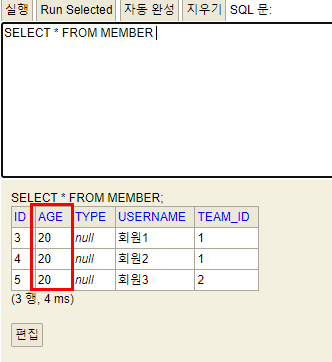

db에 한번에 age가 20으로 업데이트 된다. 


### 벌크 연산 주의

- 벌크 연산은 **영속성 컨텍스트를 무시**하고 데이터베이스에 직접 쿼리한다. (그래서 잘못하면 꼬임.)
  - (해결책 1) 벌크 연산을 **먼저** 실행한다.
  - (해결책 2) **벌크 연산 수행 후 영속성 컨텍스트를 초기화 한다.**

해결책 1 -> 벌크 연산을 **먼저** 실행하면 그 다음에는 영속성 컨텍스트는 아무것도 없으니까 상관이 없어짐

해결책 2 -> 영속성 컨텍스트에 뭔가가 있다면, 어쨋든 벌크 연산을 실행하면 JPQL이 실행되기 때문에 일단 flush 된다. 

그래서 벌크 연산을 수행하고 나서 영속성 컨텍스트를 초기화 해주면 된다. 왜냐면 옛날에 조회해온 멤버가 있는데, 예를들어 회원의 연봉이 5천만원이었는데, 회원 연봉을 벌크연산을 날려서 6천만원으로 올린다면? db에는 6천만원이지만 애플리케이션에는 5천만원이 아직 남아있게 된다. 이 경우에는 영속성 컨텍스트를 초기화해서 애플리케이션에 남아있는 5천만원을 날려 버린다. 그렇게 되면 다시 조회할때 이제 6천만원으로 조회되기 때문에 문제가 없어진다.

```java
Team teamA = new Team();
teamA.setName("팀A");
em.persist(teamA);

Team teamB = new Team();
teamB.setName("팀B");
em.persist(teamB);

Member member1 = new Member();
member1.setUsername("회원1");
member1.setTeam(teamA);
em.persist(member1);

Member member2 = new Member();
member2.setUsername("회원2");
member2.setTeam(teamA);
em.persist(member2);

Member member3 = new Member();
member3.setUsername("회원3");
member3.setTeam(teamB);
em.persist(member3);

// flush 자동 호출
int resultCount = em.createQuery("update Member m set m.age = 20")
    .executeUpdate();

System.out.println("resultCount = " + resultCount);
```

위 예제와 다른 점은 

```java
em.flush();
em.clear();
```

이 2개를 뺀거다.

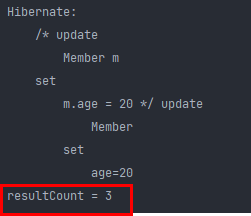

결과는 동일하게 나온다. 

> flush -> commit, query, flush 호출시 자동으로 flush 됨.

그래서 flush를 굳이 명시적으로 호출 안해줘도 query를 날리기 전에 flush가 되기 때문에 영속성 컨텍스트에 남아있는 값을 걱정할 필요 없음.


이 코드의 경우, 영속성 컨텍스트에는 회원1, 2, 3 이 있지만, 나이가 20살이란 건 영속성 컨텍스트에 없다.

```java
Team teamA = new Team();
teamA.setName("팀A");
em.persist(teamA);

Team teamB = new Team();
teamB.setName("팀B");
em.persist(teamB);

Member member1 = new Member();
member1.setUsername("회원1");
member1.setAge(0);
member1.setTeam(teamA);
em.persist(member1);

Member member2 = new Member();
member2.setUsername("회원2");
member2.setAge(0);
member2.setTeam(teamA);
em.persist(member2);

Member member3 = new Member();
member3.setUsername("회원3");
member3.setAge(0);
member3.setTeam(teamB);
em.persist(member3);

// flush 자동 호출
int resultCount = em.createQuery("update Member m set m.age = 20")
    .executeUpdate();

System.out.println("resultCount = " + resultCount);

System.out.println("member1.getAge() = " + member1.getAge());
System.out.println("member2.getAge() = " + member2.getAge());
System.out.println("member3.getAge() = " + member3.getAge());
```

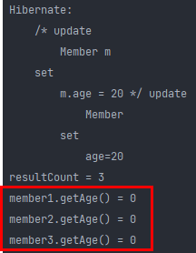

당연히 20살로 반영이 되지 않는다. (영속성 컨텍스트에 없기 때문, 물론 db에는 20살로 셋팅 되어 있음.)

벌크연산에 대한 쿼리가 나가면서 flush가 된다고해서 member가 영속성 컨텍스트에서 사라지는게 아님. (flush는 db에 쿼리를 반영하는것 이기 때문)

그래서 영속성 컨텍스트에 남아있는 age 0이 가져와 진다. 이렇게 되면 벌크연산이 db와 데이터 정합성이 안맞게 된다. **그래서 벌크 연산후에 영속성 컨텍스트 초기화를 해줘야 한다.**

```java
Team teamA = new Team();
teamA.setName("팀A");
em.persist(teamA);

Team teamB = new Team();
teamB.setName("팀B");
em.persist(teamB);

Member member1 = new Member();
member1.setUsername("회원1");
member1.setTeam(teamA);
em.persist(member1);

Member member2 = new Member();
member2.setUsername("회원2");
member2.setTeam(teamA);
em.persist(member2);

Member member3 = new Member();
member3.setUsername("회원3");
member3.setTeam(teamB);
em.persist(member3);

// flush 자동 호출
int resultCount = em.createQuery("update Member m set m.age = 20")
    .executeUpdate();
Member findMember = em.find(Member.class, member1.getId()); // 멤버를 조회하는데, 영속성 컨텍스트가 비어있지 않기 때문에 db조회 없이 1차 캐시에서 값을 가져옴
System.out.println("findMember = " + findMember.getAge()); // db 조회를 하지 않았기 때문에 age가 0으로 출력..
```

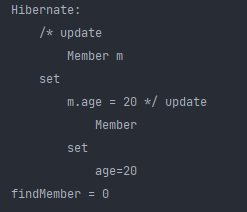

이런식으로 find해서 findMember.getAge()를 해도 0이 출력된다. db에서 가져온게 아니라 영속성 컨텍스트에서 가져온 값이기 때문.

```java
Team teamA = new Team();
teamA.setName("팀A");
em.persist(teamA);

Team teamB = new Team();
teamB.setName("팀B");
em.persist(teamB);

Member member1 = new Member();
member1.setUsername("회원1");
member1.setTeam(teamA);
em.persist(member1);

Member member2 = new Member();
member2.setUsername("회원2");
member2.setTeam(teamA);
em.persist(member2);

Member member3 = new Member();
member3.setUsername("회원3");
member3.setTeam(teamB);
em.persist(member3);

// flush 자동 호출
int resultCount = em.createQuery("update Member m set m.age = 20")
    .executeUpdate();

em.clear(); // 영속성 컨텍스트 비움

Member findMember = em.find(Member.class, member1.getId()); // 영속성 컨텍스트가 비어있으므로 db에서 조회!
System.out.println("findMember = " + findMember.getAge()); // 20이 출력!
```

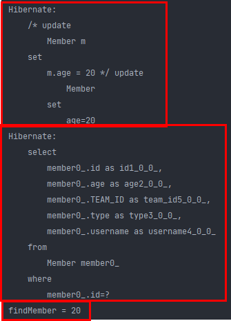

flush로 우선 db에 값을 저장하고 벌크 연산을 한 뒤에 영속성 컨텍스트를 비우면 조회시 db에서 조회하기 때문에 age 20을 들고오게 된다!

이 코드는 해결책 2에 대한 내용임! 상황에 따라 해결책1, 해결책2를 선택하여 실행하면 됨.


참고: Spring Data JPA에 Modifying Query라는게 있는데, 

```java
@Modifying
@Query("update User u set u.firstname = ?1 where u.lastname = ?2:")
int setFixedFirstnameFor(String firstname, String lastname);
```

이렇게 벌크 오퍼레이션을 날릴 수 있는데, Spring Data JPA에서도 clearAutomatically 라는 개념이 있다.

위에서 말한 내용들이 Spring Data JPA 공식문서에 적혀있다.