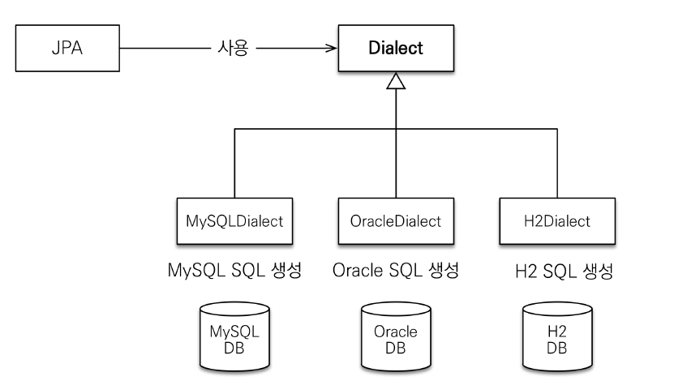
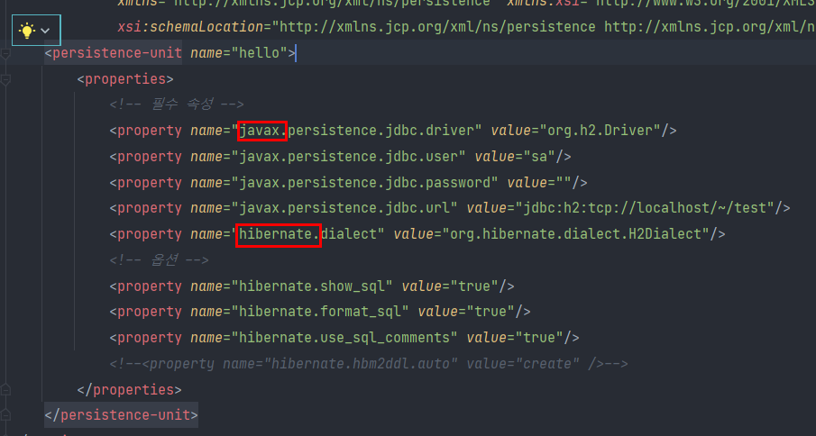
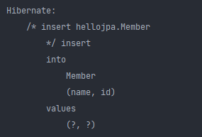
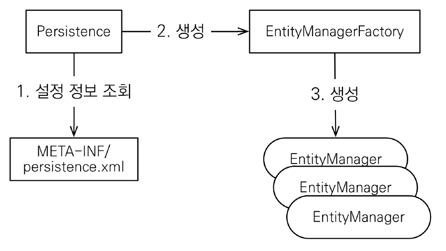
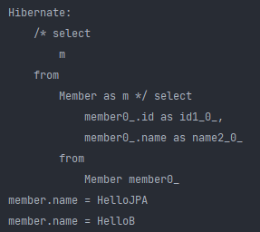
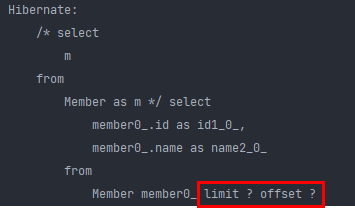

# JPA 시작

## Hello JPA - 프로젝트 생성


H2 데이터베이스 

- 최고의 실습용 DB
- 가볍다. (1.5M)
- 웹용 쿼리툴 제공
- MySQL, Oracle 데이터베이스 시뮬레이션 기능
- 시퀀스, auto increment 기능 지원

또 간단하게 db를 띄우지 않고 메모리로 실행할 수 도 있다.


**데이터베이스 방언**

- JPA는 특정 데이터베이스에 종속 X

- 각각의 데이터베이스가 제공하는 SQL 문법과 함수는 조금씩 다름
  - 가변 문자 : MySQL은 VARCHAR, Oracle은 VARCHAR2
  - 문자열을 자르는 함수 : SQL 표준은 SUBSTRING(), Oracle은 SUBSTR()
  - 페이징 : MySQL은 LIMIT, Oracle은 ROWNUM

- 방언 : SQL 표준을 지키지 않는 특정 데이터베이스만의 고유한 기능



- hibernate.dialect 속성에 지정
  - H2 : org.hibernate.dialect.H2Dialect
  - Oracle 10g : org.hibernate.dialect.Oracle10gDialect
  - MySQL : org.hibernate.dialect.MySQL5InnoDBDialect
- 하이버네이트는 40가지 이상의 데이터베이스 방언 지원



여기서 javax, hibernate의 의미는, javax는 표준을 지키는 거고 hibernate는 그 라이브러리에서만 쓸 수 있는 거다.

그래서 만약 hibernate가 아닌 다른 라이브러리를 쓴다면 셋팅을 전부 바꿔줘야 한다.


```java
package hellojpa;

import javax.persistence.EntityManager;
import javax.persistence.EntityManagerFactory;
import javax.persistence.EntityTransaction;
import javax.persistence.Persistence;

public class JpaMain {
    public static void main(String[] args) {
        EntityManagerFactory emf = Persistence.createEntityManagerFactory("hello");

        EntityManager em = emf.createEntityManager();

        EntityTransaction tx = em.getTransaction();
        tx.begin();

        Member member = new Member();
        member.setId(1L);
        member.setName("HelloA");

        em.persist(member);

        tx.commit();

        em.close();

        emf.close();
    }
}
```




위 코드 결과로 Hibernate 관련 메시지가 print된다.

이게 뜨는 이유는 persistence.xml에서 다음과 같은 옵션을 설정해 줬기 때문에 가능하다.

(참고: 자원을 다 쓰면 항상 em은 close 해줘야 한다. 마찬가지로 emf도 was가 닫힐때 close 해줘야 한다. 그래야 connection pool resource 들이 release 된다.)


## Hello JPA - 애플리케이션 개발

### JPA 구동 **방식**



**회원 조회**

```java
package hellojpa;

import javax.persistence.EntityManager;
import javax.persistence.EntityManagerFactory;
import javax.persistence.EntityTransaction;
import javax.persistence.Persistence;

public class JpaMain {
    public static void main(String[] args) {
        EntityManagerFactory emf = Persistence.createEntityManagerFactory("hello");

        EntityManager em = emf.createEntityManager();

        EntityTransaction tx = em.getTransaction();
        tx.begin();

        try {
            Member findMember = em.find(Member.class, 1L);
            findMember.setName("HelloJPA");


            tx.commit();
        } catch (Exception e) {
            tx.rollback();
        } finally {
            em.close();
        }


        emf.close();
    }
}
```

이름을 바꾸고 싶은데, 그냥 setter로만 바꿨고, persist를 해줘야 업데이트 되는거아냐? 라고 생각할 수 있는데, 그냥 set만 해줘도 update 쿼리가 나간다.

JPA를 통해서 entity를 가져오면, 얘를 JPA가 관리한다. 그래서 JPA가 이 entity가 변경이 됐는지 안됐는지 트랜잭션을 커밋하는 시점에서 다 체크한다. 그래서 뭔가 변경사항이 발생했으면 업데이트 쿼리를 날린다. (트랜잭션 커밋 직전에 업데이트 쿼리를 만들어서 날리고, 트랜잭션이 커밋된다.)


엔티티 매니저 팩토리는 

보통 웹어플리케이션 서비스라고 하면, 웹서버가 올라오는 시점에 DB 하나당 딱 하나만 생성이 된다. 

그리고 EMF에서 EM은 고객의 요청이 올때마다 썻다버렸다가 계속 이런 식으로 반복적으로 사용한다.


#### 주의

- 엔티티 매니저 팩토리는 하나만 생성해서 애플리케이션 전체에서 공유
- 엔티티 매니저는 쓰레드 간에 공유 X (사용하고 버려야 한다.), 데이터 베이스 커넥션을 빨리 쓰고 돌려줘야 하기 때문
- JPA의 모든 데이터 변경은 트랜잭션 안에서 실행


#### JPQL 소개

- 가장 단순한 조회 방법
  - EntityManager.find()
  - 객체 그래프 탐색(a.getB().getC())
- 나이가 18살 이상인 회원을 모두 검색하고 싶다면? 또는 모든 회원을 검색하고 싶다면?

이럴때 JPQL을 써야 한다. (현업에서 개발의 고민은, 테이블이 굉장히 많고 필요하면 JOIN도 해야하고, 내가 원하는 데이터를 최적화 해서 가져와야 하고, 필요하면 통계성 쿼리도 날려야 하는데,, 이걸 어떻게 할거냐? -> JPA에서 JPQL이란걸로 도와준다.)

**JPQL로 전체회원 조회**

```java
List<Member> result = em.createQuery("select m from Member as m", Member.class).getResultList();
```

JPA입장에서, 테이블을 대상으로 코드를 절대 짜지 않는다.

즉 위 코드의 createQuery 안의 쿼리에서 Member는 `멤버객체` 를 의미한다.

```java
List<Member> result = em.createQuery("select m from Member as m", Member.class)
                    .getResultList();

            for (Member member : result) {
                System.out.println("member.name = " + member.getName());
            }
```

👉result



실제로 쿼리는 id, name 필드를 select 하지만, JPQL에서는 m, 즉 멤버 엔티티를 선택한 것이라고 보면 된다.

이 JPQL이 어떤 메리트가 있을까?

페이징할때 엄청난 메리트가 있다.

```java
List<Member> result = em.createQuery("select m from Member as m", Member.class)
                    .setFirstResult(5)
                    .setMaxResults(8)
                    .getResultList();
```

👉result



이렇게 페이지 가져올때 굉장히 편하다.

즉, JPQL은 객체를 대상으로 하는 객체지향 쿼리라고 보면 된다.

위와 같이 JPQL을 짜면 각 DB의 dialect에 맞게 번역해 준다.


#### JPQL

- JPA를 사용하면 엔티티 객체를 중심으로 개발
- 문제는 검색 쿼리에서 발생한다. (데이터를 단건만 가져오는게 아니라 여러개를 가져와야 하는 상황 -> 데이터베이스에서 데이터를 필터링 해서 가져와야 하는 상황)
- 검색을 할 때도 테이블이 아닌 엔티티 객체를 대상으로 검색 (테이블에서 검색하면 JPA의 사상이 깨짐)
- 그렇다고 모든 DB 데이터를 객체로 변환해서 검색하는 것은 불가능함
- 애플리케이션이 필요한 데이터만 DB에서 불러오려면 결국 검색 조건이 포함된 SQL이 필요하다.
- JPA는 SQL을 추상화한 JPQL이라는 객체 지향 쿼리 언어 제공
- SQL과 문법 유사, SELECT, FROM, WHERE, GROUP BY, HAVING, JOIN 지원
- JPQL은 엔티티 객체를 대상으로 쿼리
- SQL은 데이터베이스 테이블을 대상으로 쿼리
- 테이블이 아닌 객체를 대상으로 검색하는 객체 지향 쿼리
- SQL을 추상화해서 특정 데이터베이스 SQL에 의존X
- JPQL을 한마디로 정의하면 객체 지향 SQL

결국 테이블을 대상으로 쿼리를 짜면 RDB에 종속적인 설계가 되버린다. 그래서 엔티티 객체를 대상으로 쿼리를 할 수 있는 JPQL이 제공 되는것이다.
