# 영속성 관리 - 내부 동작 방식

### 영속성 컨텍스트 1

#### 영속성 관리 (JPA 내부 구조)


JPA를 이해하기 위해 영속성 컨텍스트를 이해해야 함

#### JPA에서 가장 중요한 2가지

- 객체와 관계형 데이터베이스 매핑하기 (Object Relational Mapping)
- 영속성 컨텍스트

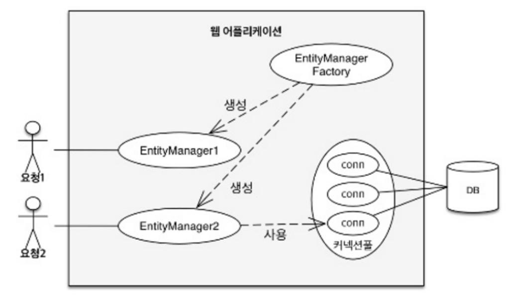

#### 영속성 컨텍스트

- JPA를 이해하는데 가장 중요한 용어
- "엔티티를 영구 저장하는 환경"이라는 뜻
- EntityManager.persist(entity);

여기서 persist는 db에 저장한다는게 아니라 영속성 컨텍스트를 통해서 엔티티를 영속화한다는 뜻이다.

더 정확히, persist는 영속성 컨텍스트 라는 곳에 저장한다.

#### 엔티티 매니저? 영속성 컨텍스트?

- 영속성 컨텍스트는 논리적인 개념
- 눈에 보이지 않는다
- 엔티티 매니저를 통해서 영속성 컨텍스트에 접근


#### 엔티티의 생명주기

- 비영속 (new/transient)

영속성 컨텍스트와 전혀 관계가 없는 **새로운** 상태

- 영속 (managed)

영속성 컨텍스트에 **관리**되는 상태

- 준영속(detached)

영속성 컨텍스트에 저장되었다가 **분리**된 상태

- 삭제 (removed)

**삭제**된 상태


#### 엔티티 생명 주기

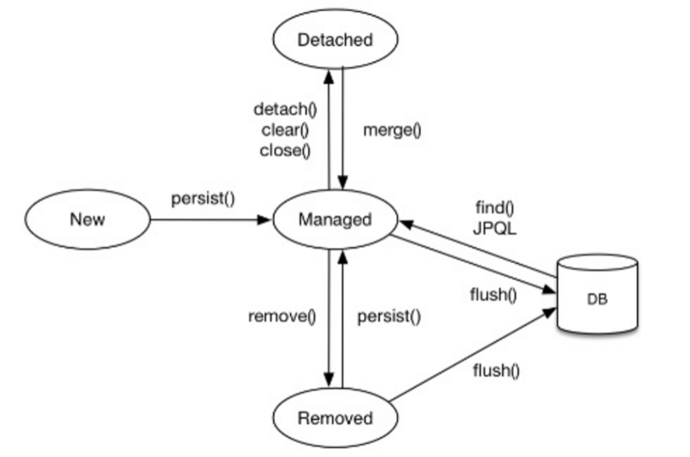

**비영속**

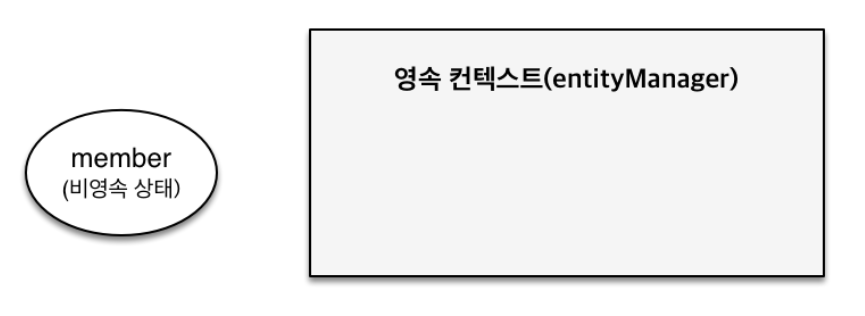

```java
// 객체를 생성한 상태 (비영속)
Member member = new Member();
member.setId("member1");
member.setUsername("회원1");
```

**영속**

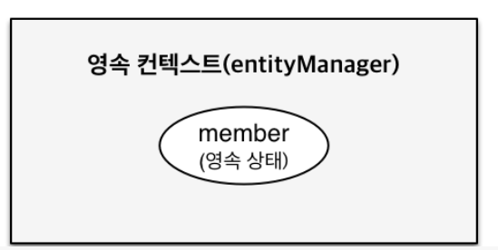

```java
// 객체를 생성한 상태 (비영속)
Member member = new Member();
member.setId("member1");
member.setUsername("회원1");

EntityManager em = emf.createEntityManager();
em.getTransaction().begin();

// 객체를 저장한 상태 (영속)
em.persist(member);
```

실제로 테스트 코드를 작성해 보면

```java
package hellojpa;

import org.hibernate.tool.schema.internal.exec.ScriptTargetOutputToFile;

import javax.persistence.EntityManager;
import javax.persistence.EntityManagerFactory;
import javax.persistence.EntityTransaction;
import javax.persistence.Persistence;
import java.util.List;

public class JpaMain {
    public static void main(String[] args) {
        EntityManagerFactory emf = Persistence.createEntityManagerFactory("hello");

        EntityManager em = emf.createEntityManager();

        EntityTransaction tx = em.getTransaction();
        tx.begin();

        try {

            // 비영속
            Member member = new Member();
            member.setId(100L);
            member.setName("HelloJPA");
            
            // 영속
            System.out.println("=== BEFORE ===");
            em.persist(member);
            System.out.println("=== AFTER ===");

            tx.commit();
        } catch (Exception e) {
            tx.rollback();
        } finally {
            em.close();
        }
        emf.close();
    }
}
```

👉result

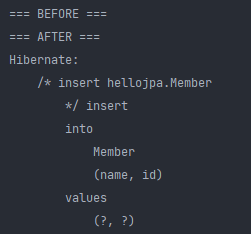

즉, persist 한다고 db에 쿼리를 날리지 않는다. 

즉, 영속상태가 된다고 db에 쿼리가 날아가는게 아니다. 언제 쿼리가 날아가냐면 트랜잭션을 커밋하는 시점에 영속성 컨텍스트에 있는 얘가 db에 쿼리가 날아가게 된다.

**준영속, 삭제**

```java
// 회원 엔티티를 영속성 컨텍스트에서 분리, 준영속 상태
em.detach(member);

// 객체를 삭제한 상태(삭제)
em.remove(member);
```

준영속은 영속성 컨텍스트에서 지우는 거고, 삭제는 실제 db 삭제를 요구하는 상태이다.

왜 이런 영속성 컨텍스트를 이용해서 이런 이상한 메커니즘을 쓰는 걸까?

#### 영속성 컨텍스트의 이점

- 1차 캐시
- 동일성(identity) 보장
- 트랜잭션을 지원하는 쓰기 지연 (transactional write-behine)
- 변경 감지(Dirty Checking)
- 지연 로딩(Lazy Loading)

지금 db와 애플리케이션 계층 사이에 뭔가가 있다(바로 영속성 컨텍스트). 아까 얘기한건데, 이러한 중간 계층에는 큰 이점을 얻어 낸다.

ex ) 버퍼링, 캐싱

#### 1. 엔티티 조회, 1차 캐시

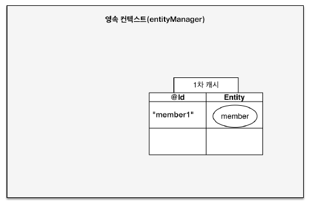

```java
// 엔티티를 생성한 상태 (비영속)
Member member = new Member();
member.setId("member1");
member.setUsername("회원1");

// 엔티티를 영속
em.persist(member);
```

영속성 컨텍스트 내부에 1차 캐시를 들고 있다.

위 코드처럼 멤버 객체를 persist 하면 영속상태가 되고, 1차 캐시에 그 값이 

(사실상 영속성 컨텍스트를 1차 캐시로 이해해도 됨.) Map 형태로 들어간다. key 값이 id가 되고 value는 객체 그 자체가 된다.

무슨 이점이 있을까?

#### 1차 캐시에서 조회

```java
Member member = new Member();
member.setId("member1");
member.setUsername("회원1");

// 1차 캐시에 저장됨
em.persist(member);

// 1차 캐시에서 조회
Member findMember = em.find(Member.class, "member1");
```

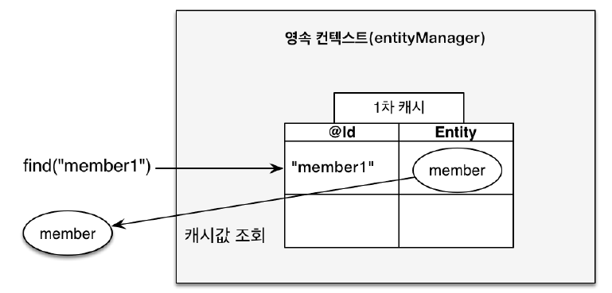

em.find를 하면 JPA는 영속성 컨텍스트에있는 1차 캐시를 먼저 뒤진다. (DB를 먼저 뒤지는게 아니라)

그래서 키 값과 같다면 1차캐시에 있는 객체를 그대로 가져온다.


#### 데이터베이스에서 조회

```java
Member findMember2 = em.find(Member.class, "member2");
```

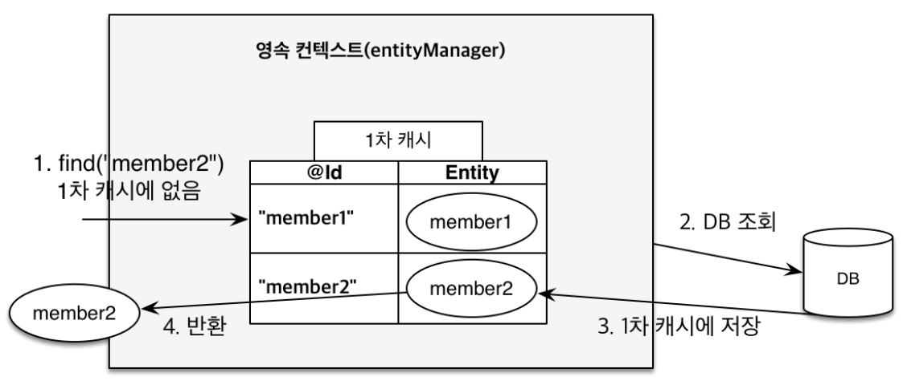

JPA는 member2가 1차캐시를 먼저 뒤져서 없다는 것을 판단한 뒤 db에서 조회한다. 그리고 db에서 조회한 

멤버2를 1차캐시에 저장한다. 그리고 멤버 2를 반홚나다. 이후에 다시 멤버2를 조회하면 디비를 조회하지않고 1차캐시에 조회하게 된다.


근데 이게 큰 도움은 안된다. em은 보통 데이터베이스 트랜잭션단위로 만들고, 데이터베이스 트랜잭션이 끝날때 em을 종료 시킨다.

원래 고객의 요청이 하나 들어와서 비즈니스가 끝나면 영속성 컨텍스트를 지운다. 즉 1차 캐시도 다 날아간다. 그래서 굉장히 짧은 찰나의 순간에 이득이 있기 때문에 여러명의 고객이 사용하는 캐시가 아니다.

애플리케이션 전체가 공유하는 캐시는 JPA나 하이버네이트에서는 2차 캐시라고 부른다. 

그래서 1차 캐시는 비즈니스 로직이 굉장히 복잡한 경우에 좀 도움이 될 수 있고, 왠만하면 큰 이점은 없다.

```java
// 비영속
Member member = new Member();
member.setId(101L);
member.setName("HelloJPA");

// 영속
System.out.println("=== BEFORE ===");
em.persist(member);
System.out.println("=== AFTER ===");

Member findMember = em.find(Member.class, 101L);

System.out.println("findMember.id = " + findMember.getId());
System.out.println("findMember.name = " + findMember.getName());

tx.commit();
```

👉result

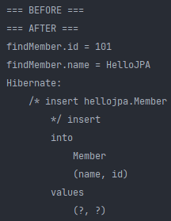

결과를 보면 find를 했는데, select 쿼리가 나가지 않는다.

왜냐면 persist할때 1차 캐시에 저장했기 때문이다.


```java
 // 영속
Member findMember1 = em.find(Member.class, 101L);
Member findMember2 = em.find(Member.class, 101L);

tx.commit();
```

👉result

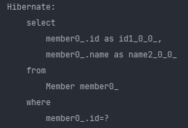

이번에는 이미 db에 101L번 멤버가 들어와있는 상황에서 다시 실행을 누르면 

findMember1을 찾을 때는 select 쿼리가 나오고, findMember2는 이미 찾았기 때문에 1차 캐시에서 조회가 되서 select 쿼리가 나가지 않는다.


--> 결국 일반적으로 큰 도움은 안되지만 비즈니스 로직이 정말 복잡할 경우 쿼리가 좀 줄어 들 수 있다. 근데 현업에서 큰 도움을 주지 않는다. 근데 나중에 이 컨셉을 이해하면 성능적인 이점 보다는 이 컨셉이 주는 이점이 있다. (좀더 객체지향적으로 코드를 작성하는 등.. )


#### 2. 영속 엔티티의 동일성 보장

```java
Member a = em.find(Member.class, "member1");
Member b = em.find(Member.class, "member1");

System.out.println(a == b); // 동일성 비교 true
```

1차 캐시로 반복 가능한 읽기 (REPEATABLE READ) 등급의 트랜잭션 격리 수준을 데이터베이스가 아닌 애플리케이션 차원에서 제공한다.

따라서 JPA는 영속 엔티티의 동일성을 보장한다. (마치 자바 컬렉션에서 꺼내서 똑같은 레퍼런스를 가져오는 것과 같다.)


#### 3. 엔티티 등록 : 트랜잭션을 지원하는 쓰기 지연

```java
EntityManager em = emf.createEntityManager();
EntityTransaction transaction = em.getTransaction();
// 엔티티 매니저는 데이터 변경시 트랜잭션을 시작해야 한다.
transaction.begin(); // [트랜잭션] 시작

em.persist(memberA);
em.persist(memberB);
// 여기까지 INSERT SQL을 데이터베이스에 보내지 않는다.

// 커밋하는 순간 데이터베이스에 INSERT SQL을 보낸다.
transaction.commit(); // [트랜잭션] 커밋
```

JPA가 트랜잭션 커밋하기 전에 SQL을 쭉 쌓고 있다가 커밋할때 SQL을 날린다.


**쓰기 지연, 회원 A, B 영속**

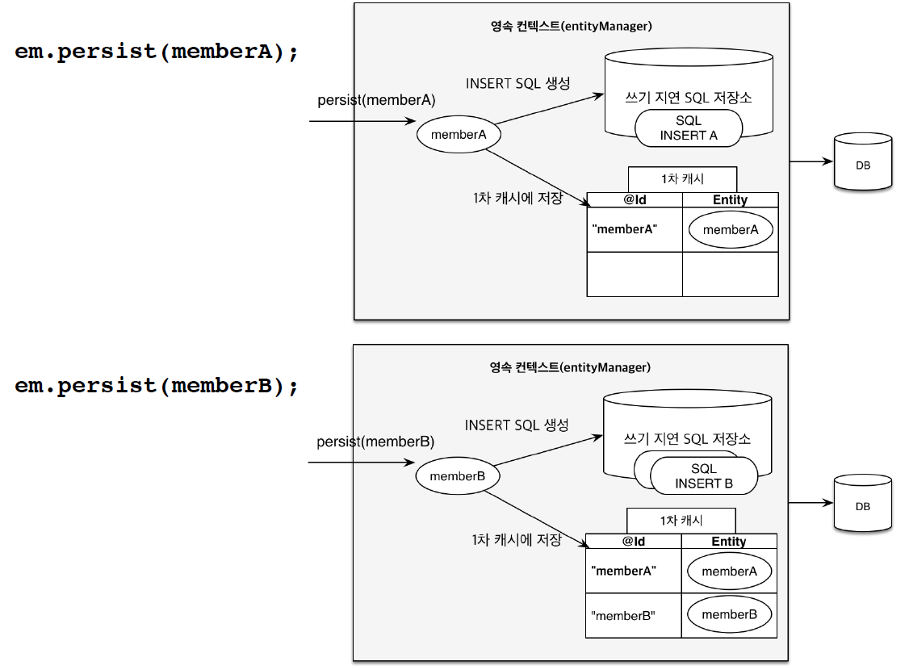

영속성 컨텍스트 안에는 1차 캐시와 함께 `쓰기지연 SQL 저장소`가 존재한다.

처음에 memberA를 영속하면 1차캐시와 동시에 JPA가 엔티티를 분석해서 INSERT 쿼리를 생성하고 쓰기 지연 SQL 저장소에 쌓아둔다.

그 다음 memberB를 영속하면 동시에 1차 캐시와 INSERT 쿼리를 생성하여 쓰기지연 SQL 저장소에 쌓아둔다.

**transaction.commit();**

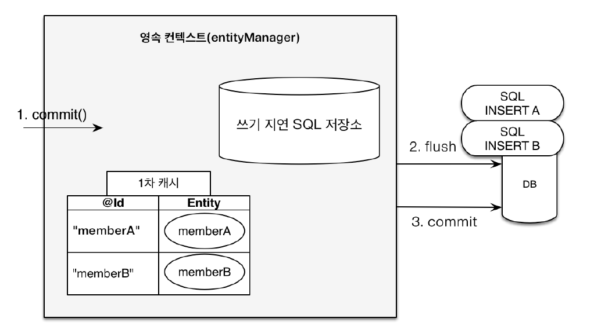

트랜잭션을 커밋하는 시점에 쓰기지연 SQL 저장소에 있던 얘들이 FLUSH가 되면서 (JPA에서 FLUSH 라고함) SQL이 날아가고 실제 데이터베이스 트랜잭션이 커밋된다.

```java
// 영속
Member member1 = new Member(150L, "A");
Member member2 = new Member(160L, "B");

em.persist(member1);
em.persist(member2);
System.out.println("========================");

tx.commit();
```

👉result

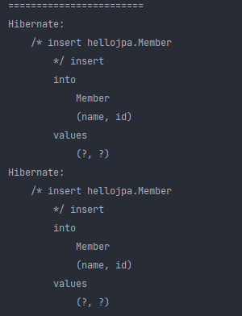

즉, persist할때는 쿼리가 안날아가고 커밋하는 순간에 쿼리가 나가는 것을 확인할 수 있다.


근데 왜 굳이 이렇게? persist 할때 쿼리가 나가면 되지않나? 라고 생각할 수 있다.

이때 버퍼링이라는 기능을 쓸 수 있다.

만약에 persist할때마다 db에 쿼리를 날리면 최적화 할 수 있는 여지 자체가 없다.

위 상황에서 member1, member2가 쌓여 있는데, 데이터베이스에서 이거를 한번에 보낼 수 있다. 이걸 jdbc batch 라고 한다.

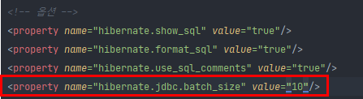

hibernate의 경우에는 옵션이 있다. 저 사이즈만큼 모아서 데이터베이스에 한번의 네트워크로 쿼리 2개를 날리고 실제 db 커밋을 한다.


이거를 mybatis로 생짜로 코드를 짠다면 내가 쿼리를 모아서 지연했다가 커밋직전에 넣는다? 이러면 진짜 힘들다..

즉 이와 같이 버퍼링을 모아서 write 함으로써 이점을 얻을 수 있다.

#### 4. 엔티티 수정 : 변경 감지 (Dirty Checking)

```java
EntityManager em = emf.createEntityManager();
EntityTransactiuon transaction = em.getTransaction();
transaction.begin(); // [트랜잭션] 시작

// 영속 엔티티 조회
Member memberA = em.find(Member.class, "memberA");

// 영속 엔티티 데이터 수정
memberA.setUsername("hi");
memberA.setAge(10);

//em.update(member) 이런 코드가 있어야 하지 않을까?

transaction.commit(); // [트랜잭션] 커밋
```

위와 같이 데이터를 변경하고 update 쳐야 하는거 아닌가? 라고 보통생각한다.

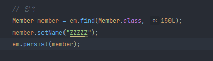

실제로 코드를 짤때 저런식으로 조회후, 데이터를 변경한뒤 또 다시 persist 를 해줘야 하지 않나? 라고 생각한다.


근데, JPA목적이 자바 컬렉션 다루듯이 객체를 다루는 것이다.

우리는 컬렉션에서 값을 꺼내고 값을 변경한뒤에 다시 컬렉션에 집어 넣지 않는다.

그래서 위 코드처럼 update나 persist 를 오히려 쓰면 안된다.

jpa는 그냥 조회해서 값을 변경만 해주면 된다.

```java
// 영속
Member member = em.find(Member.class, 150L);
member.setName("ZZZZZ");
System.out.println("========================");

tx.commit();
```

👉result

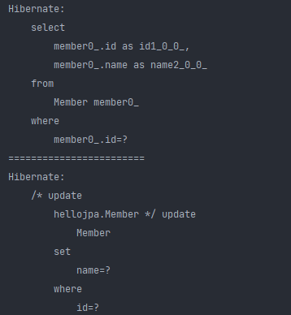

찾아온 다음에 데이터를 변경하고 JPA에게 UPDATE 쿼리를 날리라고 한적이 없다. 마치 자바 컬렉션을 다루듯이 값만 바꿨는데, UPDATE 쿼리가 나간 상황이다.

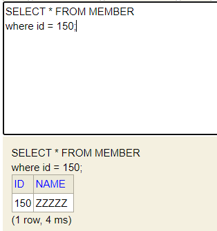

실제 db에도 데이터가 변경되었다.

JPA에서 Dirty checking 이라고 하는데, 변경 감지 기능으로 엔티티를 변경하는 기능을 제공한다.

이런 마법같은 기능이 어떻게 되는가?

**변경감지 (Dirty Checking)**

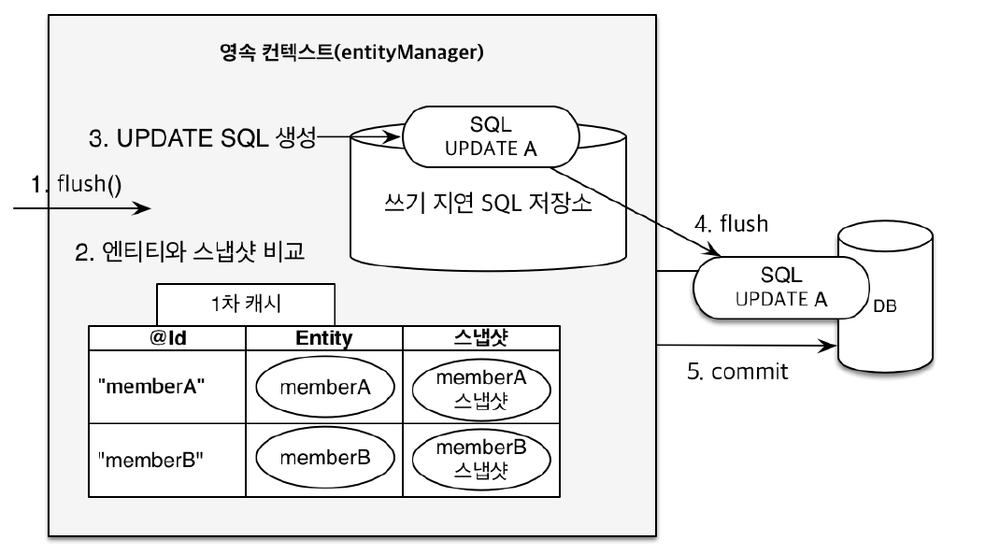

JPA는 데이터베이스 트랜잭션 커밋하는 시점에 내부적으로 flush()가 호출된다. 

그래서 엔티티와 스냅샷을 비교한다. 

1차 캐시에는 key값 (id)와 entity가 있고, `스냅샷` 이라는게 있다.

스냅샷이라는건, 내가 값을 읽어온 시점을 의미한다. 즉, 최초 시점의 상태를 스냅샷으로 따두는 거다.

db에서 읽어오든, 내가 1차캐시에 집어 넣든, **최초로** 영속성 컨텍스트에 들어온 상태를 스냅샷으로 따둔다.


그리고 memberA가 변경이 되면, JPA가 트랜잭션 커밋되는 시점에 내부적으로 flush가 호출되면서 엔티티와 스냅샷을 일일이 비교한다. (내부적으로 최적화 알고리즘이 다 적용되어 있을 것이다.)

비교해보고 memberA가 변경되면 update 쿼리를 쓰기지연 SQL 저장소에 만들어 둔다. 그리고 

이 업데이트 쿼리를 DB에 반영하고 커밋을 한다.


이런 메커니즘으로 변경 감지를 하게 된다.


#### 5. 엔티티 삭제

```java
// 삭제 대상 엔티티 조회
Member memberA = em.find(Member.class, "memberA");

em.remove(memberA); // 엔티티 삭제
```

삭제 과정은 위 메커니즘과 동일하게 작동한다.

#### 6. 플러시

영속성 컨텍스트의 변경내용을 데이터베이스에 반영한다.

쌓아뒀던 delete, update, insert sql이 db로 날아가는 거다.

즉, 영속성 컨텍스트의 변경사항과 데이터베이스를 맞추는 작업이라고 보면 된다.

**플러시 발생**

- 변경 감지
- 수정된 엔티티 쓰기 지연 SQL 저장소에 등록
- 쓰기 지연 SQL 저장소의 쿼리를 데이터베이스에 전송 (등록, 수정, 삭제 쿼리)


**영속성 컨텍스트를 플러시하는 방법**

- em.flush() - 직접 호출 (거의 할 일 없음, 근데 나중에 테스트 할때 알아두면 좋다.)
- 트랜잭션 커밋 - 플러시 자동 호출
- JPQL 쿼리 실행 - 플러시 자동 호출

```java
 // 영속
Member member = new Member(200L, "member200");
em.persist(member);
// 트랜잭션 커밋하기 전에 쿼리 날아가는 걸 보고 싶으면 flush를 강제 호출하면 됨
em.flush();

System.out.println("===========================");

tx.commit();
```

👉result

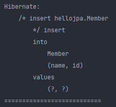

즉, 커밋이 되기 전에 flush에서 insert 쿼리가 날아가는 것을 확인할 수 있다.

> flush 하게 되면 1차 캐시는 계속 유지 된다. flush는 1차 캐시를 지우는 것, 데이터를 보내는것이 아니다.
>
> flush가 일어나면 변경감지를 통해 쓰기 지연 SQL 저장소에 UPDATE 쿼리를 쌓고 영속성 컨텍스트에 있는 쓰기 지연 SQL 저장소에 있는 쿼리들을 실제 DB에 반영되는 과정으로 생각하면 된다.


**JPQL 쿼리 실행 시 플러시가 자동으로 호출되는 이유**

```java
em.persist(memberA);
em.persist(memberB);
em.persist(memberC);

// 중간에 JPQL 실행
query = em.createQuery("select m from Member m", Member.class);
List<Member> members = query.getResultList();
```

위 코드에서 persist를 통해 멤버 3개를 영속성 컨텍스트에 넣었다. 그리고 JPQL로 멤버를 조회하려고 하는데, 현재 DB에는 이 멤버 3명이 저장되지 않은 상황이다.

3 멤버를 DB에 INSERT쿼리로 날려야 DB에서 조회를 해올 수 있는데 그런 상황이 아닌거다.

그리고 JPQL은 "select m from Member m"이 sql로 번역되서 실행된다.

그러면 db에서 가져올 member a,b,c가 없다. 이렇게 되면 문제가 생기게 된다. 

그래서 JPA는 이런 상황을 방지하고자 default로 JPQL 쿼리를 실행하면 무조건 flush를 날려버린다.

그리고 나서 JPQL의 쿼리가 날아간다. 그렇게 하여 A,B,C를 가져올 수 있다.


**플러시 모드 옵션**

```java
em.setFlushMode(FlushModeType.COMMIT)
```

- FlushModeType.AUTO 

커밋이나 쿼리를 실행할 때 플러시 (기본값)

- FlushModeType.COMMIT

커밋할 때만 플러시

이 커밋할 때만 플러시는 위 예제의 JPQL의 경우에서 멤버 A,B,C를 영속했지만, JPQL에서 멤버가아닌 전혀 다른 테이블(상품테이블)에서 조회를 한다면 굳이 그 상황에서 플러시를 할 필요가 없다.  정 이런 상황이 발생하면 이 옵션을 키면 되는데, 크게 도움은 안된다. 왠만하면 그냥 AUTO 쓰는걸 권장한다.

#### 플러시는!

- 영속성 컨텍스트를 비우지 않음
- 영속성 컨텍스트의 변경내용을 데이터베이스에 동기화
- 트랜잭션이라는 작업 단위가 중요 -> 커밋 직전에만 동기화 하면 됨

---

### 준영속 상태

- 영속 -> 준영속
- 영속 상태의 엔티티가 영속성 컨텍스트에서 분리(detached)
- 영속성 컨텍스트가 제공하는 기능을 사용 못함 (ex: dirty checking)


영속상태는 persist해서 내가 집어넣은것 뿐만아니라 find해서 db에서 1차캐시로 등록하는것 또한 영속상태로 만드는 것이다.


#### 준영속 상태로 만든느 방법

- em.detach(entity)

특정 엔티티만 준영속 상태로 전환

- em.clear()

영속성 컨텍스트를 완전히 초기화

- em.close()

영속성 컨텍스트를 종료

```java
 // 영속
Member member = em.find(Member.class, 150L);
member.setName("AAAAA");

em.detach(member);

System.out.println("===========================");

tx.commit();
```

👉result

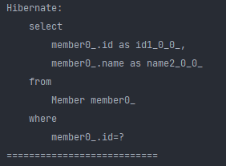

find를 통해 db에서 영속성 컨텍스트에 member를 등록하고 setName을 통해 더티체킹이 일어나 쓰기지연 sql 저장소에 업데이트 쿼리가 등록된다. 근데 detach를 호출했기 때문에 준영속 상태가 되어 commit을 해도 아무일이 일어나지 않는다.

이거를 직접 쓸 일은 거의 없다.

즉 준영속 상태는 영속상태였다가 빠지는 상황을 의미한다.

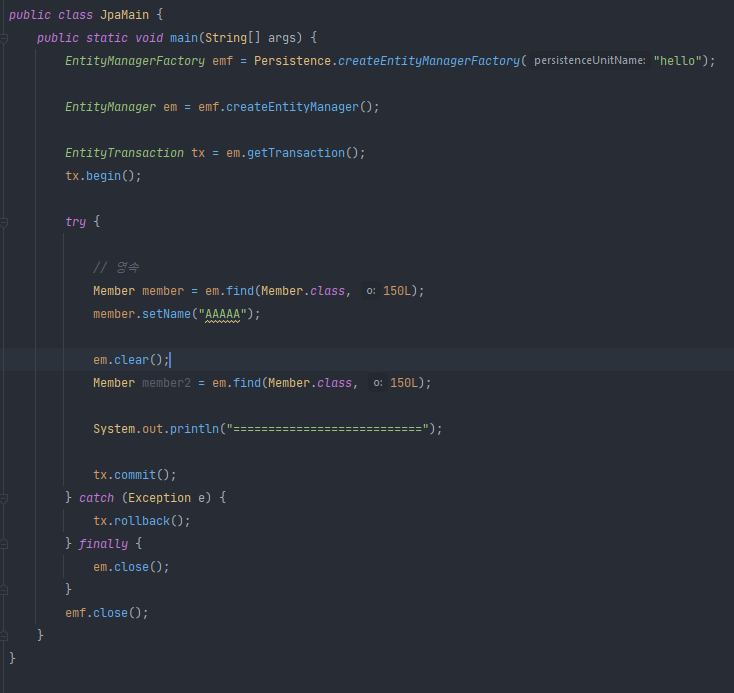

👉result

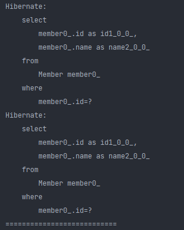

em.clear를 하면 영속성 컨텍스트를 초기화 시킨다. 즉 1차캐시가 완전히 날아가기 때문에 다시 새롭게 영속성컨텍스트로 등록하기 위해 select쿼리를 한번 더 날린다.


반면

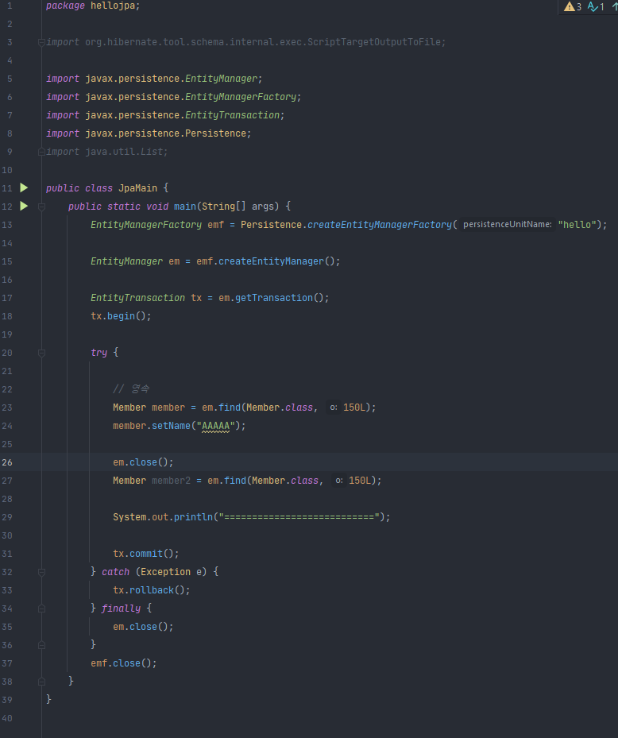

👉result

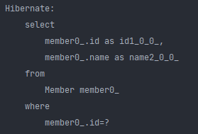

em.close로 아얘 영속성 컨텍스트를 종료하면 엔티티 매니저가 종료됬으므로 em의 메서드가 동작하지 않는다.