# 엔티티 매핑

## 객체와 테이블 매핑


### 엔티티 매핑 소개

- 객체와 테이블 매핑 : @Entity, @Table
- 필드와 컬럼 매핑: @Column
- 기본 키 매핑: @Id
- 연관관계 매핑: @ManyToOne, @JoinColumn


### 1. 객체와 테이블 매핑


#### @Entity

- @Entity가 붙은 클래스는 JPA가 관리함. 엔티티라고 함.
- JPA를 사용해서 테이블과 매핑할 클래스는 @Entity 필수로 써야함

- **주의**
  - 기본 생성자 필수(파라미터가 없는 public 또는 protected 생성자)
  - final 클래스, enum, interface, inner 클래스 사용 X
  - 저장할 필드에 final 사용 X


#### @Entity 속성

- 속성 : name
  - JPA에서 사용할 엔티티 이름을 지정한다.
  - 기본값: 클래스 이름을 그대로 사용 (예: Member)
  - 같은 클래스 이름이 없으면 가급적 기본값을 사용한다.


#### @Table

- @Table은 엔티티와 매핑할 테이블 지정

| 속성                   | 기능                                | 기본값             |
| ---------------------- | ----------------------------------- | ------------------ |
| name                   | 매핑할 테이블 이름                  | 엔티티 이름을 사용 |
| catalog                | 데이터베이스 catalog 매핑           |                    |
| schema                 | 데이터베이스 schema 매핑            |                    |
| uniqueConstraints(DDL) | DDL 생성 시에 유니크 제약 조건 생성 |                    |

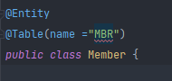

Member 엔티티에 다음과 같이 MBR이라는 이름을 붙여주면

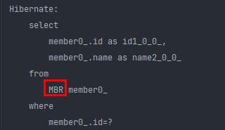

insert쿼리로 MBR이 붙는다.

---

### * 데이터베이스 스키마 자동 생성

- DDL을 애플리케이션 실행 시점에 자동 생성
- 테이블 중심 -> 객체 중심
- 데이터베이스 방언을 활용해서 데이터베이스에 맞는 적절한 DDL 생성
- 이렇게 **생성된 DDL은 개발 장비에서만 사용**
- 생성된 DDL은 운영서버에서는 사용하지 않거나, 적절히 다듬은 후 사용


#### 데이터베이스 스키마 자동생성 - 속성

`hibernate.hbm2ddl.auto`

| 옵션        | 설명                                          |
| ----------- | --------------------------------------------- |
| create      | 기존 테이블 삭제 후 다시 생성 (DROP + CRAETE) |
| create-drop | create와 같으나 종료시점에 테이블 DROP        |
| update      | 변경분만 반영(운영DB에는 사용하면 안됨)       |
| validate    | 엔티티와 테이블이 정상 매핑되었는지만 확인    |
| none        | 사용하지 않음                                 |

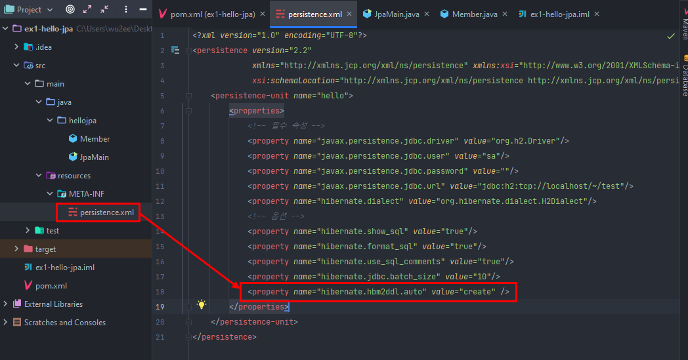

다음과 같이 persistence.xml에 create 옵션을 추가해주고 실행하면

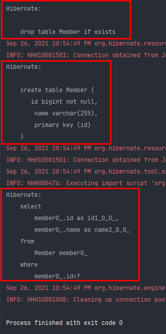

먼저 기존 테이블이 존재하는지 확인 후 있으면 DROP 한다. 그 다음 애플리케이션 로딩 시점에 엔티티가 매핑된 애들을(@Entity가 붙은 객체들) 보고 테이블을 만들어 낸다.

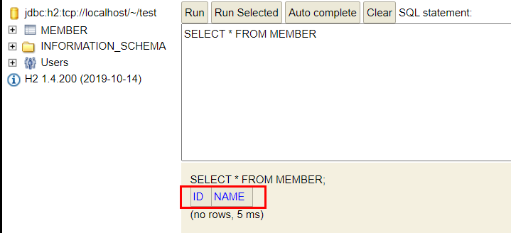

현재는 컬럼이 ID, NAME 2개있다.

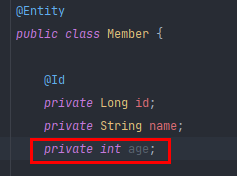

그래서 다음과 같이 필드로 age를 추가하고 다시 실행하면

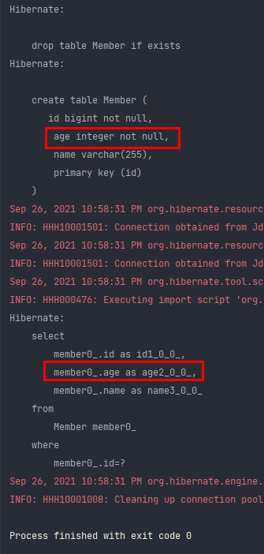


age 컬럼에 대한 쿼리와 함께 데이터베이스에 컬럼이 생기게 된다.


이런 방식으로 스키마 자동생성에 대한 속성을 위 예시를 보며 적용 가능하다.

특히 udpate 속성은 변경분만 반영이 되는데, 예를들어

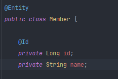

다음과 같이 id, name만 있는 테이블에 age 컬럼을 추가하고 싶다면?

그리고 기존의 테이블을 drop 하지 않고 추가하고 싶다면? (즉 alter table을 하고 싶은 거다.)

이때 update 속성을 사용한다.

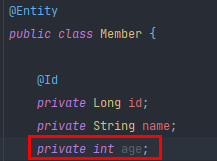

age 추가하고 update 속성으로 바꿔서 실행시키면

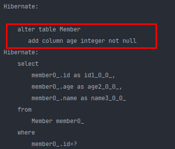

alter DDL이 나간다.

> 여기서 임의로 private int age; 를 삭제하는건 디비에 반영되지 않음. 


validate 속성은 실제 db와 객체에 있는 필드가 잘 매핑되있는지 확인해준다.


[참고] 데이터베이스 방언별로 데이터 타입이 다를 수 있음 (varchar)

예를들어 오라클의 경우는 varchar2 인데, 방언을 다음과 같이 변경시켜주고 실행시키면

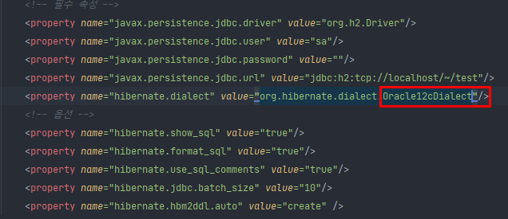

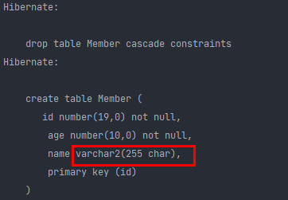

변경되어 쿼리를 날려준다.

### 데이터 베이스 스키마 자동 생성 옵션 사용시 주의 사항

- **운영 장비에는 절대 craete, create-drop, update 사용하면 안된다.**
- 개발 초기 단계는 create 또는 update
- 테스트 서버는 update 또는 validate
- 스테이징과 운영 서버는 validate 또는 none

만약 운영서버에서 alter를 잘못 치게 되면 시스템이 중단되는 상태가 생길 수 있다.

5분정도 시스템이 멈춰도 엄청난 장애가 발생하는 거다.


그래서 가급적이면 alter table 스크립트를 직접 테스트 서버나 개발서버에 직접 반영해보고, 잘 동작하면 운영서버에도 DBA에게 검수받고 적용하기를 권장한다.

결론 : local PC에서는 자유롭게하고, 개발, 스테이징, 운영서버에는 가급적 쓰지 않는다.

> TIP : show sql을 사용하면 로그로 스크립트를 hibernate가 한번 띄어주기 때문에 직접 치기 귀찮을 때 local로 한번 생성하고 그 스크립트를 다듬어서 넘긴다. 


#### DDL 생성 기능

- 제약 조건 추가 : 회원 이름은 **필수**, 10자 초과 X
  - **@Column(nullable = false, length = 10)**
- 유니크 제약조건 추가
  - @Table(uniqueConstraints = {@UniqueConstraint(name = "NAME_AGE_UNIQUE", columnNames={"NAME", "AGE"})})
- DDL 생성 기능은 DDL을 자동 생성할 때만 사용되고 JPA의 실행 로직에는 영향을 주지 않는다.

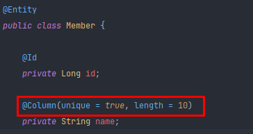

다음과 같이 컬럼에 옵션을 넣어주면

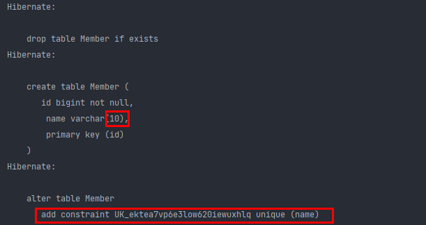

이렇게 쿼리를 추가해서 넣어준다.

이렇게 하는것은 애플리케이션에 영향(런타임)을 주지않고, 데이터베이스에 영향을 주기 때문에 JPA 실행 로직에는 영향을 주지 않는다.

---

### 2. 필드와 컬럼 매핑


#### [예제] 요구사항

1. 회원은 일반 회원과 관리자로 구분해야 한다.
2. 회원 가입일과 수정일이 있어야 한다.
3. 회원을 설명할 수 있는 필드가 있어야 한다. 이 필드는 길이 제한이 없다. 


```java
@Entity
public class Member {

    @Id
    private Long id;

    @Column(name = "name")
    private String username;

    private Integer age;

    @Enumerated(EnumType.STRING)
    private RoleType roleType;

    @Temporal(TemporalType.TIMESTAMP)
    private Date createDate;

    @Temporal(TemporalType.TIMESTAMP)
    private Date lastModifiedDate;

    @Lob // 데이터 베이스에 varchar를 넘어서는 큰 것을 넣고 싶을 때
    private String description;

    public Member(){}
}
```

다음과 같이 엔티티를 만들고 create 해보면

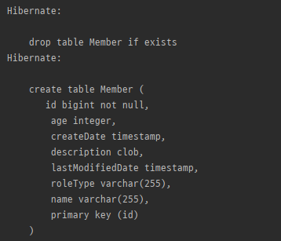

h2 데이터베이스에서 id는 bigint, age는 integer, 시간은 timestamp 타입이 있다.

또, @Lob에서 String은 clob으로 생성됨. enum과 name은 varchar로 매핑됨.


#### 매핑 어노테이션 정리

`hibernate.hbm2ddl.auto`

| 어노테이션  | 설명                                        |
| ----------- | ------------------------------------------- |
| @Column     | 컬럼 매핑                                   |
| @Temporal   | 날짜 타입 매핑                              |
| @Enumerated | enum 타입 매핑                              |
| @Lob        | BLOB, CLOB 매핑                             |
| @Transient  | 특정 필드를 컬럼에 매핑하지 않음(매핑 무시) |

@Transient는 db랑 관계없이 메모리에서 계산해보고 싶을때 사용한다.

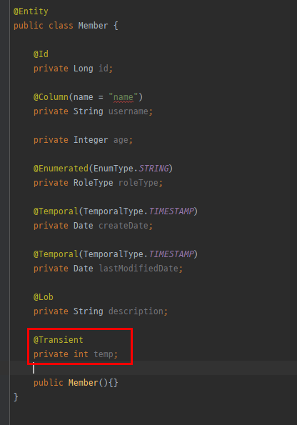

얘를 추가하면 db에 create하지 않는다. (메모리에서만 쓴다.)

| 속성                  | 설명                                                         | 기본값                                |
| --------------------- | ------------------------------------------------------------ | ------------------------------------- |
| name                  | 필드와 매핑할 테이블의 컬럼 이름                             | 객체의 필드 이름                      |
| insertable, updatable | 등록, 변경 가능 여부                                         | TRUE                                  |
| nullable(DDL)         | null 값의 허용 여부를 설정한다. false로 설정하면 DDL 생성 시에 not null 제약조건이 붙는다. |                                       |
| unique(DDL)           | @Table의 uniqueConstraints와 같지만 한 컬럼에 간단히 유니크 제약조건을 걸 때 사용한다. |                                       |
| columnDefinition(DDL) | 데이터베이스 컬럼 정보를 직접 줄 수 있다. ex) varchar(100) default ‘EMPTY' | 필드의 자바 타입과 방언 정보를 사용해 |
| length(DDL)           | 문자 길이 제약조건, String 타입에만 사용한다.                | 255                                   |
| precision, scale(DDL) | BigDecimal 타입에서 사용한다(BigInteger도 사용할 수 있다). precision은 소수점을 포함한 전체 자 릿수를, scale은 소수의 자릿수다. 참고로 double, float 타입에는 적용되지 않는다. 아주 큰 숫자나 정밀한 소수를 다루어야 할 때만 사용한다. | precision=19, scale=2                 |


```java
@Column(name = "name", nullable = false, unique = true)
private String username;
```

다음과 같이 unique 를 true로 정해주면

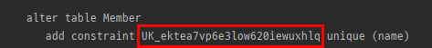

이렇게 유니크 제약조건을 만들어 준다.

근데 잘 안쓴다. 왜냐면 이름이 랜덤처럼 이상하게 나오기 때문이다.

운영에서는 unique 제약조건 뜨면 이걸 보고 바로 알아채야 하는데, 저걸 보고는 어떤 문제인지 바로 모를 수 있기 때문. 그래서 @Column으로 unique를 쓰면 이름을 반영하기 어렵다.

그래서 보통 @Table(uniqueConstraints = ~) 이런식으로 제약 조건을 건다.

또 컬럼정보를 직접 넣어 줄 수 도 있다.

```java
@Column(name = "name", nullable = false, columnDefinition = "varchar(100) default 'EMPTY'")
private String username;
```

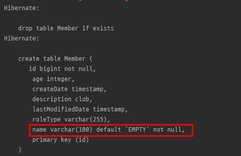

이런식으로 저렇게 문구가 그대로 db에 반영되게 할 수 있다.


#### @Enumerated

자바 enum 타입을 매핑할 때 사용

주의! ORDINAL 사용 X

| 속성  | 설명                                                         | 기본값           |      |
| ----- | ------------------------------------------------------------ | ---------------- | ---- |
| value | • EnumType.ORDINAL: enum 순서를 데이터베이스에 저장<br>• EnumType.STRING: enum 이름을 데이터베이스에 저장 | EnumType.ORDINAL |      |


만약

```java
@Enumerated(EnumType.ORDINAL)
private RoleType roleType;
```

다음과 같이 ORDINAL로 하고 실제 멤버 객체를 db에 반영한다면?

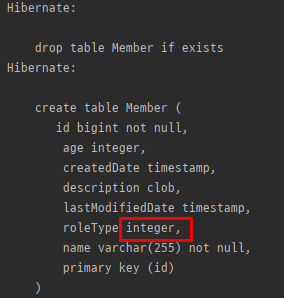

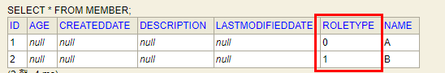

USER와 ADMIN이 0과 1로 구분된다.

이걸 왜쓰면 안되냐면, USER, ADMIN말고 GUEST가 추가된다면? C멤버를 GUEST로 추가해보자.

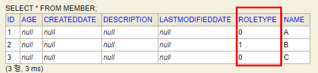

A와 C를 우리는 USER와 GUEST로 구분해서 넣었는데, ORDINAL로 등록되다보니 구분을 할 수 없게 된다.

이런거는 해결할 수 없는 버그가 되므로, 반드시 EnumType.STRING으로 써라.


#### @Temporal

날짜 타입(java.util.Date, java.util.Calendar)을 매핑할 때 사용
참고: LocalDate, LocalDateTime을 사용할 때는 생략 가능(최신 하이버네이트 지원)

| 속성  | 설명                                                         | 기본값 |
| ----- | ------------------------------------------------------------ | ------ |
| value | • TemporalType.DATE: 날짜, 데이터베이스 date 타입과 매핑 (예: 2013–10–11)<br/>• TemporalType.TIME: 시간, 데이터베이스 time 타입과 매핑 (예: 11:11:11)<br/>• TemporalType.TIMESTAMP: 날짜와 시간, 데이터베이스 timestamp 타입과 매핑(예: 2013–10–11 11:11:11) |        |


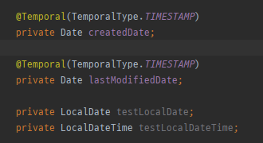

다음처럼 추가하고 돌리면

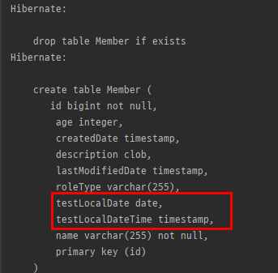

알아서 매핑이 잘 이루어 진다.

> 참고 : LocalDate는 연, 월 만 있고 LocalDateTime은 연, 월, 일이 모두 포함됨.


#### @Lob

데이터베이스 BLOB, CLOB 타입과 매핑

- @Lob에는 지정할 수 있는 속성이 없다.
- 매핑하는 필드 타입이 문자면 CLOB 매핑, 나머지는 BLOB 매핑
  - CLOB: String, char[], java.sql.CLOB
  - BLOB: byte[], java.sql. BLOB


#### @Transient

- 필드 매핑X
- 데이터베이스에 저장X, 조회X
- 주로 메모리상에서만 임시로 어떤 값을 보관하고 싶을 때 사용


---

## 기본 키 매핑


#### 기본 키 매핑 어노테이션

- @Id
- @GeneratedValue

#### 기본 키 매핑 방법

- 직접 할당 : **@Id만 사용**
- 자동 생성 : (**@GeneratedValue**)
  - **IDENTITY**: 데이터베이스에 위임, MYSQL
  - **SEQUENCE**: 데이터베이스 시퀀스 오브젝트 사용, ORACLE
    - @SequenceGenerator 필요
  - **TABLE**: 키 생성용 테이블 사용, 모든 DB에서 사용
    - @TableGenerator 필요
  - **AUTO**: 방언에 따라 자동 지정, 기본값


#### IDENTITY 전략 - 특징

- 기본 키 생성을 데이터베이스에 위임
- 주로 MySQL, PostgreSQL, SQL Server, DB2에서 사용 (예: MySQL의 AUTO_ INCREMENT)
- JPA는 보통 트랜잭션 커밋 시점에 INSERT SQL 실행
- AUTO_ INCREMENT는 데이터베이스에 INSERT SQL을 실행한 이후에 ID 값을 알 수 있음
- IDENTITY 전략은 em.persist() 시점에 즉시 INSERT SQL 실행하고 DB에서 식별자를 조회


```java
@Id
@GeneratedValue(strategy = GenerationType.IDENTITY)
private Long id;
```

```JAVA
Member member = new Member();
member.setUsername("C");
em.persist(member);
```

다음과 같이 IDENTITY 전략으로 id를 설정하고 저장하면


create 할 때 다음과 같이 설정하여 넘겨준다. 방언을 mysql로 바꿔주면

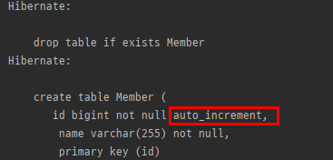

auto_increment로 나간다.

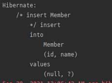

insert 쿼리를 보면 id가 null로 들어간다. 그리고 db가 알아서 1씩 증가시켜 준다.


#### SEQUENCE 전략 - 특징

- 데이터베이스 시퀀스는 유일한 값을 순서대로 생성하는 특별한 데이터베이스 오브젝트(예: 오라클 시퀀스)
- 오라클, PostgreSQL, DB2, H2 데이터베이스에서 사용


> 참고 id는 Long을 주로 많이 쓴다. int는 0이 나오기 때문에 애매해서 Integer가 가끔 쓰이는데, 얘도 애매한게, 10억 좀 넘어가면 한바퀴 돈다 (over flow). int, Integer로 했다가 10억이 넘어가서 타입을 바꾸는게 더 힘들기 때문에, 처음에 Long을 해주는게 좋다. 

```JAVA
@Id
@GeneratedValue(strategy = GenerationType.SEQUENCE)
private Long id;
```

다음과 같이 sequence로 바꾸면 

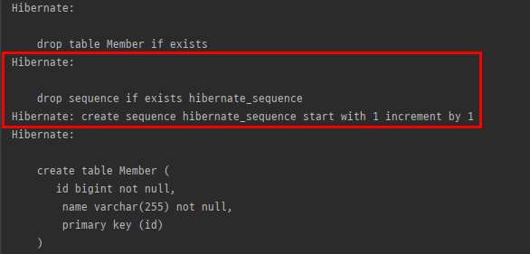

처음에 sequence를 1로 만들고 1씩 증가 시키게 끔 한다. 한번 더 저장하면

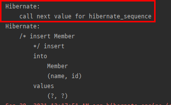

sequence에서 값을 가져와서 그다음 거에(1 증가) 세팅하게 된다.


현재 이름을 옵션으로 주지 않았기 때문에 기본 sequence인 `hibernate_sequence`가 쓰이게 된다.

근데, 테이블마다 sequence를 따로 관리하고 싶기 때문에 

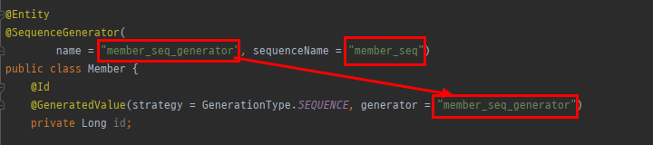

다음과 같이 @SequenceGenerator로 따로 관리하면 된다.

위 코드의 경우 member_seq_generator를 id에 매핑하면 member_seq 시퀀스가 생기게 된다.

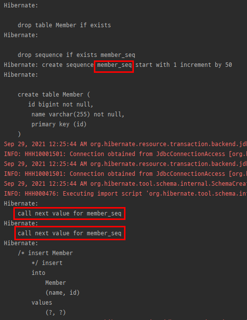

member_seq를 시퀀스로 사용하는 것을 볼 수 있다.


#### @SEQUENCE - @SequenceGenerator

- **주의 : allocationSize 기본값 = 50**

| 속성            | 설명                                                         | 기본값             |
| --------------- | ------------------------------------------------------------ | ------------------ |
| name            | 식별자 생성기 이름                                           | 필수               |
| sequenceName    | 데이터베이스에 등록되어 있는 시퀀스 이름                     | hibernate_sequence |
| initialValue    | DDL 생성 시에만 사용됨, 시퀀스 DDL을 생성할 때 처음 1 시작하는 수를 지정한다. | 1                  |
| allocationSize  | 시퀀스 한 번 호출에 증가하는 수(성능 최적화에 사용됨<br/>**데이터베이스 시퀀스 값이 하나씩 증가하도록 설정되어 있으면 이 값을 반드시 1로 설정해야 한다** | **50**             |
| catalog, schema | 데이터베이스 catalog, schema 이름                            |                    |

여기서 initialValue와 allocationSize를 통해 최적화를 가져올 수 있다. (뒤에 설명)

#### TABLE 전략

- 키 생성 전용 테이블을 하나 만들어서 데이터베이스 시퀀스를 흉내내는 전략
- 장점: 모든 데이터베이스에 적용 가능
- 단점 : 성능

별도로 테이블을 하나만들어서 키 시퀀스를 계속 제너레이터한다. 단점으로는 테이블을 하나만들고, 계속 제너레이터 하다보니 락이 걸릴수도 있고 성능적인 이슈가 있음. (시퀀스  오브젝트는 숫자뽑는데 최적화가 되있는데, 이거는 안돼있음)

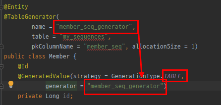

다음과 같이 테이블 전략을 사용하고 제너레이터 매핑을 해준다. table이름을 my_sequences라고 지었고, pkColumnName을 member_seq로 지었다.

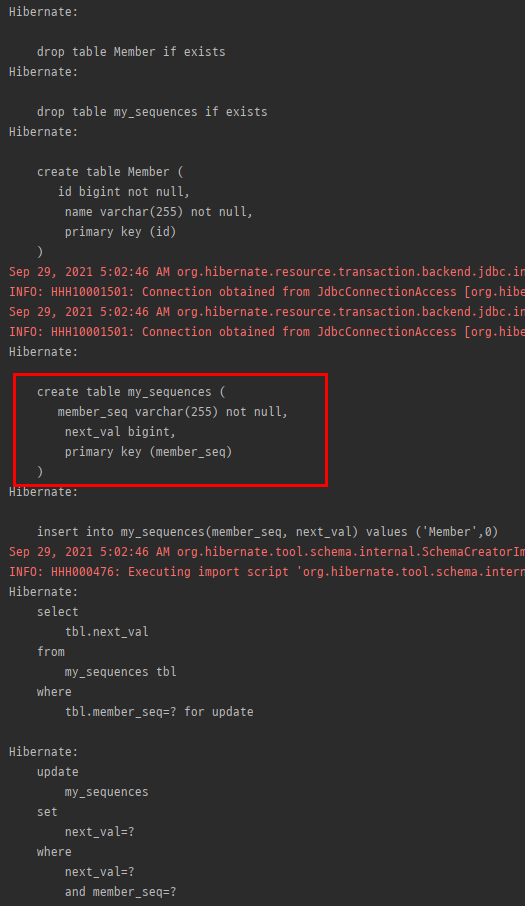

실제로 member 테이블 뿐만 아니라 my_sequences라는 테이블도 생성된다.

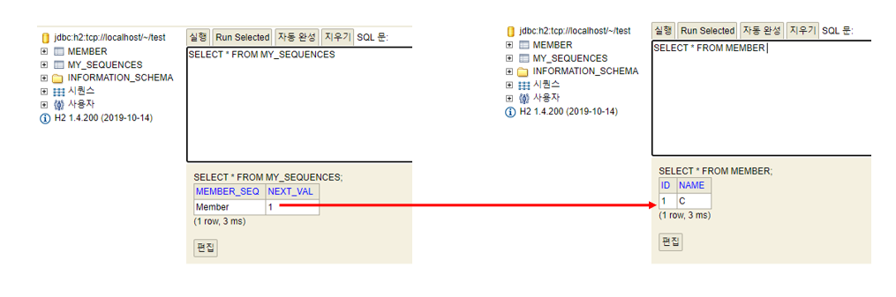

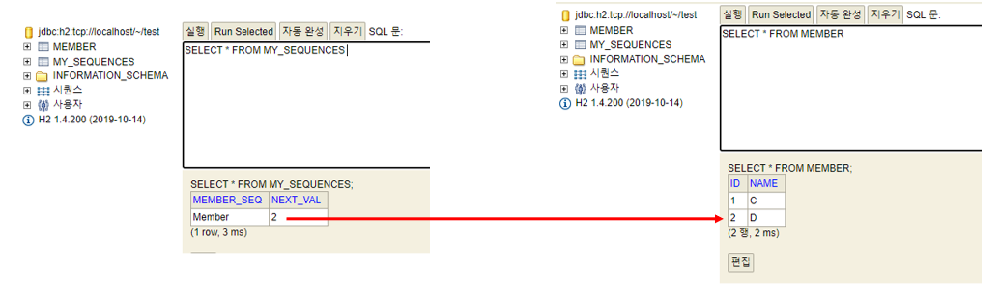

실제로 db에서 찍어보면 다음과 같이 매핑이 된다.

근데 아무래도 운영에서 테이블 전략을 쓰기에는 부담스러움.

DB에서 쓰는 관례들이 있기 때문에 그걸 쓰는걸 권장한다.

| 속성                   | 설명                                                  | 기본값              |
| ---------------------- | ----------------------------------------------------- | ------------------- |
| name                   | 식별자 생성기 이름                                    | 필수                |
| table                  | 키생성 테이블명                                       | hibernate_sequences |
| pkColumnName           | 시퀀스 컬럼명                                         | sequence_name       |
| valueColumnNa          | 시퀀스 값 컬럼명                                      | next_val            |
| pkColumnValue          | 키로 사용할 값 이름                                   | 엔티티 이름         |
| initialValue           | 초기 값, 마지막으로 생성된 값이 기준이다.             | 0                   |
| allocationSize         | 시퀀스 한 번 호출에 증가하는 수(성능 최적화에 사용됨) | 50                  |
| catalog, schema        | 데이터베이스 catalog, schema 이름                     |                     |
| uniqueConstraints(DDL) | 유니크 제약 조건을 지정할 수 있다.                    |                     |

테이블 전략도 마찬가지로 성능 최적화 전략이 있음 (뒤에 설명)


#### 권장하는 식별자 전략

- **기본 키 제약 조건**: null 아님, 유일, **변하면 안된다.**
- 미래까지 이 조건을 만족하는 자연키(비즈니스적으로 의미있는 키 : 주민등록번호 or 전화번호) 는 찾기 어렵다. 대리키(대체키 : 비즈니스랑 전혀 상관없는 키)를 사용하자.
- 예를 들어 주민등록번호도 기본 키로 적절하기 않다. (주민등록번호같은 거는 보관하면 안되기 때문)
- **권장: Long형 + 대체키 + 키 생성전략 사용**

주민번호를 pk로 쓰게되면 회원테이블을 갖다쓴 나머지 테이블을 JOIN 하려면 외래키로 들고있어야하는데, 주민번호가 곳곳에 퍼져있게 된다.

그래서 그걸 전부다 바꿔야되고 마이그레이션 등등 난리가 난다..

**그래서 Long형을 쓰거나, 대체키(시퀀스나 UUID) 같은 키 생성 전략을 조합해서 사용하는걸 권장함.**

> 결론적으로는 auto_increment나  sequence object, 둘중 하나를 써라. 그게 아니면 때에 따라 UUID나 랜덤값을 조합한 회사 내의 rule을 쓰는걸 권장한다. 절때 비즈니스를 키로 쓰는건 권장하지 않는다.


#### IDENTITY 전략 (심화)

pk 값을 내가 set하지 않고 db에 넣어준다. 그말은 null로 insert 쿼리를 날린다. db에서는 그때 값을 세팅해준다.

이렇게 되면 뭐가 문제냐면, id 값을 알려면 db에 들어가봐야 id값을 알 수 있다.

근데 JPA에서 영속성 컨텍스트에서 관리되려면 무조건 pk값이 있어야 한다. 근데 pk 값을 알려면 db에 들어가봐야 한다.


영속성 컨텍스트의 1차 캐시에 @Id 가 db pk 값이다. 근데 identity 전략을 쓰면 db에 넣기전까지 1차캐시의 @Id값을 알 수가 없다. JPA 입장에서는 키값을 모르니 값을 넣을 방법이 없다.

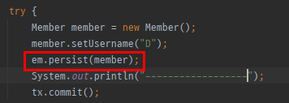

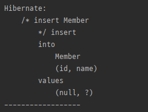

원래는 커밋하는 시점에 insert 쿼리가 날아간다고 지난시간에 배웠었다.

JPA에서는 identity전략을 쓸때만, 특이하게 em.persist(member)를 호출하는 시점에 insert 쿼리를 날린다.

왜냐면 db에 넣어봐야 pk값을 알수 있기 때문이다. 그리고 내부적으로 JPA가 그 pk값을 select해온다. 그때 영속성 컨텍스트의 @Id에 pk값을 셋팅할 수 있다.

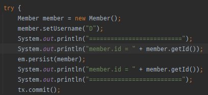

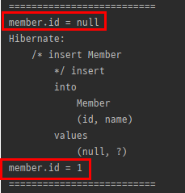

이렇게 db에서 값을 가져온다.

근데 select쿼리는 나가지는 않는데, jdbc에서 내부적으로 이런 insert  쿼리를 받았을때 바로 리턴을 받는 로직이 구현되어 있다. 그래서 db에 insert하는 시점에 바로 pk 값을 알 수 있다.

**그래서 데이터들을 모아서 insert하는것은 identity 전략에서는 불가능하다.**

근데 buffering 해서 write 하는게 크게 메리트가 있지는 않다. 트랜잭션을 계속 짤라내면 성능의 문제가 크지만, 한 트랜잭션 안에서만 insert 쿼리가 여러번 네트워크를 탄다고 해서 비약적으로 성능의 차이가 확 나지는 않는다.


#### SEQUENCE 전략 (심화)

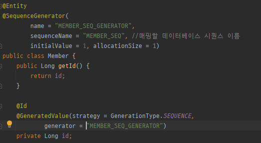

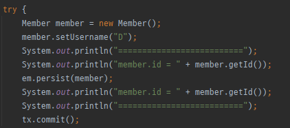

결과를 보면 start with 1 increment by 1 이라고 써있는데, sequence object가 1부터 시작해서 1씩 증가시키라고 한다.

H2 데이터베이스를 보면

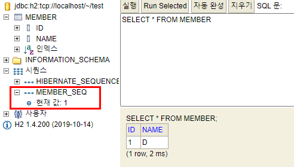

시쿼스에 MEMBER_SEQ 현재값이 1이다. 이값을 애플리케이션에서 가져와야 한다.

그래서 멤버 객체를 만들고 em.persist(member)를 할 때 영속성 컨텍스트에 넣으려면 id값이 있어야 하므로 먼저 시퀀스에서 pk값을 가져와야 한다. 그래서 JPA에서는 SEQUENCE 전략이니까 먼저 시퀀스에서 값을 가져온다고 내부적으로 구현되어 있음.

그래서 결과를 보면 em.persist(member); 를 호출하는 전 후에 

call next value for MEMBER_SEQ가 호출된다. 즉, 데이터베이스의 MEMBER_SEQ의 다음값을 가져오라는 명령이다. 그렇게 pk값을 가져오고, 그다음에 영속성 컨텍스트에 저장한다.

이때 아직 insert 쿼리는 안날아간 상태고, pk값을 받아서 영속성 컨텍스트에만 저장되어있고, 버퍼링은 해야 하니까 영속성 컨텍스트에 쌓여있다가 실제로 트랜잭션 커밋하는 시점에 insert 쿼리가 호출되게 된다.

이 시퀀스 전략은 버퍼링하는게 가능하다 (쭉 모았다가 한번에 write 하는게 가능, identity는 불가능).


근데 이 방법도 pk를 받아오다보니 자꾸 네트워크를 타야되니까 성능적인 이슈가 있을 것같다.. 

그냥 insert 쿼리 한번만 날리면 되지 너무 복잡하고 성능적인 문제가 있을 것같다.

그래서 JPA에는 allocationSize라는 옵션이 있다.

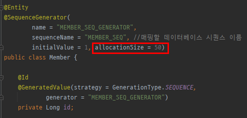

아까는 allocationSize를 1로 뒀는데, 원래 default 값은 50이다. 즉, 데이터베이스에서 50개를 미리 띄어 놓고, 서버 메모리에서는 1부터 50까지 쭉 받아서 쓴다. 그러다가 51이 되면 next call을 한번 요청한다. 그러면 db에서는 시퀀스가 50에서 100번대로 가있게 된다. 그러면 나는 다시 51번부터 쭉 받아서 쓰면 된다.

이런방식으로 db에 미리 올려놓고 메모리에서 그 갯수만큼 쓰는 방식이다.

이방식을 쓰면 여러 웹 서버가 있어도 동시성 이슈 없이 다양한 문제를 해결할 수 있다.

예시를 들어보자.

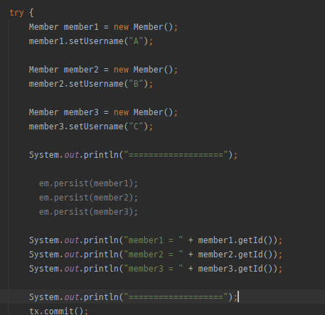

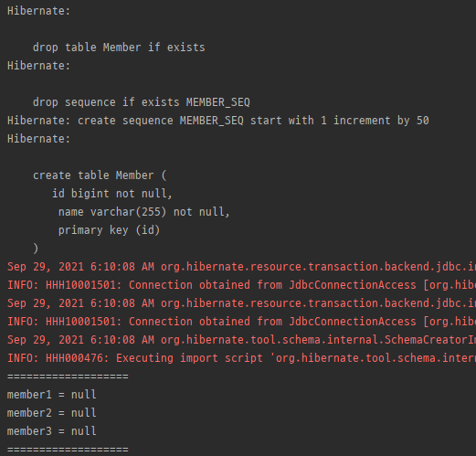

우선 persist 하지 않고 실행하면, start with 1 increment by 50이라고 뜨는데, 1부터 시작해서 50까지 늘리겠다는 뜻이다.

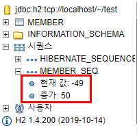

DB를 보면 MEMBER_SEQ에 현재값이 -49가 나오는데, 왜냐면 보통 call next value 해서 한번 호출해서 나온 값을 쓰는데, 그게 1이 되기를 기대하는 거다.

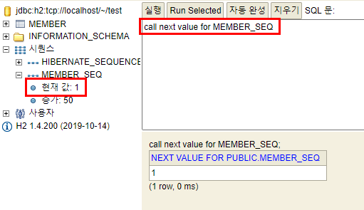

그래서 한번 호출하면 현재 값이 1로 바뀐 것을 알 수 있다.

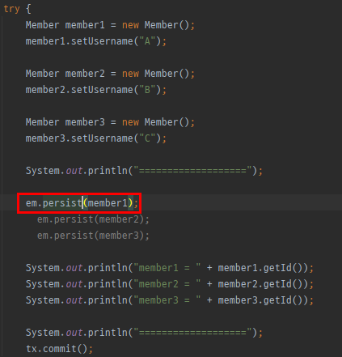

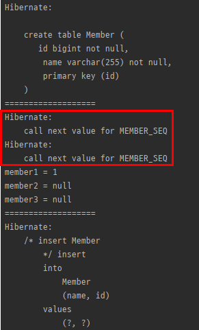

persist 하나를 주석 해제하고 돌리면 call next value가 2번 호출되는것을 볼 수 있다.

즉, persist 하기전에 처음에 한번 call하면 DB SEQUENCE가 1이고, 서버에서의 SEQUENCE는 1이다.

그리고 persist 하면 한번 더 call하는데 그때는 DB SEQUENCE가 51이 되고, 서버에서의 SEQUENCE는 2가 된다.

그리고 또 persist 하면 DB SEQUENCE는 그대로 51이고 서버에서의 SEQUENCE가 3이된다.

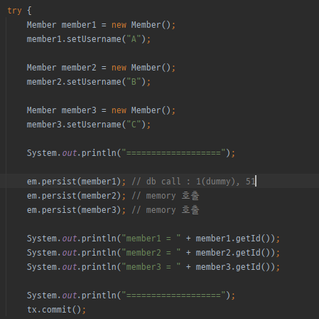

코드 단에서 보면 다음과 같은 메커니즘을 가지게 된다. 첫번째 persist 에서는 처음에 1을 위한 dummy로 call next val이 호출되고, 그다음에 persist 하면서 call next val이 한번더 호출되면서 db sequence가 51이 된다. 이후에 persist가 호출되는 것은 db sequence를 메모리로 땡겨 받았기 때문에 서버에서의 sequence가 51이 될때까지 db call이 아닌 memory에서 쓰게 된다.

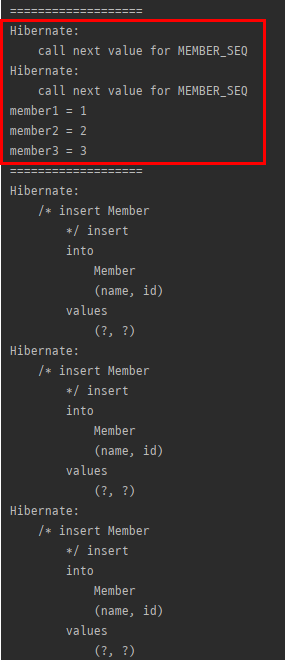

결과 또한 call next val은 두번만 호출되고, id는 계속 증가하는것을 확인할 수 있다.

대신 51이 되는순간 미리 100 까지 또 확보해 놔야하기 때문에 call next val을 한번 더 호출한다.

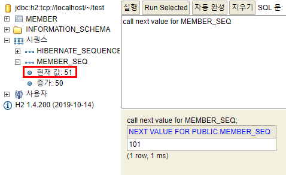ㅇ

db또한 현재값이 51로 셋팅되어 있다.

이론적으로 allocationSize를 충분히 늘려주면 좋긴 한데 (10000개 정도..) 그렇게 되면 웹서버를 내리는 시점에 값이 날아가게 된다. 즉, 숫자 구멍이 생기게 되는데, 그 구멍이 생겨도 상관은 없다. 근데 10000 처럼 크게 해버리면 그 구멍 (낭비되는 공간)이 엄청 커지게 되므로 50이나 100이 적절하다.

테이블전략도 이와 똑같은 메커니즘으로 최적화 할 수 있다. 테이블의 시퀀스의 increment를 50개 미리해놓고 웹서버에서 50까지 쭉 쓰는거다.

그러면 또 고민이 들 수 있는데, 서버가 여러대면 상관이 없을까? 라고 생각할 수 있는데 사실 문제는 없다.

시퀀스 전략이 미리 값을 올려두는 방식이기 때문에 여러대가 동시에 붙더라도, 예를들어 서버 10대가 동시 호출하면 

그 시퀀스 값이 쭉 올라가게되는데, 어쨌든 그 값을 확보하기 때문이다. 그래서 `값`만 확보해 두면 되기 때문에 동시성 이슈는 발생하지 않는다.
