# 연관관계 매핑 기초

## 목표

- **객체와 테이블 연관관계의  차이를 이해**
- **객체의 참조와 테이블의 외래 키를 매핑**
- 용어 이해
  - **방향**(Direction) : 단방향, 양방향
  - **다중성**(Multiplicity) : 다대일(N:1), 일대다(1:N), 일대일(1:1), 다대다(N:M) 이해
  - **연관관계의 주인**(Owner) : 객체 양방향 연관관계는 관리 주인이 필요

 

## 목차

1. 연관관계가 필요한 이유
2. 단방향 연관관계
3. 양방향 연관관계와 연관관계의 주인
4. 실전 예제 -  2. 연관관계 매핑 시작


### 1. 연관관계가 필요한 이유

'객체지향 설계의 목표는 자율적인 객체들의 **협력 공동체**를 만드는 것이다.' - 조영호(객체지향의 사실과 오해)

#### 예제 시나리오

- 회원과 팀이 있다.
- 회원은 하나의 팀에만 소속될 수 있다.
- 회원과 팀은 다대일 관계다.


#### 객체를 테이블에 맞추어 모델링 (연관관계가 없는 객체)

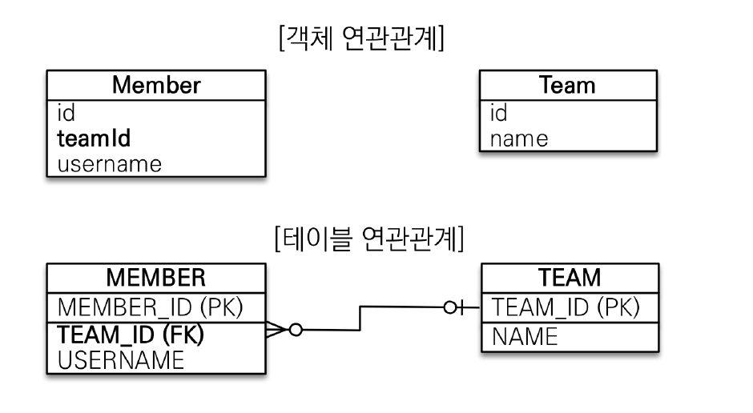

위와 같이 객체를 모델링하게 된다면,

`Member.java`

```java
@Entity
public class Member {

    @Id
    @GeneratedValue
    @Column("MEMBER_ID")
    private Long id;

    @Column(name = "USERNAME")
    private String username;

    @Column(name = "TEAM_ID")
    private Long teamId;
}
```

`Team.java`

```java
@Entity
public class Team {

    @Id
    @GeneratedValue
    @Column(name = "TEAM_ID")
    private Long id;
    
    private String name;
    
}
```

위 두 코드는 연관관계 없이, 참조 없이, 외래키를 그대로 사용한다.

실행해보면

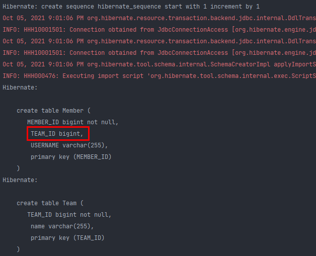

team_id 필드가 생성된다.


그리고 아래와 같이 멤버와 팀을 영속한다.

```java
Team team = new Team();
team.setName("TeamA");
em.persist(team); // persist 하면 pk 값이 셋팅이 됨.

Member member = new Member();
member.setUsername("member1");
member.setTeamId(team.getId()); // 내가 따로 set 하지 않아도 id 가 셋팅 되있음
em.persist(member);
```

두 객체간의 연관관계가 없으므로 외래키 식별자를 **직접** 다루게 된다.

이렇게 실행하면

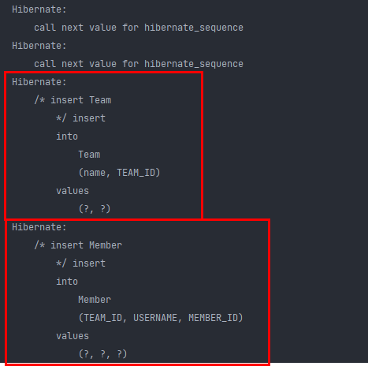

팀 쿼리가 먼저 나가고, 그다음 멤버 쿼리가 나간다.


DB에도 다음과 같이 저장되고, 팀 아이디로 조인도 가능하다.

위 코드에서 

```java
member.setTeamId(team.getId());
```

이 부분이 굉장히 애매하다. 외래키 식별자를 직접 다루는 상황인 거다.

그리고 조회할 때도 이슈가 있는데, 

```java
eam team = new Team();
team.setName("TeamA");
em.persist(team); // persist 하면 pk 값이 셋팅이 됨.

Member member = new Member();
member.setUsername("member1");
member.setTeamId(team.getId()); // 내가 따로 set 하지 않아도 id 가 셋팅 되있음
em.persist(member);

Member findMember = em.find(Member.class, member.getId());
Long findTeamId = findMember.getTeamId();
Team findTeam = em.find(Team.class, findTeamId);
```

위 코드는 팀과 멤버간의 연관관계가 없기 때문에 식별자로 다시 조회하며 db에서 계속 꺼내줘야 한다. (em.find 하는 부분) -> 객체지향 스럽지 않음.


#### 객체를 테이블에 맞추어 데이터 중심으로 모델링하면, 협력 관계를 만들 수 없다.

- **테이블은 외래키로 조인**을 사용해서 연관된 테이블을 찾는다.
- **객체는 참조**를 사용해서 연관된 객체를 찾는다.
- 테이블과 객체 사이에는 이런 큰 간격이 있다.

> 즉, 외래키로 조인과 객체 참조, 둘은 패러다임 자체가 다르다


### 2. 단방향 연관관계


#### 객체지향 모델링 (객체 연관관계 사용)

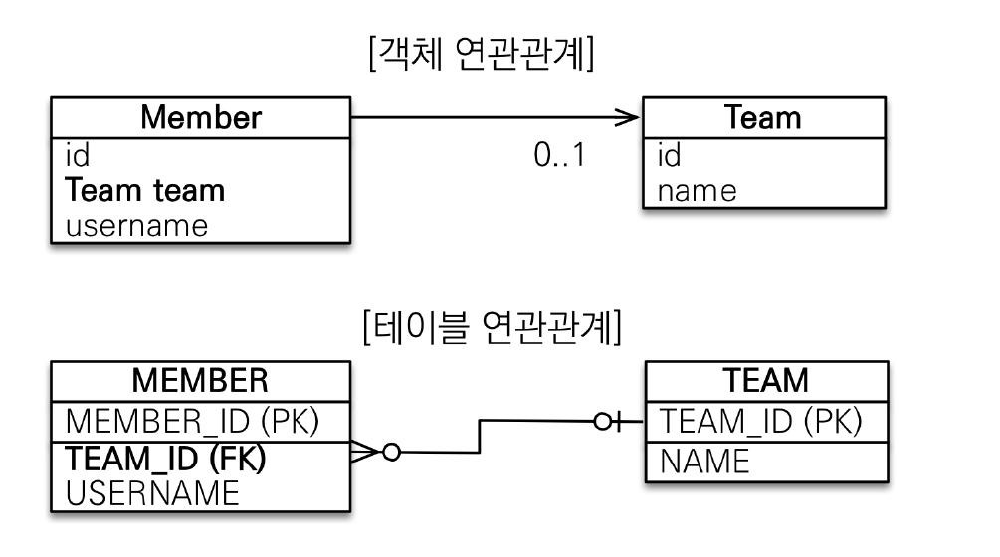

위와 같이 멤버 객체에 팀의 아이디가 아닌 팀 자체가 참조로 들어가게 된다.

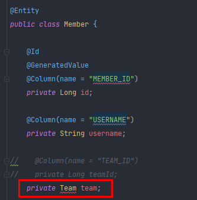

다음과 같이 추가해준다. 그러면 빨간줄이 뜨며 에러가 발생하는데, jpa한테 멤버와 팀이 무슨 연관관계인지 알려줘야 한다. (일대일, 일대다, 다대일, 다대다)

여기서 누가 `일`이고 누가 `다`인지 아는게 굉장히 중요하다.  ->이게 DB관점에서 중요한거다.

왜냐면 코드에서 애노테이션이 전부 DB와 매핑하기위한 어노테이션이기 때문.


위 테이블 그림을 보면 하나의 팀에 여러 멤버가 있을 수 있으므로 `일`은 팀이고, `다`는 멤버이다.

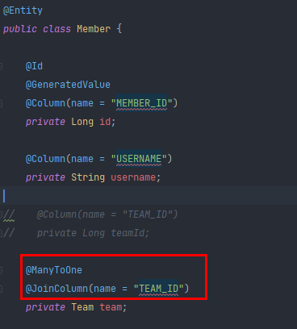

그래서 멤버입장에서 팀을 @ManyToOne으로 맵핑해야 한다.

그리고 Member 객체의 Team 참조 객체와 Member 테이블에 있는 TEAM_ID를 맵핑해야 한다. 그래서 @JoinColumn이라는 애노테이션을 사용하여, 조인해야할 컬럼을 지정해주면 한다. (우리 예제의 경우 TEAM_ID가 조인해야할 컬럼이다.)


이렇게 하면 맵핑이 끝나게 된다.

#### 객체지향 모델링 (ORM 매핑)

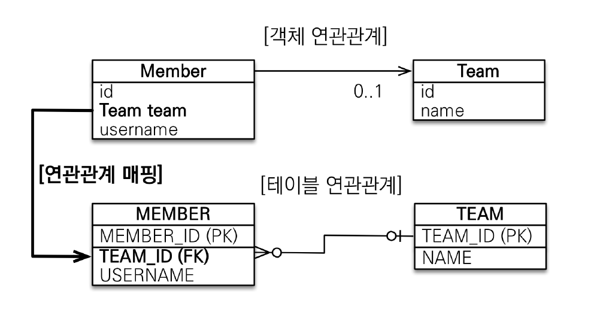

다음과 같이 객체 Member의 Team이 Member 테이블의 TEAM_ID와 연관관계 매핑이 발생하게 된다.

```java
// 저장
Team team = new Team();
team.setName("TeamA");
em.persist(team); // persist 하면 pk 값이 셋팅이 됨.

Member member = new Member();
member.setUsername("member1");
member.setTeam(team); // 단방향 연관관계 설정, 참조를 저장
em.persist(member);
```

그래서 위와 같이 코드를 구현하면, member.setTeam(team)을 하게 되면 JPA가 알아서 팀의 PK값을 꺼내서 멤버를INSERT할때 팀의 PK를 FK로 사용한다. 

```java
// 조회
Member findMember = em.find(Member.class, member.getId());
// 참조를 사용해서 연관관계 조회 -> 객체 그래프 탐색 가능
Team findTeam = findMember.getTeam();
```

그리고 멤버를 조회하고, 팀을 다시 조회할때 바로 멤버에서 팀을 조회하면 된다.

이런식으로 객체지향스럽게 레퍼런스들을 가져올 수 있게 된다.


위 코드를 테스트 할 때, 영속성 컨텍스트말고, db에서 가져오는 쿼리가 보고 싶다면? 

em.flush()를 강제 호출하고(flush 함으로써 영속성 컨텍스트에 있던 쿼리들이 다 db로 날아감), 싱크를 다 맞춘 다음에 em.clear()를 하면 영속성 컨텍스트를 완전히 초기화 하게 된다.

그리고 나서 `Member findMember = em.find(Member.class, member.getId());`를 하면 

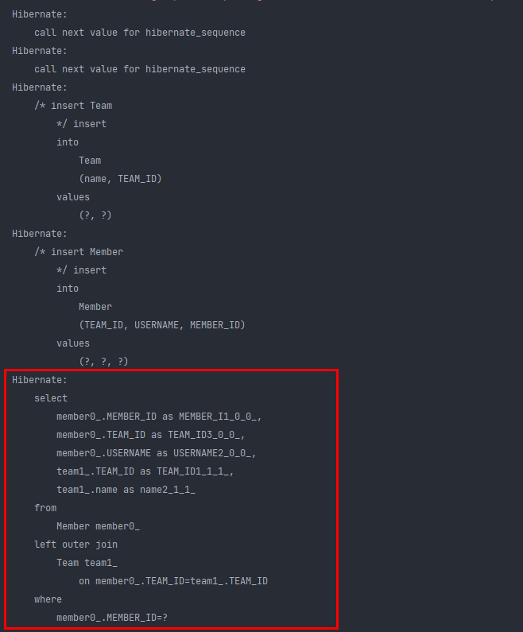

깔끔하게 db에서 가져오는 select 쿼리를 볼 수 있다.

멤버와 팀을 조인해서 가져오는걸 확인할 수 있다. 즉 JPA가 멤버와 팀을 한번에 다 땡겨 오는 것을 알 수 있다.


```JAVA
// 새로운 팀B
Tean teamB = new Team();
teamB.setName("TeamB");
em.persist(teamB);

// 회원1에 새로운 팀B 설정
member.setTeam(teamB);
```

위 코드와 같이 이미 member가 팀이 셋팅이 되어있는데, 새로운 팀으로 수정하기 위해 다시 setTeam을 하게되면 

Update 쿼리가 나가면서 FK가 바뀌게 된다.


---

# 양방향 연관관계와 연관관계의 주인 1 - 기본

#### 양방향 매핑

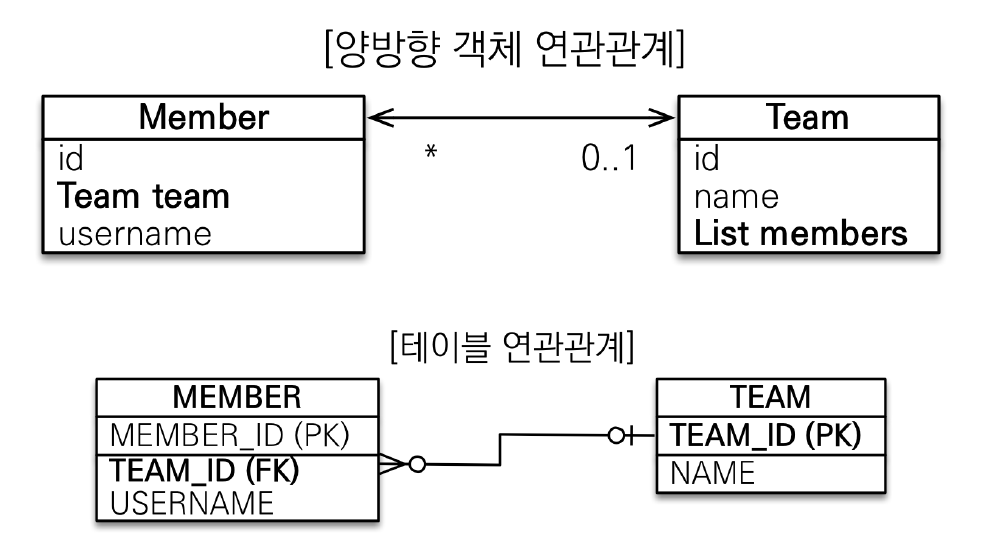

앞선 코드에서는 멤버에는 팀의 참조가 있어서 객체 그래프 탐색이 가능했지만, 팀에서는 멤버 객체 참조가 없기 때문에 팀에서 멤버를 조회할 수 없었다. (단방향) 그래서 두 객체를 자유롭게 탐색할 수 있게 하도록 하는 것이 양방향 연관관계를 설정하는 것이다. (물론 객체가 아닌 테이블이라면 외래키를 중점으로 자유롭게 탐색가능. 객체와의 차이점이다.)


즉, 위 그림에서 테이블 연관관계는 바뀐게 없다. 즉, 테이블은 양방향이나 단방향이나 변하는게 없다.

이게 굉장히 중요한데, 멤버 테이블에서 팀을 알고 싶으면, TEAM_ID 외래키를 이용하여 조인하여 알 수 있고, 팀 입장에서 우리 팀의 멤버가 누가 소속되있는지 알고 싶으면 내 PK랑 멤버의 FK랑 조인하면 된다.

`즉 테이블은 연관관계는 외래키 하나로 양방향이 다 있는거다.`  -> 사실상 테이블의 연관관계는 방향이라는 개념 자체가 없다. 그냥 FK 하나만 어디든 집어넣으면 양쪽으로 서로의 연관을 다 알 수 있다.

-> 문제는 객체이다.

멤버에서 팀으론 갈 수 있는데, 팀에서 멤버로 갈 순 없다. 그래서 팀에다가 List<Member> 를 줘야만 양방향으로 참조할 수 있다.


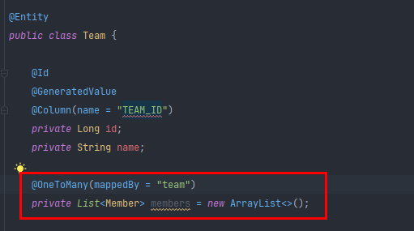

List를 만들면 관례로 new ArrayList<>(); 를 써준다. (왜냐면 add 할때 null 이면 안되니까)

그리고 팀이 `일` 이니까 @OneToMany를 쓴다.

또, mappedBy를 쓰는데, 그대로 해석하면, 나(Team)의 반대편(Member)에는 team이 걸려있다는 뜻이다.(즉, 나(Team 객체)는 team으로 매핑이 되어있는 얘 라는 뜻이다.)


```java
Team team = new Team();
team.setName("TeamA");
em.persist(team); 

Member member1 = new Member();
member1.setUsername("member1");
member1.setTeam(team);
em.persist(member1);

Member member2 = new Member();
member2.setUsername("member2");
member2.setTeam(team);
em.persist(member2);

em.flush();
em.clear();

Member findMember = em.find(Member.class, member1.getId());
System.out.println("------------------");
List<Member> members = findMember.getTeam().getMembers();

for (Member m : members) {
    System.out.println("m = " + m.getUsername());
}
```

다음과 같이 멤버 2명을 저장하고, 그중 하나의 멤버 아이디로 팀을 조회하고 다시 팀의 멤버들을 조회하였다.

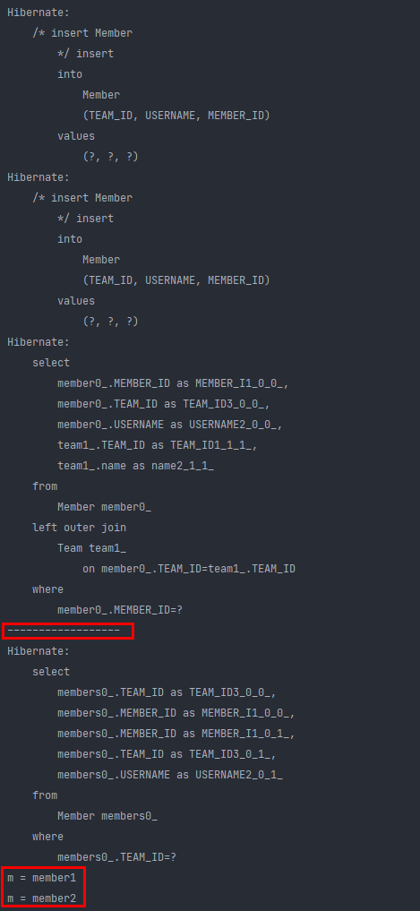

insert 쿼리가 2번 날아가고 flush 하여 캐시를 지운다. 그리고 멤버 하나로 부터 조회를 할때, team과 연관관뎨되어 있는 부분까지 조인하여 select 쿼리를 날리는 것을 확인할 수 있다. 그 다음에 객체 그래프를 참조하여 List를 가져올때 한번 더 select 쿼리가 나가는 것을 확인할 수 있다.

결국 Team에서도 Member를 조회할 수 있게 된다. (반대 방향으로 객체 그래프 탐색이 가능해짐)


그럼 이 양방향 매핑이 좋은가? 

결론적으로 객체는 단방향이 좋다. (나중에 설명)


여기서 궁금한점,

```java
@Entity
public class Member {

    ...

    @ManyToOne
    @JoinColumn(name = "TEAM_ID")
    private Team team;
    
    ...
```

멤버 엔티티에서는 JoinColumn으로 TEAM_ID를 적어줬는데,

```java
@Entity
public class Team {

    ...

    @OneToMany(mappedBy = "team")
    private List<Member> members = new ArrayList<>();
    
    ...
```

팀 엔티티에서 mappedBy = "team" 얘가 의미하는 바가 무엇인지 궁금하다.. 

`이 POINT가 굉장히 중요하다`


#### 연관관계의 주인과 mappedBy

- mappedBy = JPA의 멘탈붕괴 난이도
- mappedBy는 처음에는 이해하기 어렵다.
- 객체와 테이블간에 연관관계를 맺는 차이를 이해해야 한다.


#### 객체와 테이블이 관계를 맺는 차이

- **객체 연관관계 = 2개**
  - 회원 -> 팀 연관관계 1개 (단방향)
  - 팀 -> 회원 연관관계 1개 (단방향)
- **테이블 연관관계 = 1개**
  - 회원 <-> 팀의 연관관계 1개 (양방향)


#### 객체의 양방향 관계

- 객체의 **양방향 관계는 사실 양방향 관계가 아니라 서로 다른 단방향 관계 2개다.**
- 객체를 양방향으로 참조하려면 **단방향 연관관계를 2개** 만들어야 한다.
- A -> B (a.getB())

```java
class A {
    B b;
}
```

- B -> A (b.getA())

```java
class B {
    A a;
}
```


#### 테이블의 양방향 연관관계

- 테이블은 **외래 키 하나**로 두 테이블의 연관관계를 관리
- MEMBER.TEAM_ID 외래키 하나로 양방향 연관관계 가짐 (양쪽으로 조인할 수 있다.)

```sql
SELECT *
FROM MEMBER M
JOIN TEAM T ON M.TEAM_ID = T.TEAM_ID

SELECT *
FROM TEAM T
JOIN MEMBER M ON T.TEAM_ID = M.TEAM_ID
```

여기서 객체와 테이블 사이의 딜레마가 온다.


#### 둘 중 하나로 외래 키를 관리해야 한다.

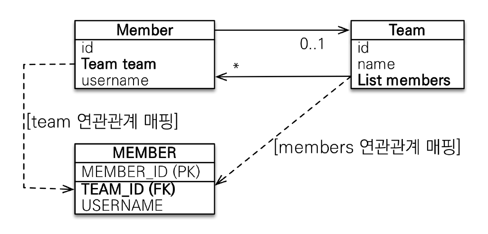

멤버의 Team이 바꼈을때 MEMBER테이블의 FK를 변경해야할지, 팀의 Member가 바꼈을때 MEMBER 테이블의 FK를 변경해야할지 딜레마가 오게 된다.

객체의 관점에서는 멤버 객체의 팀이나 팀객체의 멤버나 둘다 변경되게 하는게 맞다.

하지만 테이블 입장에서는 멤버의 FK만 바꾸면 된다.


아까 단방향일때는 멤버객체의 팀의 참조로 연관관계 매핑을 하면 됬는데, 지금은 양방향이 되면서 팀에있는 멤버들로 멤버테이블의 FK를 셋팅해야되나? 라는 고민이 들기 시작한다.

극단적인 예시로 `1, 멤버의 팀이 변경되고, 팀의 멤버가 변경이 안되는경우`, `2. 멤버의 팀은 변경이 안되고, 팀의 멤버는 변경이 되는 경우`, `3. 멤버의 팀, 팀의 멤버 둘다 변경되는경우` 가 있을 수 있다. 이럴때는 도대체 멤버 테이블의 FK를 어떻게 업데이트 시켜줘야하나..??

여기서 룰이 생기게 된다. 결국 `둘 중 하나로 외래키를 관리해야 한다.`

 멤버의 팀으로 외래키를 관리할지, 팀의 리스트 멤버로 외래키를 관리할지 정해야 한다(여기서 연관관계의 주인이라는 개념이 나오게 된다.)


#### 연관관계의 주인(Owner)

**양방향 매핑 규칙**

- 객체의 두 관계중 하나를 연관관계의 주인으로 지정
- **연관관계의 주인만이 외래 키를 관리(등록, 수정)**
- **주인이 아닌쪽은 읽기만 가능 (중요!)**
- 주인은 mappedBy 속성 사용X -> mappedBy 뜻 자체가 저것에 의해 매핑이 되었다는 뜻 (주인이 아님!)
- 주인이 아니면 mappedBy 속성으로 주인 지정


#### 누구를 주인으로?

- 외래 키가 있는 곳을 주인으로 정해라
- 여기서는 Member.team이 연관관계의 주인


```java
@Entity
public class Member {

    ...

    @ManyToOne
    @JoinColumn(name = "TEAM_ID")
    private Team team;
    
    ...
```

```java
@Entity
public class Team {

    ...

    @OneToMany(mappedBy = "team")
    private List<Member> members = new ArrayList<>();
    
    ...
```

즉, Member에서 JoinColumn으로 이미 외래키를 관리하고 있으며, Team에서는 이 List<Member> members가 mappedBy로 team에의해 관리가 된다라는 의미다. 

즉 Member 객체의 Team 참조가 연관관계의 주인이고, 따라서 Team 객체의 mappedBy가 적힌 곳은 읽기만 가능하다.

결론적으로 List<Member> members에 값을 아무리 넣어도 아무일도 일어나지 않음. (대신 조회는 가능 -> team.getMembers())

db에 update할때는 Member 객체의 Team만 참조한다.


만약 멤버 객체로 연관관계 매핑하지않고, 팀으로 멤버 테이블의 외래키를 관리하게되면 팀 객체의 members를 바꿨는데, MEMBER 테이블 (팀 객체 입장에서 다른 테이블)에 쿼리를 날리는 꼴이 된다. 즉, 팀 객체의 값을 바꾸면 멤버 테이블에 업데이트 쿼리가 날아가게 되는데 굉장히 헷갈린다. 직관적으로 멤버 객체를 변경하면 멤버 테이블에 쿼리가 나가는 것이 이해하기 편하다. 또 성능 이슈도 있다. (나중에 설명)


쉽게 생각할 수 있는 다른 방법으로는, 관계형 DB 입장에서 생각했을때, 외래키가 있는 곳이 `다` 이다.

즉, DB의 N쪽 테이블이 객체에서는 연관관계의 주인이 된다. 즉, `다` 쪽이 무조건 연관관계의 주인이 됨.

이렇게 하면 설계하는것도 가장 깔끔하게 나온다.


#### 양방향 매핑시 가장 많이 하는 실수 (연관관계의 주인에 값을 입력하지 않음)

```java
Member member = new Member();
member.setUsername("member1");
em.persist(member);

Team team = new Team();
team.setName("TeamA");
team.getMembers().add(member); // 역방향 (주인이 아닌 방향)만 연관관계 설정
em.persist(team);
```


이렇게 역방향만 연관관계 설정을 하면 실제 db에서 외래키가 업데이트 되지 않게된다.

```java
Team team = new Team();
team.setName("TeamA");
//team.getMembers().add(member);
em.persist(team);

Member member = new Member();
member.setUsername("member1");
member.setTeam(team);
em.persist(member);
```


#### 양방향 매핑시 연관관계의 주인에 값을 입력해야 한다. (순수한 객체 관계를 고려하면 항상 양쪽다 값을 입력해야 한다.)

따라서 다음과 같이 연관관계 주인인 Member에서 팀을 추가하게 되면,

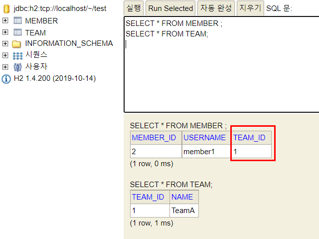

정상적으로 값이 들어가게 된다.

```java
Team team = new Team();
team.setName("TeamA");
em.persist(team);

Member member = new Member();
member.setUsername("member1");
member.setTeam(team);
em.persist(member);

team.getMembers().add(member);
```

마지막에 team에 member를 add해도 되지만 JPA에서는 사용하지 않는다.

```JAVA
Team team = new Team();
team.setName("TeamA");
//            team.getMembers().add(member);
em.persist(team);

Member member = new Member();
member.setUsername("member1");
member.setTeam(team);
em.persist(member);

em.flush();
em.clear();

Team findTeam = em.find(Team.class, team.getId());
System.out.println("--------");
List<Member> members = findTeam.getMembers();

for (Member m : members) {
    System.out.println("m = " + m.getUsername());
}
```

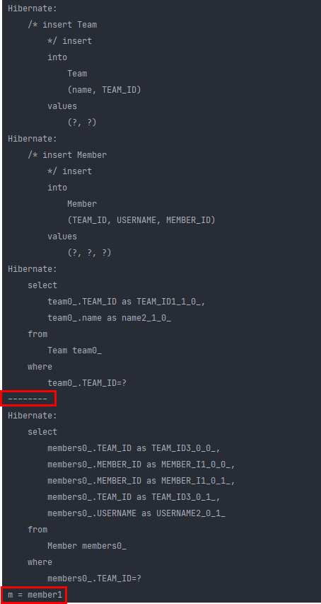

그래서 팀의 멤버리스트에 굳이 멤버들을 셋팅 안해줘도 JPA를 통해서 값을 조회할 수 있다. 근데 이걸 안넣어 주면 객체지향 스럽지 못하고, 2군데에서 문제가 생긴다.

`첫번째 문제`

```JAVA
// 저장
Team team = new Team();
team.setName("TeamA");
em.persist(team);

Member member = new Member();
member.setUsername("member1");
member.setTeam(team);
em.persist(member);

team.getMembers().add(member); // add 해줌
//em.flush();
//em.clear();

Team findTeam = em.find(Team.class, team.getId()); // 1차 캐시

List<Member> members = findTeam.getMembers();

System.out.println("--------");
for (Member m : members) {
    System.out.println("m = " + m.getUsername());
}
System.out.println("--------");

tx.commit();
```

flush를 하지않으면 findTeam이 1차캐시에 저장되어있는 것으로 찾아오게 된다. 그래서 select 쿼리가 나가지 않는다. 따라서 

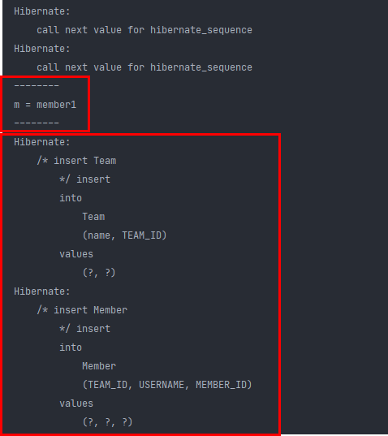

insert 쿼리만 2개 나가게 된다. 그리고 members에서 member1에 찍히는데, 앞에서 JPA에서는 이게 필요 없다고 했지만, flush를 안하게 된다면 문제가 발생한다. 그래서 추가했을 경우에는 member1이 찍히게 되는데, 만약

```java
// 저장
Team team = new Team();
team.setName("TeamA");
//team.getMembers().add(member);
em.persist(team);

Member member = new Member();
member.setUsername("member1");
member.setTeam(team);
em.persist(member);

//team.getMembers().add(member); // add 안함;
//em.flush();
//em.clear();

Team findTeam = em.find(Team.class, team.getId()); // 1차 캐시

List<Member> members = findTeam.getMembers();

System.out.println("--------");
for (Member m : members) {
    System.out.println("m = " + m.getUsername());
}
System.out.println("--------");

tx.commit();
```

다음과 같이 team에 멤버를 add 안해주면

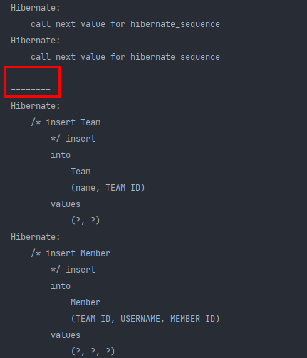

아무것도 안나온다. 

결국 영속성 컨텍스트에만 1차 캐시로 존재하고, db에서 가져오는게 아니기 때문에 test의 List<Member> 컬렉션에 add를 하지 않으면 조회가 되지 않는 것이다. (flush를 했다면 db에서 select 해올 것이기 때문에  연관관계 주인에 의해 FK가 셋팅 되어있기 때문에 test의 List<Member> 컬렉션에 멤버들이 add가 된 상태로 조회가 된다.)

즉, 위 상황은 findTeam 자체가 그저 순수한 객체이기 때문에 당연히 컬렉션에 member 들이 add되지 않았으므로 조회가 되지 않는 상황인 것이다.

`두번째 문제`

테스트 케이스 작성할때, jpa상관없이 순수 자바 코드로 동작하게 짜야한다. 그때도 member.getTeam 하면 되는데, 반대로하면 null이 생기는 상황이 발생할 수 있다.


**그래서 결론은 객체지향적인 생각으로 팀과 멤버 둘다 값을 셋팅해 주는 것이 맞다.**


#### 양방향 연관관계 주의 - 실습

- **순수 객체 상태를 고려해서 항상 양쪽에 값을 설정하자**
- 연관관계 편의 메소드를 생성하자
- 양방향 매핑시에 무한 루프를 조심하자
  - 예: toString(), lombok, JSON 생성 라이브러리


둘다 set 해주는걸 깜빡할 때가 있기 때문에 **연관관계 편의 메소드를 생성**해서 쓰는게 좋다.

```java
Team team = new Team();
team.setName("TeamA");
em.persist(team);

Member member = new Member();
member.setUsername("member1");
member.setTeam(team);
em.persist(member);

//team.getMembers().add(member); // 이렇게 깜빡하고 add를 못하는걸 방지하기 위해..
Team findTeam = em.find(Team.class, team.getId());

List<Member> members = findTeam.getMembers();
```

```java
@Entity
public class Member {

   ...

    @ManyToOne
    @JoinColumn(name = "TEAM_ID")
    private Team team;

    ...

    public void setTeam(Team team) {
        this.team = team;
        team.getMembers().add(this);
    }
}
```

다음과 같이 setTeam 메소드에 team 뿐만아니라 Member 객체 를 바로 team의 멤버 리스트에 추가해주면 된다.


그리고 이거는 개발자 마다 다른데, 연관관계 편의 메소드나, jpa 상태 변경하는 것을 setter를 잘 쓰지 않는다. (자바의 getter/setter 관례 때문)

```java
Team team = new Team();
team.setName("TeamA");
em.persist(team);

Member member = new Member();
member.setUsername("member1");
member.changeTeam(team);
em.persist(member);

//team.getMembers().add(member); // 이렇게 깜빡하고 add를 못하는걸 방지하기 위해..
Team findTeam = em.find(Team.class, team.getId());

List<Member> members = findTeam.getMembers();
```

```java
@Entity
public class Member {

   ...

    @ManyToOne
    @JoinColumn(name = "TEAM_ID")
    private Team team;

    public void changeTeam(Team team) {
        this.team = team;
        team.getMembers().add(this);
    }
    
    ...
}
```

이렇게 setTeam에서 changeTeam으로 이름을 바꿔서 단순히 getter/setter 관례가 아니라 뭔가 중요한 로직을 처리하는 구나 알 수 있게 해준다.


사실 이 연관관계 편의 메소드를 더 깊이있게 쓰려면 복잡해진다.

예를들면 팀안의 멤버에 진짜 내가 있냐 없냐 null체크도 해줘야 하고, 나를 바꾸면 멤버 입장에서 반대로 기존에 있던걸 빼고 다시 넣어줘야 하고, 팀이 바뀌면 기존에 있던 곳에서 빼내야 한다. 비즈니스 로직이 정말 복잡하다면 이런 것들 까지 넣어줘야 한다. 

근데 보통은 그렇게 까지 안해서 위와 같이 편의 메소드를 정의해서 쓰면 된다.

> 이런 복잡한 내용은 JPA 책을 통해 습득하자


편의 메소드를 위에서는 멤버 객체에다가 만들었는데, 반대로 팀 객체에다가 만들 수도 있다.

```JAVA
@Entity
public class Team {

    ...

    @OneToMany(mappedBy = "team")
    private List<Member> members = new ArrayList<>();

    public void addMember(Member member) {
        member.setTeam(this);
        members.add(member);
    }
    
    ...
}
```

```java
Team team = new Team();
team.setName("TeamA");
em.persist(team);

Member member = new Member();
member.setUsername("member1");
//member.changeTeam(team); // 편의 메서드를 둘다 사용하면 꼬이므로 하나만 사용해야 함
em.persist(member);

team.addMember(member); // 이렇게 편의 메서드를 변경 할 수 있음

Team findTeam = em.find(Team.class, team.getId());

List<Member> members = findTeam.getMembers();
```

위와 같이 addMember 편의 메서드를 사용해도 상관없다.

편의 메서드를 만약 둘다 사용하게 되면 최악의 경우 무한 루프를 돌 수 있으므로 조심해야 한다.

> 편의 메서드는 `일`에 넣어도 되고 `다` 에 넣어도 되는데, 애플리케이션 만드는 상황마다 다르다.


```java
@Override
public String toString() {
    return "Team{" +
        "id=" + id +
        ", name='" + name + '\'' +
        ", members=" + members +
        '}';
}

@Override
    public String toString() {
        return "Member{" +
                "id=" + id +
                ", username='" + username + '\'' +
                ", team=" + team +
                '}';
    }

```

```java
Team team = new Team();
            team.setName("TeamA");
            em.persist(team);

            Member member = new Member();
            member.setUsername("member1");
            em.persist(member);

            team.addMember(member); // 연관관계 편의 메소드

            Team findTeam = em.find(Team.class, team.getId());

            List<Member> members = findTeam.getMembers();

            System.out.println("============");
            System.out.println("members = " + findTeam); // 이게 toString() 호출함
            System.out.println("============");
```


또 양방향 매핑시, 객체에 toString 을 오버라이딩 하면 객체 그래프를 참조하면서 서로 toString을 타면서 무한 반복 호출을 하게 되는 상황이 발생할 수 있다.

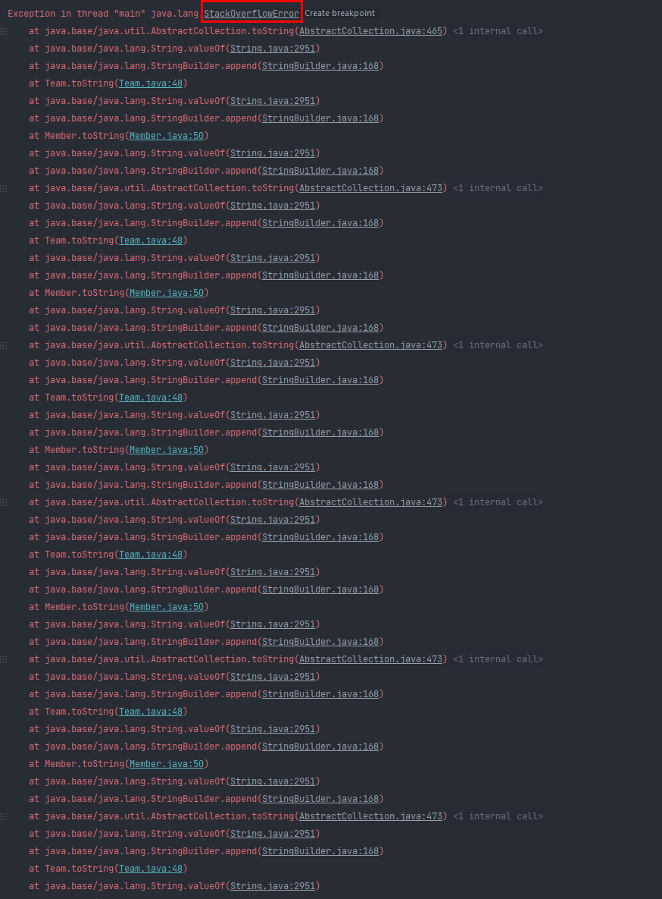

스택 오버플로가 터진다.

toString 뿐만아니라 JSON 생성 라이브러리에서도 값을 쭉 뽑으면서 엔티티에서 JSON으로 변경시 무한루프에 걸릴 수 있게 된다.

이 JSON 생성 라이브러리가 실제 운영에서 언제 문제가 많이 생기냐면, 엔티티를 컨트롤러에서 직접 리스폰스 엔티티로 보내버리면, 엔티티에 걸여있는 연관관계가 양방향으로 걸려있으면 컨트롤러에서 그 엔티티를 반환해 줄때, JSON으로 반환하면서  무한루프에 걸리게 된다. 이렇게 시스템에 장애가 발생한다.


그래서 이거도 답이 정해져 있는데, lombok에서 toString 만드는건 왠만하면 쓰지말자. 혹시 쓰더라도 연관관계는 빼고 써라. 

그리고 JSON 생성 라이브러리는 사실 고민할 필요가 없는데 

실무진에서도 굉장히 많은 고민, 질문들이 여기서 많이 들어온다. 

답은 컨트롤러에서는 엔티티를 절때 반환하지 말자. 

왜냐면 요새는 컨트롤러에서 response로 JSON을 쫙 뽑는데, (거의 JSON으로 통신하면서 업무를 하니까) 

컨트롤러에서 엔티티를 API 스펙으로 반영해 버리면 2가지 문제가 생긴다.

1. 지금 계속 얘기한 무한루프 문제
2. 엔티티가 변경이 일어났을 때 API 스펙도 변경되는 문제 (내가 직접 컨트롤 하는거랑 달라서 문제의 소지가 높음)

그래서 엔티티 반환이 아니라 왠만하면 DTO(단순히 값만 있는)로 변환하여 반환하는 걸 추천함. (그러면 JSON 생성 라이브러리에서 문제가 생기지 않음)


#### 양방향 매핑 정리

- **단방향 매핑만으로도 이미 연관관계 매핑은 완료**
- 양방향 매핑은 반대 방향으로 조회(객체 그래프 탐색) 기능이 추가된 것 뿐
- JPQL에서 역방향으로 탐색할 일이 많음
- 단방향 매핑을 잘 하고 양방향은 필요할 때 추가해도 됨 (테이블에 영향을 주지 않음)

처음에는 무조건 단방향 매핑으로 설계를 끝내라. 그리고 양방향으로 조회기능이 추가되는 것이다. 

JPA에서 단방향 매핑만으로 이미 객체와 테이블 매핑은 완료된 것임. 개발하다 보면 테이블이 굳어지게 되는데, 

객체 입장에서 사실 양방향 관계가 좋을 이유가 없음. 연관관계 편의 메서드도 만들어야하고 등등 고민 거리들만 많아진다.

**설계의 관점에서만 보면 객체와 테이블을 매핑한다는 관점에서 이미 단방향 매핑만으로 끝난거다.**


근데 또 막상 실무에서는 역방향 탐색이 많은데, 이때 JPQL을 많이 사용함.

#### 연관관계의 주인을 정하는 기준

- 비즈니스 로직을 기준으로 연관관계의 주인을 선택하면 안됨 (할 수는 있음.. but, 성능 등, 여러관점을 고려)
- **연관관계의 주인은 외래 키의 기준으로 정해야 함**

---

# 실전 예제 2 - 연관관계 매핑 시작

#### 테이블 구조

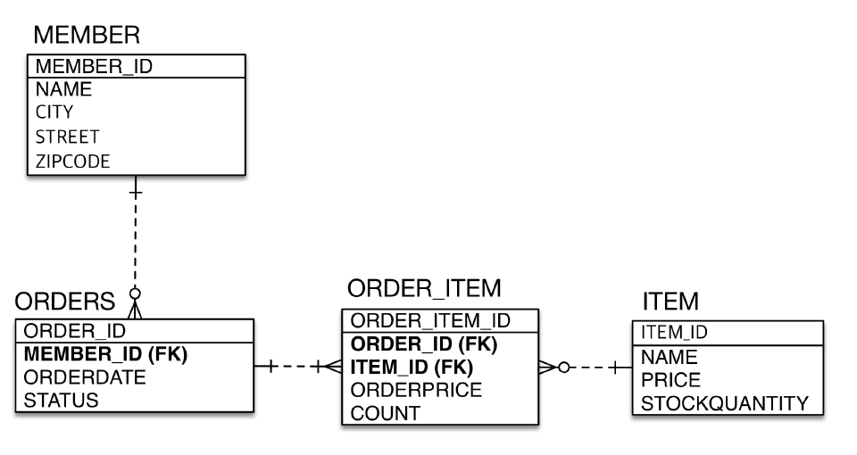


#### 객체 구조

- 참조를 사용하도록 변경

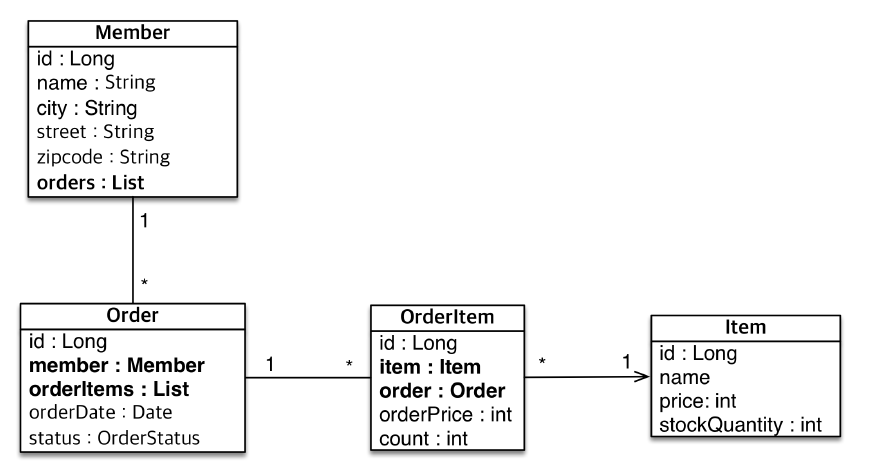


Member 에서 주문 리스트를 찾지는 않는게 보통임.

근데 비즈니스적으로 주문에서 주문 리스트를 찾는건 굉장히 많기 때문에 중요함.

위 객체, 테이블 설계에서 orderList 와 orderItemList는 사실필요없다. 단방향 연관관계만으로 어플리케이션 만드는데는 아무 지장이없다.

양방향 연관관계를 만드는이유는 개발상의 편의, 조회할때쓴다. 연관관계의 주인이 아닌것들은 조회만 가능하기때문이다.  예를들면 오더테이블을조회했을때, 바로 오더아이템스를 알수있게끔 편의를줄수있다. 

설계할때 **단방향으로 매핑해도 다되고** 필요할때만 양방향을 적용하면된다고했는데, 이게 사실 실전에서는 애매한경우가있다.

어떤경우냐면 실전에서는 JPQL을 많이짠다. 그러다보니 Order를조회할때, OrderItem도 끌고오고싶은 경우가잇다. 그때 Order테이블에 OrderItemList같이 뭐라도 있어야가능하다. **그리고 실무에서 JPQL을 복잡하게 짜기때문에 양방향연관관계 사용하게된다.**


사실 이마저도 **단방향 연관관계**를 적용한뒤, orderItem을 조회하고싶으면, 그냥다시 db에 select쿼리를날려서 조회하면된다. 근데 객체지향적인설계를적용하고싶고, 양쪽에서 걸어주는게 어플리케이션 개발에서 더 순조로울 수 있다.

그래서 지금 구조상에서는 멤버객체를보고 오더테이블을 찾을일이 없다. 왜냐면 비즈니스적으로 그럴일이 없기때문. 그냥 오더테이블을조회하면되기때문. 그래서 멤버객체에 오더리스트가들어간게 로직상으로 문제는없지만 비즈니스적으로 잘못된 상황이라고 생각하는것이다!

