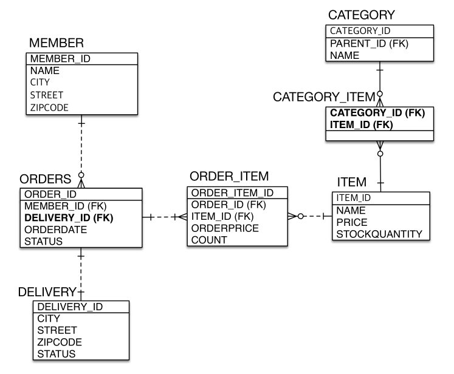

# 다양한 연관관계 매핑

## 목차

- 연관관계 매핑시 고려사항 3가지
- 다대일 [N:1]
- 일대다 [1:N]
- 일대일 [1:1]
- 다대다 [N:M]
- 실전 예제 - 3. 다양한 연관관계 매핑


## 연관관계 매핑시 고려사항 3가지

- 다중성 (일대다 ...)
- 단방향, 양방향
- 연관관계의 주인 (양방향 일때)


### 다중성

- 다대일: @ManyToOne
- 일대다: @OneToMany
- 일대일: @OneToOne
- 다대다: @ManyToMany


> JPA에서 나온 애노테이션은 전부 DB와 매핑하기 위해 존재한다고 생각하면 편하다. (데이터베이스의 다중성을 위주로 고민하면 된다.)

가끔 헷갈릴 때가 있는데, 그때는 반대로 생각하면 된다. 대칭성이 존재하기 때문에 가능하다.

> 다대일 <-> 일대다 | 일대다 <-> 다대일 | 일대일 <-> 일대일 | 다대다 <-> 다대다 


여기서 사실 다대다는 실무에서 쓰면 안된다. 

다대일을 가장 많이 쓰고, 일대다도 필요할때 많이쓴다. 일대일은 가끔 나오긴한다.


### 단방향, 양방향

- **테이블**
  - 외래 키 하나로 양쪽 조인 가능
  - 사실 방향이라는 개념이 없음
- **객체**
  - 참조용 필드가 있는 쪽으로만 참조 가능
  - 한쪽만 참조하면 단방향
  - 양쪽이 서로 참조하면 양방향


### 연관관계의 주인

- 테이블은 외래 키 하나로 두 테이블이 연관관계를 맺음
- 객체 양방향 관계는 A->B, B->A 처럼 참조가 2군데
- 객체 양방향 관계는 참조가 2군데 있음. 둘중 테이블의 외래 키를 관리할 곳을 지정해야 함
- 연관관계의 주인: 외래 키를 관리하는 참조
- 주인의 반대편: 외래 키에 영향을 주지 않음. 단순 조회만 가능


## 다대일 [N:1]

### * 다대일 단방향


`다` 에 외래키가 있는게 맞는 설계다. (만약 TEAM에서 MEMBER_ID를 관리하면 같은 TEAM이 여러번 INSERT 되야 하므로 잘못된 설계임) 지금 같은 경우 객체에서 다대일로 설계를 했기 때문에 Member객체와 MEMBER 테이블을 매핑해주는데, Member객체의 Team 참조와 MEMBER 테이블의 TEAM_ID만 매핑해주면 된다.

### 다대일 단방향 정리

- 가장 많이 사용하는 연관관계
- **다대일**의 반대는 **일대다**


### * 다대일 양방향


양방향으로 바뀌면 Team 객체에 List members 참조만 넣어주면된다. 테이블 연관관계는 변함이 없다.

> [일]대일, [다]대일, [일]대일, [다]대다, 즉 단어의 맨앞이 연관관계의 주인이라고 이해하면 된다.


### 다대일 양방향 정리

- 외래키가 있는 쪽이 연관관계의 주인
- 양쪽을 서로 참조하도록 개발


## 일대다 [1:N]

### * 일대다 단방향


여기서는 `일`이 연관관계의 주인이다.

> 이 모델은 권장하지 않는다. [어쨋든 표준 스펙에서는 지원해 주기 때문에 이 내용이 나온 것임] 실무에서 이 모델을 거의 가져가지 않는다.


지금 이 설계는 팀은 멤버를 알고싶은데, 멤버는 팀을 알고싶지 않은 상황이다. (사실 객체 입장에서 이런 설계가 나올 확률이 높다.)

근데 DB 입장에서, 팀이랑, 멤버 테이블이 있는데, **"무조건"** `다` 쪽에 외래키가 들어가야 한다. 팀에 멤버 외래키가 들어가는게 말이 안된다. 팀이 계속 중복이 되면서 INSERT 되야하기 때문;; 결국 일이 아닌 N이 되버린다.

일대다 단뱡향 설계에서 위 상황일 경우, 팀에서 members를 바꿨을때, MEMBER 테이블에 UPDATE 쿼리를 날려야 한다. (팀객체 입장에서 팀 테이블이 아닌, 다른 멤버 테이블에 업데이트 쿼리를 날리는 상황이다.)


`Member.java`

```java
@Entity
public class Member {

    @Id
    @GeneratedValue
    @Column(name = "MEMBER_ID")
    private Long id;

    @Column(name = "USERNAME")
    private String username;
}
```

`Team.java`

```java
@Entity
public class Team {

    @Id
    @GeneratedValue
    @Column(name = "TEAM_ID")
    private Long id;
    private String name;

    @OneToMany
    @JoinColumn(name = "TEAM_ID") // 다음과 같이 매핑해줄 수 있음
    private List<Member> members = new ArrayList<>();
}
```

`main.java`

```java
Member member = new Member();
member.setUsername("member1");

em.persist(member);

Team team = new Team();
team.setName("teamA");
team.getMembers().add(member);

em.persist(team);
```


멤버와 팀이 insert 되고, db에는 값이 잘 들어갔는데, 추가로 Member 테이블에 update 쿼리가 나가는 것을 확인할 수 있다.

왜냐면 team.setName("teamA")는 그냥 TEAM 테이블에 INSERT 하면 된다. 근데 team.getMembers().add(member) 는 MEMBER 테이블의 TEAM_ID를 업데이트 쿼리 치지 않는 이상 방법이 없다.

그래서 옆 테이블에 가서 UPDATE를 치게되서, 어쩔 수 없이 쿼리를 한번더 날려야 해서 성능상 단점이 있다. (이거 UPDATE 쿼리 하나나간다고 성능상 엄청 큰 차이를 가져오는 건 아니지만 어쨋든 손해다.)


이 방식의 심각한 문제는 JPA내용을 깊게 이해하지 못할 경우 실무에서 분명히 나는 팀 객체를 영속했는데, 결과로 나온 쿼리를 보면 왜 전혀 관계없는 MEMBER 테이블에 UPDATE 쿼리가 날아가지? 라는 고민을 계속하게 되고, 

JPA를 잘 하더라도 권장하지 않는데, 실무에서는 테이블이 한두개가 아니라 수십개가 엮여서 돌아가기 때문에 이런식의 설계는 운영이 굉장히 힘들어진다.

> 그래서 앞선 다대일 단방향 관계에서 필요한 양방향으로 가는 식의 설계를 한다. 물론 멤버에서 팀으로 갈일이 없다면 객체적으로 손해를 볼 수 있겠지만(trade-off임), DB와 맞추어 설계의 방향성을 잡아서 유지보수를 좀더 하기 쉽게 선택을 하는거다. 

### 일대다 단방향 정리

- 일대다 단방향은 일대다(1:N)에서 **일(1)이 연관관계의 주인**
- 테이블 일대다 관계는 항상 **다(N)쪽에 외래 키가 있음**
- 객체와 테이블의 차이 때문에 반대편 테이블의 외래 키를 관리하는 특이한 구조 (ORM이 억지로 패러다임을 맞춰서 해결해주려고 노력하는 거임..)
- @JoinColumn을 꼭 사용해야 함. 그렇지 않으면 조인 테이블 방식을 사용함(중간에 테이블을 하나 추가함, @JoinColumn 안넣으면 default로 @JoinTable이 동작함)
- 일대다 단방향 매핑의 단점
  - 엔티티가 관리하는 외래 키가 다른 테이블에 있음
  - 연관관계 관리를 위해 추가로 UPDATE SQL 실행
- 일대다 단방향 매핑보다는 매핑보다는 **다대일 양방향 매핑을 사용**하자


### * 일대다 양방향


멤버에서 팀을 읽고싶다면? 이건 스펙상으로 되는게 아니라 야매로 된다..

`Member.java`

```java
@Entity
public class Member {

    @Id
    @GeneratedValue
    @Column(name = "MEMBER_ID")
    private Long id;

    @Column(name = "USERNAME")
    private String username;

    @ManyToOne
    @JoinColumn(name = "TEAM_ID", insertable = false, updatable = false) // 둘다 false, 야매다..
    private Team team;
}
```

그냥 @JoinColumn(name = "TEAM_ID") 을 해버리면 연관관계의 주인처럼 되어버리기 때문에, insertable과 updatable을 false로 설정하여, 임의로 읽기전용으로 만들어버린다.

매핑은 되고 값을 다쓰는데, 최종적으로 insert, update를 안하는거다.

결과적으로 Team 객체의 members가 연관관계의 주인으로 MEMBER 테이블의 TEAM_ID와 연관관계 매핑이 되고, Member 객체에있는 Team도 연관관계의 주인처럼 만들어 놨지만, 읽기전용으로만 걸어버리는 거다.

이렇게 하면 사실상 양방향 관계와 똑같아 지게 된다.

### 일대다 양방향 정리

- 이런 매핑은 공식적으로 존재X
- @JoinColumn(**insertable = false, updatable = false**)
- **읽기 전용 필드**를 사용해서 양방향 처럼 사용하는 방법 (생각보다 이 전략이 실무에서 복잡하게 하다보면 한번씩 필요할 때가 있음)
- **다대일 양방향을 사용하자**

> 테이블이 수십개씩 돌아가기 때문에 이러한 매핑을 위한 설계는 단순하게 가져가야 한다. 복잡하게 가져가면 전부 힘들어지게 된다.


## 일대일 [1:1] (다시한번 보기)

### 일대일 관계

- 일대일 관계는 그 반대도 일대일
- 주 테이블이나 대상 테이블 중에 외래키 선택 가능 (일대일 이기 때문에 가능)
  - 주 테이블에 외래키
  - 대상 테이블에 외래 키
- 외래 키에 데이터베이스 유니크(UNI) 제약조건 추가

DB 입장에서는 외래키의 데이터베이스 유니크 제약조건이 추가된게 일대일 관계가 된다.


### * 일대일: 주 테이블에 외래 키 단방향


멤버가 Locker라는 사물함을 딱 하나만 가질 수 있고, 사물함입장에서도 딱 하나의 멤버만 가질 수 있다. 이러한 비즈니스 룰이 있다고 가정할 때, 멤버 테이블 입장에서 LOCKER의 LOCKER_ID를 FK로 가져도 되고, 반대로 LOCKER 테이블에서 MEMBER_ID를 FK로 가져도 된다. (둘다 일대일 연관관계가 된다.)

위 그림과 같은 상황이 가장 쉬운 일대일 단방향 매핑이다.

### 일대일: 주 테이블에 외래 키 단방향 정리

- 다대일(@ManyToOne) 단방향 매핑과 유사


### * 일대일: 주 테이블에 외래 키 양방향


양방향으로 하고 싶으면 Locker 객체에 Member 추가하면 됨.

### 일대일: 주 테이블에 외래 키 양방향 정리

- 다대일 양방향 매핑 처럼 외래 키가 있는 곳이 연관관계의 주인
- 반대편은 mappedBy 적용


### * 일대일: 대상 테이블에 외래 키 단방향


이 경우에 Member 객체에서 LOCKER 테이블의 MEMBER_ID를 관리할 수 없다. 지원을 해주지 않음.

### 일대일: 대상 테이블에 외래 키 단방향 정리

- **단방향 관계는 JPA 지원X**
- 양방향 관계는 지원


### * 일대일: 대상 테이블에 외래 키 양방향


이 케이스는 `일대일: 주 테이블에 외래키 양방향` 을 뒤집은 케이스다.

> 일대일 관계는 내가(A객체가) 내꺼만(A테이블) 관리할 수 있다.

### 일대일: 대상 테이블에 외래 키 양방향

- 사실 일대일 주 테이블에 외래 키 양방향과 매핑 방법은 같음


-> 여기서 외래키를 멤버 테이블에서 에서 LOCKER_ID를 가지는게 나을까? 아니면 락커 테이블에서 MEMBER_ID를 가지는게 나을까?

둘중 어떤 방법을 쓰더라도 일대일 관계는 유효하게 성립한다. 근데여기서 trade-off가 있는데, **DBA입장**에서 둘중 뭐가 맞냐? 라고 했을때 미래를 생각할 수밖에 없다.

정답은 없지만, 테이블이 한번 정해지면 변경하기 어렵다. 그런 관점에서 시간이 지나서 룰이 변경된다고 한다면? 예를들어 하나의 멤버가 여러개의 사물함을 가질 수 있다면? 이라고 비즈니스룰이 바뀌게 되면 그 경우에는 LOCKER 테이블에서 MEMBER_ID를 외래키로 다루는 경우, UNIQUE 제약조건만 빼면 된다.

그렇게 되면 자연스럽게 일대일에서 일대다로 바꾸기 쉽다(테이블 입장에서 보면)


근데 만약 MEMBER 테이블에서 LOCKER_ID를 FK로 가지고있다면, 저 룰이 추가됬을때 LOCKER 테이블에 MEMBER_ID 컬럼을 추가하고, 기능들을 변경해야한다. 코드도 많이 수정되게 된다. 그리고 MEMBER 테이블의 LOCKER_ID 컬럼도 지워야 한다.


이렇게 생각하면 LOCKER테이블이 MEMBER_ID를 가지는게 맞는데, 반대로 생각해서 또 비즈니스가 뒤집어진다면?

뭐 예를들어 하나의 락커가 여러명의 멤버가 가질 수 있다면? 그러면 또 MEMBER 테이블이 LOCKER_ID를 가지는게 맞는 설계가 되는거다.


이거는 DBA의 입장이고, **개발자의 입장**에서는 또 어떤 딜레마가 있냐면 MEMBER에 LOCKER_ID가 있는게 성능적으로도 그렇고 여러가지로 유리하다. 왜냐하면 

대부분의 비즈니스에서 멤버는 왠만하면 조회를 해와야 한다. 그러면 LOCKER_ID 값이 있으니까 SELECT DB 쿼리 하나로 별도의 JOIN없이 MEMBER를 가져왔을때 LOCKER가 있냐 없냐에 대한 정보를 되게 쉽게 얻을 수 있다. (성능상 이점도 있고 여러가지 장점이 있다)

그래서 개발자(JPA, 객체를 쓰는) 입장에서는 MEMBER 테이블이 LOCKER_ID를 가지는 상황이 좀더 편한 상황이 된다. 


이러한 상황들을 종합적으로 고려해서 선택을 해야 한다.

이럴 때는 보통 너무 먼미래를 생각하지 않고 명확하게 일대일 관계인 상황에서 설계를 결정해야할 때, 멤버에서 락커를 가질 수 있도록 가져가는걸 선호한다. (근데 DBA나 사람마다 선호하는게 다를 수 있으니 그때그때 상황에 따라 가는게 맞음)


### 일대일 정리

- **주 테이블에 외래키**
  - 주 객체가 대상 객체의 참조를 가지는 것 처럼 주 테이블에 외래 키를 두고 대상 테이블을 찾음
  - 객체지향 개발자가 선호하는 방식
  - JPA 매핑이 편리함
  - 장점 : 주 테이블만 조회해도 대상 테이블에 데이터가 있는지 확인 가능
  - 단점 : 값이 없으면 외래 키에 null 허용 
- **대상 테이블에 외래 키**
  - 대상 테이블에 외래 키가 존재
  - 전통적인 데이터베이스 개발자가 선호하는 방식
  - 장점 : 주 테이블과 대상 테이블을 일대일에서 일대다 관계로 변경할 때 테이블 구조 유지
  - 단점 : 프록시 기능의 한계로 **지연로딩으로 설정해도 항상 즉시 로딩됨**(프록시는 뒤에서 설명)


## 다대다 [N:M]

### 다대다

- 관계형 데이터베이스는 정규화된 테이블 2개로 다대다 관계를 표현할 수 없음
- 연결 테이블을 추가해서 일대다, 다대일 관계로 풀어내야 함


- **객체는 컬렉션을 사용해서 객체 2개로 다대다 관계 가능**


- **@ManyToMany** 사용
- **@JoinTable**로 연결 테이블 지정
- 다대다 매핑 : 단방향, 양방향 가능


### 다대다 매핑의 한계

- **편리해 보이지만 실무에서 사용X**
- 연결 테이블이 단순히 연결만 하고 끝나지 않음
- 주문시간, 수량 같은 데이터가 들어올 수 있음


> 지금 이 그림은 Member_Product가 MEMBER_ID와 PRODUCT_ID를 묶어서 PK로 본다. (전통적인 방식에서 이 2개를 묶어서 PK로 잡고 또 각각을 FK로 놔서 조인할 수 있게 한다.) 근데 이렇게 하면 나중에 두 PK값에 제약이 걸려서 테이블 변경이 생기게 되면 유연하게 변경할 수 없음.

```JAVA
@Entity
public class Member {

    @Id
    @GeneratedValue
    @Column(name = "MEMBER_ID")
    private Long id;

    @Column(name = "USERNAME")
    private String username;

    @ManyToOne
    @JoinColumn(name = "TEAM_ID" ,insertable = false, updatable = false)
    private Team team;

    @OneToOne
    @JoinColumn(name ="LOCKER_ID")
    private Locker locker;

    @ManyToMany
    @JoinTable(name = "MEMBER_PRODUCT")  // 조인 테이블을 위한 멤버 프로덕트 테이블을 생성한다.
    private List<Product> products = new ArrayList<>();

    public Long getId() {
        return id;
    }

    public void setId(Long id) {
        this.id = id;
    }

    public String getUsername() {
        return username;
    }

    public void setUsername(String username) {
        this.username = username;
    }
}
```

다음과 같이 @ManyToMany 매핑을하고 실행하면 (ddl option : create)


MEMBER_PRODUCT라는 중간 테이블과 FK가 설정되게 된다.


실무에서는 이 연결 테이블이 단순히 연결만 하고 끝나지 않는다. 예를들어 주문시간, 수량, 데이터변경 시간등등 엄청 많은 내용들이 들어갈 수 있기 때문이다. 그래서 **다대다 관계로 생기는 테이블에는 매핑정보 외에 다른 추가 정보가 들어갈 수 없기때문에 실무에서 사용하지 않는다.**

그리고 쿼리도 이상하게 날아가는데, 멤버랑 프로덕트를 조회하려고 하는데, 중간 테이블이 껴서 함께 쿼리가 JOIN되서 날아가야 한다.. (중간 테이블이 숨겨져 있기 때문에 내가 생각하지 못한 쿼리들이 발생하게 된다.)


#### 다대다 한계 극복

- **연결 테이블용 엔티티 추가 (연결 테이블을 엔티티로 승격)**
- **@ManyToMany -> @OneToMany, @ManyToOne**


> 이그림에서는 ORDER 테이블에서 MEMBER_ID와 PRODUCT_ID를 묶어서 PK로 보지 않고 따로 ORDER_ID라는 PK를 뒀다. 실전에서는 왠만하면 PK는 의미 부여가 없는 값을 써야한다. 그냥 의미없는 PK값을 쭉~ 쓰는걸 권장한다. 그래야 유연하게 변경사항에 대응할 수 있다.
>
> 또 JPA에서 두개의 PK를 묶어서 만들면 복합키를 만들수 도 잇음.

실제로 의미있는 키끼리 연관하여 PK로 두면 좋은 설계라고는 하는데, 어플리케이션을 계속해서 만들면서 발전이 되면서 이 ID값이 어딘가에 종속이 되어있는 상황이 시스템을 유연성있는 방향으로 바꾸기가 쉽지 않게 된다.

비즈니스적으로 위그림에서 ORDER_ID가 의미가 없더라도 (Generate value나 uuid 같은..) JPA 매핑도 굉장히 심플해지고 개발할 때도 필요하면 따로 묶어서 제약조건을 걸면 된다. (애플리케이션 개발 경험상.. 그렇다고 함)


# 실전 예제 - 3. 다양한 연관관계 매핑

## 배송, 카테고리 추가 - 엔티티

- 주문과 배송은 1:1(**@OneToOne**)
- 상품과 카테고리는 N:M(**@ManyToMany**)


## 배송, 카테고리 추가 - ERD



**일대일 관계**는 외래 키를 양쪽 어디나 둘 수 있음

- ORDERS에 두면 : 성능(바로 확인 가능, 나중에 프록시 등등) + 객체 입장에서 편리하다
- DELIVERY에 두면 : 1 -> N으로 확장이 편리함 (DB 컬럼 변경 없이 N으로 변경 가능)

**다대다 관계**는 테이블은 중간 테이블을 만들고 일대다, 다대일 관계로 풀어야 한다.

## 배송, 카테고리 추가 - 엔티티 상세


위 엔티티 상세 그림에서 Category엔티티가 parent를 가지고 있는데, 즉, 상위 카테고리라는 개념이 있다.

JPA에서 셀프로 매핑하는것도 된다.

## N:M 관계는 1:N, N:1로

- 테이블의 N:M 관계는 중간 테이블을 이용해서 1:N, N:1
- 실전에서는 중간 테이블이 단순하지 않다.
- @ManyToMany는 제약: 필드 추가X, 엔티티 테이블 불일치
- 실전에서는 **@ManyToMany 사용X**


## @JoinColumn

- 외래 키를 매핑할 때 사용

| 속성                                                         | 설명                                                         | 기본값                                        |
| ------------------------------------------------------------ | ------------------------------------------------------------ | --------------------------------------------- |
| name                                                         | 매핑할 외래 키 이름                                          | 필드명 + _ + 참조하는 테이블의 기본 키 컬럼명 |
| referencedColumnName                                         | 외래 키가 참조하는 대상 테이블의 컬럼명                      | 참조하는 테이블의 기본<br/>키 컬럼명          |
| foreignKey(DDL)                                              | 외래 키 제약조건을 직접 지정할 수 있다.<br/>이 속성은 테이블을 생성할 때만 사용한다. |                                               |
| unique<br/>nullable insertable<br/>updatable<br/>columnDefinition<br/>table | @Column의 속성과 같다.                                       |                                               |

## @ManyToOne - 주요 속성

- 다대일 관계 매핑

| 속성         | 설명                                                         | 기본값                                                       |
| ------------ | ------------------------------------------------------------ | ------------------------------------------------------------ |
| optional     | false로 설정하면 연관된 엔티티가 항상 있어야 한다.           | TRUE                                                         |
| fetch        | 글로벌 페치 전략을 설정한다.                                 | - @ManyToOne=FetchType.EAGER<br/>- @OneToMany=FetchType.LAZY |
| cascade      | 영속성 전이 기능을 사용한다.                                 |                                                              |
| targetEntity | 연관된 엔티티의 타입 정보를 설정한다. 이 기능은 거<br/>의 사용하지 않는다. 컬렉션을 사용해도 제네릭으로 타<br/>입 정보를 알 수 있다. |                                                              |

## @OneToMany - 주요 속성

- 다대일 관계 매핑

| 속성         | 설명                                                         | 기본값                                                       |
| ------------ | ------------------------------------------------------------ | ------------------------------------------------------------ |
| mappedBy     | 연관관계의 주인 필드를 선택한다.                             |                                                              |
| fetch        | 글로벌 페치 전략을 설정한다.                                 | - @ManyToOne=FetchType.EAGER<br/>- @OneToMany=FetchType.LAZY |
| cascade      | 영속성 전이 기능을 사용한다.                                 |                                                              |
| targetEntity | 연관된 엔티티의 타입 정보를 설정한다. 이 기능은 거<br/>의 사용하지 않는다. 컬렉션을 사용해도 제네릭으로 타<br/>입 정보를 알 수 있다. |                                                              |

