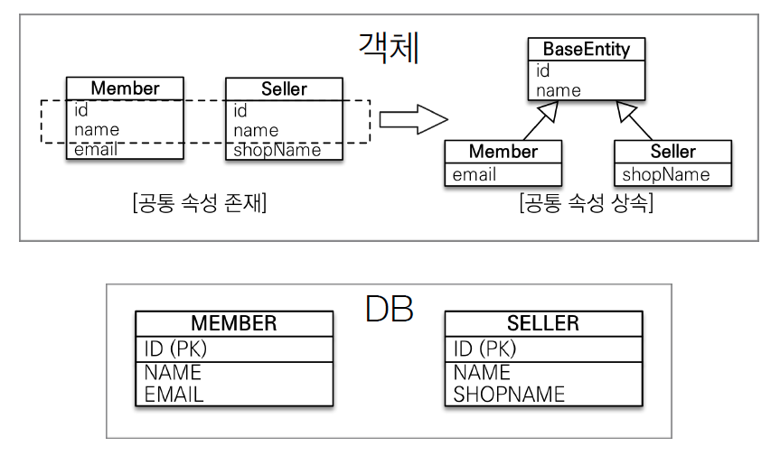

# 고급 매핑

## 목차

- 상속관계 매핑
- @MappedSuperclass
- 실전 예제 - 4. 상속관계 매핑

## 상속관계 매핑

- 관계형 데이터베이스는 상속 관계X
- 슈퍼 타입 서브타입 관계라는 모델링 기법이 객체 상속과 유사
- 상속관계 매핑: 객체의 상속과 구조와 DB의 슈퍼타입 서브타입 관계를 매핑


- 슈퍼타입 서브타입 논리 모델을 실제 물리 모델로 구현하는 방법
  - 각각 테이블로 변환 -> 조인 전략
  - 통합 테이블로 변환 -> 단일 테이블 전략
  - 서브타입 테이블로 변환 -> 구현 클래스마다 테이블 전략

관계형 데이터베이스 설계에는 논리모델과 물리 모델이 있는데, 위 그림에서 왼쪽이 **논리모델**로 DB의 슈퍼타입, 서브타입을 표현한거다. 이를 물리 모델로 바꾸기 위한 방법 3가지가 있다. (조인 전략, 단일 테이블 전략, 구현 클래스마다 테이블 전략)

## 주요 어노테이션

- @Inheritance(strategy=InheritanceType.XXX)
  - **JOINED**: 조인 전략
  - **SINGLE_TABLE**: 단일 테이블 전략
  - **TABLE_PER_CLASS**: 구현 클래스마다 테이블 전략
- @DiscriminatorColumn(name="DTYPE")
- @DiscriminatorValue("XXX")

## 조인 전략


- 장점
  - 테이블 정규화(중복되는 NAME, PRICE를 따로 관리)
  - 외래 키 참조 무결성 제약조건 활용가능
  - 저장공간 효율화
- 단점
  - 조회시 조인을 많이 사용, 성능 저하 (근데 조인도 잘 맞추면 성능 잘 나온다고 함)
  - 조회 쿼리가 복잡함
  - 데이터 저장시 INSERT SQL 2번 호출

ITEM에 @DiscriminatorColumn 애노테이션을 넣으면 DTYPE이 생기고, 이 DTYPE은 자식인 Album, Movie, Book 엔티티 이름이 들어가게 된다.

운영상황에서 select 했을 때, DTYPE이 딸려오는게 보기 좋음.

optional로 DTYPE 대신 name을 지정할 수도 있음.

만약 자식의 엔티티 이름이 아닌, 다른 이름을 넣고싶다면 자식 클래스에 @DiscriminatorValue("이름") 

이렇게 이름을 넣어서 정해줄 수도 있음.


## 단일 테이블 전략


- 장점
  - 조인이 필요 없으므로 일반적으로 조회 성능이 빠름
  - 조회 쿼리가 단순함
  - 조인을 하지 않아서 INSERT 쿼리도 한번만 하면 된다.
- 단점
  - 자식 엔티티가 매핑한 컬럼은 모두 null 허용
  - 단일 테이블에 모든 것을 저장하므로 테이블이 커질 수 잇다. 상황에 따라서 조회 성능이 오히려 느려질 수 있다.

단일 테이블 전략은 @DiscriminatorColumn 안붙여도 디폴트로 DTYPE을 생성함. 왜냐면 단일 테이블 전략을 사용하면 내가 앨범인지 책인지 영환지 알 수 없기 때문에 DTYPE이 반드시 필요하기 때문임.


지금 DB 설계를 바꿨지만, 코드단을 바꾼게 거의 없다. 어노테이션 전략만 바꾼거다. 이게 JPA의 큰 장점중 하나다.

조인 전략으로 테이블을 설계해서 코드를 구현하다가 성능이 도저히 안나와서 단일 테이블 전략으로 DB설계를 바꿨다고 치자. 이때 만약 JPA를 사용하지 않고 다른 걸 사용했다면 소스코드를 정말 많이 뜯어 고쳐야함.. 

## 구현 클래스마다 테이블 전략


이 전략은 단순히 값을 넣을 때는 좋은데, 조회할 때 문제가 생김.

```java
Movie movie = new Movie();
movie.setDirector("aaaa");
movie.setActor("bbbb");
movie.setName("바람과 함께 사라지다");
movie.setPrice(10000);

em.persist(movie);

em.flush();
em.clear();

Item item = em.find(Item.class, movie.getId());
System.out.println("findMovie = " + item);
```


union all로 다 뒤져 버림. 굉장히 비효율 적으로 동작함.


- **이 전략은 데이터베이스 설계자와 ORM 전문가 둘 다 추천X**
- 장점
  - 서브 타입을 명확하게 구분해서 처리할 때 효과적
  - not null 제약조건 사용 가능
- 단점
  - 여러 자식 테이블을 함께 조회할 때 성능이 느림(UNION SQL 필요)
  - 자식 테이블을 통합해서 쿼리하기 어려움


실무에서는 조인 전략은 기본으로 깔고, 진짜 단순한 경우, 데이터도 얼마 없는 경우, 복잡하게 에너지 들일 필요 없이 단일 테이블 전략을 쓴다.

근데 비즈니스 적으로 되게 중요하고 복잡하다면 조인 전략을 가져간다. (트레이드 오프가 있어서 문제에 따라 고민을 해봐야 한다.)


# @MappedSuperclass

- 공통 매핑 정보가 필요할 때 사용(id, name)



위에서 배운 상속관계 매핑처럼 테이블을 생각하는게아님. 객체를 만들때마다 공통 컬럼들이 계속 생기면 그거를 따로 빼서 상속하는 방법이다.

상속관계 매핑 이런게 전혀 아니고, 그냥 중복된 속성을 같이쓰기 위해 매핑 정보만 받는 부모 클래스라고 생각하면 된다.

보통 craetedBy, createdDate, lastModifiedBy, lastModifiedDate 컬럼을 BaseEntity로 사용한다.

그리고 JPA에서 Date에 대한 컬럼은 자동으로 값을 넣을 수 있음. (따로 set 할 필요 없음)

> 이런 BaseEntity 객체는 운영상 반드시 필요하다. 불변 테이블을 제외한 나머지 테이블에는 이 속성이 들어 있어야 누가 변경했고, 언제 수정했는지 정보가 남기 때문에 나중에 관리하기 편함

- 상속관계 매핑X
- 엔티티X, 테이블과 매핑X
- 부모 클래스를 상속 받는 **자식 클래스에 매핑 정보만 제공**
- 조회, 검색 불가(**em.find(BaseEntity) 불가**)
- 직접 생성해서 사용할 일이 없으므로 **추상 클래스 권장**
- 테이블과 관계 없고, 단순히 엔티티가 공통으로 사용하는 매핑 정보를 모으는 역할
- 주로 등록일, 수정일, 등록자, 수정자 같은 전체 엔티티에서 공통으로 적용하는 정보를 모을 때 사용
- 참고: @Entity 클래스는 엔티티나 @MappedSuperclass로 지정한 클래스만 상속 가능


# 실전 예제 - 4. 상속관계 매핑

## 요구사항 추가

- 상품의 종류는 음반, 도서, 영화가 있고 이후 더 확장될 수 있다.
- 모든 데이터는 등록일과 수정일이 필수다.

## 도메인 모델


## 도메인 모델 상세


## 테이블 설계


사실 사용자가 많지 않은 어플리케이션에서는 Item에 상속관계 매핑을 하는게 잘 동작한다. 근데 데이터가 억단위로 넘어가고 파티셔닝이 들어가기시작하면 복잡해진다. 하루에 백만건씩 쌓이면 고민거리가 확 늘어나고, 그래서 테이블을 단순하게 유지해야 한다.

그럴 경우에는 Album, Book, Movie를 JSON으로 말아 넣기도 함.