# 프록시와 연관관계 관리

## 목차

- 프록시
- 즉시 로딩과 지연 로딩
- 지연 로딩 활용
- 영속성 전이: CASCADE
- 고아 객체
- 영속성 전이 + 고아 객체, 생명주기
- 실전 예제 - 5.연관관계 관리

## 1. 프록시

### Member를 조회할 때 Team도 함께 조회해야 할까?


**회원과 팀 함께 출력**

```java
public void printUserAndTeam(String memberId) {
	Member member = em.find(Member.class, memberId);
	Team team = member.getTeam();
	System.out.println("회원 이름: " + member.getUsername());
	System.out.println("소속팀: " + team.getName());
}
```


**회원만 출력**

```java
public void printUser(String memberId) {
	Member member = em.find(Member.class, memberId);
	Team team = member.getTeam();
	System.out.println("회원 이름: " + member.getUsername());
}
```

우리가 하고 싶은 것은 찾아온 객체에 대한 유저와 팀에대한 정보를 출력하는 것이다. 근데 위의 상황에서 만약 유저를 find 하게 될때, 회원과 팀을 함께 출력한다면 데이터베이스에서 팀과 유저 테이블을 조인해서 가져와야 한다. 하지만 조인해서 가져왔는데, 실제로 우리가 회원만 출력하는 메소드만 사용한다면? 이는 굉장히 비효율 적이게 된다.

여기서 프록시의 개념이 등장함.

### 프록시 기초

- em.find() vs em.getReference()
- em.find() : 데이터베이스를 통해서 실제 엔티티 객체를 조회한다.
- em.getReference() : **데이터베이스 조회를 미루는 가짜(프록시)엔티티 객체를 조회한다.**

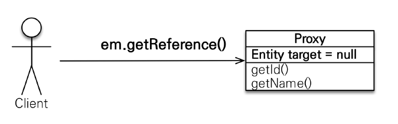

결과적으로 DB에 쿼리를 안날렸는데, 객체가 조회되는 거다.

위 그림에서 Proxy는 껍데기는 똑같지만, 내부가 텅텅 빈 것이다. 그리고 내부에 target이 있는데, 이게 진짜 레퍼런스를 가리킨다. (초기에는 null, 즉 없다.)

`프록시가 아닌 예제 코드`

```java
Member member = new Member();
member.setUsername("hello");

em.persist(member);

em.flush();
em.clear(); // 영속되어있는 상태들 모두 clear

Member findMember = em.find(Member.class, member.getId());
System.out.println("findMember.id = " + findMember.getId());
System.out.println("findMember.username = " + findMember.getUsername());
```

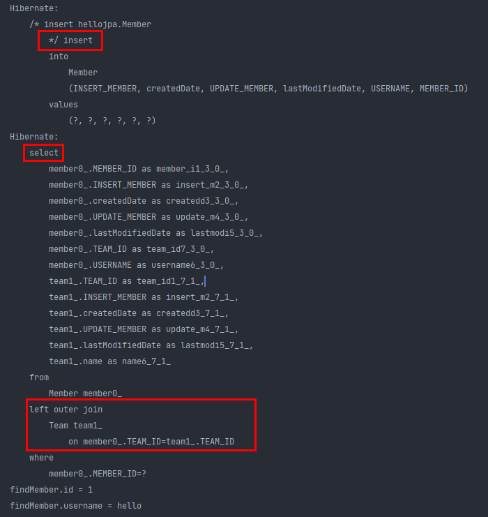

다음과 같은 예시 코드의 결과는 em.persist 할때 insert 쿼리가 나가고, em.find할때 select 쿼리가 나간다.

`프록시를 사용한 예제코드`

```java
Member member = new Member();
member.setUsername("hello");

em.persist(member);

em.flush();
em.clear(); 

Member findMember = em.getReference(Member.class, member.getId());
// System.out.println("findMember.id = " + findMember.getId());
// System.out.println("findMember.username = " + findMember.getUsername());
```

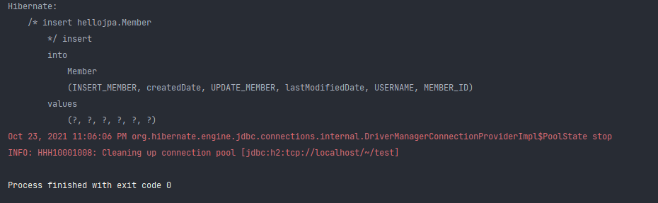

다음과 같이 getReference 라는 메소드를 쓰게되고, 맨아래 두줄의 콘솔출력을 잠시 주석처리했을때, 결과적으로는 insert 쿼리만 나가고, select 쿼리는 나가지 않는다.

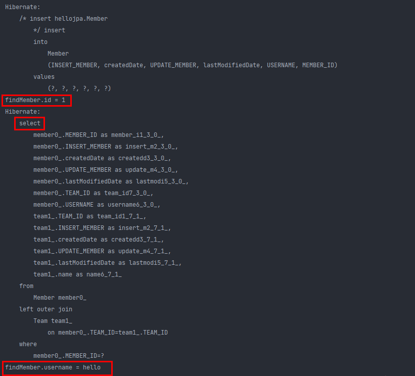

그러나 아래 콘솔출력 코드 2줄의 주석을 해제하고 다시 돌리면 그때는 select 쿼리가 나간다.

즉, getReference를 호출하는 시점에는 데이터베이스에 쿼리를 안함.

> findMember.getId() 할때는 select 쿼리 안나감. 왜냐면 이미 내가 member.getId()를 통해 값을 넣어줬기 때문이다. 그래서 결국 select 쿼리는 findMember.getUsername()이 호출될때 나간다. (username은 DB에 있는 값이기 때문) -> 결과적으로 em.getReference() 메소드를 실행하면 그 내부에서 Id값이 채워지고 나머지 값은 비어있다. 그저 껍데기인 가짜 엔티티 객체를 만들어오게 된다.


JPA는 findMember.getUsername()을 호출할때 DB에 쿼리를 날린다(SELECT). 그리고 findMember에 값을 채운다음, 출력을 해주게 된다.


여기서 `findMember에 값을 채운다`는 말을했는데, 사실 여기에 더 복잡한 메커니즘이 존재한다.

 ```java
 Member member = new Member();
 member.setUsername("hello");
 
 em.persist(member);
 
 em.flush();
 em.clear(); 
 
 Member findMember = em.getReference(Member.class, member.getId());
 System.out.println("findMember = " + findMember.getClass());
 System.out.println("findMember.id = " + findMember.getId());
 System.out.println("findMember.username = " + findMember.getUsername());
 ```

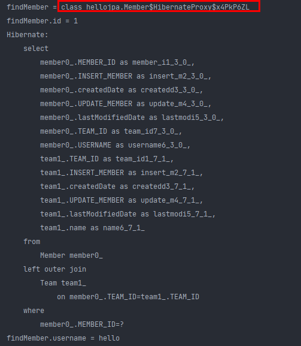

HibernateProxy는 하이버네이트가 만들어낸 가짜 객체를 의미한다.


### 프록시 특징

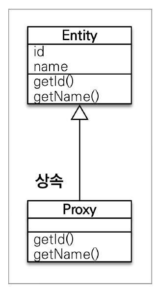

- 실제 클래스를 상속 받아서 만들어 진다.
- 실제 클래스와 겉 모양이 같다.
- 사용하는 입장에서는 진짜 객체인지 프록시 객체인지 구분하지 않고 사용하면 된다.(이론상으로는.. 근데 몇가지 조심해야될게 있음 -> 뒤에서 설명)
- 프록시 객체는 실제 객체의 참조(target)를 보관한다.
- 프록시 객체를 호출하면 프록시 객체는 실제 객체의 메소드를 호출한다.

### 프록시 객체의 초기화

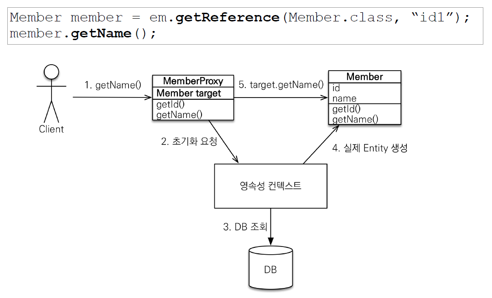

처음에 getName을 호출하면 target에 값이 없어서 JPA가 영속성컨텍스트에 진짜 멤버 객체를 가져오라고 호출한다. 

그럼 영속성 컨텍스트는 DB를 조회해서 실제 Entity 객체를 생성한다. 그리고 target과 이 Entity를 연결해 준다.

그래서 결과적으로 target.getName()을 통해서 Member Entity의 getName이 반환되게 된다.

```java
Member member = new Member();
member.setUsername("hello");

em.persist(member);

em.flush();
em.clear();

Member findMember = em.getReference(Member.class, member.getId());
System.out.println("findMember.username = " + findMember.getUsername());
System.out.println("findMember.username = " + findMember.getUsername());
```

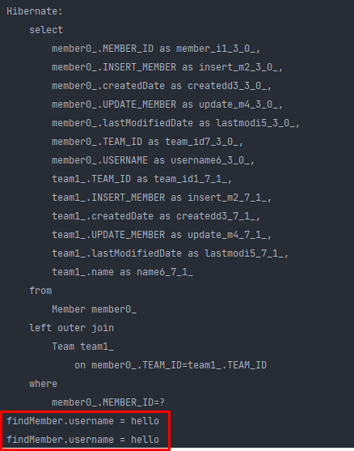

그래서 2번째로 getUsername을 호출하면 이제 target에 레퍼런스가 있기 때문에 select를 하지 않는다.

### 프록시의 특징

- 프록시 객체는 처음 사용할 때 한번만 초기화한다.
- 프록시 객체를 초기화 할 때, **프록시 객체가 실제 엔티티로 바뀌는 것은 아님**. 초기화되면 프록시 객체를 통해서 실제 엔티티에 접근 가능하다.

```java
Member member = new Member();
member.setUsername("hello");

em.persist(member);

em.flush();
em.clear();

Member findMember = em.getReference(Member.class, member.getId());
System.out.println("bfore findMember = " + findMember.getClass());
System.out.println("findMember.username = " + findMember.getUsername());
System.out.println("after findMember = " + findMember.getClass());
```

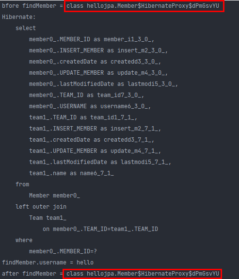

초기화 전과 초기화 후 모두 프록시 객체가 조회되는 것을 확인할 수 있다.

- 프록시 객체는 원본 엔티티를 상속받는다. 따라서 타입 체크시 주의해야 함(== 비교 실패할 수 있음, 따라서 instance of 사용하자)

```java
Member member1 = new Member();
member1.setUsername("hello");
em.persist(member1);

Member member2 = new Member();
member2.setUsername("hello");
em.persist(member2);

em.flush();
em.clear();
Member m1 = em.find(Member.class, member1.getId());
//Member m2 = em.find(Member.class, member2.getId());
Member m2 = em.getReference(Member.class, member2.getId());

System.out.println(m1.getClass());
System.out.println("m1 == m2: " + (m1.getClass() == m2.getClass()));
```

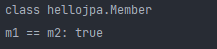

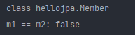

m1과 m2 의 getClass를 비교하면 find를 했을때는 당연히 true가 나오지만, getReference로 가져오게되면 프록시 객체를 가져오므로 false가 나온다. 

```java
Member member1 = new Member();
member1.setUsername("hello");
em.persist(member1);

Member member2 = new Member();
member2.setUsername("hello");
em.persist(member2);

em.flush();
em.clear(); // 영속되어있는 상태들 모두 clear

Member m1 = em.find(Member.class, member1.getId());
Member m2 = em.getReference(Member.class, member2.getId());

System.out.println(m1.getClass());
System.out.println("m1 == m2: " + (m1 instanceof Member));
System.out.println("m1 == m2: " + (m2 instanceof Member));
```

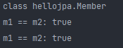

이렇게 타입에 대해서 instanceof를 사용해야 true가 나온다.

- 영속성 컨텍스트에 찾는 엔티티가 이미 있으면 **em.getReference()**를 호출해도 실제 엔티티를 반환한다.

```java
Member member1 = new Member();
member1.setUsername("hello");
em.persist(member1);

em.flush();
em.clear();

Member findMember = em.find(Member.class, member1.getId());
System.out.println("findMember = " + findMember.getClass());
Member refMember = em.getReference(Member.class, member1.getId());
System.out.println("refMember = " + refMember.getClass());

System.out.println("refMember = findMember: " + (refMember == findMember));
```

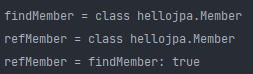

결과를 보면 reference로 Member로 나온다.

왜 Member일까? 2가지 이유가 있다.

1. 이미 Member를 영속성 컨텍스트의 1차 캐시위에 올라와있는데, 그걸 굳이 프록시로 가져와 봐야 아무 이점이 없다. (성능 최적화의 관점)
2. JPA에서는 프록시이든 엔티티이든, 마치 자바컬렉션에서 == 비교하듯이, 하나의 영속성 컨텍스트에서 pk가 같은 얘에 대한 조회를 하면 그것에 대한 == 비교를 하면 JPA는 항상 true를 반환해 준다.<br>JPA는 reapeatable read 에서도 그랬듯이, 하나의 트랜잭션에서 같은 것에 대해 보장해 준다.


근데 위 예제코드의 반대를 생각해 보면?

```java
Member member1 = new Member();
member1.setUsername("hello");
em.persist(member1);

em.flush();
em.clear();

Member refMember = em.getReference(Member.class, member1.getId());
System.out.println("refMember = " + refMember.getClass());
Member findMember = em.find(Member.class, member1.getId());
System.out.println("findMember = " + findMember.getClass());

System.out.println("refMember = findMember: " + (refMember == findMember));
```

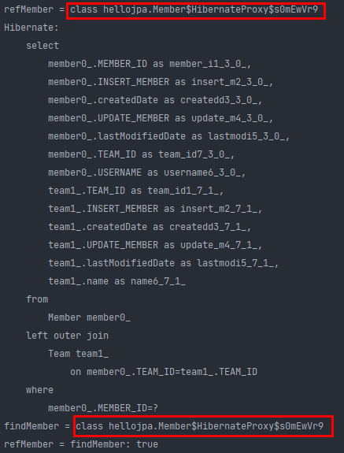

find로 했는데도 proxy 객체가 반환된다. 왜냐면 처음에 getReference로 조회하고 난뒤에 find를 했고, refMember와 findMember 를 == 비교하면 true가 나와야 하기 때문이다. (JPA의 기본 메커니즘)

`핵심`은 개발할 때, 프록시든, 실제 엔티티든, 개발에 큰 문제가 없게 하는게 제일 중요한 거다.

> 실무에서는 이렇게 복잡하진 않다.

- 영속성 컨텍스트의 도움을 받을 수 없는 준영속 상태일 때, 프록시를 초기화하면 문제 발생 (하이버네이트는 org.hibernate.LazyInitializationException 예외를 터트림) -> 실무에서 진짜 많이 만나게 된다.

```java
Member member1 = new Member();
member1.setUsername("hello");
em.persist(member1);

em.flush();
em.clear();

Member refMember = em.getReference(Member.class, member1.getId());
System.out.println("refMember = " + refMember.getClass());

em.detach(refMember); // 준영속

System.out.println("refMember = " + refMember.getUsername());
```

refMember를 프록시로 등록했는데, detach를 하고 getUsername을 호출한다면?

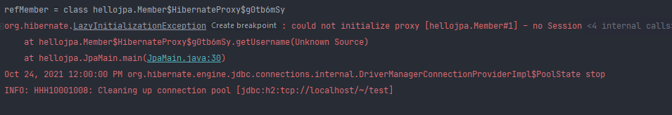

첫번째 콘솔 프린트는 찍히는데, detach 아래의 콘솔은 찍히지 않고, Exception이 발생하게 된다.

즉, 준영속 상태가 되면 프록시 초기화를 할때 영속성 컨텍스트의 도움을 받을 수 없기 때문에 초기화 예외가 발생하게 된다.

마찬가지로 em.clear()를 하면 똑같은 초기화 예외를 발생시키게 된다.

> em.close()를 해도 예외가 발생해야 되는데, Hibernate 5.4.0 final 버전부터 예외 여부 체크 메소드가 변경됨 그래서 예외가 발생하지 않고 세션이 종료되더라도 트랜잭션이 살아있어서 Lazy Loading으로 잘 동작함.
>
> https://www.inflearn.com/questions/53733 참고
>
> em.clear()는 영속성 컨텍스트가 깨끗하게 지워지기 때문에 예외처리 그대로 발생함.

실무에서 보통 트랜잭션이 끝나고 프록시를 조회하게 되는데, 그때 no session 뜨면서 예외가 발생하게 됨.

### 프록시 확인하는 방법

- **프록시 인스턴스의 초기화 여부 확인**<br>PersistenceUnitUtil.isLoaded(Object entity)

```java
Member member1 = new Member();
member1.setUsername("hello");
em.persist(member1);

em.flush();
em.clear();

Member refMember = em.getReference(Member.class, member1.getId());
System.out.println("refMember = " + refMember.getClass());
System.out.println("isLoaded = " + emf.getPersistenceUnitUtil().isLoaded(refMember));
refMember.getUsername();
System.out.println("isLoaded = " + emf.getPersistenceUnitUtil().isLoaded(refMember));
```

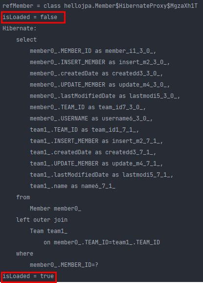

초기화 전과 후 false, true로 확인할 수 있다!

- **프록시 클래스 확인 방법**<br>entity.getClass().getName() 출력(..javasist.. or HibernateProxy..)
- **프록시 강제 초기화**<br>org.hibernate.Hibernate.initialize(entity);

지금까지는 refMember.getUsername()을 호출하여 강제 초기화했는데, 초기화의 목적이 아닌 메소드이므로 애매하다. 그래서 하이버네이트에서는 initialize라는 초기화 메소드를 제공해 준다.

```java
Member member1 = new Member();
member1.setUsername("hello");
em.persist(member1);

em.flush();
em.clear();

Member refMember = em.getReference(Member.class, member1.getId());
System.out.println("refMember = " + refMember.getClass());
Hibernate.initialize(refMember); // 강제 초기화
```

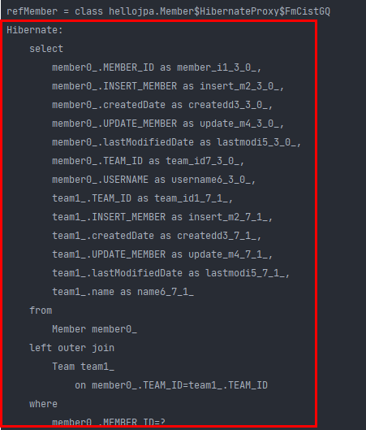

강제 초기화 되어 select 쿼리가 나간다! (얘는 hibernate가 강제 초기화하는 메소드를 제공해 주는거임)

- 참고 : JPA 표준은 강제 초기화 없음<br>강제 호출: **member.getName()**

## 즉시 로딩과 지연 로딩

### Member를 조회할 때 Team도 함께 조회해야 할까?

단순히 member 정보만 사용하는 비즈니스 로직 -> println(member.getName());

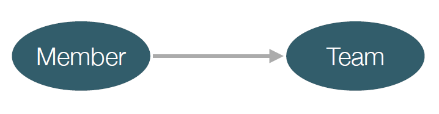

### 지연 로딩 LAZY를 사용해서 프록시로 조회

```JAVA
@Entity
public class Member {
    @Id
    @GeneratedValue
    private Long id;
    @Column(name = "USERNAME")
    private String name;
    @ManyToOne(fetch = FetchType.LAZY) //**
    @JoinColumn(name = "TEAM_ID")
    private Team team;
    ....
}
```

```java
Team team = new Team();
team.setName("teamA");
em.persist(team);

Member member1 = new Member();
member1.setUsername("hello");
member1.setTeam(team);
em.persist(member1);

em.flush();
em.clear();

Member m = em.find(Member.class, member1.getId());
System.out.println("m = " + m.getTeam().getClass());
```

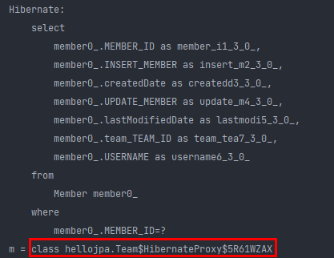

Team이 프록시로 나온다.

```java
Team team = new Team();
team.setName("teamA");
em.persist(team);

Member member1 = new Member();
member1.setUsername("hello");
member1.setTeam(team);
em.persist(member1);

em.flush();
em.clear();

Member m = em.find(Member.class, member1.getId());
System.out.println("m = " + m.getTeam().getClass());

System.out.println("===============");
m.getTeam().getName();
System.out.println("===============");
```

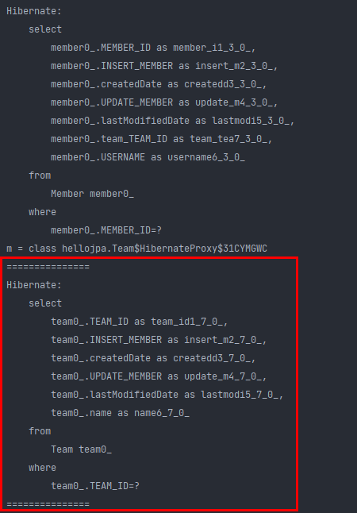

그래서 m.getTeam().getName() 하는 시점에 쿼리가 나가게 된다.

이렇게 지연로딩을 하면, 연관된걸 `프록시`로 가져오게 된다.

근데 비즈니스 로직상 만약 멤버와 팀의 정보를 반드시 함께 사용한다면, 위 의 경우는 select 쿼리가 2번나가서 성능적으로 안좋다.

### 지연 로딩

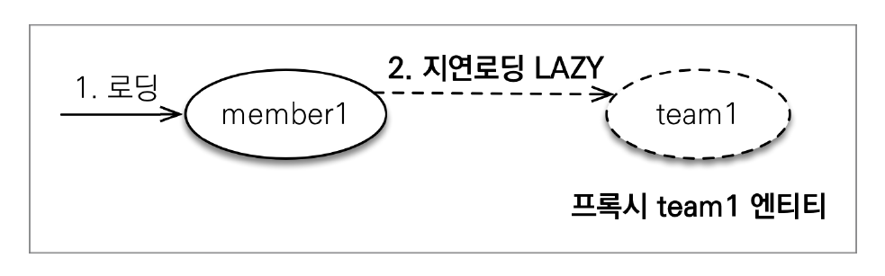

### 지연 로딩 LAZY를 이용해서 프록시로 조회

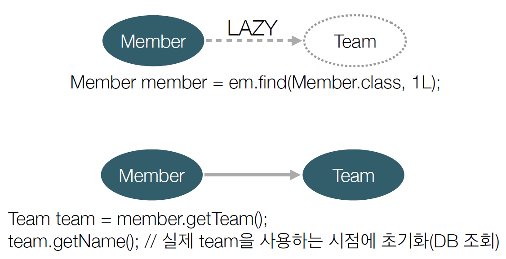


### Member와 Team을 자주 함께 사용한다면?

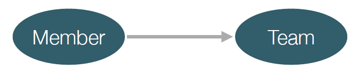

### 즉시 로딩 EAGER를 사용해서 함께 조회한다.

```JAVA
@Entity
public class Member {
    @Id
    @GeneratedValue
    private Long id;
    @Column(name = "USERNAME")
    private String name;
    @ManyToOne(fetch = FetchType.EAGER) //**
    @JoinColumn(name = "TEAM_ID")
    private Team team;
    ....
}
```

```java
Team team = new Team();
team.setName("teamA");
em.persist(team);

Member member1 = new Member();
member1.setUsername("hello");
member1.setTeam(team);
em.persist(member1);

em.flush();
em.clear();

Member m = em.find(Member.class, member1.getId());
System.out.println("m = " + m.getTeam().getClass());

System.out.println("===============");
m.getTeam().getName();
System.out.println("===============");
```

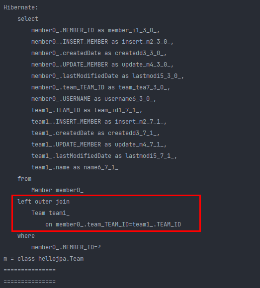

EAGER로 하면, 애초에 find할때, 멤버와 팀 테이블을 조인하여 가져온다. (한방 쿼리로 쫙 땡겨온다. -> 즉시 로딩)

그래서 m도 프록시가 아니라 실제 엔티티가 나오게 된다.

> 사실 하이버네이트에서 즉시로딩 일때 한방 쿼리로 조인해서 가져오게끔 구현되어있다. 근데 구현하는 사람에 따라 성능이 안좋더라도, 팀, 멤버에 대해 각각의 select 쿼리 2개를 날리게끔 구현할 수 도 있다.

### 즉시 로딩

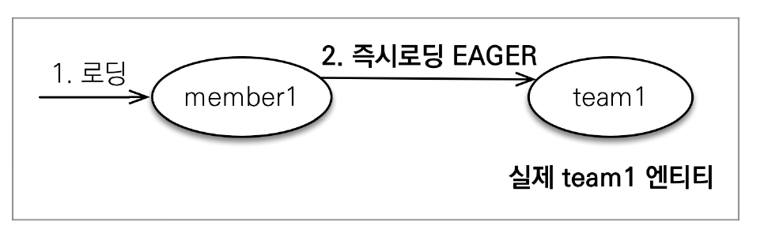

어플리케이션 개발하는데, 90% 이상이 member를 쓸때 무조건 team도 같이 쓴다고 하면 즉시 로딩을 쓰는게 유리하다.


### 즉시 로딩(EAGER), Member조회 시 항상 Team도 조회

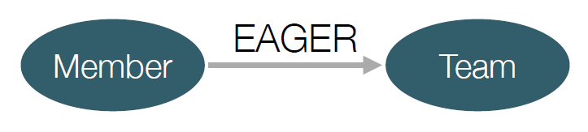

JPA 구현체는 가능하면 조인을 사용해서 SQL 한번에 함께 조회

### 프록시와 즉시로딩 주의

- **가급적 지연 로딩만 사용(특히 실무에서)**
- 즉시 로딩을 적용하면 예상하지 못한 SQL이 발생한다.

데이터베이스 입장에서 JOIN이 한두개면 그렇게 크게 느리지 않다. 근데 테이블이 10개고 전부 묶여있다면? find할때 10개가 다 join된다.

그래서 실무에서 테이블이 복잡하게 얽혀있는 상황에서는 (조그만 프로젝트, 테이블 한두개면 EAGER로 해도 크게 뭐 성능적인 이슈도 없겠지만..)

- **즉시 로딩은 JPQL에서 N+1문제를 일으킨다.**

```java
Team team = new Team();
team.setName("teamA");
em.persist(team);

Member member1 = new Member();
member1.setUsername("hello");
member1.setTeam(team);
em.persist(member1);

em.flush();
em.clear();

List<Member> members = em.createQuery("select m from Member m", Member.class).getResultList(); // JPQL 이용
```

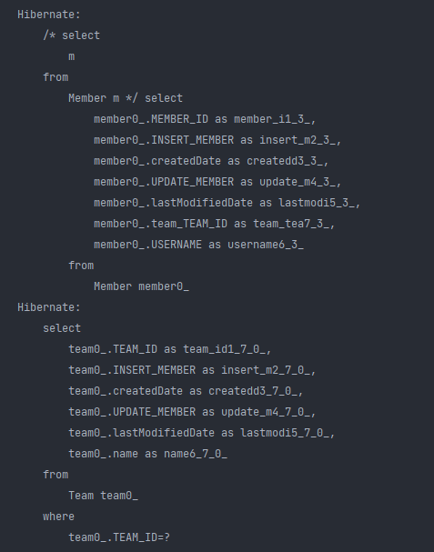

분명히 EAGER로 했는데, SELECT 쿼리가 2개가 나간다.

em.find는 pk로 가져오는 거기 때문에 JPA가 내부적으로 찾아서 할 수 있다. 

근데 JPQL은 `select m from Member m`이게 우선 SQL로 번역이 된다. SQL로 번역을 하면, 당연히 Member만을 select 하는게 된다. (SQL : select * from MEMBER) 그래서 Member 데이터를 쭉 db에서 가져오는데, Member를 가지고 와봤더니 Team이 즉시로딩으로 되어있네? 즉시로딩이면 값이 무조건 다 들어가있어야 된다. 그래서 Member를 가져오고, 예를들어 멤버 갯수가 10개면, 그 10개만큼의 team을 가져오기 위해 team 테이블에 10번의 쿼리를 별도로 날리게 된다. (SQL : select * from TEAM where TEAM_ID = xxx)

```java
Team teamA = new Team();
teamA.setName("teamA");
em.persist(teamA);

Team teamB = new Team();
teamB.setName("teamB");
em.persist(teamB);

Member member1 = new Member();
member1.setUsername("hello");
member1.setTeam(teamA);
em.persist(member1);

Member member2 = new Member();
member2.setUsername("hello");
member2.setTeam(teamB);
em.persist(member2);

em.flush();
em.clear();

List<Member> members = em.createQuery("select m from Member m", Member.class).getResultList();
```

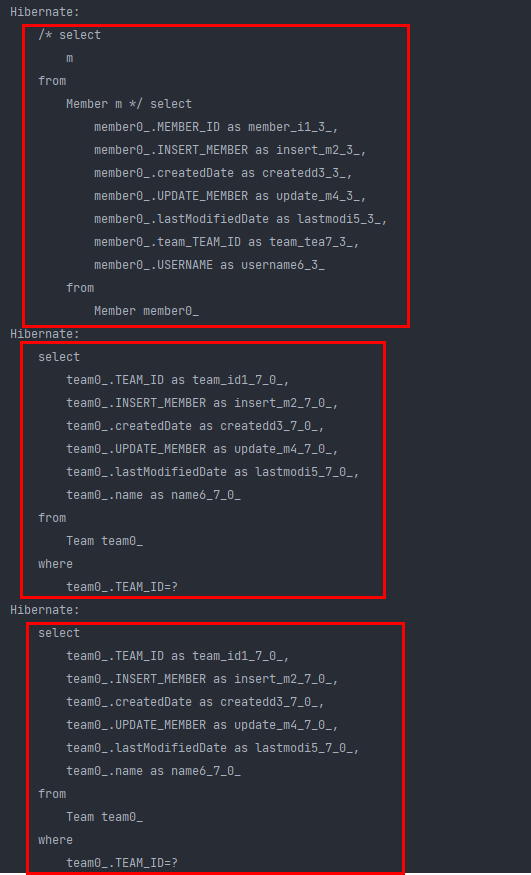

이번에는 멤버 2개를 만들어서 팀 2개를 연관관계를 맺은상황이다. 이때 JPQL로 멤버를 조회하면, 우선 Member는 한번에 쭉 다 가져온다. 2개의 멤버를 가져오게 되고, 그 2개의 멤버는 각각 다른 팀을 가지고 있다.

그리고 영속성 컨텍스트에도 팀이 없기 때문에, 각각 팀을 따로 select 해온다. 위 select는 teamA가 나올거고, 아래 select는 teamB가 나오게 된다. 이게 바로 N+1 문제다.

N+1 문제가 뭐냐면, 1은 최초 쿼리 1개를 날렸는데, (지금같은 경우 select * from MEMBER) 이거 때문에 추가 쿼리가 N개 나간다는 의미다. (지금 같은 경우는 select * from TEAM where TEAM_ID = 1, select * from TEAM where TEAM_ID = 2)

근데 이걸 LAZY로 바꾸게 되면

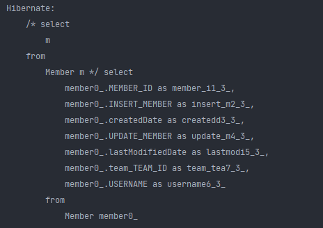

Member select 쿼리만 나간다. 왜냐면 Team은 지금 안쓰기 때문이다. 

물론 여기서 다시 team을 쓴다면 쿼리가 계속 나가게 된다.

아무튼 이 N+1문제를 해결하기 위해서 일단, 모든 연관관계를 지연로딩으로 바꾼다.

그리고 3가지 방법이 있다.

1. fetch join을 사용한다. (런타임에 동적으로 내가 원하는 얘들을 선택해서 한번에 가져올 수 있다.) 그래서 멤버만 가져올 때는, 그냥 이렇게 멤버만 select 하면되고, 멤버랑 팀을 둘다 가져오고 싶으면 fetch join을 이용하여 한방쿼리로 값을 가져오게 할 수 있다.

```java
Team teamA = new Team();
teamA.setName("teamA");
em.persist(teamA);

Team teamB = new Team();
teamB.setName("teamB");
em.persist(teamB);

Member member1 = new Member();
member1.setUsername("hello");
member1.setTeam(teamA);
em.persist(member1);

Member member2 = new Member();
member2.setUsername("hello");
member2.setTeam(teamB);
em.persist(member2);

em.flush();
em.clear();

List<Member> members = em.createQuery("select m from Member m join fetch m.team", Member.class).getResultList();
```

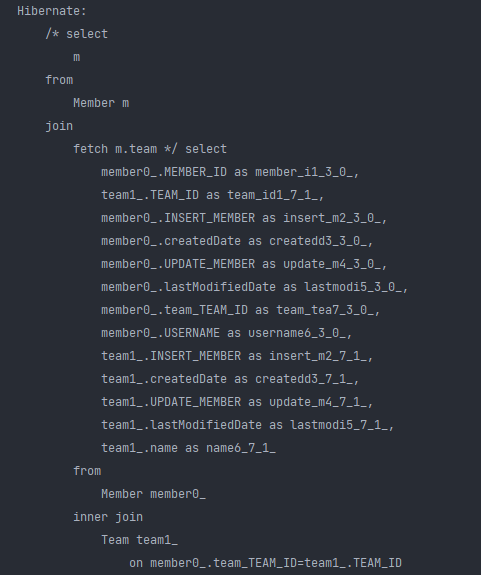

LAZY 이지만 fetch join을 이용해서 한방 쿼리로 가져와서 N+1 문제를 해결할 수 있다.

한방쿼리로 값이 다 채워져있기 때문에 루프를 돌며 값을 계속 찾아와도 더이상 쿼리가 날아가지 않는다.

2. 다른 방법으로 엔티티 그래프, 어노테이션으로 푸는 방법, 배치사이즈로 푸는 방법(얘는 쿼리가 하나 더나가긴함 : 1+1) 등이 있음(뒤에서 설명)

- **@ManyToOne, @OneToOne은 기본이 즉시 로딩 -> LAZY로 설정**

- @OneToMany, @ManyToMany는 기본이 지연로딩

## 지연 로딩 활용

- **Member**와 **Team**은 자주 함께 사용 -> **즉시 로딩**
- **Member**와 **Order**는 가끔 사용 -> **지연 로딩**
- **Order**와 **Product**는 자주 함께 사용 -> **즉시 로딩**

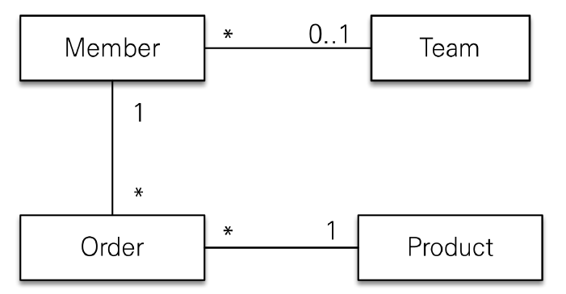

이거는 이론적인거고 실무에서는 이렇게 하면안됨! 무조건 지연 로딩으로 다 박아야 한다!!

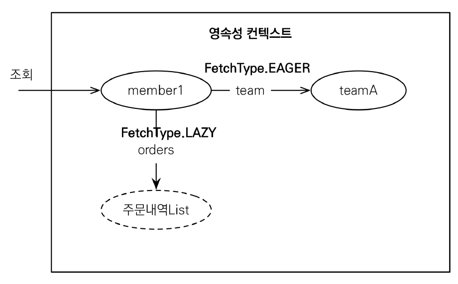

이경우는 멤버를 select 해올때 team도 eager로 한방 쿼리로 가져온다. 그리고 주문에 대한 것은 프록시로 가져오게 된다.

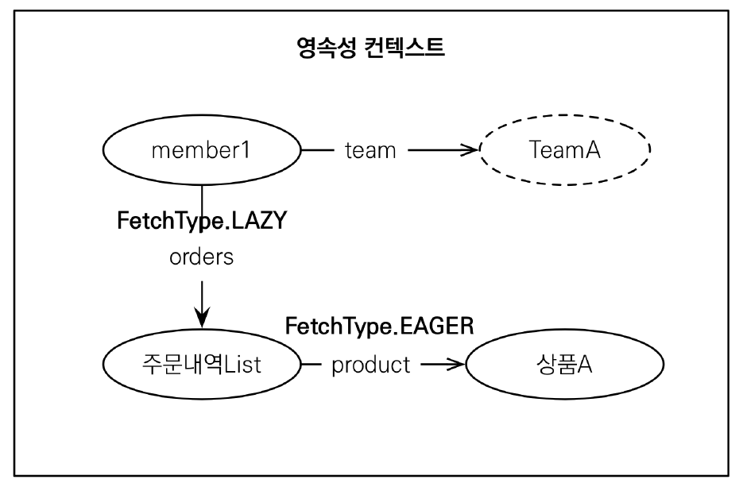

그러다가 주문에 대한 내용을 조회하게 되면 주문 프록시는 실제 주문을 레퍼런스로 갖게 되며 동시에 상품이 eager이므로 한방쿼리로 가져오게 된다.

## 지연 로딩 활용 - 실무

- **모든 연관관계에 지연 로딩을 사용해라!**
- **실무에서 즉시 로딩을 사용하지 마라!**
- **JPQL fetch 조인이나, 엔티티 그래프 기능을 사용해라! (뒤에서 설명)**
- **즉시 로딩은 상상하지 못한 쿼리가 나간다.**


# 영속성 전이 : CASCADE

- 특정 엔티티를 영속 상태로 만들 때 연관된 엔티티도 함께 영속 상태로 만들고 싶을때
- 예 : 부모 엔티티를 저장할 때 자식 엔티티도 함께 저장한다.

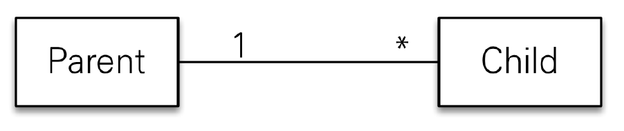

영속성 전이에 대한 내용은 앞에서 배운 즉시로딩, 지연로딩, 연관관계와 전혀 상관없는 내용이다.

영속성 전이에 대한 내용은 부모를 저장할때 자식도 같이 저장하고 싶다는 내용이므로, 연관관계와 관련이있나? 라고 충분히 생각할 수 있다. 근데 이 영속성 전이는 그런거랑 전혀 관계가 없다. 영속성 전이는 예를들어 부모를 저장할때 연관된 자식들도 함께 다 persist를 하고 싶을때 쓰는거다.

```java
@Entity
public class Parent {

    @Id
    @GeneratedValue
    private Long id;

    private String name;

    @OneToMany(mappedBy = "parent")
    private List<Child> childList = new ArrayList<>();

    public void addChild(Child child) {
        childList.add(child);
        child.setParent(this);
    }
}
```

```java
@Entity
public class Child {
    @Id
    @GeneratedValue
    private Long id;

    private String name;

    @ManyToOne
    @JoinColumn(name = "parent_id")
    private Parent parent;
}
```

```java
Child child1 = new Child();
Child child2 = new Child();

Parent parent = new Parent();
parent.addChild(child1);
parent.addChild(child2);

em.persist(parent);
em.persist(child1);
em.persist(child2);
```

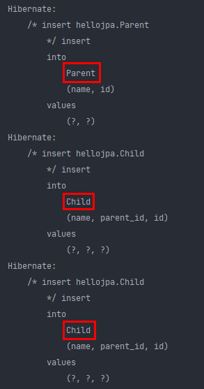

persist를 3번해서 insert 쿼리가 3번 나가는 것을 확인할 수 있다.

근데 이렇게 하면 귀찮다.. 내가 parent 중심으로 코드를 작성하고 있는데, child는 알아서 됬으면 좋겠다. 

즉, parent를 persist 하면 알아서 child 들이 persist 됬으면 좋겠는 상황이다.

```java
Child child1 = new Child();
Child child2 = new Child();

Parent parent = new Parent();
parent.addChild(child1);
parent.addChild(child2);

em.persist(parent);
```

그렇다고 parent만 persist하면 parent만 insert 쿼리가 나간다. 이때 쓰는게 바로 영속성 전이다.

```java
@OneToMany(mappedBy = "parent", cascade = CascadeType.ALL)
private List<Child> childList = new ArrayList<>();
```

`cascade = CascadeType.ALL` 이거만 추가하고 다시 em.persist(parent); 하나만 해서 돌려보면

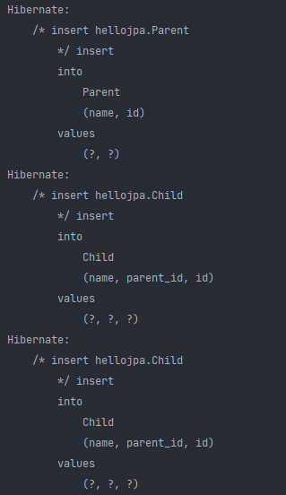

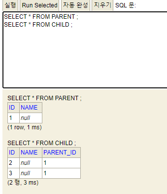

child 둘다 persist 되서 db에 잘 들어간다.

영속성 전이는 연관관계랑 관계없이 parent를 persist할때, cascade 선언이 되어있는 얘들 (지금은 Collection 안에 있는 얘들 -> childList들) 을 모두 다 persist 해준다는 의미다. (한마디로 `연쇄` 이다.)

### 영속성 전이 : 저장

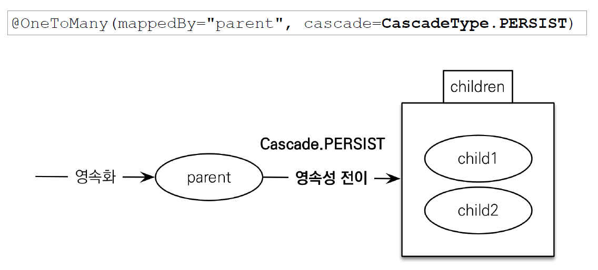

### 영속성 전이 : CASCADE - 주의!

- 영속성 전이는 연관관계를 매핑하는 것과 아무 관련이 없음
- 엔티티를 영속화할 때 연관된 엔티티도 함께 영속화하는 편리함을 제공할 뿐이다. (그 이상, 그 이하도 아님)

### CASCADE의 종류

- **ALL: 모두 적용**
- **PERSIST: 영속**
- **REMOVE: 삭제**
- MERGE: 병합
- REFRESH: REFRESH
- DETACH: DETACH

영속성 전이는 편리하므로 실무에서 많이 쓴다!

주의 해야 할점은 언제 쓰느냐인데, 일대다에 다 거는거는 아니다.

정말로 하나의 부모가 여러 자식들을 관리할 때는 영속성 전이가 의미가 있다.

예를들면 게시판, 첨부파일의 데이터(경로) 인 경우에는 쓸 수 있다. 왜냐면 첨부파일의 경로는 한 게시판(게시물)에서 관리하기 때문이다.

또, 쓰면 안되는 케이스가 있는데, 파일을 여러군데서 관리하고 다른 엔티티를 관리하는 상황이면 쓰면 안된다.

뭐 위의 예시에서 Parent만 child를 관리할 때는 써도되는데 다른얘가 child랑 연관관계가 있다면 쓰면 안된다. (child가 다른 얘를 아는건 상관이없는데, 다른얘가 child를 알면 문제가 생김 -> 운영이 너무 힘들어짐)

이거를 보통 `소유자가 하나 일때` 라고 표현하는데 이때는 영속성 전이를 써도 된다.

단일 엔티티에 완전히 종속적일때 이거를 사용해도 무방하다. (Life Cycle이 보통 똑같기 때문)

정리

1. Life Cycle이 똑같을 때, (Parent와 Child의 라이프 사이클이 거의 유사할 때 -> ex : 등록하거나 삭제 할때)
2. 단일 소유자일 때 (Parent 엔티티`만` Child를 소유할 때) -> 다른데서 막 연관관계가 있는데 영속성 전이가 되면 Child가 예상치 못하게 영속성 전이가 일어나 버림..

# 고아 객체

- 고아 객체 제거: 부모 엔티티와 연관관계가 끊어진 자식 엔티티를 자동으로 삭제
- orphanRemoval = true
- Parent parent1 = em.find(Parent.class, id);<br>parent1.getChildren().remove(0);<br>//자식 엔티티를 컬렉션에서 제거
- remove 하면 DELETE FROM CHILD WHERE ID =? 쿼리가 나간다.

```java
@OneToMany(mappedBy = "parent", cascade = CascadeType.ALL, orphanRemoval = true)
private List<Child> childList = new ArrayList<>();
```

```java
Child child1 = new Child();
Child child2 = new Child();

Parent parent = new Parent();
parent.addChild(child1);
parent.addChild(child2);

em.persist(parent);

em.flush();
em.clear();

Parent findParent = em.find(Parent.class, parent.getId());
findParent.getChildList().remove(0);
```

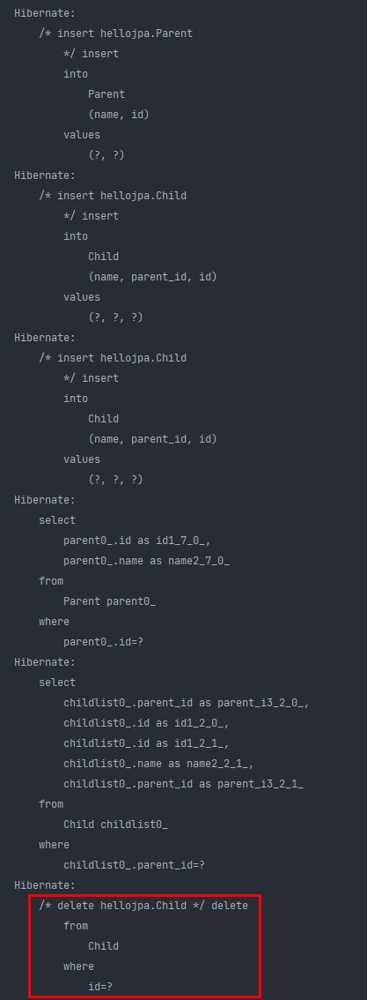

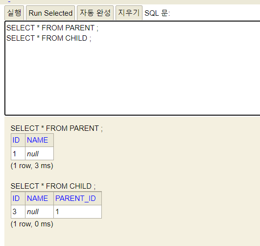

ID 2번이 지워져있다. (remove(0)을 했으니 2가 지워진다.)

orphanRemoval이 true일 경우 이렇게 컬렉션에서 지워주면 delete 쿼리가 나가게 된다.

### 고아 객체 - 주의

- 참조가 제거된 엔티티는 다른 곳에서 참조하지 않는 고아 객체로 보고 삭제하는 기능이다.
- **참조하는 곳이 하나일 때 사용해야 한다!**
- **특정 엔티티가 개인 소유할 때 사용해야 한다.**
- @OneToOne, @OneToMany만 사용 가능하다.
- 참고 : 개념적으로 부모를 제거하면 자식은 고아가 된다. 따라서 고아 객체 제거 기능을 활성화 하면, 부모를 제거할 때 자식도 함께 제거된다. 이것은 CascadeType.REMOVE처럼 동작한다.

(CascadeType.REMOVE처럼 동작한다는 말은 orphanRemoval이 false여도 영속성 전이에 의해 부모가 관리하는 자식들도 삭제된다는 말임)

아래 코드는 Cascade.ALL 을 지우고 orphanRemoval만 true로 하였다.

```java
Child child1 = new Child();
Child child2 = new Child();

Parent parent = new Parent();
parent.addChild(child1);
parent.addChild(child2);

em.persist(parent);

em.flush();
em.clear();

Parent findParent = em.find(Parent.class, parent.getId());
em.remove(findParent);
```

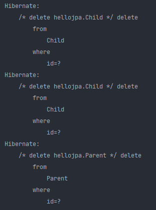

Cascade타입과 상관없이 orphanRemoval이 true면 부모가 제거되면 그 자식들도 모두 제거된다.

### 영속성 전이 + 고아 객체, 생명 주기

- **CascadeType.ALL + orphanRemoval = true**
- 스스로 생명주기를 관리하는 엔티티는 em.persist()로 영속화, em.remove()로 제거한다.
- 두 옵션을 모두 활성화 하면 부모 엔티티를 통해서 자식의 생명 주기를 관리할 수 있다.
- 도메인 주도 설계 (DDD)의 Aggregate Root 개념을 구현할 때 유용하다.

parent는 JPA를 통해 생명주기를 관리하고 있음. 근데 child의 생명주기는 바로 parent가 관리한다. 이런 설계는 바로 DDD에 유용함.

> Aggregate Root는 Repository만 contact 하고 나머지는 Repository를 만들지 않는게 더 낫다. (항상 만들지 않는다.) Aggregate Root와 관련된 하위얘들은 따로 Repository를 만들지 않고 Aggregate Root를 통해 생명 주기를 관리한다고 함.

위 예로 따지면 Parent가 Aggregate Root고 Child가 그 하위이다.

# 실전 예제 - 5. 연관관계 관리

### 글로벌 페치 전략 설정

- 모든 연관관계를 지연 로딩으로
- @ManyToOne, @OneToOne은 기본이 즉시 로딩이므로 지연로딩으로 변경

### 영속성 전이 설정

- **Order -> Delivery**를 영속성 전이 ALL 설정
- **Order -> OrderItem**을 영속성 전이 ALL 설정
