# 값 타입

## 목차

- 기본값 타입
- 임베디드 타입(복합 값 타입)
- 값 타입과 불변 객체
- 값 타입의 비교
- 값 타입 컬렉션
- 실전 예제 - 6. 값 타입 매핑

## 기본값 타입

### JPA의 데이터 타입 분류

JPA는 데이터 타입을 최상위 레벨로 2가지로 본다.

- **엔티티 타입**
  - @Entity로 정의하는 객체
  - 데이터가 변해도 식별자로 지속해서 **추적 가능**
  - 예) 회원 엔티티의 키나 나이 값을 변경해도 식별자로 인식 가능 (내부 데이터가 바뀌어도 추적 가능함)
- **값 타입**
  - int, Integer, String처럼 단순히 값으로 사용하는 자바 기본 타입이나 객체
  - 식별자가 없고 값만 있으므로 변경시 추적 불가
  - 예) 숫자 100을 200으로 변경하면 완전히 다른 값으로 대체

### 값 타입 분류

- **기본값 타입**
  - 자바 기본 타입(int, double)
  - 래퍼 클래스(Integer, Long)
  - String
- **임베디드 타입**(embedded type, 복합 값 타입) : ex) x,y 좌표로 position 클래스를 값처럼 사용하고 싶을때
- **컬렉션 값 타입**(collection value type) : 자바 컬렉션에, 기본값 타입, 임베디드 타입을 넣을수 있는 것

임베디드, 컬렉션 값 타입은 jpa에서 정의해서 써야함

### 기본값 타입

- 예: String name, int age
- 생명주기 : 엔티티에 의존한다.
  - 예: 회원을 삭제하면 이름, 나이 필드도 함께 삭제한다.
- 값 타입은 공유하면 X
  - 예: 회원 이름 변경시 다른 회원의 이름도 함께 변경되면 안된다. (부수효과가 나타나면 안됨.)

### 참고 : 자바의 기본 타입은 절대 공유X

- int, double 같은 기본 타입(primitive type)은 절대 공유X
- 기본 타입은 항상 값을 복사한다.
- Integer같은 래퍼 클래스나 String 같은 특수한 클래스는 공유 가능한 객체(주소값이기 때문)이지만 변경 X (바꾸는것 자체가 불가능하게 하여 사이드 이펙트가 발생하게 하지 않음.)

이런 이유로 자바에서 기본값 타입을 쓰면 안전하게 사이드 이펙트 없이 개발할 수 있다.

이 내용은 자바 몇주 배우면아는 내용을 왜 JPA강의에서 설명하지? JPA에서 이걸 이해하는게 중요하다.


# 임베디드 타입(복합 값 타입)

- 새로운 값 타입을 직접 정의할 수 있다.
- JPA는 임베디드 타입(embedded type)이라고 한다.
- 주로 기본 값 타입을 모아서 만들기 때문에 복합 값 타입(composite value type)이라고도 한다.
- int, String과 같은 값 타입이다. 

#### 예제

- 회원 엔티티는 이름, 근무 시작일, 근무 종료일, 주소 도시, 주소 번지, 주소 우편번호를 가진다.

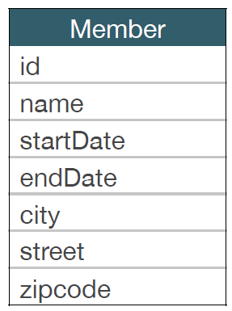

여기서 잘 보면, 주소 3개를 하나로 묶을 수 있을것 같고, 시작일 종료일도 하나로 묶어서 공통으로 클래스화하여 쓸수 있을 것같다.

- 회원 엔티티는 이름, 근무 기간, 집 주소를 가진다.(이렇게 묶어 내는게 임베디드 타입이다.)

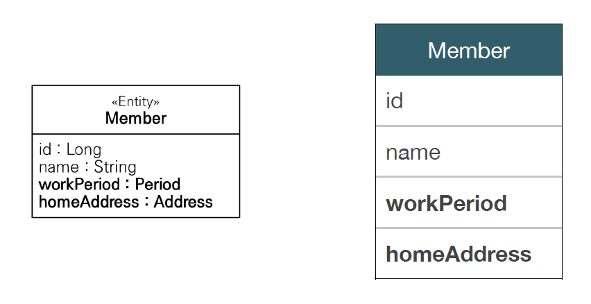

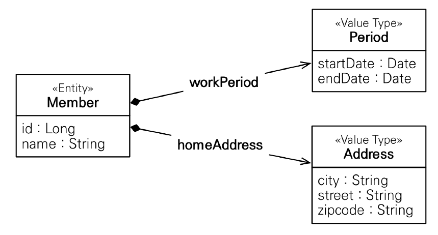

### 임베디드 타입 사용법

- @Embeddable: 값 타입을 정의하는 곳에 표시
- @Embedded: 값 타입을 사용하는 곳에 표시
- 기본 생성자 필수

@Embeddable과 @Embedded 둘중 하나만 넣고 하나는 생략해도 됨. (근데 둘 다 넣는걸 권장함.)

```java
@Embeddable // 값타입임을 알려줌
public class Address {
    private String city;
    private String street;
    private String zipcode;

    public Address() {}

    public Address(String city, String street, String zipcode) {
        this.city = city;
        this.street = street;
        this.zipcode = zipcode;
    }
}
```

다음과 같이 사용한다.

### 임베디드 타입의 장점

- 재사용 가능
- 높은 응집도를 가짐 
- Period.isWokr()처럼 해당 값 타입만 사용하는 의미 있는 메소드를 만들 수 있음
- 임베디드 타입을 포함한 모든 값 타입은, 값 타입을 소유한 엔티티의 생명주기를 의존한다.

### 임베디드 타입과 테이블 매핑

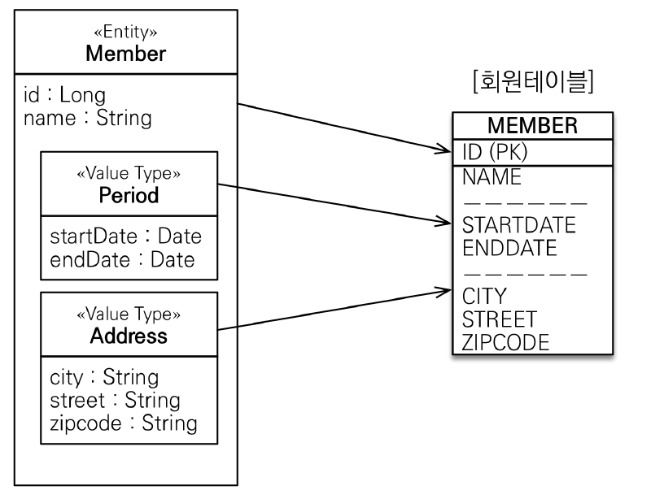

임베디드 타입을 쓰든 안쓰든, db 입장에서는 바뀌는게 없다(회원 테이블은 똑같다). 대신 매핑만 해주면 된다.

DB는 데이터를 잘 관리하는 목적이기 때문에 다음그림과 같이 설계되는게 맞다. 근데 객체는 데이터 뿐만아니라, 메서드같은 기능, 행위들도 같이 들고 있기 때문에 임베디드 타입으로 같이 묶어서 가지고 있을때 더 많은 이득이 있다.

```java
@Entity
public class Member{

    @Id
    @GeneratedValue
    @Column(name = "MEMBER_ID")
    private Long id;

    @Column(name = "USERNAME")
    private String username;

    // 기간 Period
    @Embedded
    private Period workPeriod;

    // 주소
    @Embedded
    private Address homeAddress;
}
```

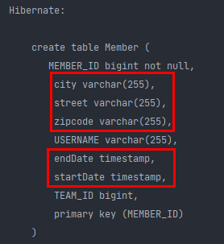

임베디드 타입을 쓰더라도 테이블은 그대로 우리가 설계한대로 컬럼이 들어간다.

```java
Member member = new Member();
member.setUsername("hello");
member.setHomeAddress(new Address("city", "street", "10000"));
member.setWorkPeriod(new Period());
em.persist(member);
```

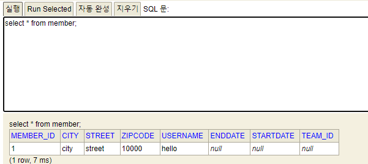

db에도 값이 잘 들어간다. (Period는 내가 값을 설정 안해줬으니 null)

### 임베디드 타입과 테이블 매핑

- 임베디드 타입은 엔티티의 값일 뿐이다.
- 임베디드 타입을 사용하기 전과 후에 **매핑하는 테이블은 같다.**
- 객체와 테이블을 아주 세밀하게(find-grained) 매핑하는 것이 가능하다.

프로젝트 큰거를 하다보면, address, period, position 클래스 안에 메소드들을 만들어 놓으면 그걸 활용할 수 있는게 되게 많기 때문에 좋다. 그리고 설계적으로도 모델링이 깔끔하게 떨어진다(설명하기도 좋음 -> 필드가 너무 많아지면 설명하기 힘듦).

- 잘 설계한 ORM 애플리케이션은 매핑한 테이블의 수 보다 클래스의 수가 더 많다. (여기서 value type이 많이 튀어나오는 거다!)

뭐 그렇다고 현업에서 value type을 어마어마 하게 쓰는건 아니다. 짜다 보면 이런거 쓰는게 좋겠구나 하고 본인이 하고 있는 프로젝트에 나오게 된다.

근데 어쨋든 위와 같이 임베디드 타입을 만들어 놓으면 공통으로 관리할 수 있고, 되게 장점들이 많다. 용어도 공통화 되고 코드도 공통화 된다.

### 임베디드 타입과 연관관계

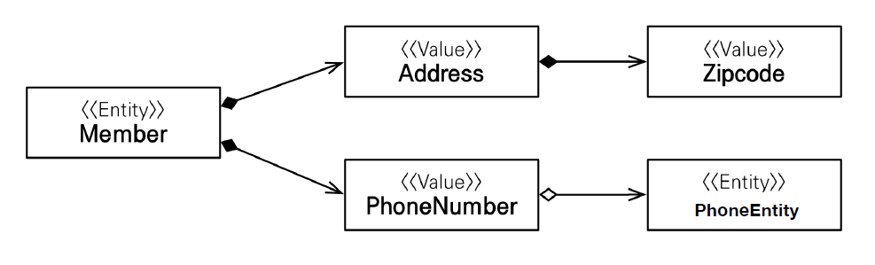

위 그림의 경우 Address 의 임베디드 타입**안**에 zipcode라는 **임베디드 타입**이 들어올 수 있다.

또 PhoneNumber라는 임베디드 타입**안**에 PhoneEntity라는 **엔티티**가 들어올 수도 있다.

### @AttributeOverride: 속성 재정의

- 한 엔티티에서 같은 값 타입을 사용하면?
- 컬럼 명이 중복된다.
- **@AttributeOverrides**, **@AttributeOverride**를 사용해서 컬럼 명 속성을 재정의 할 수 있음.

```java
@Entity
public class Member{

    @Id
    @GeneratedValue
    @Column(name = "MEMBER_ID")
    private Long id;

    @Column(name = "USERNAME")
    private String username;

    // 기간 Period
    @Embedded
    private Period workPeriod;

    // 주소
    @Embedded
    private Address homeAddress;

    // 주소
    @Embedded
    private Address workAddress;
}
```

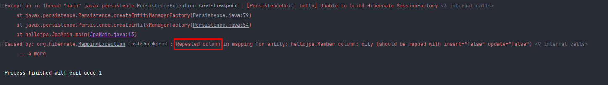

컬럼명이 중복되어 매핑 예외가 발생한다.

이때 @AttributeOverride 애노테이션을 사용한다.

```java
public class Member{

    @Id
    @GeneratedValue
    @Column(name = "MEMBER_ID")
    private Long id;

    @Column(name = "USERNAME")
    private String username;

    // 기간 Period
    @Embedded
    private Period workPeriod;

    // 주소
    @Embedded
    private Address homeAddress;

    // 주소
    @Embedded
    @AttributeOverrides({
            @AttributeOverride(name = "city",
                    column = @Column("WORK_CITY")),
            @AttributeOverride(name = "street",
                    column = @Column("WORK_STREET")),
            @AttributeOverride(name = "zipcode",
                    column = @Column("WORK_ZIPCODE"))
    })
    private Address workAddress;
}
```

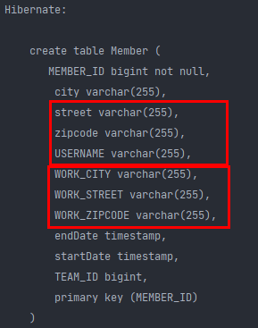

이 애노테이션을 쓰면, 내가 재 정의한 컬럼명이 들어가기 때문에 컬럼명을 중복 없이 저장할 수 있다.

### 임베디드 타입과 null

- 임베디드 타입의 값이 null이면 매핑한 컬럼 값은 모두 null 이다.

# 값 타입과 불변 객체

> 값 타입은 복잡한 객체 세상을 조금이라도 단순화하려고 만든 개념이다. 따라서 값 타입은 단순하고 안전하게 다룰 수 있어야 한다.

## 값 타입 공유 참조

- 임베디드 타입 같은 값 타입을 여러 엔티티에서 공유하면 위험하다.
- 부작용(side effect) 발생한다.

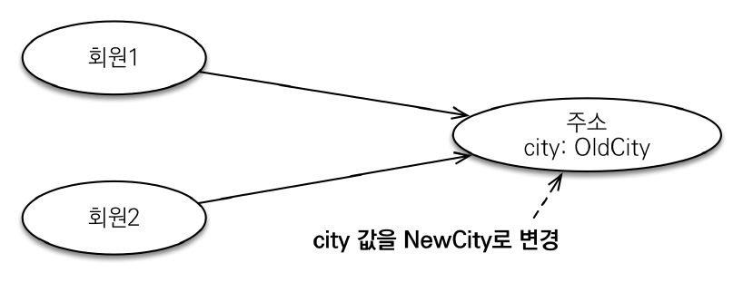

```java
Address address = new Address("city", "street", "10000");

Member member1 = new Member();
member1.setUsername("member1");
member1.setHomeAddress(address);
em.persist(member1);

Member member2 = new Member();
member2.setUsername("member2");
member2.setHomeAddress(address);
em.persist(member2);
```

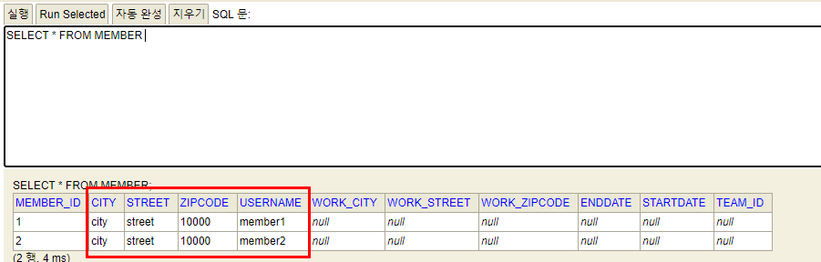

멤버테이블을 조회하면 같은 address가 저장된 것을 확인할 수 있다.

```java
Address address = new Address("city", "street", "10000");

Member member1 = new Member();
member1.setUsername("member1");
member1.setHomeAddress(address);
em.persist(member1);

Member member2 = new Member();
member2.setUsername("member2");
member2.setHomeAddress(address);
em.persist(member2);

member1.getHomeAddress().setCity("newCity");
```

위 코드는 member1의 주소의 city만 newCity로 바꾸고 싶은 상황이다.

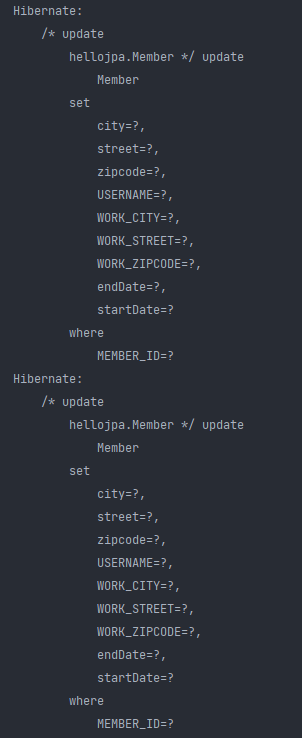

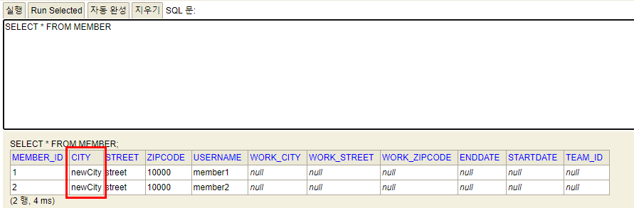

하지만 update 쿼리가 2번 나가면서 member1,2 둘다 city가 newCity로 바뀐다. 

이런 버그(side effect)는 진짜 잡기 어렵다. 

만약 이렇게 값타입으로 같은 값을 쓰려고 의도했다면 그건 잘못된 거임. Address를 entity로 잡아야 맞는 설계다. (우리가 앞서 배운 BaseEntity의 상황인거다.)

## 값 타입 복사

- 값 타입의 실제 인스턴스인 값을 공유하는 것은 위험하다.
- 대신 값(인스턴스)를 복사해서 사용한다.

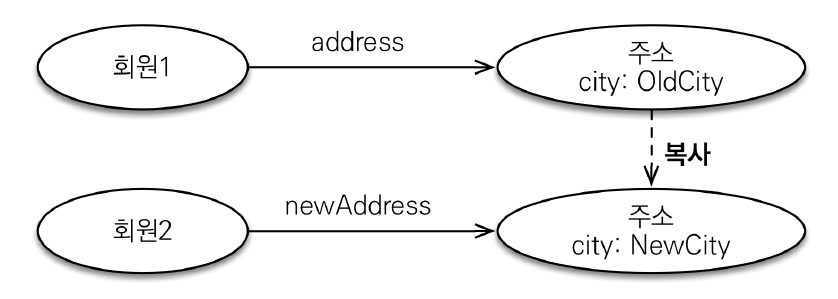

```java
Member member1 = new Member();
member1.setUsername("member1");
member1.setHomeAddress(address);
em.persist(member1);

Address copyAddress = new Address(address.getCity(), address.getStreet(), address.getZipcode());

Member member2 = new Member();
member2.setUsername("member2");
member2.setHomeAddress(copyAddress);
em.persist(member2);

member1.getHomeAddress().setCity("newCity");
```

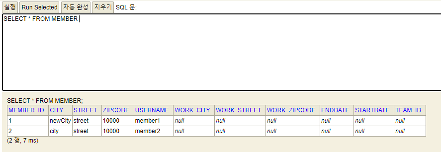

address를 복사해주면 의도한 대로 member1만 newCity로 바뀌게 된다.

근데 협업하다가 팀원이 실수로 복사하지않고 그대로 address를 집어넣는다면..? 컴파일단에서 에러를 잡을 방법이 없다.

## 객체 타입의 한계

- 항상 값을 복사해서 사용하면 공유 참조로 인해 발생하는 부작용을 피할 수 있다.
- 문제는 임베디드 타입처럼 **직접 정의한 값 타입은 자바의 기본 타입이 아니라 객체 타입**이다.
- 자바 기본 타입에 값을 대입하면 값을 복사한다.
- **객체 타입은 참조 값을 직접 대입하는 것을 막을 방법이 없다.**
- **객체의 공유 참조는 피할 수 없다.**

**기본 타입(primitive type)**

```java
int a = 10;
int b = a; // 기본 타입은 값을 복사
b = 4; // b의 값을 바꿔도 a의 값은 10이다.
```

**객체 타입**

```java
Address a = new Address("old");
Address b = a; // 객체 타입은 참조를 전달
b.setCity("new") // b를 set 했지만 참조이므로 a 참조도 city가 new로 바뀜
```

## 불변 객체

- 객체 타입을 수정할 수 없게 만들면 **부작용을 원천 차단**할 수 있다.
- **값 타입은 불변 객체(immutable object)로 설계해야 함**
- **불변 객체 : 생성 시점 이후 절대 값을 변경할 수 없는 객체**
- 생성자로만 값을 설정하고 수정자(Setter)를 만들지 않으면 된다.
- 참고: Integer, String은 자바가 제공하는 대표적인 불변객체이다.

따라서 값 타입은 다 불변으로 만들어야 한다. (사이드 이펙트가 발생하면 정말 추적하기 힘들기 때문)

> 불면이라는 작은 제약으로 부작용이라는 큰 재앙을 막을 수 있다.

근데 만약 값을 바꾸고 싶다면?

```java
Address address = new Address("city", "street", "10000");

Member member1 = new Member();
member1.setUsername("member1");
member1.setHomeAddress(address);
em.persist(member1);

Address newAddress = new Address("NewCity", address.getStreet(), address.getZipcode());
member1.setHomeAddress(newAddress);
```

이렇게 생성자로 address를 새롭게 만들어서 통으로 갈아끼워야 함.

# 값 타입의 비교

- 값 타입: 인스턴스가 달라도 그 안에 값이 같으면 같은 것으로 봐야 한다.

```java
int a = 10;
int b = 10;
a == b // true
```

```java
Address a = new Address("서울시")
Address b = new Address("서울시")
a == b // false
```

- **동일성(identity) 비교** : 인스턴스의 참조 값을 비교, == 사용한다.
- **동등성(equivalence) 비교** : 인스턴스의 값을 비교, equals() 사용한다.
- 값 타입은 a.equals(b)를 사용해서 동등성 비교를 해야 한다.
- 값 타입의 equals() 메소드를 적절하게 재정의(주로 모든 필드에 사용해야 함)

```java
@Embeddable
public class Address {
    private String city;
    private String street;
    private String zipcode;

    public Address() {}

    public Address(String city, String street, String zipcode) {
        this.city = city;
        this.street = street;
        this.zipcode = zipcode;
    }

    public String getCity() {
        return city;
    }

    private void setCity(String city) {
        this.city = city;
    }

    public String getStreet() {
        return street;
    }

    private void setStreet(String street) {
        this.street = street;
    }

    public String getZipcode() {
        return zipcode;
    }

    private void setZipcode(String zipcode) {
        this.zipcode = zipcode;
    }

    @Override
    public boolean equals(Object o) {
        if (this == o) return true;
        if (o == null || getClass() != o.getClass()) return false;
        Address address = (Address) o;
        return Objects.equals(city, address.city) && Objects.equals(street, address.street) && Objects.equals(zipcode, address.zipcode);
    }

    @Override
    public int hashCode() {
        return Objects.hash(city, street, zipcode);
    }
}
```

equals를 override 하면서 hashCode도 같이 override해줘야 hash를 사용하는 hashMap같은 자바 컬렉션에서 이거를 효율적으로 사용할 수 있음.

근데 현업에서 정말 equals를 비교하냐고 물어본다면, 사실 생각보다 그렇게 비교할 일은 없다.

**그리고 equals, hashCode를 override할때 getter로 code를 generation하는게 좋다. (프록시 일때는 필드 값을 가져와서 사용할 수 없기 때문)** JPA에서는 이 부분을 고려해서 오버라이드 해야 한다.

# 값 타입 컬렉션

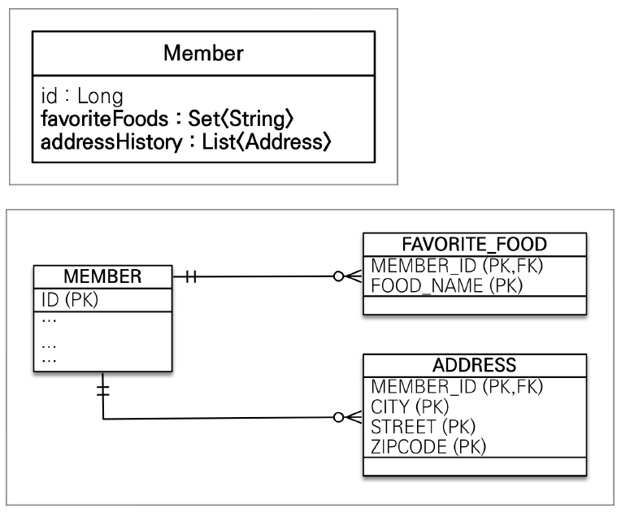

지금까지는 entity를 컬렉션으로 썼었는데, 이번에는 값타입을 컬렉션으로 넣어서 사용한다.

단순히 값 타입이 하나일때는 멤버의 필드속성으로 해서 멤버테이블에 쭉 넣으면 됬는데,

컬렉션으로 쓰게되면 이걸 db 테이블로 구현할 때 문제가 생긴다.

관계형 데이터베이스는 기본적으로 테이블 내부안에 컬렉션을 담을 구조가 없다. (다 value로 값만 넣어준다.)

(요즘에는 db에 json도 저장할수 있는 것들이 많이 나온다.)


어쨋든 멤버입장에서 address list는 컬렉션으로 일대다 형태이다. 따라서 컬렉션에 따른 별도의 테이블을 뽑아야 한다.

(개념적으로 보면 `일대다`이다.) 이런식으로 해야 관리가 된다.


위 그림에서 FAVORITE_FOOD테이블은 MEMBER_ID와 FOOD_NAME을 하나로 묶어서 PK로 관리하고, ADDRESS 테이블은 MEMBER_ID, CITY, STREET, ZIPCODE를 하나로 묶어서 PK로 관리한다.

왜 하나로 묶냐면, **값 타입**이기 때문이다. 만약에 ADDRESS나 FAVORITE_FOOD 테이블에 식별자 ID같은 개념을 넣어서 걔를 PK로 쓰게되면 걔는 값 타입이 아니라 **엔티티**가 되버린다.

그래서 값타입은 값들이 테이블에 값들로만 저장이 되고 이것들을 묶어서 PK로 구성한다.

```JAVA
@Entity
public class Member{

    @Id
    @GeneratedValue
    @Column(name = "MEMBER_ID")
    private Long id;

    @Column(name = "USERNAME")
    private String username;

    @Embedded
    private Address homeAddress;

    @ElementCollection // 값 타입 컬렉션임을 알려주는 애노테이션
    @CollectionTable(name = "FAVORITE_FOOD", // 테이블 이름 지정
            joinColumns = @JoinColumn(name = "MEMBER_ID")
    )
    @Column(name = "FOOD_NAME")
    private Set<String> favoriteFoods = new HashSet<>();

    @ElementCollection
    @CollectionTable(name = "ADDRESS",
            joinColumns = @JoinColumn(name = "MEMBER_ID")
    )
    private List<Address> addressHistory = new ArrayList<>();
}
```

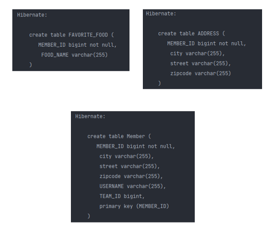

여기서 만약 필드값에 컬럼명을 주고 싶다면? Address는 임베디드 값의 컬럼을 쓰면 되고,

`Set<String>`의 경우, 하나기 때문에 특별히 @Column을 허용해 준다.  (일단 값이 하나고 내가 정의해준게 아니기 때문에 가능)

또 Member와 join할 수 있는 MEMBER_ID를 넣어줘야 한다

### 값 타입 컬렉션

- 값 타입을 하나 이상 저장할 때 사용
- @ElementCollection, @CollectionTable 사용한다.
- 데이터베이스는 컬렉션을 한 테이블에 저장할 수 없다. (정석적으로 방법이 없어서 일대다로 풀어서 별도의 테이블을 만들어 내야 한다)
- 컬렉션을 저장하기 위한 별도의 테이블이 필요하다.

## 값 타입 컬렉션 사용

- 값 타입 저장 예제

```java
Member member = new Member();
member.setUsername("member1");
member.setHomeAddress(new Address("homeCity", "street", "10000"));

member.getFavoriteFoods().add("치킨");
member.getFavoriteFoods().add("족발");
member.getFavoriteFoods().add("피자"); // HashSet에 들어감

member.getAddressHistory().add(new Address("old1", "street", "10000"));
member.getAddressHistory().add(new Address("old2", "street", "10000"));
```

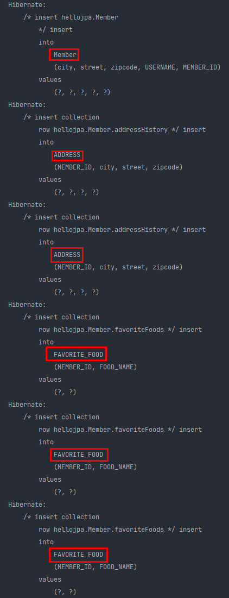

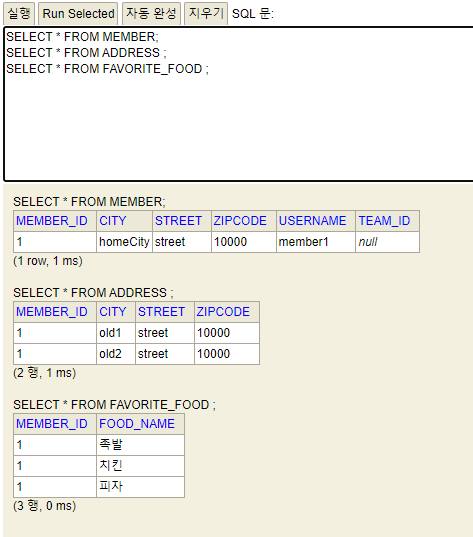

persist 하면서 한번에 insert 쿼리가 나간다. (코드에서 본것처럼 갯수에 따라 insert 쿼리가 나간다.)

db에도 값이 잘 들어가 있다.


여기서 볼 것은, 값 타입을 따로 persist하지 않았지만, 그냥 member만 persist 하면, 컬렉션 값 타입들은 다른 테이블임에도 불구하고 life cycle을 같이 가져가게 된다. 이 이유는 `값 타입` 이기 때문이다.

생명주기가 다 이 Member에게 있다. 그래서 값 타입들은 별도의 persist, update할 필요 없다.

> 참고 : 값 타입 컬렉션은 영속성 전이(Cascade) + 고아 객체 제거 기능을 필수로 가진다고 볼 수 있다.

- 값 타입 조회 예제
  - 값 타입 컬렉션도 지연 로딩 전략을 사용한다.

```JAVA
Member member = new Member();
member.setUsername("member1");
member.setHomeAddress(new Address("homeCity", "street", "10000"));

member.getFavoriteFoods().add("치킨");
member.getFavoriteFoods().add("족발");
member.getFavoriteFoods().add("피자"); // HashSet에 들어감

member.getAddressHistory().add(new Address("old1", "street", "10000"));
member.getAddressHistory().add(new Address("old2", "street", "10000"));

em.persist(member);

em.flush();
em.clear();

System.out.println("============= START =============");
Member findMember = em.find(Member.class, member.getId());
```

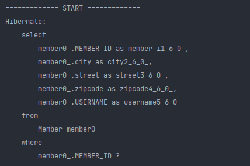

멤버를 조회했더니 멤버만을 가져오는 SELECT 쿼리를 날린다. 이 말은, Collection들은 다 `지연 로딩`이라는 뜻이다.

반면 Member에 @Embedded로 지정된 homeAddress는 같이 조회된다. 왜냐면 멤버에 소속된 값 타입이기 때문이다. (지연로딩 할 필요 없이 바로 불러오는게 더 효율적임.)

```java
Member member = new Member();
member.setUsername("member1");
member.setHomeAddress(new Address("homeCity", "street", "10000"));

member.getFavoriteFoods().add("치킨");
member.getFavoriteFoods().add("족발");
member.getFavoriteFoods().add("피자"); // HashSet에 들어감

member.getAddressHistory().add(new Address("old1", "street", "10000"));
member.getAddressHistory().add(new Address("old2", "street", "10000"));

em.persist(member);

em.flush();
em.clear();

System.out.println("============= START =============");
Member findMember = em.find(Member.class, member.getId());

List<Address> addressHistory = findMember.getAddressHistory();
for (Address address : addressHistory) {
    System.out.println("address = " + address.getCity());
}

Set<String> favoriteFoods = findMember.getFavoriteFoods();
for (String favoriteFood : favoriteFoods) {
    System.out.println("favoriteFood = " + favoriteFood);
}
```

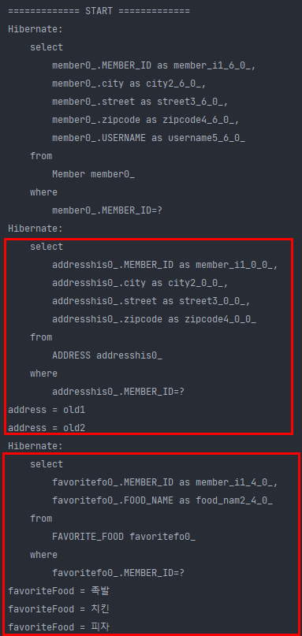

다음과 같이 컬렉션 타입은 지연 로딩으로 값이 필요할때 select 쿼리를 날린다.

- 값 타입 수정 예제

```java
Member member = new Member();
member.setUsername("member1");
member.setHomeAddress(new Address("homeCity", "street", "10000"));

member.getFavoriteFoods().add("치킨");
member.getFavoriteFoods().add("족발");
member.getFavoriteFoods().add("피자"); // HashSet에 들어감

member.getAddressHistory().add(new Address("old1", "street", "10000"));
member.getAddressHistory().add(new Address("old2", "street", "10000"));

em.persist(member);

em.flush();
em.clear();

System.out.println("============= START =============");
Member findMember = em.find(Member.class, member.getId());

//homeCity -> newCity
//            findMember.getHomeAddress().setCity("newCity"); // 값 타입을 setter로 변경하면 안된다!
Address old = findMember.getHomeAddress();
findMember.setHomeAddress(new Address("newCity", old.getStreet(), old.getZipcode())); // 이렇게 완전히 새로운 인스턴스로 갈아 끼워야 함
```


조회후 update 쿼리가 나가는 걸 확인할 수 있다. 이거는 값 타입에 대한 update이지 값 타입 컬렉션에 대한 update는 아님.

```java
Member member = new Member();
member.setUsername("member1");
member.setHomeAddress(new Address("homeCity", "street", "10000"));

member.getFavoriteFoods().add("치킨");
member.getFavoriteFoods().add("족발");
member.getFavoriteFoods().add("피자"); // HashSet에 들어감

member.getAddressHistory().add(new Address("old1", "street", "10000"));
member.getAddressHistory().add(new Address("old2", "street", "10000"));

em.persist(member);

em.flush();
em.clear();

System.out.println("============= START =============");
Member findMember = em.find(Member.class, member.getId());

//homeCity -> newCity
//            findMember.getHomeAddress().setCity("newCity"); // 값 타입을 setter로 변경하면 안된다!
Address old = findMember.getHomeAddress();
findMember.setHomeAddress(new Address("newCity", old.getStreet(), old.getZipcode())); // 이렇게 완전히 새로운 인스턴스로 갈아 끼워야 함

// 치킨 -> 한식
findMember.getFavoriteFoods().remove("치킨");
findMember.getFavoriteFoods().add("한식");
```

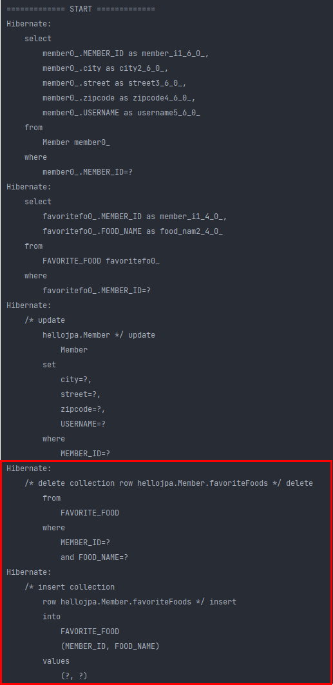

값 타입 컬렉션의 경우, remove, add를 이용하여 데이터를 지우고 저장한다. delete 쿼리로 데이터 삭제후 새롭게 insert 쿼리로 집어넣는것을 확인할 수 있음.

여기서 주목할 점은 컬렉션의 `값`만 변경해도, 실제 데이터베이스에도 쿼리가 날아가면서 뭐가 변경됬는지 알고, JPA가 알아서 바꿔준다. (마치 영속성 전이가 되는 것처럼!)

```java
Member member = new Member();
member.setUsername("member1");
member.setHomeAddress(new Address("homeCity", "street", "10000"));

member.getFavoriteFoods().add("치킨");
member.getFavoriteFoods().add("족발");
member.getFavoriteFoods().add("피자"); 

member.getAddressHistory().add(new Address("old1", "street", "10000"));
member.getAddressHistory().add(new Address("old2", "street", "10000"));

em.persist(member);

em.flush();
em.clear();

System.out.println("============= START =============");
Member findMember = em.find(Member.class, member.getId());

Address old = findMember.getHomeAddress();
findMember.setHomeAddress(new Address("newCity", old.getStreet(), old.getZipcode())); 

// 치킨 -> 한식
findMember.getFavoriteFoods().remove("치킨");
findMember.getFavoriteFoods().add("한식");

findMember.getAddressHistory().remove(new Address("old1", "street", "10000")); // 여기서 equals, hashCode가 구현이 안되있으면 제대로 동작하지 않는다.
findMember.getAddressHistory().add(new Address("newCity1", "street", "10000"));
```

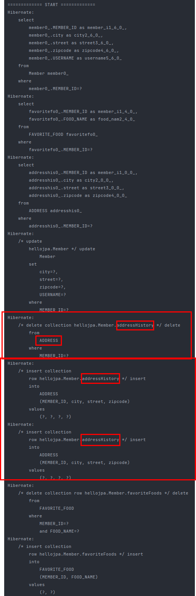

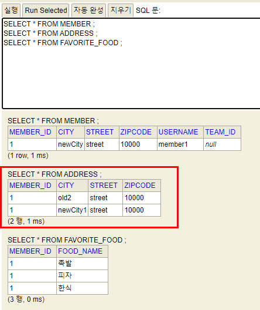

멤버에 소속된 데이터들을 address에서 다 지운다음, 데이터 insert 쿼리를 2개 날린다.

왜냐면 old1을 하나 지우고, old2와 newCity가 남아있는 상황이다. 이때 테이블에 있는 데이터를 완전히 갈아끼워 버리는 거다.

데이터베이스 상에는 우리가 기대한 값들이 들어가 있는데, 쿼리가 문제인 상황이다.

코드만 봤을때 기대하기에는 remove할때 delete, add할때 insert, 즉 2번의 쿼리가 나가는 것을 기대했을 것이다.

하지만, 그렇게 동작하지 않는다. (아까 한식, 치킨할때는 그게 됬었는데, 이거는 안됨)

## 값 타입 컬렉션의 제약 사항

- 값 타입은 엔티티와 다르게 식별자 개념이 없다.
- 값은 변경하면 추적이 어렵다.
- 값 타입 컬렉션에 변경 사항이 발생하면, 주인 엔티티와 연관된 모든 데이터를 삭제하고 ,값 타입 컬렉션에 있는 현재 값을 모두 다시 저장한다.

위 예시처럼, `List<Address> addressHistory`에서 어떤 값을 변경하면, db에 쿼리 날릴때, 현재 member_id와 관련된 address를 전부 다 지운다. (데이터 백만개 있으면 그 백만개 다 지운다.) 그리고 현재의 컬렉션에 최종적으로 남아있는게 2개가 있다면 2개만 insert 쿼리를 친다는 얘기다.

ADDRESS 테이블에는 MEMBER_ID와 CITY, STREET, ZIPCODE 밖에없어서 값이 변경되면 추적하기가 굉장히 어렵다. ID가 있는게 아니기 때문! 그래서 DB에서 값이 변경된 것만 찾아가는게 굉장히 어렵기 때문에 이런 정책이 나옴.

그래서 이런 상황을 해결하는 방법으로 @OrderColumn(name = "address_history_order") 애노테이션을 붙이면 다지우고 다시 insert 하는게 아니라 update 쿼리가 나가게 된다.

```java
@OrderColumn(name = "address_history_order")
@ElementCollection
@CollectionTable(name = "ADDRESS",
                 joinColumns = @JoinColumn(name = "MEMBER_ID")
                )
private List<Address> addressHistory = new ArrayList<>();
```

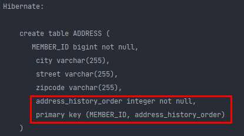

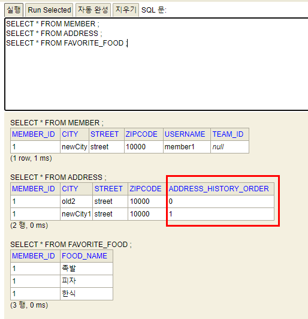

update 쿼리가 나갈 수 있는 이유는 다음 어노테이션을 붙임으로 ADDRESS 테이블에 컬럼이 추가가 된다. 여기에 컬렉션 순서 값들이 들어가게 된다. 그리고 PK 또한 MEMBER_ID와 address_history_order로 제대로 잡는다.

**근데 이 애노테이션을 쓰는것도 엄청 위험하다.**

될 것같은데, 원하는대로 동작하지 않는 경우가 굉장히 많고, 또, 컬렉션이 0,1,2,3,4.. 이렇게 있는데, 중간에 2번을 빼먹었다면 0,1,null,3,4.. 이렇게 들어오는 상황이 발생하게 된다..

#### 결론적으로 이렇게 복잡하게 쓸거면 다른 방식으로 풀어내야 한다.

- 값 타입 컬렉션을 매핑하는 테이블은 모든 컬럼을 묶어서 기본 키를 구성해야 한다. : **null 입력X, 중복 저장X**

다시 돌아와서, 

```java
@ElementCollection
@CollectionTable(name = "ADDRESS",
                 joinColumns = @JoinColumn(name = "MEMBER_ID")
                )
private List<Address> addressHistory = new ArrayList<>();
```

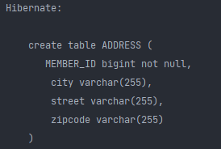

이게 JPA에서 기본적으로 만들어주는 테이블인데, 이 테이블에 ID가 있으면, 더이상 `값 타입`이 아니라 `엔티티`가 된다. 

결과적으로 이 4개의 컬럼을 `묶어서` PK로 만들어야 한다. 4개중 그 어느것도 PK로 만들 수 있는게 없기 때문이다.

위 테이블에서는 JPA가 어떻게 될지 모르기 때문에 PK를 안만들어 놓은 거다.

> PK 없이는 DB 운영을 할 수가 없다.

그러다 보니 NULL입력도 안되고 중복저장도 못하는 제약사항이 생기게 된다.

### 값 타입 컬렉션 대안

- 실무에서는 상황에 따라 **값 타입 컬렉션 대신에 일대다 관계를 고려**한다. (정말 간단한 건 값 타입으로 써도 됨)
- 일대다 관계를 위한 엔티티를 만들고, 여기에서 값 타입을 사용한다.
- 영속성 전이(Cascade) + 고아 객체 제거를 사용해서 값 타입 컬렉션 처럼 사용한다.
- ex) AddressEntity

```java
@Entity
@Table(name = "ADDRESS")
public class AddressEntity { // 엔티티
    @Id
    @GeneratedValue
    private Long id;

    private Address address; // 값 타입
    
    public AddressEntity(String city, String street, String zipcode) { // 생성자
        this.address = new Address(city, street, zipcode);
    } 
}
```

이렇게 address 엔티티를 만들고, 

```java
@OneToMany(cascade = CascadeType.ALL, orphanRemoval = true)
@JoinColumn(name = "MEMBER_ID")
private List<AddressEntity> addressHistory = new ArrayList<>();
```

멤버에서는 일대다로 매핑하면 된다. (이 경우는 특이한 경우니까 영속성 전이를 모두 ALL, 고아객체까지 모두 지워주는 옵션을 넣어준다.)

이렇게 하면 값타입으로 매핑하는것 보다 훨씬 활용하기가 편해진다. 실무에서 쿼리 최적화 하기도 훨씬 유리하다.

```java
Member member = new Member();
member.setUsername("member1");
member.setHomeAddress(new Address("homeCity", "street", "10000"));

member.getFavoriteFoods().add("치킨");
member.getFavoriteFoods().add("족발");
member.getFavoriteFoods().add("피자"); 

member.getAddressHistory().add(new AddressEntity("old1", "street", "10000"));
member.getAddressHistory().add(new AddressEntity("old2", "street", "10000"));

em.persist(member);

em.flush();
em.clear();
```

다음과 같이 AddressEntity 생성자를 이용하여 컬렉션을 이용한다.

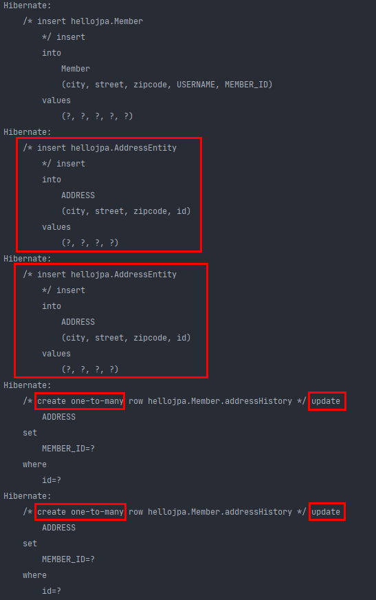

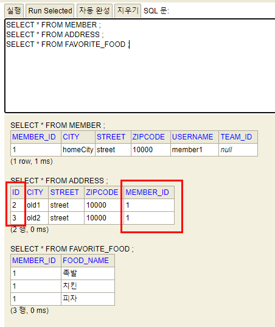

insert 쿼리가 2번 날아간다. 여기서 update 쿼리가 나가는 것은 어쩔 수 없다.

앞서 연관관계 매핑에서, 일대다 단방향 매핑에서는, 다른 테이블에 외래키가 있기 때문에 어쩔 수 없이 update 쿼리가 나가게 된다.

db를 확인하면 이제 ADDRESS 테이블에 ID가 생기게 됨. (FK로 MEMBER_ID를 가짐) 자체적인 ID가 있다는건, 값 타입이 아니라 엔티티라는 거다. 이렇게 되면, 내가 마음껏 수정할 수 있다.

> 이 경우를 값 타입에서 엔티티로 승급한다고 얘기한다.

실제로 실무에서는 이 방법을 많이 쓴다.


그럼 우리가 배운 **값 타입 컬렉션**은 언제 쓸까?

쓰는 기준이 정해져 있는데, 예를들어 select 박스에서, 예를 들어 [치킨, 피자 ..] 이렇게 multi로 select 할 수 있도록 되어 있을때(체크 버튼이 있음), 

이렇게 매우 단순한거 할때 쓴다..

추적할 필요도 없고 update 칠 필요도 없다. 그럴때 값 타입 컬렉션을 쓰고, 그게 아닌 이상, 왠만하면 엔티티를 쓴다. (왠만해서는 값 타입을 잘 이용하지 않는다.)

예를들어 주소에 대한 이력을 보고 싶다면 주소 이력 자체만을 조회하고 싶은 상황이 있을거다. 이거는 전부 다 `엔티티` 이다.

### 정리

- **엔티티 타입의 특징**
  - 식별자 O
  - 생명 주기 관리함
  - 공유 가능
- **값 타입의 특징**
  - 식별자 X
  - 생명 주기를 엔티티에 의존한다.
  - 공유하지 않는 것이 안전하다.(복사해서 사용)
  - 불변 객체로 만드는 것이 안전하다.

> 값 타입은 정말 값 타입이라 판단될 때만 사용한다.
>
> 엔티티와 값 타입을 혼동해서 엔티티를 값 타입으로 만들면 안된다.
>
> 식별자가 필요하고, 지속해서 값을 추적, 변경해야 한다면 그것은 값 타입이 아닌 엔티티 이다!

# 실전 예제 - 6. 값 타입 매핑

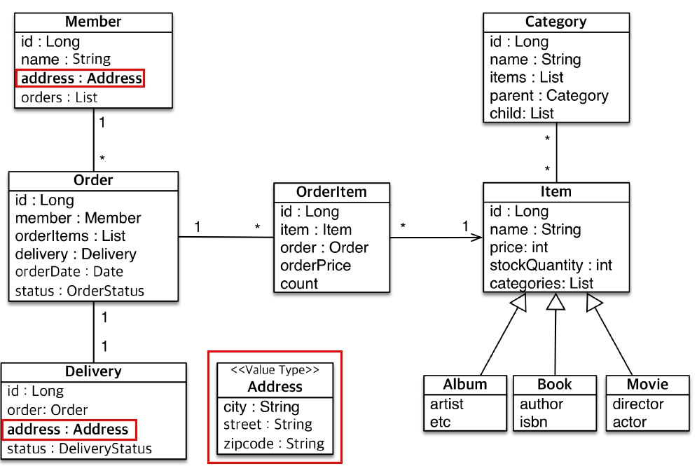

Address를 여러 군데가 아니라 한군데에만 쓴다고 하더라도 의미가 있다.

값타입을 UML에서는 stereo type이라고 한다.