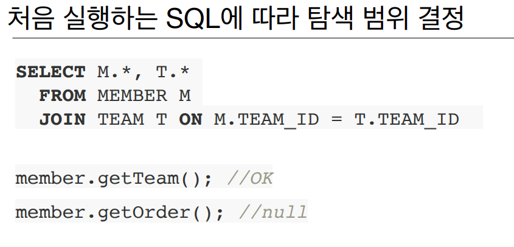

# 1주차

Section1. 강좌소개
==================

자바 웹 어플리케이션에서의 데이터베이스 역사
------------------
- JDBC -> JDBC Template, Mybatis -> JPA  
- SQL 구문에 대해 개발자가 직접 처리해야하되는 부분이 계속적으로 줄어들고 있음.
- 개발 생산성과 유지 보수 환경이 개선되고 있음.
- 하지만, 편리한만큼 실무에서의 적용은 쉽지가 않음.
    1. 객체와 테이블을 올바르게 매핑하고 설계하는 것이 쉽지 않음.
    

강좌 목표
------------------
1. 객체와 테이블을 제대로 설계하고 매핑하는 방법
2. 기본 키와 외래 키 매핑
3. 1:N, N:1, 1:1, N:M 매핑
4. 실무 노하우 + 성능 요소
5. 복잡한 시스템에 대한 JPA 설계
6. JPA 동작 원리
    1. JPA가 어떤 SQL을 만드는지.
    2. JPA가 언제 SQL을 실행하는지.

Section2. JPA 소개
==================

JPA와 모던 자바 데이터 저장 기술
------------------
- SQL 중심적인 개발의 문제점
    1. 무한 반복, 지루한 코드 (CRUD)
    2. SQL에 의존적인 코드를 피하기가 어렵다.
    3. 패러다임의 불일치 (객체 vs 관계형 데이터베이스)
    4. 엔티티 신뢰 문제
        - SQL문에 의해 객체의 탐색 범위가 한정되므로 객체 그래프 탐색이 제한됨.
          
          
- JPA 소개
