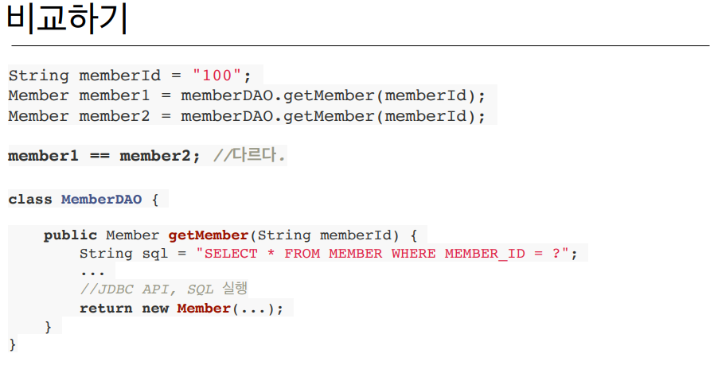
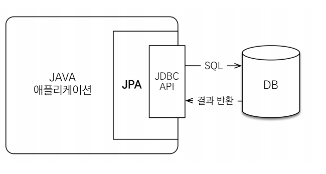

# 1주차

Section1. 강좌소개
==================

자바 웹 어플리케이션에서의 데이터베이스 역사
------------------
- JDBC -> JDBC Template, Mybatis -> JPA  
- SQL 구문에 대해 개발자가 직접 처리해야하되는 부분이 계속적으로 줄어들고 있음.
- 개발 생산성과 유지 보수 환경이 개선되고 있음.
- 하지만, 편리한만큼 실무에서의 적용은 쉽지가 않음.
    - 객체와 테이블을 올바르게 매핑하고 설계하는 것이 쉽지 않음.
    

강좌 목표
------------------
- 객체와 테이블을 제대로 설계하고 매핑하는 방법
- 기본 키와 외래 키 매핑
- 1:N, N:1, 1:1, N:M 매핑
- 실무 노하우 + 성능 요소
- 복잡한 시스템에 대한 JPA 설계
- JPA 동작 원리
    1. JPA가 어떤 SQL을 만드는지.
    1. JPA가 언제 SQL을 실행하는지.

Section2. JPA 소개
==================

JPA와 모던 자바 데이터 저장 기술
------------------
- SQL 중심적인 개발의 문제점
    1. 무한 반복, 지루한 코드 (CRUD)
    1. SQL에 의존적인 코드를 피하기가 어렵다.
    1. 패러다임의 불일치 (객체 vs 관계형 데이터베이스)
    1. 엔티티 신뢰 문제
        - SQL문에 의해 객체의 탐색 범위가 한정되므로 객체 그래프 탐색이 제한됨.
        - 
          
        - 레이어드 계층 구조를 사용할 수 없음.
        - 오브젝트간의 비교연산 불가능. (매번 조회마다, 비즈니스 로직마다, 오브젝트가 새롭게 생성됨.)
        - 
        > 객체다운 모델링을 할수록 매핑 작업만 늘어난다.

JPA
------------------
- Java Persistence API
- 자바 진영의 ORM(Object-relational mapping) 기술 표준
- 객체는 객체지향스럽게, RDB는 RDB 스럽게 설계하고 ORM 프레임워크로 매핑함.
- 대부분의 언어에서 ORM 기술 존재함.
- 
- JPA는 인터페이스의 모음이며 구현체는 하이버네이트, EclipseLink, DataNucleus 정도가 존재함.
    
JPA를 왜 사용해야 하는가?
------------------
1. SQL 중심적인 개발이 아닌 객체 중심적인 개발이 가능.
1. 생산성 및 유지보수 증대
1. 패러다임 불일치 해결
   1. 상속, 연관관계 개념을 해치지 않는다. (JPA가 관련 모든 SQL 구문을 작성해줌.)
   1. 신뢰할 수 있는 엔티티 보장(객체 그래프 탐색, 레이어드 계층화)
   1. 같은 트랜잭션 내부에서는 오브젝트 비교 연산 가능.
1. 성능
   1. 1차 캐시와 동일성(identity)
      - 같은 트랜잭션 안에서는 같은 엔티티를 반환함.
   1. 트랜잭션을 지원하는 쓰기 지연
      - 트랜잭션 커밋까지 SQL문을 모아서 한 꺼번에 보냄.
   1. 지연 로딩(Lazy Loading)
      - 객체가 실제 사용될 때 로딩(변경)
1. 데이터 접근 추상화와 벤더 독립성
1. 표준

JPA 실습
------------------
- JPQL
    - SQL을 추상화한 객체 지향 쿼리 언어
    - SQL과 유사한 문법 (SELECT, FROM, WHERE, GROUP BY, HAVING, JOING)
    - JPQL은 **엔티티 객체** 대상, SQL은 **데이터베이스 테이블** 대상

Section3. 영속성 관리
==================
영속성 컨텍스트
------------------
> "엔티티를 영구 저장하는 환경"
- 엔티티의 생명주기
    - 비영속 (new/transient)
        - 영속성 컨텍스트와 전혀 관계가 없는 **새로운** 상태
    - 영속 (managed)
        - 영속성 컨텍스트에 **관리**되는 상태
    - 준영속 (detached)
        - 영속성 컨텍스트에 저장되었다가 **분리**된 상태
    - 삭제 (removed)
        - **삭제**된 상태
- 장점
    - 1차 캐시
        - 영속성 컨텍스트에서 PK값을 통해 미리 저장된 값이 있다면 그 값을 반환함.
    - 동일성(identity 보장)
        - 영속성 내에서 엔티티에 대한 동일여부 판단이 가능함. (1차 캐시로 인해, 어플리케이션이 데이터베이스 수준의 REPEATABLE READ 등급을 가질 수 있음.)
    - 트랜잭션을 지원하는 쓰기 지연(transactional write-behind)
        - 트랜잭션 커밋 시점에서 쓰기 지연 SQL 저장소에 쌓아둔 쿼리문을 실제 데이터베이스 서버에 보냄. (flush로 미리 보내는 것도 가능.)
        - 버퍼링을 둬서 성능 최적화의 여지가 있음.
    - 변경 감지(dirty checking)
        - 영속성 컨텍스트내에서 최초 스냅샷과 commit 시점에서의 스냅샷이 다를 경우, 변경을 감지하여 자동으로 update SQL문을 실행함.
    - 지연 로딩(lazy loading)
    