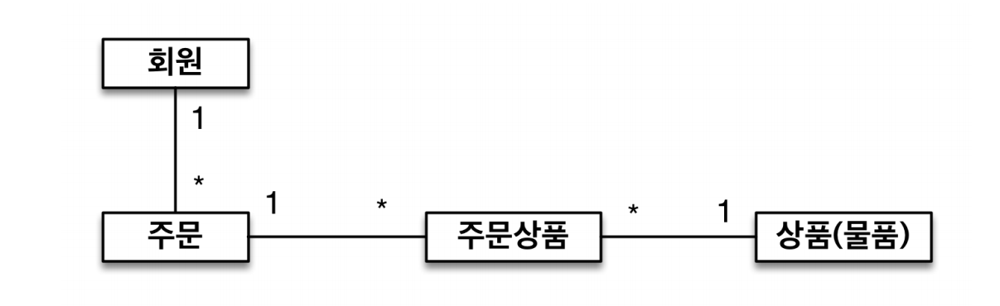
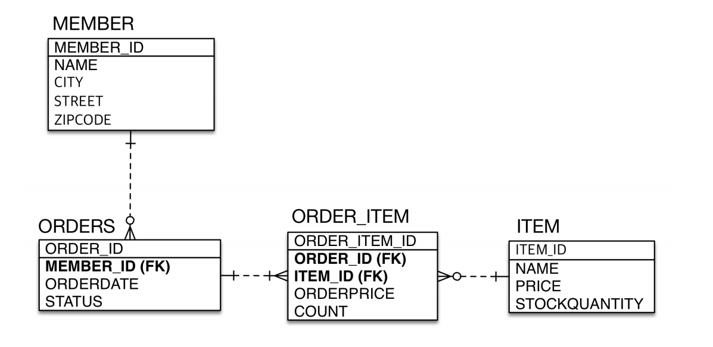
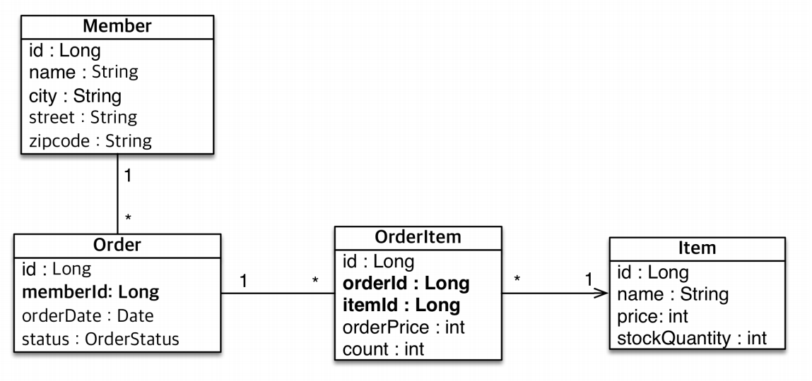

# 2주차

Section4. 엔티티 매핑
==================

엔티티 매핑 소개
------------------
- 객체와 테이블 매핑 : @Entity, @Table
- 필드와 컬럼 매핑 : @Column
- 기본 키 매핑 : @Id
- 연관관계 매핑 : @ManyToOne, @JoinColumn

Entity 속성 정리
------------------
- name : 매핑할 테이블 이름
- catalog : 데이터베이스 catalog 매핑
- schema : 데이터베이스 schema 매핑
- uniqueConstraints(DDL) : DDL 생성 시에 유니크 제약 조건 생성

데이터베이스 스키마 자동 생성
------------------
- DDL을 애플리케이션 실행 시점에 자동 생성
- 테이블 중심 -> 객체 중심
- 데이터베이스 종류에 따라서 적절한 DDL 생성
- 운영 환경에서 DDL이 일어나지 않도록 **주의**
- 속성 종류
  - create : 기존 테이블 삭제 후 다시 생성 
  - create-drop : create와 같으나 종료 시점에 테이블 **DROP**
  - update : 변경분만 반영(**주의**)
  - validate : 엔티티와 테이블이 정상 매핑되었는지만 확인
  - none : 사용하지 않음

DDL 생성 기능
------------------
- 제약조건 추가(nullable, length 등)
- 유니크 제약조건 추가
- DDL 생성 기능은 DDL을 자동 생성할 때만 사용되고 JPA 실행 로직에는 영향을 주지 않는다.

필드와 컬럼 매핑
------------------
- 매핑 어노테이션 정리
  - @Column : 컬럼 매핑
  - @Temporal : 날짜 타입 매핑
  - @Enumerated : enum 타입 매핑
  - @Lob : BLOB, CLOB 매핑
  - @Transient 특정 필드를 컬럼에 매핑 하지 않음.

- @Column
  - name : 필드와 매핑할 테이블 컬럼의 이름
  - insertable, updatable : 등록, 변경 가능 여부
  - nullable(DDL) : null 값의 허용 여부 (false시, DDL 생성 시에 not null 제약조건이 붙음.)
  - unique(DDL) : 유니크 제약 조건 부여
  - columnDefinition(DDL) : 데이터베이스 컬럼 정보를 직접 부여
  - length(DDL) : 문자 길이 제약조건, STring 타입에만 사용
  - precision, scale(DDL) : BigDecimal 타입에서 사용. 자리수 관련

- @Enumerated
  - ORDINAL : enum 순서를 데이터베이스에 저장 (안 쓰는게 좋음. (ENUM 순서가 바뀔 경우, DB 마이그레이션이 힘듬.))
  - STRING : enum 이름을 데이터베이스에 저장
  
- @Temporal
  - 날짜 타입 매핑에 사용(최근에는 LocalDateTime 사용으로 거의 사용되지 않음.)
  
- @Lob
  - 매핑 필드가 문자일 경우 CLOB, 나머지는 BLOB

기본 키 매핑
------------------
- 매핑 어노테이션 정리
  - @ID
    - 기본키 지정
    - 직접할당할 경우 @ID만 사용
  - @GeneratedValue
    - IDENTITY : 데이터베이스에 위임, MY SQL
        - 주로 MySQL, PostgreSQL, SQL Server, DB2에서 사용
        - JPA의 경우 트랜잭션 커밋 시점에 INSERT SQL 실행
        - AUTO_INCREMENT는 데이터베이스에 INSERT SQL을 실행한 이후에 ID값을 알 수 있음.
        - **IDENTITY 전략은 em.persist() 시점에 즉시 INSERT SQL을 실행하고 DB에서 식별자를 조회**
          - > INSERT 버퍼링 쓰기 전략을 사용할 수 없음.
    - SEQUENCE : 데이터베이스 시퀀스 오브젝트 사용, Oracle (@SequenceGenerator 필요)
    - TABLE : 키 생성용 테이블 사용, 모든 DB에서 사용 가능 (@TableGenerator 필요)
        - 성능 X
    - AUTO : 데이터베이스에 따라 자동 지정, 기본값
  - 권장 식별자 전략
    - 기본 키 제약 조건 : NOT NULL, 유일, 변하면 안됨.
    - 미래에도 이 조건을 만족하는 자연키를 찾기 어렵다. 대리키(대체키)를 사용하자.
    - 권장 : Long형 + 대체키 + 키 생성전략 사용

실전 예제
------------------
- 요구사항 분석
  - 회원은 상품을 주문할 수 있다.
  - 주문 시 여러 종류의 상품을 선택할 수 있다.
  
- 기능 목록
  - 회원 기능
    - 회원 등록
    - 회원 조회
  - 상품 기능
    - 상품 등록
    - 상품 수정
    - 상품 조회
  - 주문 기능
    - 상품 주문
    - 주문 내역조회
    - 주문 취소
  
- 도메인 모델 분석
  - 
  
- 테이블 설계
  - 

- 엔티티 설계
  - 
  
- 데이터 중심 설계의 문제점
  - 객체 설계가 아닌 테이블 설계에 맞춘 방식
  - 테이블의 외래키를 객채에 그대로 가져옴
  - **객체 그래프 탐색 불가능**
  - ID값만 가지므로 참조가 아님.