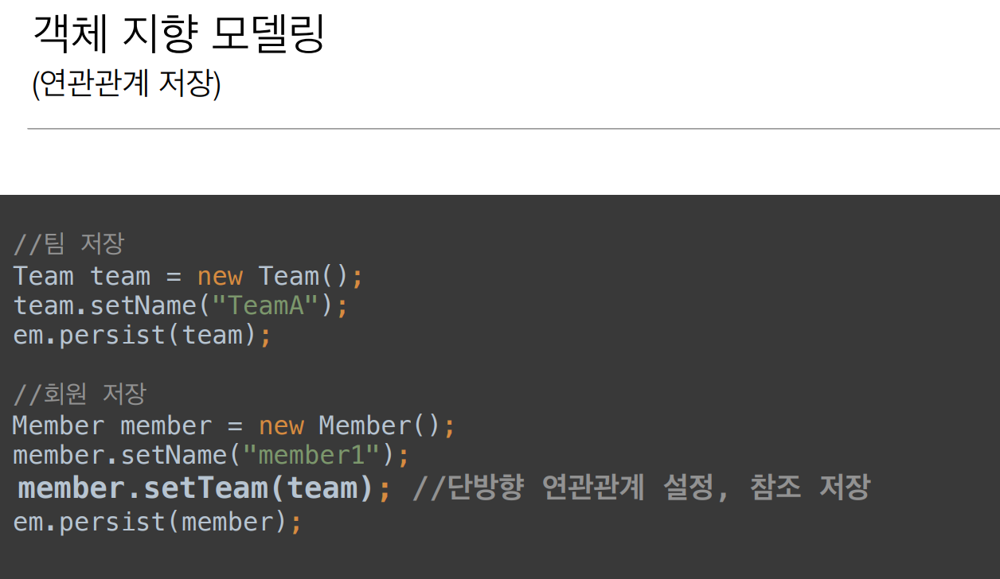

# 3주차

Section5. 연관관계 매핑 기초
==================

목표
------------------
- 객체와 테이블 연관관계의 차이를 이해
- 객체의 참조와 테이블의 외래 키를 매핑
- 용어
    - 방향(Direction) : 단방향, 양방향
    - 다중성(Multiplicity): 다대일(N:1), 일대다(1:N), 일대일(1:1), 다대다(N:M) 이해
    - 연관관계의 주인(Owner) : 객체 양방향 연관관계는 관리 주인이 필요
        - > JPA계의 포인터?

연관관계가 필요한 이유
------------------
 > 객체지향 설계의 목표는 자율적인 객체들의 **협력 공동체**를 만드는 것이다.

예제 시나리오
------------------
- 회원과 팀이 있다.
- 회원은 하나의 팀에만 소속될 수 있다.
- 회원과 팀은 다대일(N:1) 관계다.
- 
- 
- 
- 
- 

> 객체를 테이블에 맞추어 데이터 중심으로 모델링하면, 협력 관계를 만들 수 없다.
- 테이블은 외래 키로 조인을 사용해서 연관된 테이블을 찾는다.
- 객체는 참조를 사용해서 연관된 객체를 찾는다.
- 테이블과 객체 사이에는 이런 큰 간격이 있다

단방향 연관관계
------------------
- 
- 
- 
- 
- 
- 

양방향 연관관계와 연관관계의 주인
------------------
- 
- 
- 
- 

연관관계의 주인과 mappedBy
------------------
- 객체와 테이블간에 연관관계를 맺는 차이를 이해한다.
    - 객체 연관관계 (2개)
        - 회원 -> 팀 연관관계 1개(단방향)
        - 팀 -> 회원 연관관계 1개(단방향)
    - 테이블 연관관계 (1개)
        - 회원 <-> 팀의 연관관계 1개(양방향)
    - 
    - 객체의 양방향 관계
        - 객체의 양방향 관계는 사실 양방향 관계가 아니라 서로 다른 단 뱡향 관계 2개다. 
        - 객체를 양방향으로 참조하려면 단방향 연관관계를 2개 만들어야 한다. 
          - A -> B (a.getB())
          - B -> A (b.getA())
    - 테이블의 양방향 연관관계 
        - 테이블은 외래 키 하나로 두 테이블의 연관관계를 관리
        - MEMBER.TEAM_ID 외래 키 하나로 양방향 연관관계 가짐(양쪽으로 조인할 수 있다.)
        - 

    
연관관계의 주인(Owner)
------------------
- 양방향 매핑 규칙
    - 객체의 두 관계중 하나를 연관관계의 주인으로 지정
    - 연관관계의 주인만이 외래 키를 관리(등록, 수정)
    - 주인이 아닌쪽은 읽기만 가능
    - 주인은 mappedBy 속성 사용X
    - 주인이 아니면 mappedBy 속성으로 주인 지정
    - 
    - 
    - 

양방향 연관관계 주의 - 실습
------------------
- 순수 객체 상태를 고려해서 항상 양쪽에 값을 설정하자
- 연관관계 편의 메소드를 생성하자
    - 예 : Member 클래스의 멤버 함수 changeTeam(Team team) => { this.setTeam(team); team.addMember(this); }
- 양방향 매핑시에 무한 루프를 조심하자
    - 예: toString(), lombok, JSON 생성 라이브러리

양방향 매핑 정리
------------------
- 단방향 매핑으로 모든 설계가 가능하다!
- 양방향 매핑은 필요할 경우 추가해도 된다. (테이블 영향 X)

연관관계의 주인(Owner) 기준
------------------
- 비즈니스 로직 X, 외래 키의 위치가 존재하는 곳 O