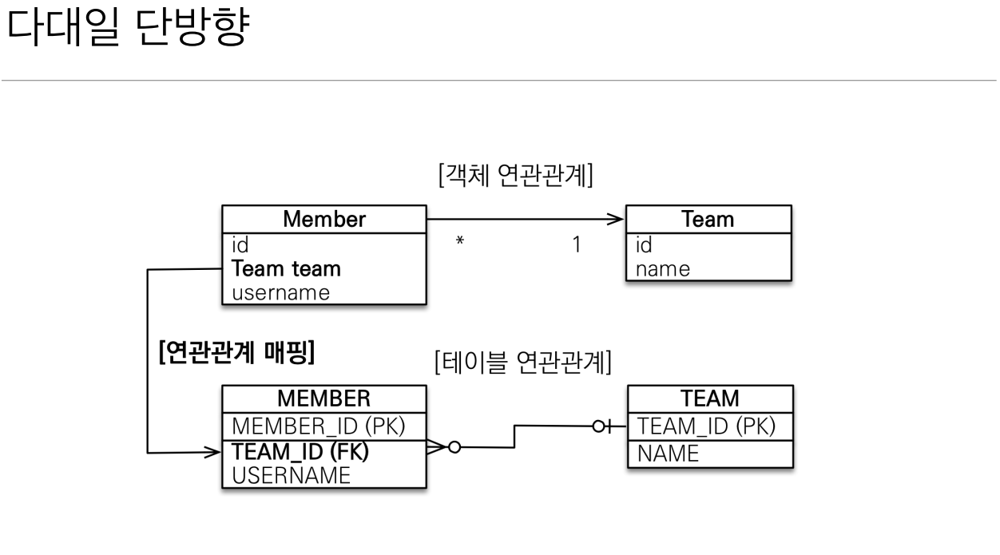
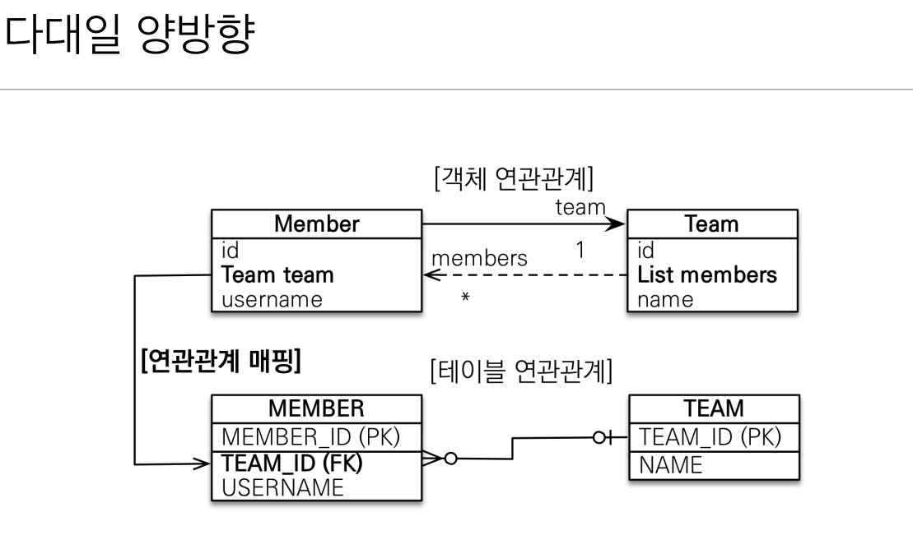
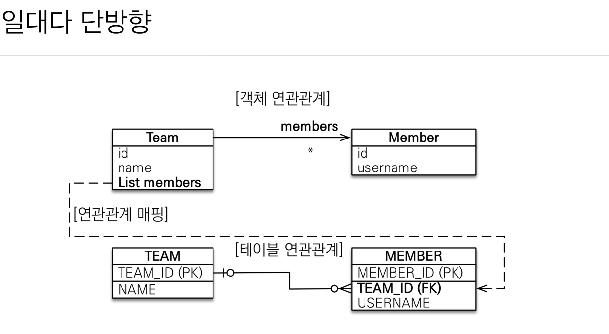
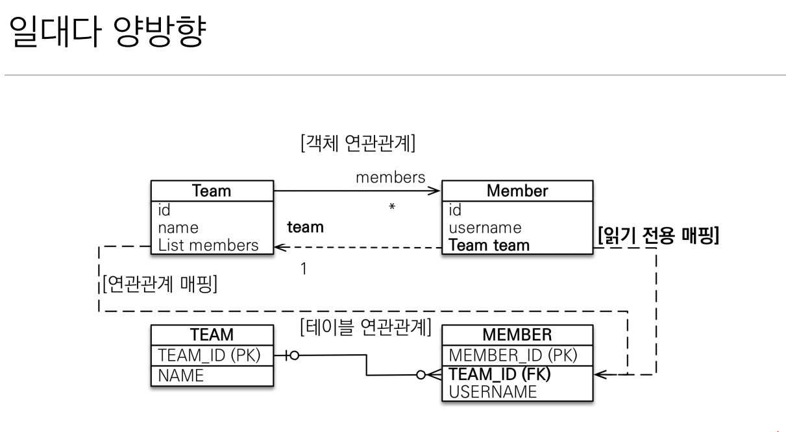
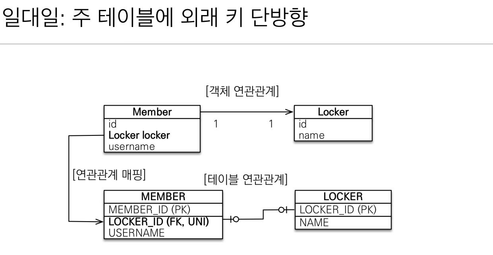
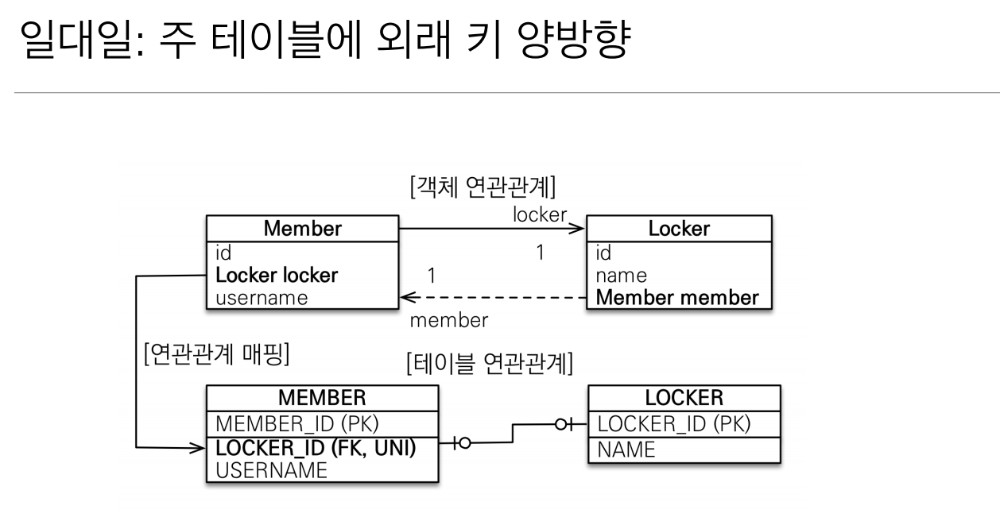
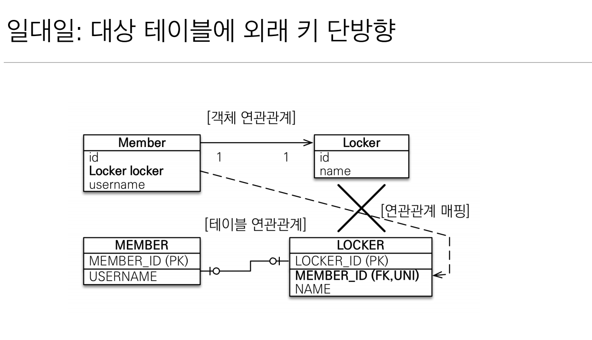
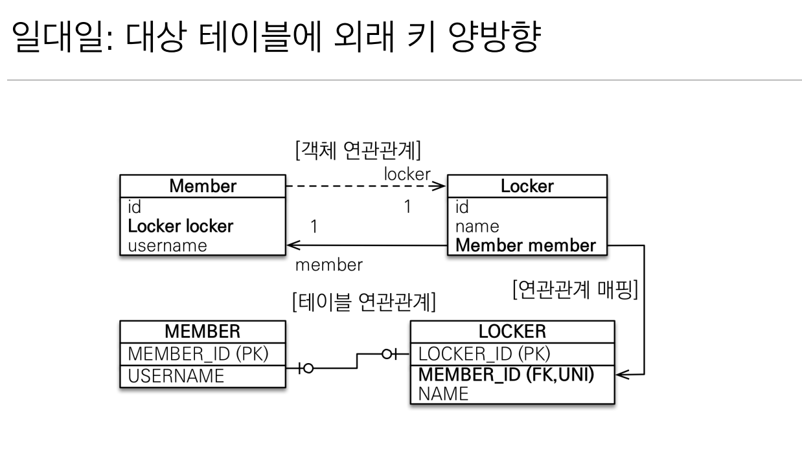
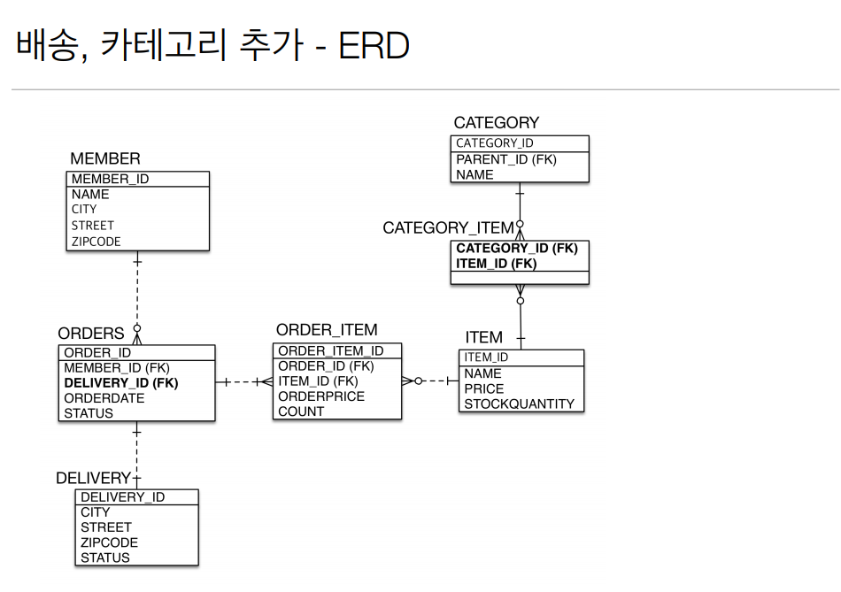
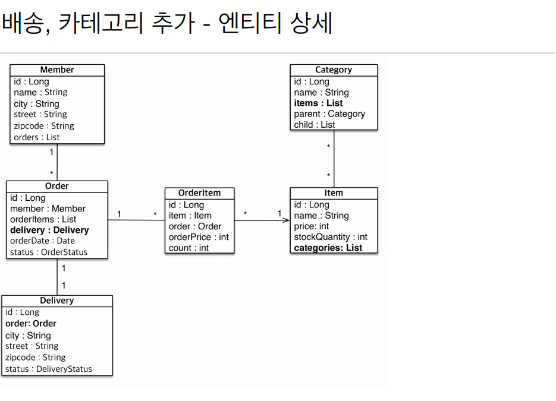

# 4주차

Section6. 다양한 연관관계 매핑
==================

목차
------------------
- 연관관계 매핑시 고려사항 3가지
- 다대일 (N:1)
- 일대다 (1:N)
- 일대일 (1:1)
- 다대다 (N:M)
- 실전예제 3

연관관계 매팽시 고려사항 3가지
------------------
- 다중성
  - 다대일(@ManyToOne)
  - 일대다(@OneToMany)
  - 일대일(@OneToOne)
  - 다대다(@ManyToMany)
> 대칭성이 있으므로 헷갈리면 "역"을 생각해보라.

> "다대다"는 실무에서 사용하지 말자.

단방향, 양방향
------------------
  - 테이블
    - 외래키 하나로 양쪽 조인 가능 (방향 X)
  - 객체
    - 참조용 필드가 있는 쪽으로만 참조 가능
    - 한쪽만 참조하면 단방향
    - 양쪽이 서로 참조하면 양방향(단방향 X 2)
    
- 연관관계의 주인
  - 테이블은 **외래키**로 두 테이블의 연관관계를 맺음
  - 객체 양방향 관계는 2개의 참조가 존재함
    - 외래키를 관리할 곳을 지정해야함
    - 연관관계의 주인 : 외래키를 관리하는 참조
    - 연관관계의 노예 : 외래 키에 영향을 주지 않음. 단순 조회만 가능

일대다
------------------
- 다대일 단방향
  - 가장 많이 사용하는 연관관계
  - 
  
- 다대일 양방향
  - 외래 키가 있는 쪽이 주인
  - 
  
- 일대다 단방향
  - 일(1)이 연관관계의 주인
  - 객체와 테이블의 차이로 인해 인지하지 못하는 수정이 발생할 수 있음.
    - ex) team.getMembers().add(member);
    - > member의 team 값 수정이 일어남.
    - > INSERT TEAM
    - > UPDATE MEMBER
  - @JoinColumn을 사용하지 않으면 JoinTable(Member_Team)이 생성됨.
  - 
  
- 일대다 양방향
  - @JoinColumn(insertable=false, updatable=false)를 사용한 **야매**
    - 읽기 전용 필드를 사용해서 양방향을 흉내
  > 그냥 사용하지말자
  - 
  
일대일
------------------
- 주 테이블 or 대상 테이블 중 외래 키 선택 가능 (대칭성)
- 외래 키에 데이터베이스 유니크(UN) 제약조건 추가

- 주 테이블에 외래 키 단방향
  - 다대일 단방향과 유사
  - 
  
- 주 테이블에 외래 키 단방향 
  - 다대일 양방향 매핑 처럼 외래 키가 있는 곳이 연관관계의 주인
  - 반대편은 mappedBy 적용
  - 
  
- 대상 테이블에 외래 키 단방향
  - > 불가능!!!
  - 

- 대상 테이블에 외래 키 양방향
  - > 불가능하지는 않지만.. 쓰지말자
  - 
  
> Trade Off에 대한 유연한 대처는 필요하다.

> 대상 테이블 외래 키를 사용하면 지연 로딩 사용 불가(쿼리가 무조건 나갈 수 밖에 없음)

다대다
------------------
> 실무 사용 X

- 연결 테이블을 추가해서 일대다 or 다대일 관계로 확장 (관계형 데이터베이스의 한계)
- @ManyToMany, @JoinTable(A_B_TABLE) 사용 (하지만, 사용 X)
  - A_B_TABLE에 추가되는 다양한 데이터를 처리할 수 없음
  - 예상하지 못한 쿼리가 생성됨
> 연결 테이블을 엔티티로 승격하여 사용하라!

실전예제3 - 다양한 연관관계 매핑
------------------
- 배송, 카테고리 추가
 - 주문과 배송 (1:1)
 - 상품과 카테고리 (N:M)

- ERD
  - 
  - 
