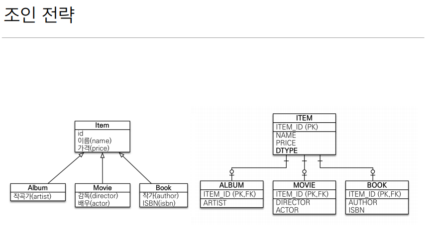
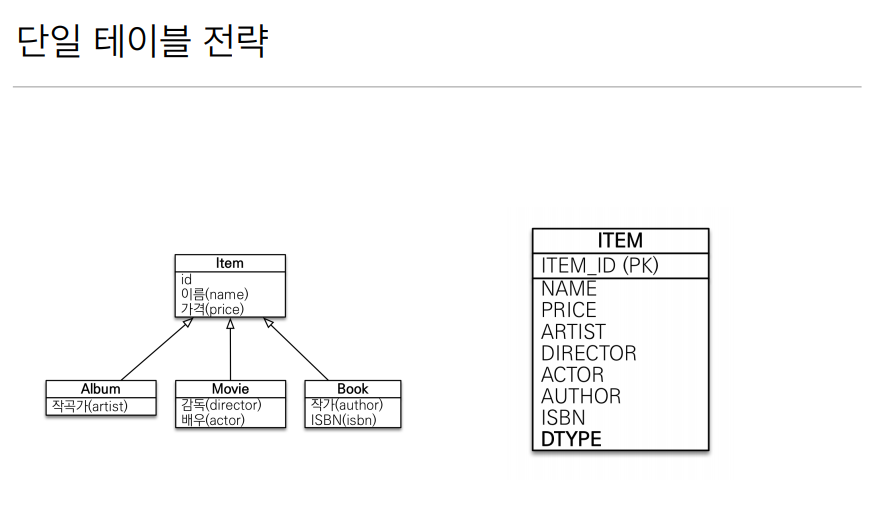
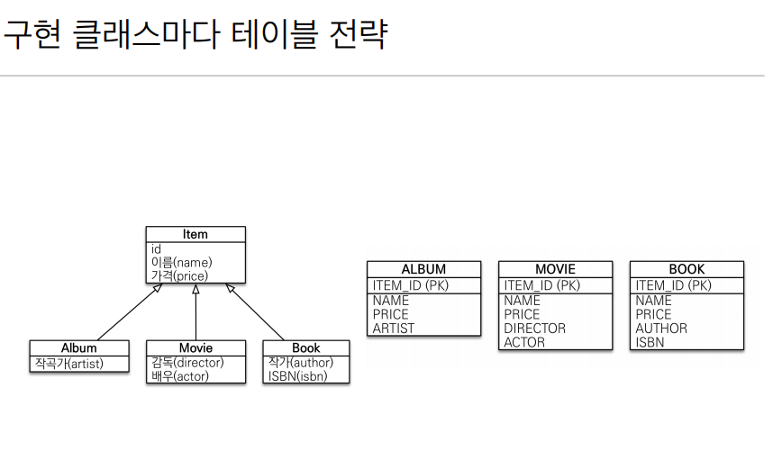
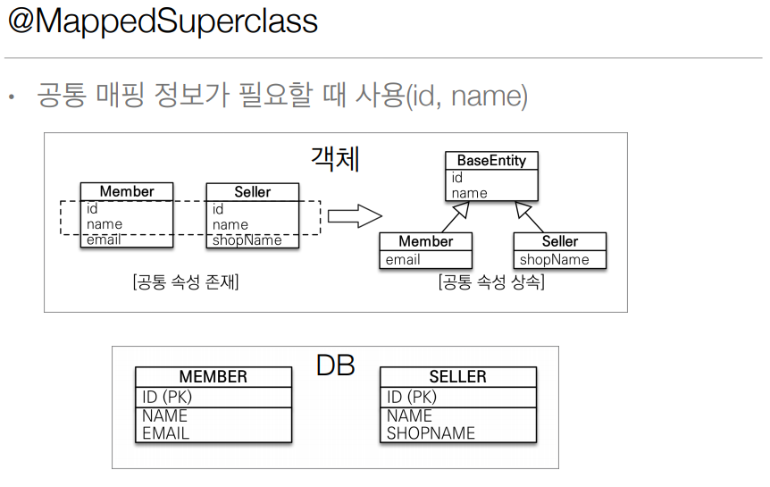
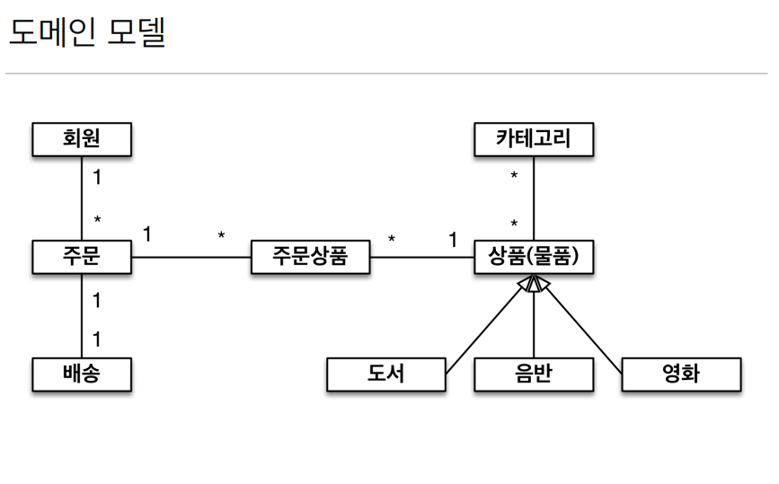
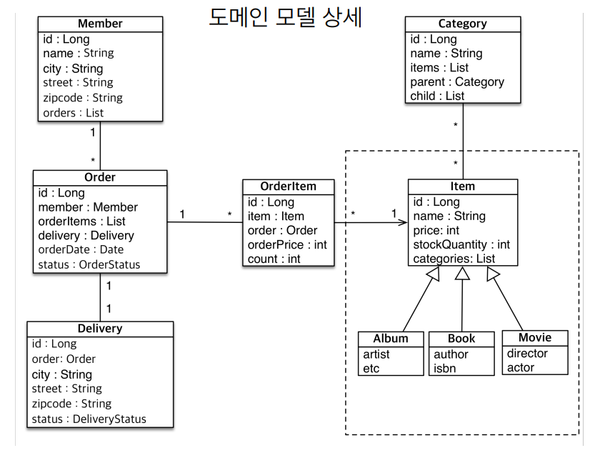
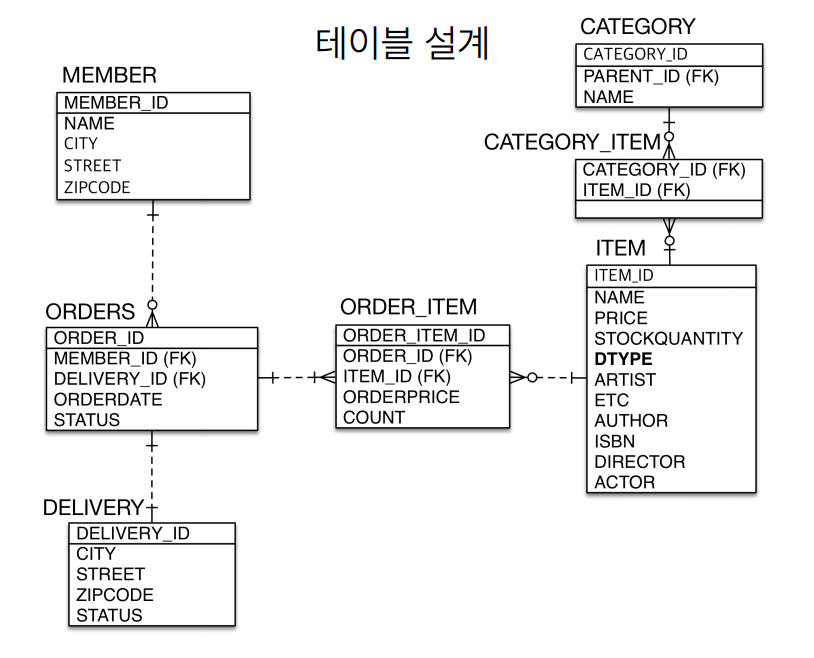

# 5주차

Section7. 고급 매핑
==================

목차
------------------
- 상속관계 매핑
- @MappedSuperclass
- 실전예제4

상속관계 매핑
------------------
- 관계형 데이터베이스는 상속 관계 X
- 슈퍼타입-서브타입 관계를 이용해 객체 상속을 흉내냄
- 상속관계 매핑 : 객체의 상속을 DB의 슈퍼타입-서브타입 관계를 매핑
- 3가지의 방법 (JPA 모두 지원)
  - 조인 전략
    - 장점 
        - 테이블 정규화
        - 외래키 참조 무결성 제약조건 활용가능
        - 저장공간 효율화
    - 단점
        - 조회시 조인을 많이 사용 => 성능저하
        - 조회 쿼리가 복잡
        - 데이터 저장시 INSERT SQL 2번 호출
    - 
  - 단일테이블 전략
    - 장점
        - 조인이 필요 없으므로 조회 성능이 좋음
        - 조회 쿼리가 단순
    - 단점
        - 자식 엔티티가 매핑한 컬럼은 모두 null 허용
        - 단일 테이블에 모든것을 저장하므로 테이블이 커질 수 있음(너무 커지면 조회 성능이 오히려 느려짐)
    - 
  - 구현 클래스마다 테이블 전략
      - >쓰지말자
      - 장점
        - 서브 타입을 명확하게 구분해서 처리할 경우 효과적
        - not null 제약조건 사용 가능
      - 단점
          - 부모에서 여러 자식 테이블을 함께 조회할 경우 성능이 느림(UNION SQL)
          - 자식 테이블을 통합해서 쿼리하기 어려움
    - 

@MappedSuperclass
------------------
- 공통매핑이 필요할때 사용
  - 상속관계 매핑 X
  - 엔티티X, 테이블과 매핑 X
  - 자식 클래스에게 매핑 정보만 제공
  - 조회 X
  - 추상 클래스 권장 (어차피 직접 생성해서 사용하지 않음)
  - 
  

실전예제4
------------------
- 
- 
- 
