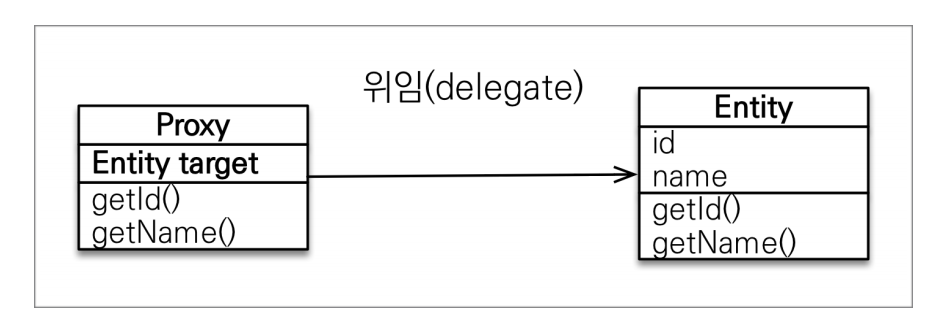
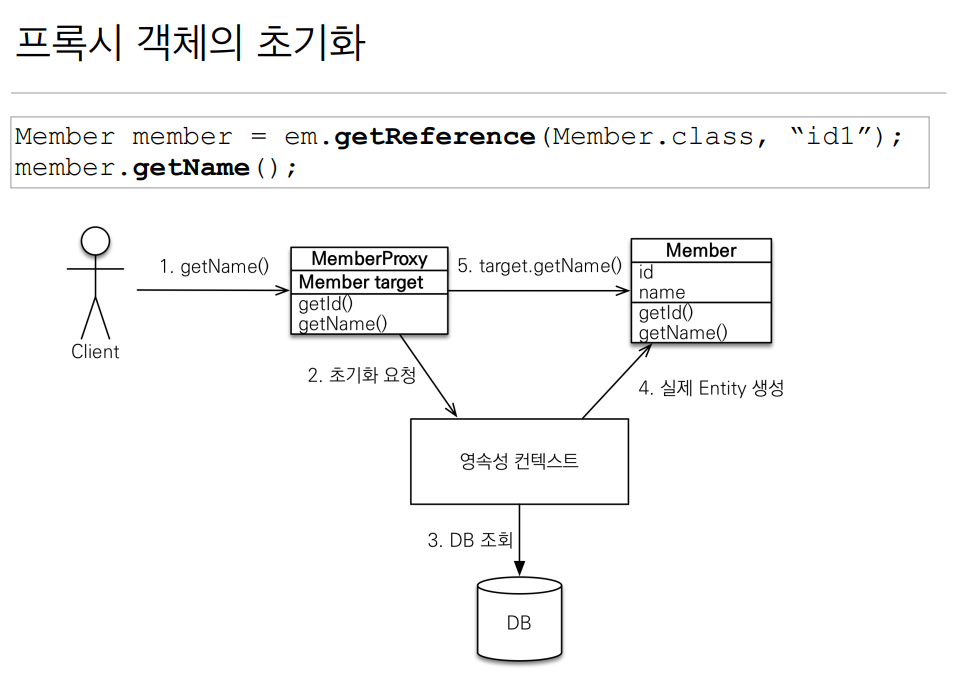
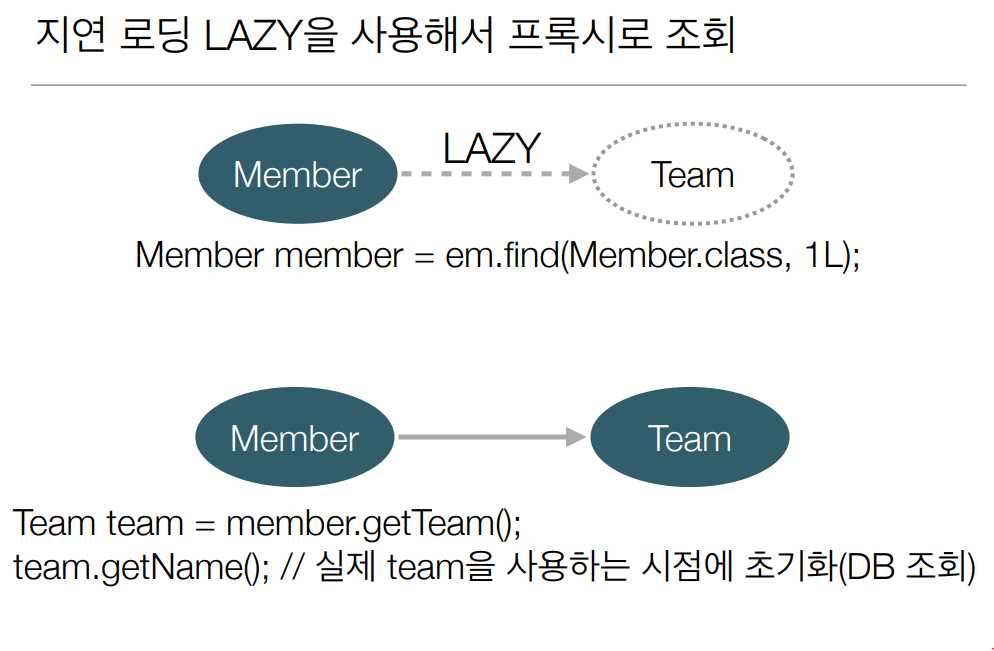
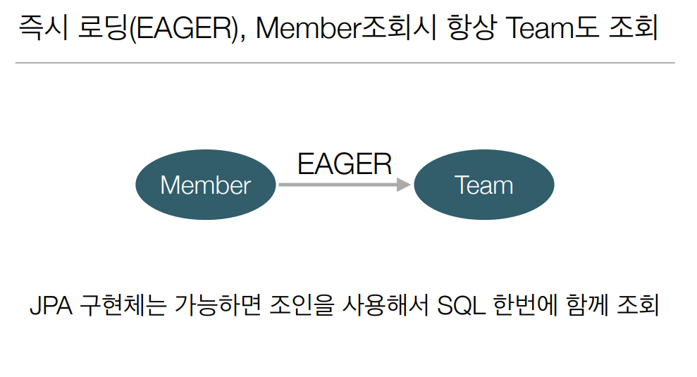

# 6주차

Section8. 프록시와 연관관계 관리
==================

목차
------------------
- 프록시
- 즉시로딩과 지연로딩
- 지연로딩 활용
- 영속성 전이 : CASCADE
- 고아 객체
- 영속성 전이 + 고아객체, 생명주기
- 실전예제 5

프록시 기초
------------------
- em.find() vs em.getReference()
  - em.find() : DB를 통해 실제 엔티티 객체 조회
  - em.getReference() : 데이터베이스 조회를 미루는 가짜 조회(프록시, 지연 로딩)

프록시 특징
------------------
- 실제 클래스를 상속 받아서 만들어짐
- 실제 클래스와 겉 모양이 같음
- 진짜 객체와 프록시 객체를 구분하지 않고 사용가능(이론상)
- 실제 객체의 참조(target)를 보관
- 프록시 객체의 메소드를 호출하면 프록시 객체는 실제 객체의 메소드 호출
  - 
- 
- 프록시 객체는 처음 사용할 때 한 번만 초기화
- 프록시 객체를 초기화 할 때, 프록시 객체가 실제 엔티티로 **바뀌는 것은 아님**, 초기화되면 프록시 객체를 통해서 실제 엔티티에 **접근 가능**
- 프록시 객체는 원본 엔티티를 상속받음, 따라서 **타입 체크**시 주의해야함 (== 비교 실패, 대신 instance of 사용)
- 영속성 컨텍스트에 찾는 엔티티가 이미 있으면 em.getReference()를 호출해도 **실제 엔티티** 반환
    - JPA는 한 트랜잭션 내에서 비교연산(==)을 보장하기 때문에, find에서 proxy가 나올수도, getReference에서 entity가 나올수 있음.
- 영속성 컨텍스트의 도움을 받을 수 없는 준영속 상태일 때, 프록시를 초기화하면 문제 발생(하이버네이트는 org.hibernate.LazyInitializationException 예외를 터트림)

즉시로딩과 지연로딩
------------------
- 지연 로딩(fetch = FetchType.LAZY)을 사용하면 프록시로 조회
  - 

- 즉시 로딩(fetch = FetchType.EAGER)을 사용하면 함께 조회
  -  

프록시와 즉시로딩 주의
------------------
- 가급적 지연 로딩 사용(실무)
- 즉시 로딩 적용시, 예상치 못한 SQL이 발생
- 즉시 로딩은 JPQL에서 **N+1** 문제를 일으킨다.
  > 1개의 쿼리에서 파생된 N개의 쿼리..
- @ManyToOne, @OneToOne은 기본이 즉시로딩
  > LAZY로 설정
- @OneToMany, @ManyToMany는 기본이 지연 로딩

지연로딩 활용
------------------
- 그냥 다 지연로딩으로 하자.

영속성 전이: CASCADE
------------------
- 특정 엔티티를 영속 상태로 만들 때 연관된 엔티티도 함께 영속 상태로 만들고 싶을 때
> 편리함. 그 이상 그 이하도 아니다. 연관관계랑 관련없음!
 
> 오직 하나의 부모만 자식을 관리할 때(개인 소유), 라이프 사이클이 일치할 때, 사용하라 !
- 게시판 < 게시물 첨부 파일 (OK)
- 공지사항 < 공유 파일, 게시판 < 공유 파일 (X)

고아 객체
------------------
- 부모 엔티티와 연관관계가 끊어진 자식 엔티티를 자동 삭제(orphanRemoval = true)
- **오직 하나의 부모만 자식을 관리할 때(개인 소유) 사용하라**

영속성전이 + 고아객체, 생명주기
------------------
- 부모 엔티티를 통해서**만** 자식 엔티티를 관리
> 부모 없는 자식은 없다

> 도메인 주도 설계(DDD)의 Aggregate Root개념을 구현할 때 유용

실전 예제 5
------------------
- 모든 연관관계를 지연 로딩으로 변경
- 영속성 전이 설정