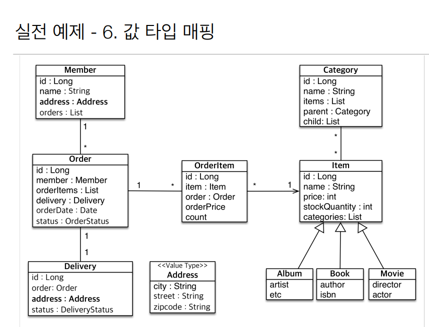

# 7주차

Section9. 값 타입
==================

목차
------------------
- 기본값 타입
- 임베디듣 타입(복합 값 타입)
- 갑 타입과 불변 객체
- 갑 타입의 비교
- 갑 타입 컬렉션
- 실전 예제 6

JPA의 데이터 타입 분류
------------------
- 엔티티 타입
    - @Entity로 정의하는 객체
    - 데이터가 변해도 식별자로 지속해서 추적 가능
    - 예) 회원 엔티티의 키 혹은 나이 값을 변경해도 식별자로 인식 가능
- 값 타입
    - int, Integer, String처럼 단순 값으로 사용하는 자바 기본 타입 혹은 객체
    - 식별자가 없고 값만 있으므로 변경시 추적 불가
    - 예) 숫자 100을 200으로 변경하면 완전히 다른 값으로 대체

갑 타입 분류
------------------
- 기본값 타입
    - 자바 기본 타입(int, double 등)
    - 래퍼 클래스(Integer, Long 등)
    - String
    
- 임베디드 타입(embedded type, 복합 값 타입)
- 컬렉션 값 타입(collection value type)

기본값 타입
------------------
- 예) String name, int age 등
- 엔티티 의존적인 생명주기
    - 예) 회원을 삭제하면 이름, 나이 필드도 함께 삭제
- 값 타입은 공유 X
    - 예) 회원 이름 변경시 다른 회원의 이름도 함께 변경되면 안됨
    
임베디드 타입(복합 값 타입)
------------------
- 새로운 값 타입을 **직접** 정의할 수 있음
- JPA는 임베디드 타입(embedded type)이라 함
- 주로 기본 값 타입을 모아서 만드므로 복합 값 타입이라고도 함
- int, String과 마찬가지로 **값 타입** 취급
- @Embeddable : 값 타입을 정의하는 곳에 표시
- @Embedded : 값 타입을 사용하는 곳에 표시
- 기본 생성자 **필수**

임베디드 타입의 장점
------------------
- 재사용 가능
- 높은 클래스 응집도
- Period.isWork()와 같은 해당 값 타입만을 사용하는 의미 있는 메소드를 만들 수 있음
- 임베디드 타입을 포함한 모든 값 타입은, 값 타입을 소유한 엔티티의 생명주기에 의존함
> 객체지향적이군

-임베디드 타입과 테이블 매핑
    - 임베디드 타입은 엔티티의 값일 뿐
    - 임베디드 타입을 사용하기 전과 후에 매핑하는 테이블은 같다(**임베디드를 사용해서 테이블 모양이 변하지는 않음**)
    - 객체와 테이블을 아주 세밀하게(find-grained) 매핑하는 것이 가능
    - 잘 설계한 ORM 어플리케이션은 매핑한 테이블의 수보다 클래스의 수가 더 많음

- 임베디드 타입과 연관관계
    - 
    - @AttributeOverride: 속성 재정의
        - 한 엔티티에서 같은 값 타입을 사용할 경우 => 컬럼 명이 중복됨
        - @AttributeOverrides, @AttributeOverride를 사용해서 컬럼 명 속성을 재정의
    - 임베디드 타입에 NULL이 들어가면 하위 모든 값도 NULL로 설정

값 타입과 불변 객체
------------------
- 값 타입 공유 참조
    - 임베디드 타입 같은 값 타입을 여러 엔티티에서 공유하면 위험함
    - 부작용(side effect) 발생
    > 공유하지말고 **복사**해서 사용하자
  
불변 객체
------------------
- 불변 객체 : 생성 시점 이후 절대 값을 변경할 수 없는 객체
- 객체 타입을 수정할 수 없게 만들면 부작용을 원천 차단
- 값 타입은 불변 객체(immutable object)로 설계해야함
- 생성자로만 값을 설정하고 수정자(Setter)를 만들지 않으면 됨
- 예) Integer, String 등 자바가 제공하는 대표적인 불변 객체

값 타입의 비교
------------------
- 값 타입: 인스턴스가 달라도 그 안의 값이 같으면 같은 것으로 봐야 함
    - 동일성(identity) 비교 : 인스턴스의 참조 값을 비교, == 사용
    - 동등성(equivalence) 비교 : 인스턴스의 값을 비교, equals() 사용
    - 값 타입은 a.equals(b)를 사용해서 **동등성** 비교를 해야 함
    - 값 타입의 equals() 메소드를 적절하게 재정의(모든 필드를 비교하도록)

값 타입 컬렉션
------------------
- 
- 값 타입을 하나 이상 저장할 때 사용
- @ElementCollection, @Collection Table 사용
- 데이터베이스는 컬렉션을 같은 테이블에 저장할 수 없음
- 컬렉션을 저장하기 위한 별도의 테이블이 필요함
- 지연로딩, 영속성 전이, 고아 객체 제거 기능을 모두 필수로 가진다

값 타입 컬렉션의 제약사항
------------------
- 값 타입은 엔티티와 다르게 식별자 개념이 없다
- 값은 변경하면 추적이 어렵다
- 값 타입 컬렉션에 변경사항이 발생하면, 주인 엔티티와 연관된 모든 데이터를 삭제하고, 값 타입 컬렉션에 있는 현재 값을 모두 다시 저장한다
- 값 타입 컬렉션을 매핑하는 테이블은 모든 컬럼을 묶어서 기본키를 구성해야 함
    - 따라서, null 입력 X, 중복 저장 X

값 타입 컬렉션 대안
------------------
- 실무에서는 상황에 따라 값 타입 컬렉션 대신 일대다 관계를 고려
- 일대다 관계를 위한 에티티를 만들고, 여기에서 값 타입을 사용
- 영속성 전이 + 고아 객체 제거를 사용해서 값 타입 컬렉션처럼 사용

실전 예제 6
------------------
- 