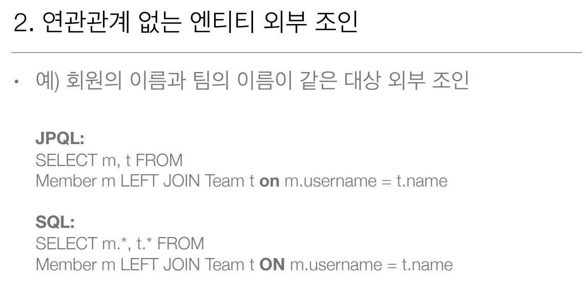

# 8주차

Section10. 객체지향 쿼리 언어1
==================

JPA는 다양한 쿼리 방법을 지원
------------------
- **JPQL**
  > 표준 문법
- JPA Criteria
  > JAVA Code를 이용한 JQPL 쿼리를 생성함
- **QueryDSL**
  > JAVA Code를 이용한 JQPL 쿼리를 생성함
- 네이티브 SQL
  > 데이터베이스 종속적인 쿼리 (ex. Oracle ConnectBy 등)
- JDBC API 직접 사용, MyBatis, SpringJdbcTemplate 함께 사용

JPQL 소개
------------------
- 가장 단순한 조회 방법
    - EntityManager.find()
    - 객체 그래프 탐색(a.getB().getC())
- 나이가 18살 이상인 모든 회원을 검색하고 싶다면 ?

JPQL
------------------
- JPA를 사용하면 엔티티 객체를 중심으로 개발
- 문제는 검색 쿼리
- 검색을 할 때도 테이블이 아닌 엔티티 객체를 대상으로 검색
- 모든 DB 데이터를 객체로 변환해서 검색하는 것은 불가능
- 애플리케이션이 필요한 데이터만 DB에서 불러오려면 결국 검색 조건이 포함된 SQL이 필요
- JPA는 SQL을 추상화한 JPQL이라는 객체 지향 쿼리 언어 제공
- SQL과 문법 유사 ANSI 표준 (SELECT, FROM, WHERE, GROUP BY, HAVING, JOIN)
- JPQL은 엔티티 객체를 대상으로 쿼리
- SQL은 데이터베이스 테이블을 대상으로 쿼리
- 테이블이 아닌 객체를 대상으로 검색하는 객체 지향 쿼리
- SQL을 추상화해서 특정 데이터베이스 SQL에 의존 X
- JPQL을 한 마디로 정의하면 객체 지향 SQL

Criteria 소개
------------------
- JPQL은 동적 쿼리를 만들기가 어려움
- Criteria는 ? 
- 
- 문자가 아닌 자바코드로 JPQL을 작성할 수 있음
- JPQL 빌더, JPA 공식 기능, 표준
- 하지만, 너무 복잡하고 실용성이 없다
- **QueryDSL** 사용 권장

QueryDSL 소개
------------------
- 
- 문자가 아닌 자바코드로 JPQL을 작성할 수 있음 
- 단순하고 쉬움, 실무 사용 권장

네이티브 SQL 소개
------------------
- 
- JPA가 제공하는 SQL을 직접 사용하는 기능
- JPQL로 해결할 수 없는 특정 데이터베이스에 의존적인 기능
- 예) 오라클 CONENCT BY, 특정 DB만 사용하는 SQL 힌트

JDBC 직접 사용, SpringJdbcTemplate 등
- JPA를 사용하면서 JDBC 커넥션을 직접 사용하거나, 스프링 JdbcTemplate, 마이바티스등을 함께 사용 가능
- 단, 영속성 컨텍스트를 적절한 시점에 강제로 플러시해야 함
- 예) JPA를 우회해서 SQL을 실행하기 직전에 영속성 컨텍스트 수동 플러시

JPQL(Java Persistence Query Language)
------------------
- JPQL은 테이블이 아닌 **엔티티 객체**를 대상으로 쿼리한다
- JPQL은 SQL을 추상화해서 특정 데이터베이스 SQL에 의존하지 않는다
- JPQL은 SQL로 변환된다

JPQL 문법
------------------
 - 문법을 정리해야할까? 그냥 쓰면 될듯

프로젝션
------------------
- 엔티티 프로젝션
  - SELECT m FROM Member m
  - SELECT m.team FROM Member m
- 임베디드 타입 프로젝션
  - SELECT m.address FROM Member m
- 스칼라 타입 프로젝션
  - SELECT m.username, m.age FROM Member m
- DISTINCT로 중복 제거
- 

페이징 API
------------------
- JPA는 페이징을 다음 두 API로 추상화
- setFirstResult(int startPosition) : 조회 시작 위치 (from 0)
- setMaxResults(int maxResult): 조회할 데이터 수

조인
------------------
- 내부 조인
  - SELECT m FROM Member m [INNER] JOIN m.team t
- 외부 조인
  - SELECT m FROM Member m LEFT [OUTER] JOIN m.team t
- 세타 조인
  - select count(m) from Member m, Team t where m.username
    = t.name

조인 - ON 절
 - 조인 대상 필터링
 - 연관관계 없는 엔티티 외부 조인(하이버네이트 5.1부터)
-    
- 

서브 쿼리
------------------
- 
- 

JPA 서브 쿼리 한계
------------------
- JPA는 WHERE, HAVING 절에서만 서브 쿼리 사용 가능
- SELECT 절도 가능(하이버네이트에서 지원)
- FROM 절의 서브 쿼리는 현재 JPQL에서 불가능
  - 조인으로 풀 수 있으면 풀어서 해결

JPQL 타입 표현
------------------

조건식
------------------
그냥 쓰면 될듯

JPQL 기본 함수
------------------
그냥 쓰면 될듯