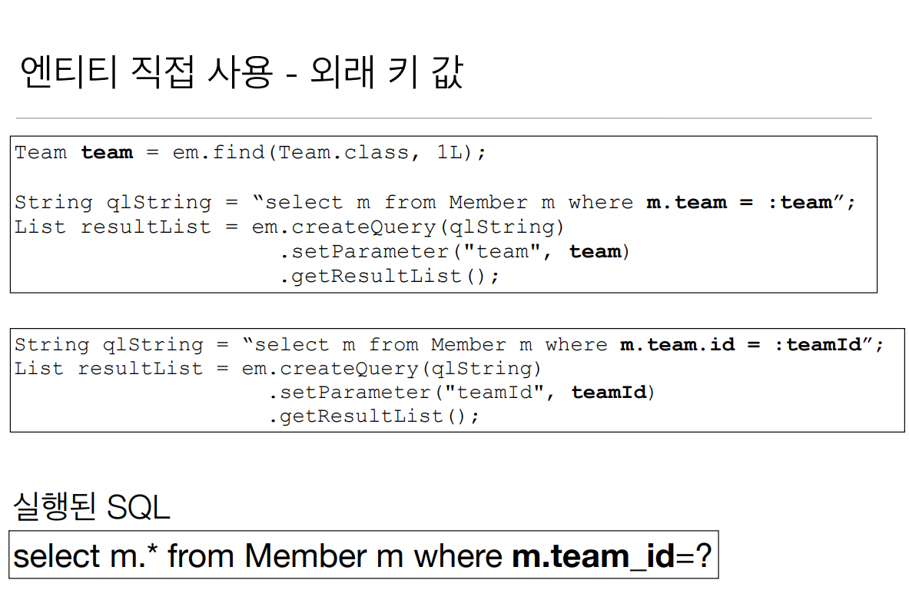

# 9주차

Section11. 객체지향 쿼리 언어2
==================

경로 표현식
------------------
- .(점)을 찍어 객체 그래프를 탐색하는 것
    - 상태 필드(state field) : 단순히 값을 저장하기 위한 필드
        - ex) m.username
    - 연관 필드(association field) : 연관관계를 위한 필드
        - 단일 값 연관 필드
            - @ManyToOne, @OneToOne, 엔티티(m.team)
        - 컬렉션 값 연관 필드
            - @OneToMany, @ManyToMany, 컬렉션(m.orders)

- 경료 표현식 특징
    - 상태 필드 : 경로 탐색의 끝, 추가 탐색 X
    - 단일 값 연관 경로 : 묵시적 내부 조인(inner join) 발생, 추가 탐색 O
    - 컬렉션 값 연관 경로 : 묵시적 내부 조인(inner join) 발생, 추가 탐색 O
        - FROM 절에서 명시적 조인을 통해 별칭을 얻으면 별칭을 통해 추가 탐색 가능
      

명시적 조인, 묵시적 조인
------------------
- 명시적 조인 : join 키워드 직접 사용
    - select m from Member m join m.team t
- 묵시적 조인 : 경로 표현식에 의해 묵시적으로 SQL 조인 발생(내부 조인만 가능)
    - select m.team from Member m 

경료 표현식 - 예제
------------------
- select o.member.team from Order o (성공)
- select t.members from Team (성공)
- select t.members.username from Team t (실패)
- select m.username from Team t join t.members m (성공)

경로 탐색을 사용한 묵시적 조인 시 주의 사항
------------------
- 항상 내부 조인
- 컬렉션은 경로 탐색의 끝, 명시적 조인을 통해 별칭을 얻어야함
- 경로 탐색은 주로 SELECT, WHERE 절에서 사용하지만 묵시적 조인으로 인해 SQL의 FROM(JOIN) 절에 영향을 줌

실무 조언
------------------
- 가급적 묵시적 조인 대신에 **명시적 조인** 사용
- 조인은 SQL 튜닝에 중요한 포인트
- 묵시적 조인은 조인이 일어나는 상황을 한눈에 파악하기 어려움

JPQL - 페치 조인(fetch join)
------------------
- SQL 조인 종류 X
- JPQL에서 **성능 최적화**를 위해 제공하는 기능
- 연관된 엔티티나 컬렉션을 SQL 한 번에 함께 조회하는 기능
- join fetch 명령어 사용
    - ex) [OUTER | INNER] JOIN FETCH 조인 경로

- 엔티티 페치 조인
    - 회원을 조회하면서 연관된 팀도 함께 조회(SQL 한 방)
    - SQL에서 회원 뿐만 아니라 팀(T.*)도 함께 **SELECT**
    - JPQL
        - select m from Member m join fetch m.team
    - SQL
        - SELECT M.*, T.* FROM MEMBER M INNER JOIN TEAM T ON M.TEAM_ID = T.ID

- 페치 조인과 일반 조인의 차이
    - 일반 조인 실행시 연관된 엔티티를 함께 조회하지 않음
    - JPQL은 결과를 반환할 때 연관관계 고려 X
    - 단지 SELECT 절에 지정한 엔티티만 조회할 뿐
    - 페치 조인을 사용하면 연관된 엔티티도 함께 조회(즉시 로딩)
    - 페치 조인은 객체 그래프를 SQL 한 방으로 조회하는 개념

JPQL - 페치 조인의 한계
------------------
- 페치 조인 대상에는 별칭을 줄 수 없다
    -하이버네이트는 가능, 가급적 사용 X
- 둘 이상의 컬렉션은 페치 조인 할 수 없다 (t.members, t.orders X)
- 컬렉션을 페치 조인하면 페이징 API를 사용할 수 없다.
    - 일대일, 다대일 같은 단일 값 연관필드들은 페치 조인해도 페이징 가능
    - 하이버네이트는 경고 로그를 남기고 메모리에서 페이징(**매우 위험**)

- 페치 조인의 특징과 한계
    - 연관된 엔티티들을 SQL 한 번으로 조회 - 성능 최적화
    - 엔티티에 직접 적용하는 글로벌 로딩 전략보다 우선순위가 높음
        - @WOneToMany(fetch = FetchType.LAZY)
    - 실무에서 글로벌 로딩 전략은 모두 지연 로딩
    - 최적화가 필요한 곳은 페치 조인 적용

- 페치 조인 정리
    - 모든 것을 페치 조인으로 해결할 수는 없음
    - 페치 조인은 객체 그래프를 유지할 때 효과적
    - 여러 테이블을 조인해서 엔티티가 가진 모양이 아닌 전혀 다른 결과를 내야 하면, 페치 조인 보다는 일반 조인을 사용하고 필요한 데이터들만 조회해서 DTO로 반환하는 것이 효과적

다형성 쿼리
------------------
- 
- 

엔티티 직접 사용
------------------
- 
- 

Named 쿼리
------------------
- 
- 

벌크 연산
------------------
- 
- 
